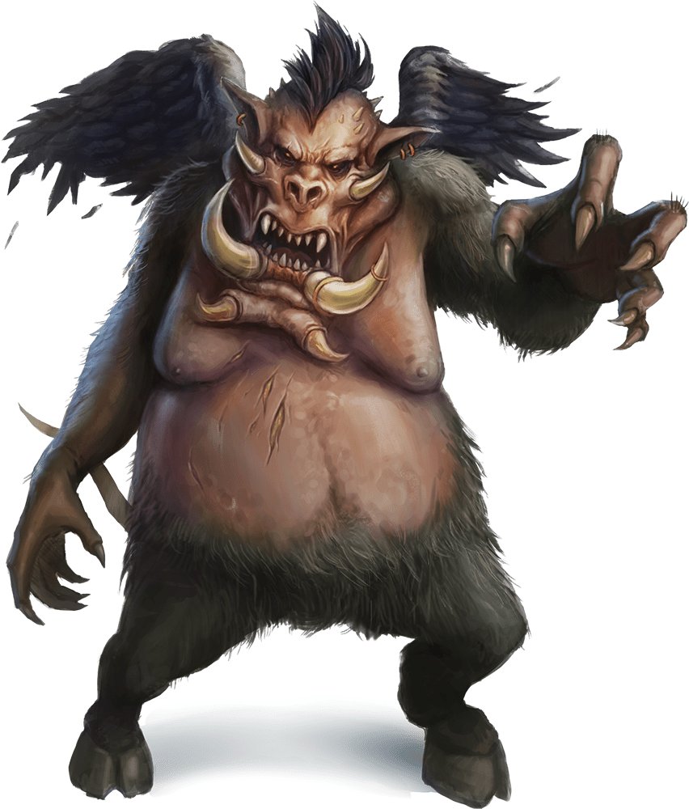
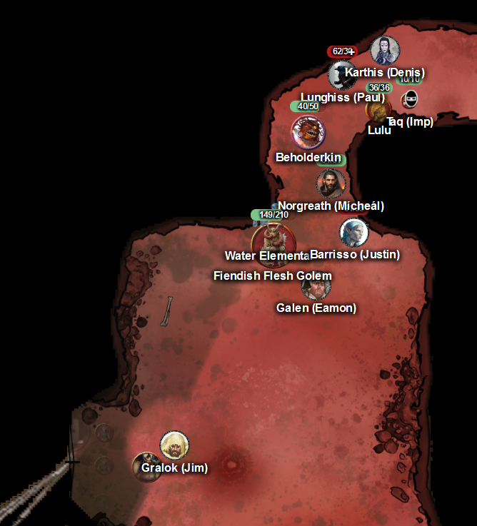
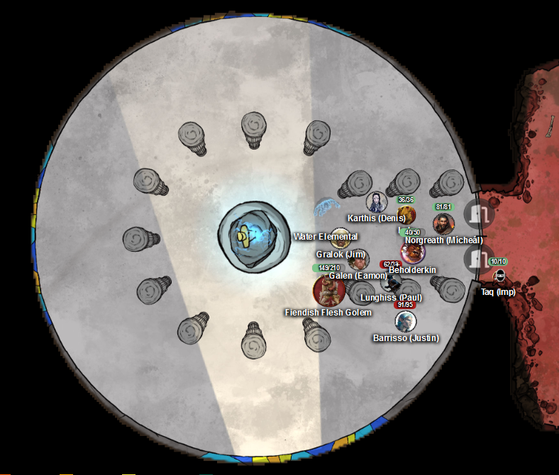
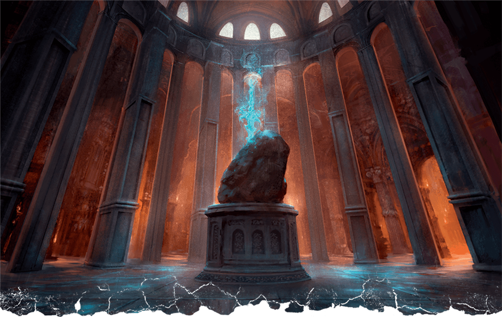
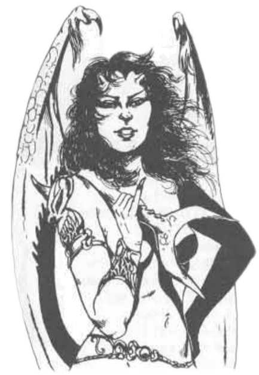

# 5 March 2025

**[Previously](2025-02-26.md):** We are delving into the scab of Avernian earth which we think holds the alabaster fortress that, in a collective dream, was revealed to be the location of Zariel's blade. After conjuring up a beholderkin, a water elemental, and a flesh golem, we entered a fierce battle of vrocks and gnolls, who we defeated by shattering a statue of their god, Yeenoghu. We continued to search the tunnels, and found an Eversmoking Bottle that may come in useful. We encounter another band of gnolls, playing football with the severed head of a comrade, and make quick work of most of them, but have heard a command being shouted to the remnants from up a passageway to our north-west...

- [ ] Seek Zariel's blade in the alabaster fortress, as revealed by the dream machine and in Barrisso's vision ("Seek Zariel's blade: it's the key to her heart, and will sever Elturel's chains")
- [ ] Investigate Mahadi's Emporium (at the Pit of Shummrath)
- [ ] Investigate the Obelisk of Ubbalux
- [ ] Redeem Zariel's general Olanthius, and in doing so redeem the ghosts in the Crypt of the Hellriders
- [ ] Find out from the tortured blob where Zariel's flying fortress is.
- [ ] Investigate Thavius Kreeg, High Overseer of Elturel
- [ ] Investigate the vampire High Rider Klav Ikaia at Shiarra's Market
- [ ] Rescue the Hellriders
- [ ] Find the other half of the Infernal contract between Thavius Kreeg and Zariel
- [ ] Free Elturel from Avernus

---

From the north-west passageway, one of the gnolls tries to hit the water elemental, doing 11HP of damage (fortunately, they are immune to the poison damage).

Our beholderkin moves and casts Eye Ray at the gnoll, doing 14HP of psychic damage.

Barrisso attacks with his longbow, doing 6HP of damage.

Our flesh golem moves and attacks the gnoll, doing 18HP of damage.

Lunghiss attacks with his shortbow: with a critical, he does 57HP of damage, killing a gnoll outright.

Galen moves and casts Toll the Dead on the injured gnoll: unfortunately, the remaining injured gnoll saves.

Norgreath uses Eldritch Blast (with Agonizing Blast and Genie's Wrath for the first attack), doing 32HP of damage,

Gralok moves, then fires his longbow: he does 18HP of piercing damage.

---

Our water elemental does two slam attacks on the gnoll: he does 13HP of bludgeoning damage.

Karthis casts Fire Bolt but misses. He uses his luck but misses.

The gnoll attacks, doing 3HP of damage to our water elemental.

Our beholderkin casts Eye Ray at the gnoll, doing 9HP of psychic damage, killing it.

---

Around us are the bodies of 20 gnolls. Between them, we find 23GP. They have coinage from many places we don't recognise: but, it's still gold. We find nothing else of real interest.

We check the north-west passage, which winds north, then west, then south into a cavern of the reddish fleshy material that the scab is made of. In its western wall are brass double doors, bearing relief images. In front of the doors are three of the goat-headed bulezau demons, of the type we previously met, throwing themselves at them. Flying behind them is a corpulent ape-like fiend with small wings, roaring commands at them in Abyssal, urging them to knock down the doors. Lunghiss recognises it as a nalfeshnee:

<figure markdown>
  { width="400" }
  <figcaption>Nalfeshnee</figcaption>
</figure>

Gralok rages (Form of the Beast) and attacks the nalfeshnee with his claws four times, doing 28HP of slashing damage.

<figure markdown>
  { width="400" }
  <figcaption>Nalfeshnee Battle</figcaption>
</figure>

A bulezau moves towards Gralok and lashes out with his tail, but misses.

Our water elemental moves, then does a Slam attack, doing 16HP of bludgeoning damage.

One of the bulezau jumps and attacks the water elemental, doing 5HP of damage.

Our flesh golem moves to block the doorway.

Our beholderkin casts Eye Ray at the nalfeshnee, but misses.

Lunghiss moves, then fires his shortbow, but misses.

Karthis casts Witch Bolt on the nalfeshnee with inspiration, but the fiend seems to have resistance, and only does 5HP of damage.

Galen moves, then uses a bonus action to cast Command on the nalfeshnee to make him fall. Unfortunately, he saves. Galen then attacks with his +1 marble mace, doing 22HP of damage.

The nalfeshnee turns to face Galen, and calls out to us in a rumbling voice in our heads: "WHY ARE YOU THWARTING ME? IF YOU OPEN THESE DOORS, WE WILL SPLIT THE TREASURES BEHIND THEM AND I WILL NOT DESTROY YOU."

Lulu responds telepathically to us: "Don't trust him! He's an evil demon! We can't let him thru the doors!"

The nalfeshnee brings out his claws, and suddenly there is a nimbus of light around him. All of the party around him resist his fear.

The nalfeshnee moves to attack, meaning that Gralok gets to attack: his claws do 7HP of damage, but resists his Infectious Fury.

The nalfeshnee attacks Galen, doing 31HP of damage.

Barrisso moves, then fires his longbow at the nalfeshnee, doing 6HP of damage.

The last of the bulezau jumps towards Gralok and attacks with his tail, doing 7HP of damage.

Norgreath uses Eldritch Blast (with Agonizing Blast and Genie's Wrath for the first attack) on the nalfeshnee, doing 24HP of damage.

---

Gralok attacks the nalfeshnee for 16HP of damage.

Our water elemental is attacked by a bulezau, but they miss.

Our water elemental attacks two bulezau with a whelm attack, succeeds with both: they are now grappled and restrained, and take 12HP of damage each.

One of the bulezau attacks the water elemental, doing 4HP of piercing damage.

Our flesh golem attacks the nalfeshnee, doing 17HP of bludgeoning damage.

Lunghiss attacks the nalfeshnee - with inspiration he hits, doing 34HP of damage, plus 4HP of thunder.

The nalfeshnee then teleports right beside Lunghiss. His bite does 31HP of damage; his first claw attack misses, for his second it hits but Lunghiss uses Shield to make it miss.

Barrisso attacks the nalfeshnee with his  Lathander's Radiant Blade; using inspiration and Divine Smite, doing 19HP of damage, killing it.

A bulezau attacks Galen, but misses.

Norgreath uses Eldritch Blast (with Agonizing Blast and Genie's Wrath for the first attack) on the same bulezau, doing 26HP of damage.

Gralok attacks, doing 11HP of damage.

A bulezau (whelmed by the water elemental) escapes from it.

The whelmed bulezau takes 16HP of damage.

The water elemental slams the other bulezau, killing it.

The other whelmed bulezau tries to break free, but fails.

Our flesh golem attacks the bulezau, killing it. One bulezau remains.

Our beholderkin attacks it, doing 9HP of damage.

Lunghiss does 32HP of damage, finishing it off.

---

We search the dead bodies but find nothing.

Galen casts Prayer of Healing, giving 28HP of healing to anyone who needs it.

---

We examine the door that the fiends had been attacking: they seem to have made no damage to it. They depict a blindfolded angel with a sword; carved into the frame are gold inlaid runes, in Celestial.

Lulu says: "The runes spell out: Against evil we stand united, only the pure at heart can open these gates."

Barrisso opens the gates. Beyond, we see a large light-filled pillared chamber, where we behold Zariel's Sword:

<figure markdown>
  { width="400" }
  <figcaption>Zariel's Sword Chamber</figcaption>
</figure>

The light in the chamber burns away the dirt and blood on our clothes.

The party is able to take a long rest.

**The party all goes up a level to Level 12.**

We ready ourselves to enter the opened chamber. Taq finds he cannot enter.

The runes on the sword's pedestal say: "The hero who can become one with this blade exists no longer."

<figure markdown>
  { width="400" }
  <figcaption>Zariel's Sword</figcaption>
</figure>

A ghostly figure approaches: we recognise it as Yael. She approaches Lulu and embraces her, saying "What mighty things you have done, my friend." Lulu trumpets sadly.

Yael turns to us and says: "Lulu and I followed Zariel to Avernus, but he evil here proved too much for us. Zariel had to give the lord of the nine hells her fealty. I took her sword in case it could redeem her someday. I set up this place to protect her sword. I am sorry to say you face another trial. 'The hero who can become one with this blade exists no longer' - which of you is brave enough to draw this blade, and be gone forever."

Barrisso reaches for the sword. The next thing we see is a flash of golden light and we are elsewhere

We see a league of solars, inspecting them is an angel riding a golden-winged lion. We see Zariel here, younger and innocent. The mounted angel speaks to another angel down the line.

"What's your name?"

"Chazaqiel"

"Do you know why you are here?"

"Elysium seeks the Avernian paradise."

"Thank you young one" the Marshall says, soaring into the sky.

He addresses the assembly.

"To glory, my angels! To the emerald plains we’ll soar, and there forge our destiny! The Legions of Heaven shall secure the Eighth Heaven!"

---

We find ourselves again, flying on feathered wings in a jungle at night. A wall of blue flames highlights the foliage. We follow another angel, our commanding officer.

Another small squad of angels swoops out of the night, led by Chazaqiel. Your commanding officer (who we realize is Zariel)  pulls up in mid-air.

Zariel: Kentarch Chazaqiel! Thank the Heavens! Have you heard from
Princeps Sanniel?

Chazaqiel: Sanniel is no longer in command. I am Princeps now.

Zariel: What do you mean? Was she killed in the planar upheaval?

Chazaqiel: No. She turned against the Celestial Marshal.

Zariel: Against Ashmedai? What are you talking about?

Chazaqiel: Things are changing, Hecaton. We are no longer going to be a the plaything dangled between Elysium and Celestia. Ashmedai has claimed Avernus for himself. The great work has just begun. We ride paradise into the jaws of battle!

Zariel: Where?

Chazaqiel: To Hell.

Zariel: This is treason!

Chazaqiel: Don’t be a fool, Zariel! You swore an oath to the Celestial

Marshal! Now obey him! Obey us!

Zariel: I swore an oath to Heaven, Chazaqiel. To Heaven above all.

Zariel abruptly draws her sword and attacks! Chazaqiel beats his wings and flies back just out of reach.

The solars on both sides fight, until trumpets sound from reinforcements nearby and Zariel and a number of you manage to cut your way free to reach them. A voice cries out, “The demon lord flees!”

And then…

Zariel is mounted upon Lulu in her golden war mammoth form. A small force of planetars and other celestials are arrayed behind and above them. Across a recent battlefield of torn mud and blood, they are glowering at a female devil mounted upon a dire hellhound and surrounded by a motley gang of other devils.The female devil has coppery skin, dark hair, and two curving ram’s horns upon her head. Her lips are curled in the kind of smile that doesn’t touch her tawny eyes.

<figure markdown>
  { width="400" }
  <figcaption>Glasya</figcaption>
</figure>

Zariel: What has brought you to the mortal plane, devil?

Glasya: It seems the same as you, angel. We pursued the demon lord Yeenoghu and followed the foul beast here to his butchery among the humans.

Zariel: And your name?

Glasya: I am Glasya, daughter of Asmodeus.

Several of the planetars surged forward with a strong beat of their wings. Zariel raises her hand to keep them at peace.

Glasya: And yours?

Zariel: Zariel. What are your intentions?

Glasya: Completed, I think. Yeenoghu has slipped through our snare. He has most likely slunk back to the Abyss with his tail tucked between his legs. [she looks up at the planetars] Will we need to tuck yours, too?

Planetar 1: She’ll only have a tail once she’s ripped it off of you!

Glasya (laughs): Come, Zariel. Leash your dogs and I’ll leash mine. I would speak with you without our voices being drowned by the rattling of sabers.

Zariel gestures towards a small grove off to one side. Glasya considers it, then nods her head and dismounts. Zariel follows suit, leaving Lulu and the others behind as she moves off to parlay with the devil. Glasya’s hellhound edges closer to Lulu and sniffs. Lulu recoils. The hellhound reaches up… and licks her trunk. Glasya and Zariel return. Zariel announces that they have both agreed to leave the fields of Idyllglen in peace, having “fought to common purpose.” There’s a flash of golden light.

And then…

As your vision clears, you’re standing on a field of battle beneath the blood red sky of Avernus. A huge mound of devils lies dead. Other devils, still living, are hauling bodies off the mound, chittering amongst themselves. All the way at the bottom of the mound, as one last corpse is pinioned on a pitchfork and flung to one side, the body of an angel is revealed. A blood-stained Zariel. The devils draw back. Some of them are cackling, but then one glances back over their shoulder and suddenly drops prostrate to the ground. Others, too, following the first’s gaze, throw themselves to the ground.A tall devil with skin of maroon and crimson, dressed in robes of black and gold, strides in amongst the scattered corpses. He is possessed of a leonid beauty, with two almost impossibly long, dark horns curving gracefully from his forehead. You recognize this face. It is the face of Ashmedai, once Celestial Marshal of the Legions of Heaven. The devil’s eyes smoulder as he looks down at the angel. In a smooth voice of elegance and grace he asks, “Where is her Sword?”

“Gone.” Zariel chokes out of the word. “Asmodeus.”

“Fetch her some water,” Asmodeus says.

They wait. Simply gazing at each other. A few minutes later, the water is brought in a chalice of ivory- and-gold. Asmodeus takes the cup and offers it to Zariel. Zariel smacks his hand aside, spilling the cup into the dust and blood.

Asmodeus smiles:

I look at you and I see that you are in despair. You thought you could make a difference. That you could end the Blood War. But here you are on a field of dead friends. You look at me and I know you see malevolence. You see Evil. You see an antithesis. You see betrayal. But I did make a difference. And I will end the Blood War. All those aeons ago, at my trial, when I looked you in the eye and laughed. Do you think I mocked you? No. I laughed because I saw you standing where I had stood before. I knew we walked the same road and you were just a few steps behind me. Look around you. Look at the dead. Piled high. Do you really think this to be Good? Do you think this butchery to be worthwhile because it was done in a noble cause? You know as well as I do that as long as this continues, as long as the dead are nothing but tallies in the ledgers of complacent gods, Good is derelict. It is meaningless. It is feathery cupids cavorting on a celestial isle while suffering boils forth across the multiverse. I know you came here to kill demons. You think you have failed. I think you have barely begun. Which of us do you think sees more clearly? What I offer you is simple: A chance to continue our fight. You have killed Terza’reg. I offer you his place on the Dark Eight and command of a Blood Legion. Serve me and your Crusade can still boil across the Abyss and turn the Great Wheel into a new epoch.

As Asmodeus speaks, you sense that this is but one truth among many; that Zariel and Asmodeus converse upon many different planes of thought. That this is but a mortal reflection of a myriad complexity beyond your grasp.

But when it is done, Zariel gazes upon Asmodeus for a long moment. An eternal moment. And then she reaches out her hand.
“I accept.”

As their hands clasp, they explode with a blinding, golden light.

And then…

You are elsewhere on the Avernian field of battle. Zariel is kneeling in the dust. Lady Yael, arrayed for battle in battered, bloody, dust-covered armour kneels on the ground next her. Zariel is pushing her glowing sword into Lady Yael’s hands.
Yael: I refuse. Do not ask me of this.

Zariel (smiling sadly): I must. I do. Look beyond this forsaken day. One last time, I need you to dream a little bigger.

Yael weeps and then, unable to speak, nods, taking Zariel’s sword.

But the moment shifts, and you see that in the moment Zariel passes over the Sword, she passes something else, too: A part of herself. A spark. A shard of her eternal, celestial soul.
I am the memory of Zariel that was and who can be again.
I am the Sword of her will and the Blade of her soul.
Zariel continues to speak to Yael, but she turns her head and her blazing eyes bore into you: “This is the last thing I will ever ask of you.”

---

We are back in the chamber: Barrisso has the sword in his hand, [but does not look the same.](2025-03-12.md)
