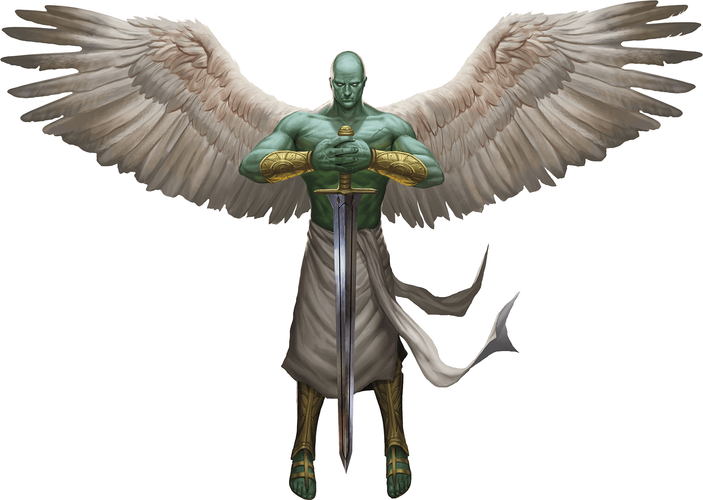
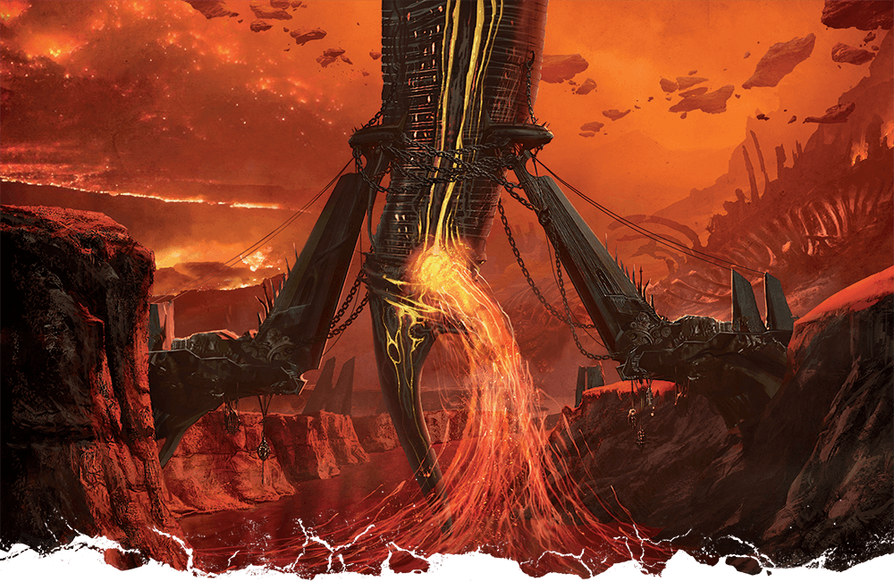

# 12 March 2025

**[Previously](2025-03-05.md):** Having fought our way through hoards of gnolls, we encountered the betusked demon who urged his goat-demon underlings to batter their way into the citadel (to little effect). Despite his offers to share the booty, we and our summoned allies removed the demon threat and the way lay clear. The doors opened for us without hindrance and the holy radiance healed us of all ills while cleansing our physical forms. Barrisso stepped forward to claim the sword at the ghostly Yael's urging, whereupon we were all enmeshed in visions of the past; this time not from Lulu's perspective, but from Zariel's! As these faded, we know more of the path that has brought Zariel to her current fate, but we notice that our friend Barrisso is not the same as he was before grasping that hilt.

- [X] Seek Zariel's blade in the alabaster fortress, as revealed by the dream machine and in Barrisso's vision ("Seek Zariel's blade: it's the key to her heart, and will sever Elturel's chains")
- [ ] Investigate Mahadi's Emporium (at the Pit of Shummrath)
- [ ] Investigate the Obelisk of Ubbalux
- [ ] Redeem Zariel's general Olanthius, and in doing so redeem the ghosts in the Crypt of the Hellriders
- [ ] Find out from the tortured blob where Zariel's flying fortress is.
- [ ] Investigate Thavius Kreeg, High Overseer of Elturel
- [ ] Investigate the vampire High Rider Klav Ikaia at Shiarra's Market
- [ ] Rescue the Hellriders
- [ ] Find the other half of the Infernal contract between Thavius Kreeg and Zariel
- [ ] Free Elturel from Avernus

---

Instead of Barrisso standing holding the sword, we see him hovering on angelic wings, his eyes pools of silvery light. The sword emits a glowing light that surrounds him. Yael's stands nearby, a ghostly form in armour. Lulu and our summoned creatures are still here; Taq is outside, since he cannot enter this chamber.

We ask Barrisso if he's OK. "I am good."

Since, as he now wields the Zariel's Blade, he no longer needs his Lathander's Radiant Blade *(+2 shortsword)* he gives it to Lunghiss.

We ask Yael where the other half of the infernal contract is. Yael says she has no idea about the contract.

We talk more about what to do. [We recall the nine large adamantine rods that we found](2025-01-15.md), each with the words in Infernal: "Solar Insidiator lock" followed by a number from 1 to 9. How are these related to the Companion, known as the Solar Insidiator? Do we need to turn that off before we can rescue Elturel?

---

We return to the site of Elturel hovering above us. Each adamantine rod weighs 3lbs. Barrisso disguises himself with Norgreath's Hat of Disguise to look like a devil, then flies up to the Companion: instead of bright light, it is now magical darkness.

Within the orb of darkness, he finds a metal shell. Within there, he founds a number of holes around the equator of the object: nine of them. Barrisso takes the nine adamantine rods, and slides them into the corresponding slots, going by the number on each rod *(Arcana check)*.

The metal sphere, the Companion, opens to reveal a trapped planetar curled inside. Barrisso asks them if they are alright.

<figure markdown>
  { width="400" }
  <figcaption>Planetar</figcaption>
</figure>

After a brief moment where it seems to recover, the planetar (who is called Nascius) turns to Barrisso and says "Who are you?".

"Barrisso."

"You are not only Barrisso."

"I carry the Sword of Zariel."

"Redeem Zariel and recover the goodness in her, and to free Elturel."

"This is a noble calling. Now that I am freed, I can return Elturel, but only when the chains are cut."

"I can do this with Zariel's sword. But I feel that first we must redeem Zariel. The people of Elturel are still damned until we can destroy the contract."

"I suspect the contract is with Zariel."

The planetar does not know where she is.

Barrisso asks the planetar to come with our party, but he says he should not leave the Companion until we are ready to free Elturel. Barrisso asks him to keep up the illusion that all is well. But if lightning from the Companion strikes a devil, so be it.

Barrisso returns outside once again, scanning the sky for a flying fortress that may contain Zariel. But as he is about to give up, he notices a strange pair of objects either side of the Styx, with a vessel between them.

<figure markdown>
  { width="400" }
  <figcaption>Landing Clamps</figcaption>
</figure>

---

Barrisso wonders if he is somehow connected to Zariel. But it turns out, only to the essence of goodness that she has left in the sword: nothing that connects him to her current self.

Lulu is happy that Barrisso has the sword: "All we have to do is give her the sword, and everything will be absolutely fine!". But unfortunately, Lulu cannot help him. But she thinks Zariel is at the vessel currently held by the [gigantic clamps that erupt from the Styx.](2025-03-19.md)
