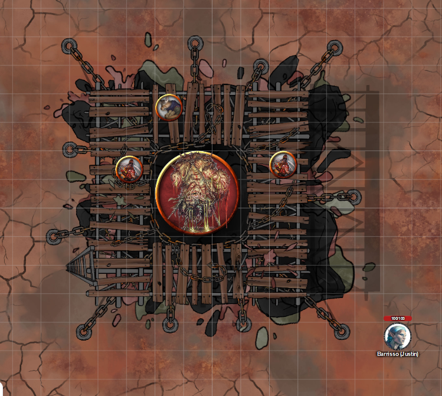

# 19 March 2025

**[Previously](2025-03-12.md):** We have found Zariel's Blade: after grasping it, Barrisso now appears to be some kind of angel-tinged being with wings. We decided our next task is to use the large adamantine rods we found to the "Solar Insidiator lock" - this name points to the Companion. Using his new wings - and a devil disguise - Barrisso flew up the Companion and used the adamantine rods on a series of holes around the equator of the object, to reveal a trapped planetar inside. The planetar said he would stay there until we are ready to free Elturel: he can physically lift Elturel from Avernus, once the chains tethering it to the surface have been severed. Barrisso scanned the sky for Zariel's flying fortress, and found it, tethered between two giant clamps which erupt from the Styx.

- [ ] Find out from the tortured blob where Zariel's flying fortress is.
- [ ] Go to Bel's Forge
- [ ] Investigate Mahadi's Emporium (at the Pit of Shummrath)
- [ ] Investigate the Obelisk of Ubbalux
- [ ] Redeem Zariel's general Olanthius, and in doing so redeem the ghosts in the Crypt of the Hellriders
- [ ] Investigate Thavius Kreeg, High Overseer of Elturel
- [ ] Investigate the vampire High Rider Klav Ikaia at Shiarra's Market
- [ ] Rescue the Hellriders
- [ ] Find the other half of the Infernal contract between Thavius Kreeg and Zariel
- [ ] Free Elturel from Avernus

---

We decide to scout some of the locations we have intended to visit during our time in Avernus, where we think we might  be able to do some good or, hey, find treasure.

We first head to where [a long time back, we saw a strange blob creature called a sibriex being tortured by chain devils to reveal the location of Zariel's fortress](../2024/2024-09-25.md).

We arrive to see the creature lashed in chains; it looks like a gibbering mouther, with less mouths. Two chain devils are still torturing the creature by tightening chains around it. A shallow pool of ichor has collected around the creature. Another fiend, jackal-headed, is sitting on scaffolding and using a bronze horn to project their voice at the blob. This creature is demanding answers from the blob: the location of demon armies, the location of the closest ship across the Styx, and other stranger questions that the blob could not possibly know the answer to. It's as if they want to torture the blob for eternity.

Barrisso, in his devil disguise, approaches the devils, while the rest of the party stay nearby in our war machine:

<figure markdown>
  { width="400" }
  <figcaption>Tortured Blob</figcaption>
</figure>

In Infernal, Barrisso asks "Are you having fun?"

The devils look a bit surprised, but does not seem to look through Barrisso's disguise. The smell is horrendous. The guy nearest says: "Shalock, did you hear this one speak to me?" The other chain devil says: "Yes, Jank, I think he did."

"I did not mean to interrupt."

"Bel will have to wait!"

"I cannot go back to Bel and tell him that: he needs more detail or will be displeased."

"What is your name?"

"Barrisell"

"It is Barrisell who Bel will be displeased with, not with us."

"That is your choice."

"Do you want us to destroy this thing?"

The jackal-headed creature, named Fetchtatter by the others, says "What thing?" and has a good look at Barrisso. When it does, it says "Angelic being, why do you bother my devils?"

Barrisso flies back and drops the disguise.

"What sort of a spy are you?" says the jackal-headed being.

"What do you mean, angelic creature?" says the other two.

"Do you not see the angel's wings that hold this being aloft?"

"Oh!.... Do you want us to kill it?"

"I don't have any particular objection."

Lunghiss casts Magic Weapon on his shortbow, then fires at the nearest devil, doing 32HP of damage.

The chain devil on the other side of the platform animates chains from the superstructure and damages Barrisso with them.

Norgreath casts Eldritch Blast (with Agonizing Blast, once with Genie's Wrath), doing a heap of damage.

The blob targets the closest of our party: Barrisso, Gralok, and Karthis. Karthis feels a terrible itching, but then resists. Barrisso feels as is his arms were about to disappear from his body and then, fine. Gralok felt his flesh beginning to fall off his bones, and then felt fine again:

<figure markdown>
  { width="200" }
  <figcaption>Tortured Blob</figcaption>
</figure>

Barrisso frees himself from the chains *(Athletics check)* and backs away.

Galen moves, then casts Banishment on all four of the creatures. The jackal-headed devil and one of the chain devils disappear.

Gralok fires his longbow at the remaining chain devil, doing 8HP of damage, then moves into cover behind a rock.

Karthis targets the blob with a Cloudkill: it doesn't seem to have any effect on the creature.

The remaining chain devil animates his chain, and they strike out towards Galen, doing 21HP damage and restraining Galen.

---

Lunghiss fires his magicked bow, doing 9HP of damage.

Norgreath casts Eldritch Blast (with Agonizing Blast, once with Genie's Wrath), killing the chain devil. His second attack hits the blob, doing 6HP of damage.

The blob rises into the air as the chains no longer restrain it. It squirts some bile at Karthis. He is squarely hit *(Dex fail)* but luck saves him. The blob then moves slowly towards us.

Barrisso speaks in Infernal: "What were the devils torturing you for?"

"Information."

"What information?"

"Lots of information."

"Those two devils were banished, but will be back soon. Are you willing to fight with us against them?"

"Foolish mortal."

As it speaks, squirts bile at Barrisso, but misses.

Galen casts Spiritual Weapon, then Toll the Dead, and retreats.

Gralok fires his longbow, doing 9HP of damage.

Karthis casts Witch Bolt but misses.

---

Lunghiss fires his magicked bow, doing 11HP of damage.

Norgreath casts Eldritch Blast (with Agonizing Blast, once with Genie's Wrath), doing 11HP of damage.

The blob casts a spell, and two of Galen's tusks rapidly expand to form tusks. He is also poisoned, and gains a level of exhaustion. The blob then moves 20 ft towards us. The chains on the creature start reaching out to us, but nothing else happens.

Barrisso attacks with the Sword of Zariel; one attack hits, doing 52HP of damage.

Galen's Spiritual Weapon attacks, but misses. Galen then himself attacks with a Flame Strike, doing 24HP of radiant damage, and 7HP of fire damage.

Before Gralok gets to go, the blob casts a spell at Galen. The blob does him 16HP of psychic damage, and suffers from Feeblemind.

Gralok uses Form of the Beast, then performs a series of reckless attack on the blob, doing 21HP of damage.

The blob sprays his bile on Barrisso, but misses.

Karthis moves, then casts Shatter on the blob, doing 9HP of damage.

Lunghiss strikes the blob with his +2 Lathander's Radiant Blade, using Booming Blade and Savage Attacker, doing 36HP of damage. The creature collapses in on itself but issues a cloud of poison. Lunghiss, Barrisso, Gralok, and Karthis are all nearby but avoid damage.

---

Lulu moves to Galen and casts Heal, curing him of Feeblemind. Barrisso cures himself with Lay on Hands, while others of the party climb onto the platform, in readiness for the jackal-headed and chain devil reappearing from their banishment. Norgreath casts Shadow of Moil. Galen casts Bless on the party.

The two devils reappear from banishment.

Gralok uses reckless attacks on the chain devil, doing 25HP of damage.

Karthis casts Witch Bolt on the chain devil, but misses.

The jackal-headed demon casts Chain Lightning at Gralok, Barrisso, Galen, and Karthis: everyone gets half damage (24HP).

Lunghiss strikes the chain devil with his +2 Lathander's Radiant Blade, using Booming Blade and Savage Attacker, doing 31HP of damage (plus 10HP thunder damage if it moves). Lunghiss then disengages.

As Lunghiss attacked the chain devil, it looked at him. As he looked back, he saw the face of his dead fledgling. Lunghiss is now frightened until his next turn.

The chain devil attacks Gralok, doing damage. He then attacks Galen, doing 34HP of damage.

Norgreath flies, then casts Eldritch Blast (with Agonizing Blast, once with Genie's Wrath) at the jackal-headed devil.

Barrisso attacks the chain devil with his Sword of Zariel, smiting him. He then moves to attack the jackal-headed demon, but misses.

Galen casts Mass Cure Wounds, giving everyone in the party 15HP of health.

Gralok attacks with his claws, doing 11HP of slashing damage.

Karthis casts Haste on Barrisso.

The jackal-headed devil teleports away to a rock to our east.

Lunghiss fires his shortbow at the jackal-headed devil, but misses.

Norgreath casts Eldritch Blast (with Agonizing Blast, once with Genie's Wrath) at the jackal-headed devil: two attacks hit, doing 30HP of damage.

A hastened Barrisso moves towards the jackal-headed devil and attacks with his Sword of Zariel: suddenly a shield of force intervenes but the attack still succeeds with Bless. On his second attack, the devil dies.

---

The jackal-headed devil was a yugoloth. [We search his remains...](2025-03-26.md)
