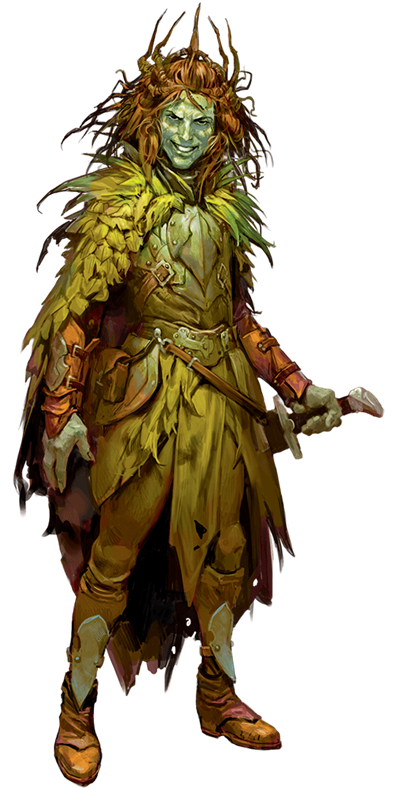
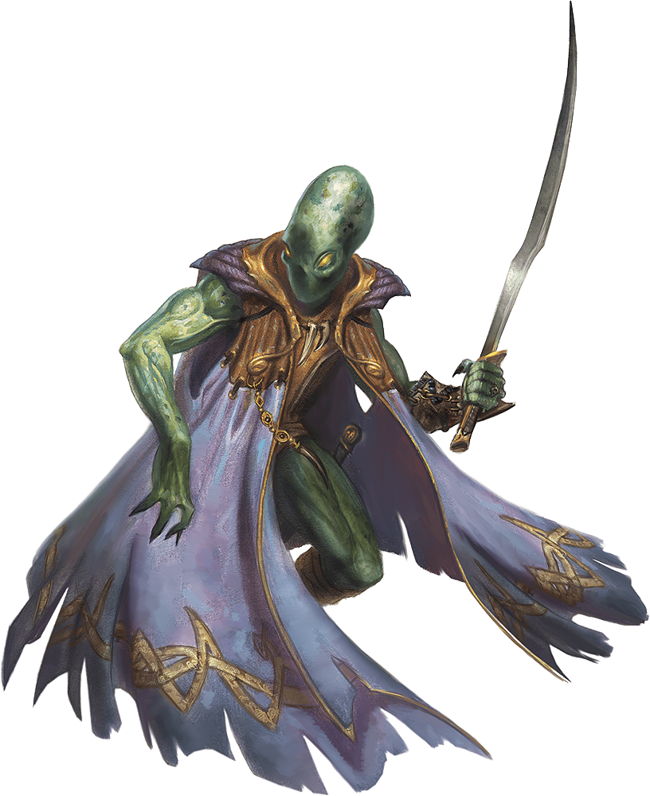

# 26 March 2025

**[Previously](2025-03-19.md):** After finding the Sword of Zariel, and before we use it to sever the chains holding Elturel to Avernus, we decided to tie up any loose ends. We headed to where [a long time back, we saw a strange blob creature named Sibriex being tortured by chain devils to reveal the location of Zariel's fortress](../2024/2024-09-25.md). Barrisso, disguised a devil, approached the two chain devils (Shaylock and Jank) and bantered with them: they revealed they were torturing the blob to get information for Bel. A jackal-headed devil, Fetchtatter, sees through Barrisso's disguise, so we attack. In the fight, we injure the blob, who then decides to attack us as well. Fortunately, Galen temporarily banishes two of the devils, and we use the interlude to finish off a devil and the blob, then kill the two other devils once they reappear.

- [X] Find out from the tortured blob where Zariel's flying fortress is.
{: .task-failed }
- [ ] Go to Bel's Forge
- [ ] Investigate Mahadi's Emporium (at the Pit of Shummrath)
- [ ] Investigate the Obelisk of Ubbalux
- [ ] Redeem Zariel's general Olanthius, and in doing so redeem the ghosts in the Crypt of the Hellriders
- [ ] Investigate Thavius Kreeg, High Overseer of Elturel
- [ ] Investigate the vampire High Rider Klav Ikaia at Shiarra's Market
- [ ] Rescue the Hellriders
- [ ] Find the other half of the Infernal contract between Thavius Kreeg and Zariel
- [ ] Free Elturel from Avernus

---

We search the bodies for anything interesting. We find on Fetchtatter a bunch of scrolls: some emanate magic. These contain the spells:

* 1st level:
    * Detect Magic
    * Identify
    * Shield spell
    * Tenser's Floating Disk
* 2nd level:
    * Detect Thoughts
    * Mirror Image
    * Phantasmal Force
    * Suggestion
* 3rd level
    * Fear
    * Fireball
* 4th level:
    * Banishment
    * Dimension Door
* 5th level:
    * Contact Other Plane
    * Hold Monster
* 6th level:
    * Chain Lightning
* 7th level:
    * Finger of Death
    * Death God's Touch
    * Last Rays of The Dying Sun
* 8th level:
    * Mind Blank
    * Arcane Sight
    * Create Ring Servant

There are also non-magical scrolls in Infernal. One document is full of gaps and crossed-out lines. The second scroll details the interrogation of Sibriex, the blob by Fetchtatter the Arcanaloth:

???+ scroll "The Arcanaloth's Notes on the Sibriex"

	Tell me, Sibriex, who knows the location of the captive silver dragon?

	Sibriex: Those seeking information about a silver dragon trapped in Avernus should speak with Mahadi.

	Who possesses information about the infernal munitions dump, Sibriex?

	Sibriex: Z'Neth the Beastmaster not only knows the location of the dump but also possesses its floor plans.

	Who is Fhet'Ahla?

	Sibriex: Fhet'Ahla is an imp who notarizes contracts at the Emporium.

	Who is Fhet'Ahla?

	Sibriex: Fhet'Ahla was once betrayed by another imp named Beirgroach, who pilfered a chest of contracts intended for the Terror Troop.

	Who is Trondoz Wildsnow?

	Sibriex: Trondoz Wildsnow, the white abishai, knows the way inside the tower of Arkhan the Cruel.

	What was the former role of Respen Shadowswimmer?

	Sibriex: Respen Shadowswimmer, the drow wizard, held the position of commander at Plagueshield Point before it was dragged into Avernus.

	Where might one find the spirit of the dwarven Hellrider Glanring Ironbelly, and how might this location be discovered?

	Sibriex: The spirit of a dwarven Hellrider named Glanring Ironbelly might be located in the ruins of Weatherstone Keep, a secret that can be discovered within Respen Shadowswimmer's hidden hall of secrets.

	Sibriex, what truth lies behind the ascent of Bel to power in Avernus, and what became of the original ruler?

	Sibriex: Contrary to common belief, the pit fiend Bel overthrew and imprisoned the original Lord of Avernus thousands of years ago, not Tiamat. Bel has been siphoning the imprisoned Lord's power, though he remains subject to the Dark Eight.

	Are there conflicting accounts regarding the historical power dynamics between Bel and Zariel in Avernus?

	Sibriex: Indeed Older accounts suggest Bel overthrew Zariel, who was the initial Lord of Avernus. However, the current narrative portrays Zariel ascending to power over Bel, a discrepancy that could be exploited.

	What is the current state of Gargauth, a former Lord of Avernus, and what influence does he still wield?

	Sibriex: Gargauth, once a Lord of Avernus, was cast out and now resides trapped within the Shield of the Hidden Lord. From within, he seeks godhood and can subtly influence those who possess the shield. His past rank suggests he might still have hidden allies.

	Who are the Dark Eight, and what is their role and disposition within Avernus?

	Sibriex: The Dark Eight are powerful devils based in Avernus who favour the rank of general. They are in constant competition, scheming for power and prestige. Understanding their goals and rivalries could offer opportunities.

	Are there any significant internal rivalries within Zariel's legions that could be exploited?

	Sibriex: Within Zariel's legions, there is a fierce rivalry between the Horned Devil corps, which is currently out of favour, and the Erinyes corps, which currently holds dominion This discord could be exploited to weaken her forces.

	What should one be wary of when accepting gifts from devils?

	Sibriex: Devils often tempt mortals with treasure and magic items, but these frequently bear infernal markings or have devilish quirks, revealing their origin Acquiring them might attract unwanted attention or offer insights into the devil's schemes.

	What are Bel's true intentions regarding the nine adamantine rods?

	Sibriex: Bel does not truly expect those who recover the nine adamantine rods to return them. He secretly hopes they will be used to unlock the Companion, potentially disrupting Zariel's plans for Elturel.

	Are there any unusual cults within the Blood Legions with aspirations beyond the current conflict?

	Sibriex: Yes, despite the ongoing Blood War, there are cult societies within the Blood Legions who still idolize "Avernus That Was," a former paradise, and secretly seek its restoration Aligning with or exploiting these cults could offer a different perspective on Avernian power dynamics.

	What is the true nature of soul coins?

	Sibriex: Soul coins are used as currency and contain trapped souls that can be conversed with.

	What is the fate of the souls trapped within soul coins?

	Sibriex: These souls can be freed by a spell that removes a curse. However, most freed souls are simply recycled back into Hell's intake.

	What are the plans of the warlord, Princeps Kovik?

	Sibriex: Princeps Kovik, a chain devil, has spies within Bel's Forge who informed him about nine adamantine rods. He intends to sell them to Mahadi for soul coins.

	What is Mad Maggie's current obsession within Avernus, and what knowledge might she possess?

	Sibriex: Mad Maggie, a respected warlord, is obsessed with the saga of Zariel's fall and actively seeks relics related to it. Her knowledge of Zariel's past might offer valuable insights.

	What potential secrets does the exiled Respen Shadowswimmer hold regarding Plagueshield Point?

	Sibriex: Respen Shadowswimmer, the exiled former commander of Plagueshield Point, is a researcher fascinated by the River Styx. His past role suggests he might possess valuable knowledge about the fortress's secrets or vulnerabilities.

	Are there any significant rivalries amongst the current archdevils that could be exploited?

	Sibriex: Levistus, an archdevil, is a rival of Geryon, who seeks to usurp Levistus's position by destroying him. This ongoing rivalry presents a potential avenue for those seeking to gain favour or disrupt the highest echelons of Hell.

Fetchtatter's gloves emanate magic; we will check them later.

---

We head onwards towards the Pitt of Shummrath. Galen casts Prayer of Healing on those in the party who need it.

As we travel, we are suddenly pelted with small hot meteorites. We hide under our vehicle, the Demon Grinder, and are safe for the moment. We reach the area of the Demon Zapper, and continue onwards. We feel a sensation of unease, but throw off the onslaught of psychic evil. We continue on.

After a while, we see a dark speck on the horizon, blurred by the heat of Avernus, we cannot tell if it if flying or jumping, reappearing and appearing. We continue but avoid travelling directly to it. As we approach it, we see the object - a vehicle with two wheels - is using a large semicircular rock as a ramp. The vehicle's driver is a humanoid who has spotted us and begins waving to us. We make out a large grin on the figure's greenish face. It seems to be a green elf eladrin.

Barrisso shouts "Hail, eladrin: what are you going?"

"Practising!"

"For what?"

"My machine's manoeuvrability."

"For what?"

"I want to get what's due to me. I am Smiler, favoured of Tymora herself. She has blessed me with your company. Who do I have the pleasure of meeting?"

Barrisso knows *(religion check)* knows that Tymora is a goddess known as Lady Luck.

"Not too long ago, I led a merry band of adventurers. I thought they were my friends. Alas, they betrayed me. An accursed devil known as Bitterbreath turned my friends against me. Maybe I have been blessed with your arrival, to aid me in recapturing my soul coins from Bitterbreath. I will split the proceeds of course! I think he is the Marauder's Camp near the Pit of Shummrath. 

<figure markdown>
  { width="200" }
  <figcaption>Smiler</figcaption>
</figure>

"So why were you jumping around in your vehicle?"

"I thought I might need to make a fast getaway in it. There's one devil, but with about 30 hobgoblins."

"You're surprised they turned on you?"

"They used to be my friends."

Barrisso intuits that Smiler is not telling the whole truth, and asks him what he is keeping back, using Intimidation.

Smiler seems almost insulted by this. He claims it was all true, maybe slightly embellished. He may have taken some soul coins and escaped on his bike previously. He found a way to survive here on the plains, along with the other warlords.

"A creature such as yourself - would you not find satisfaction that Bitterbreath and his friends rampage and torture?"

"Why is Bitterbreath so different?"

"He is cursed. He was a pit fiend, and now is just a lowly warlord with the inability to enter into any deals. Being unable to enter into deals makes his life unbearable. He has taken over my hobgoblins as no devil is allowed to associate with him."

"How many soul coins did you have?"

"At least 40."

We decide to consider Smiler's offer, but will continue on. We ask the camp's exact location. 

"Are you willing to wait?" 

"Well, you are my goddess-given best chance. I cannot force you!".

We head on.

---

We feel an overwhelming telepathic burst: we all save, so only suffer 5HP of psychic damage. 

We approach the south of the Pit of Shummrath. A canyon splits the surface of Avernus, from east to west, a mile deep, and filled with undulating green slime. From a nearby cliff, we see a tributary cascading into the slime. Nearby, dangling from a bent iron crane over the chasm, is an iron cage. It contains a hairless shackled green-skinned humanoid. The crane is continuously lowering the cage into the slime, immersing the creature for a minute, then hoisting it back out.  

We try to turn the crane; as soon as we do, the creature telepathically pleads: "Free me! And I will give you knowledge!". 

We ask his name: it's Baazit.

"Who put you here?"

"I did something I wasn't supposed to."

"What?"

"There was this pit fiend with a huge shield and sword, and I took some of his soul coins. He did not take kindly to that. His name is Pulcaaw."

"Where is Pulcaaw?"

"I have not seen him in decades."

"How many soul coins did you steal?"

"Eight."

"EIGHT???!!"

"Yes, I've been thinking about them a long time."

We believe this creature is an ultraloth. 

Lunghiss takes his crowbar and *(Sleight of Hand check)* successfully jams it into the winching mechanism. 

Lunghiss casts Mage Hand, then uses his Thieves' Tools to open the cage door. However, Baazit is still shackled.

"How can we get you out of those shackles?"

"A good question. I don't have a means."

"Do you know the command phrase for them?"

"No." 

"The pit field Pulcaaw might."

Lunghiss knows that dimensional shackles can only be opened by the creature who used them, or someone who makes a 30 Strength/Athletics check. 

We decide to use our Pipes of Marvellous Emancipation to unlock the shackles. 

"We're going to try something. But that involves using a precious item of ours. We're not keen to lose it, unless you can replace it with something as valuable?"

"I can tell you how to create creatures from the slime that will serve. You can have one each. They would last until they died. They're not combative though."

"Like a familiar?" pipes up Lunghiss. "They're rubbish!".

"If you free me from dimensional shackles, you would have dimensional shackles."

We look sceptical.

"I might be able to help you with knowledge of this plane."

"What do you know about Zariel? Anything that would give us advantage?"

"I can give you some information."

"The Sword of Zariel, because it contains her angelic essence, will weaken her. "

Lunghiss plays the pipes (only three remain now), the shackles open, and the creature appears beside us:

<figure markdown>
  { width="200" }
  <figcaption>Ultraloth</figcaption>
</figure>

Barrisso flies over and takes the shackles. 

"All of Zariel's forces have an order to find her sword and return it to her. It is that important. Bel, who I have worked for, has also been seeking this sword. Bel's understanding is that there is a divine spark of Zariel contained in the sword, and therefore if they are brought together, potentially Zariel could be weakened. Depending on that, it may be that she is no longer bound by her oath, and Bel could take over this plane again."

We ask Lulu what we could do. Seemingly, the sword could remind of Zariel of her past.

Since our agreement with Baazit ends, he disappears.

---

We head to the bridge across the Pit, across to the Obelisk of Ubbalux. A giant stone staircase reaches up the obelisk. We leave our vehicle, and start climbing. The steps seem endless, but eventually we reach the top. We see a curving path leading to the obelisk, which 30 feet tall, made of purplish-reddish stone. Around it is a set of standing stones; seven mini-versions of the main stone.  

As we examine then, we notice a tall humanoid wearing tattered black robes striding between the stones, gesticulating wildly and screaming curses into the wind. 

We catch his attention, and he says: "Help me! My name is Ubbalux."

"This is your obelisk? Why do you need help?"

"I do not recall where I have come from, but I know I can be freed if I can solve the riddle of this place. I can do that if you help me with the streams of magic here. The obelisk in the centre focuses the energy of the other stones. I hope we can dissipate the magic that traps me here. I do not know where I am from, but hope that once I can step outside their circumference, [I will regain that knowledge."](2025-04-02.md)

