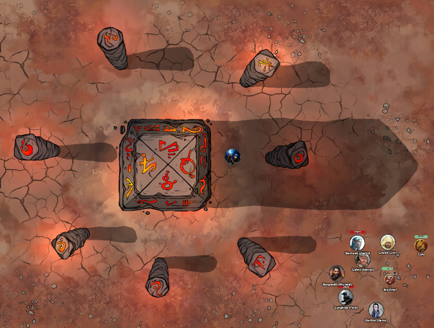
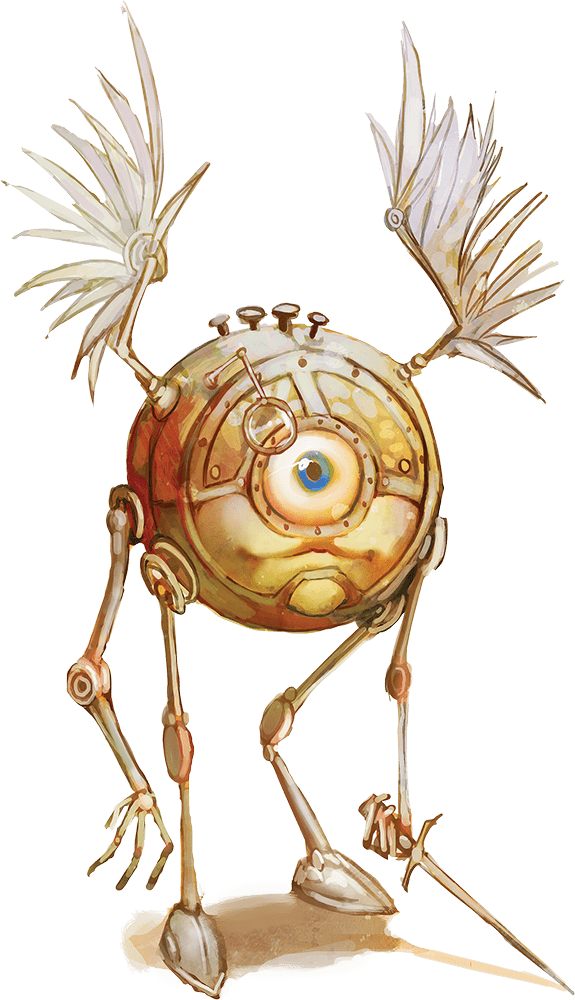

# 2 Apr 2025

**[Previously](2025-03-26.md):** After defeating Sibriex the blob and the devils who were torturing him (seemingly for Bel), we are rewarded with a nice stash of magical scrolls, Fetchtatter's gloves (which emanate magic), plus a record of the questions asked during his torture. We continue on to the Pitt of Shummrath. On the way, we meet a green elf eladrin, betrayed by a devil called Bitterbreath who turned his comrades (30 hobgoblins) against him. It turns out he had escaped with 40 soul coins, and wants them back. We decide it might not been worth it, and continue on. We reach the Pit of Shummrath, and find a green-skinned humanoid ultraloth named Baazit being raised and lowering continuously in a cage into the green slime of the pit. He had been locked in the cage by a pit fiend named Pulcaaw. Lunghiss rescues him by playing the Pipes of Marvellous Emancipation to remove the creature's shackles. He has only advice to offer: "All of Zariel's forces have an order to find her sword and return it to her. It is that important. Bel, who I have worked for, has also been seeking this sword. Bel's understanding is that there is a divine spark of Zariel contained in the sword, and therefore if they are brought together, potentially Zariel could be weakened. Depending on that, it may be that she is no longer bound by her oath, and Bel could take over this plane again." We head across the bridge to the Obelisk of Ubbalux, where we meet Ubbalux himself. He is trapped, and can be freed if I can solve the riddle of this place: the obelisk in the centre focuses the energy of the other stones.

- [ ] Go to Bel's Forge
- [ ] Investigate Mahadi's Emporium (at the Pit of Shummrath)
- [ ] Investigate the Obelisk of Ubbalux
- [ ] Redeem Zariel's general Olanthius, and in doing so redeem the ghosts in the Crypt of the Hellriders
- [ ] Investigate Thavius Kreeg, High Overseer of Elturel
- [ ] Investigate the vampire High Rider Klav Ikaia at Shiarra's Market
- [ ] Rescue the Hellriders
- [ ] Find the other half of the Infernal contract between Thavius Kreeg and Zariel
- [ ] Free Elturel from Avernus

---

<figure markdown>
  { width="400" }
  <figcaption>Obelisk of Ubbalux</figcaption>
</figure>

Both the main obelisk, and the eight surrounding smaller obelisks, display symbols. Some are related to schools of magic. Ubbalux thinks if we stand near each pillar, it will empower them.

Karthis touches the obelisk with the Evocation symbol. It feels like rock, but already thrumming slightly before he touched it. Justin uses Insight to detect Ubbalux's motive: he seems sincere, but touched. We cannot be sure if his advice is correct.

We ask Ubbalux who trapped him here: he answers Asmodeus, getting upset at just mentioning his name. He doesn't remember his own name, or even where he came from.
Barrisso also touches a pillar, and feels a thrumming sound.

We decide that all the party, eight in total, should touch one of each of the eight pillars.

Ubbalux begins to chant, and the air around us fills with the smell of ozone. Lightning courses over the standing stones. Everyone takes 23 lightning damage.

The person connected to abjuration gets a +2 AC for 24 hours.

Conjuration (Norgreath): A strange creature, a modron, appears and seems to follow him around.

<figure markdown>
  { width="200" }
  <figcaption>Modron</figcaption>
</figure>

Divination (Taq) gains True Seeing for the next hour.

Enchantment (Galen), feels confused, but resists.

Evocation (Karthis) is targeted with a Magic Missile, and gets 15 HP of damage.

Illusion (Lunghiss), a swarm of bats attacks.

Necromancy (Gralok), suffers 30HP of necrotic damage.

Lastly, Lulu turns from a golden colour, to blue.

Ubbalux screams in frustration and agony: his human form disappears and we see a barlgura (an ape-like demon) in his place.

Barrisso fires with his longbow, doing 3HP of piercing damage.

Galen casts Mass Healing Word, healing everyone for 14HP.

Karthis casts Shatter at the barlgura, doing 6HP of thunder damage.

The barlgura casts a spell, and disappears. Barrisso, who has Truesight, can see where the barlgura is.

Lunghiss casts the cantrip Mind Sliver, doing 11HP of psychic damage.

Norgreath casts Eldritch Blast (with Agonizing Blast) three times, once with Genie's Wrath, hitting twice.

Barrisso casts Toll the Dead, doing 23HP of necrotic damage. The demon is also now visible again.

Galen moves and casts Bless on himself, Lunghiss, Norgreath, and Barrisso.

Karthis moves and casts Enervation at the demon, doing 7HP of necrotic damage, killing him.

---

Lunghiss uses Mage Hand to check the corpse for items: however, we find nothing.

We search the area. While we are investigating, Norgreath sees the modron and asks it to investigate the circle. Lunghiss *(Arcana check)* thinks modrons speak, well, Modron.

Barrisso thinks about putting the modron in the circle: Lulu, telepathically, says to leave it alone.

---

We climb down the stairs from the obelisk back to our war machine. We drive back towards the bridge across the Styx. A psychic blast of agony washes across the party *(Int save)*: those who fail take 10HP of damage.

We head across the plains on the far side towards the Arches of Ulloch. A wave of extreme heat affects the party *(Con save)*: those who fail take a level of exhaustion.

---

We arrive at the Crypt of the Hellriders, and rest while some of the party take watch. During the watch, Olanthius appears to us, clad in dark platemail. His eyes sweep across the resting party, and he moves to Barrisso. He greets him, and wakens the party.

Olanthius asks: "Who have you seen?"

"A number of people."

"Did you speak to Yael?"

"Yes, we did, a ghost in a dream."

"Is her spirit pure?"

"It seemed to be. I would say, yes."

He pauses, silent. It sounds like he is sighing.

"Does this please you?"

"It is I would have wished."

"The longer you wander the surface of this plane with what you carry, the more you endanger your city."

Barrisso tells him he want to redeem Zariel. We hope to redeem our own souls as well.

Olanthius has no knowledge of Zariel's flying fortress, or how to access it. He says there is a horned devil named **Bazelsteen** in charge of the Stygian dock, which should contain information about the structure of the flying fortress.
We thank Olanthius for his help, then take a long rest.

---

Olanthius has warned us that the Sword of Zariel is the most sought-after item in Avernus, so Barrisso hides it in a Bag of Holding. We travel towards the Arches of Ulloch; as we travel, the vehicle is pelted with acid rain; we shelter from it underneath. We proceed onwards.

We use the Arches of Ulloch to travel to the Stygian dock, two tower-like clamps holding Zariel's flying fortress in place.

We arrive at a gigantic basalt citadel: upriver we see the flying fortress. The citadel is 100 foot high, with chains affixed to it. There are a bunch of around 15 devils working away in this area.

Karthis *(Arcana check)* describes the infernal hierarchy of devils:

* **Lowest devil:**
    * Lemure
* **Lesser devils:**
    * Imp
    * Spined devil
    * Bearded devil
    * Barbed devil
    * Chain devil
    * Bone devil
* **Greater devils:**
    * Horned devil
    * Erinyes
    * Ice devil
    * Pit fiend
* **Archdevils:**
    * Duke or duchess
    * Archduke or archduchess

Barrisso disguises himself as a bone devil. The rest of the party enter Norgreath's magic ring, (Genie's Vessel: Bottled Respite/Sanctuary Vessel) which Taq will carry.

Barrisso enters the dock area: he is asked to state his purpose. He requests an audience with Bazelsteen. After some pleading, a horned devil, constantly chewing on a shard of red-hot coal and covered in engine oil, [approaches Barrisso.....](2025-04-09.md)

