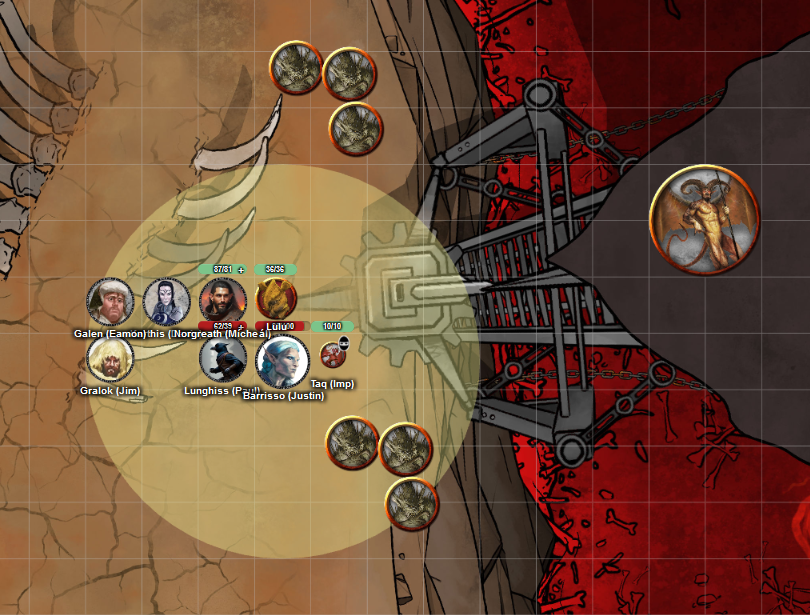
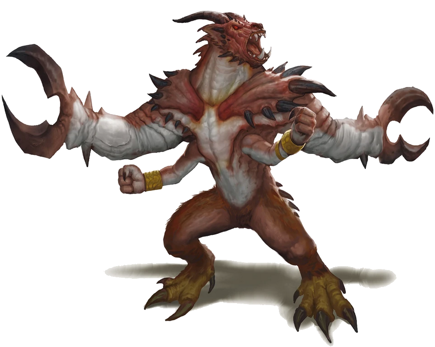

# 9 Apr 2025

**[Previously](2025-04-02.md):** We found ourselves at the Obelisk of Ubbalux, where the man himself was seemingly trapped inside the circle of stones. He asked us to touch each of them, as by empowering them, we seemingly could set him free. Unfortunately, one magical effect from the stones turned Ubbalux into a barlgura (an ape-like demon) and we attacked and slayed him, yielding no treasures. We returned to the Crypt of the Hellriders, where we conversed with Olanthius. He seemed pleased with our quest to free Elturel and, hopefully, Zariel, and advised us not to tarry with the sword. We travelled to the Stygian dock which holds Zariel's flying fortress in place. There, Barrisso disguised himself as a bone devil in an attempt to infiltrate the craft, while the rest of the party hid inside Norgreath's magic ring. A horned devil named Bazelsteen approaches Barrisso....

- [X] Investigate the Obelisk of Ubbalux
- [ ] Go to Bel's Forge
- [ ] Investigate Mahadi's Emporium (at the Pit of Shummrath)
- [ ] Redeem Zariel's general Olanthius, and in doing so redeem the ghosts in the Crypt of the Hellriders
- [ ] Investigate Thavius Kreeg, High Overseer of Elturel
- [ ] Investigate the vampire High Rider Klav Ikaia at Shiarra's Market
- [ ] Rescue the Hellriders
- [ ] Find the other half of the Infernal contract between Thavius Kreeg and Zariel
- [ ] Free Elturel from Avernus

---

We are currently on the banks of the Styx, next to the dock where Zariel's flying fortress is stationed. On the banks are six barbed devils: on the dock is Bazelsteen the horned devil.

<figure markdown>
  { width="400" }
  <figcaption>Stygian Dock</figcaption>
</figure>

Barrisso asks can we have access to Zariel's flying fortress.

"What's the likes of you want to get in the fortress?"

"To meet with Zariel or one of her agents. It's personal."

"I can't just let anyone in here, can I?"

"Is there anything I can do to help you to help me?"

"Hmm. Do you have some friends who would help me with an experimental technique? I call it a bathysphere. It searches the Styx for souls, which we can turn into lemures."

He wants us to enter the craft and use its suction arms to scoop up silted souls from the bottle of the river. The bathysphere can hold four people.

We ponder is this a suicide mission and, if so, is there a way we could escape from the machine if it gets into trouble. We wonder if we do the task with only one or two of the party, who could use magic to escape. Bazelsteen is insistent that four people should enter the craft. Dimension Door will only rescue two people in the event of trouble.

Barrisso asks Bazelsteen if he has a spell that would help us if things go wrong. He shrugs, and says no. We decide to accept the offer, and tell him we will be back tomorrow.

---

We decide to travel and rest at the warlord's lair where we met and made a deal with a medusa. We suffer *(Con save)* psychic damage on our way, but arrive at our destination relatively intact.

Karthis inscribes the Dimension Door spell from a scroll, and learns it: this will hopefully helps us if things go wrong. Our plan is for everyone except Karthis and Taq to enter Norgreath's magic ring (his Genie's Vessel) in the event of trouble, with Taq wearing the ring. Karthis could then use Dimension Door so that he and Taq escape. Karthis also examines the gloves we got from Fetchtatter: they are Subtle Mage Gloves. We all take a long rest. The next morning, we head back to the Stygian dock. Some of us *(Con save)* suffer a level of exhaustion from the oppressive atmosphere.

---

At the dock, we ask Bazelsteen if the agreement still stands. Four of us volunteer for the bathysphere: Lunghiss, Norgreath, Gralok, and Karthis. Each suction station of the craft is equipped with operational levers. Bazelsteen says "Whichever of you gets the most souls will get a soul coin."

---

We enter the bathysphere, which is lowered by a chain into the Styx. The waters of the river are opaque: we only have 10 feet of vision through its small windows at each of the four stations.

Bazelsteen lowers us down as far as we can go. We all *(Dex check)* use our suction tools to try to capture souls caught in the silt of the riverbed.

---

Suddenly, up on the surface, a group of vrocks swoop down and attack the dock area. Bazelsteen leaves the bathysphere area to help his barbed devils repel the onslaught, leaving the bathysphere controls unattended.

Barrisso tries to hide from the vrocks, who are diving and attacking the horned devil and barbed devils. Galen tries to understand the control system of the bathysphere *(Arcana check*). He realises he would have to make three successful checks to bring the craft back up safely, and attempts it.

---

Meanwhile, in the bathysphere, the passengers feel a tug upwards, but continue gathering souls.

---

Back on the surface, the battle continues but no side has an upper hand. From his hidden position, Barrisso casts Guidance on Galen, to aid him in raising the bathysphere. Galen successfully raises it more. Suddenly, a glabrezu demon appears on the crane, and attempts to snip the bathysphere's cable with its pincers.

<figure markdown>
  { width="400" }
  <figcaption>Glabrezu</figcaption>
</figure>

It succeeds. The craft is dragged to the bottom: everyone inside suffers 2HP of bludgeoning damage. Those inside decide to use our escape plan.

---

In the meantime on the surface, the glabrezu attacks Galen, doing 20HP of damage.

---

Inside the bathysphere, Lunghiss, Gralok, and Norgreath enter Norgreath's magic ring (his Genie's Vessel), which Taq wears around his neck. Karthis and Taq are now in the bathysphere on their own. Karthis casts Dimension Door: Karthis and Taq are transported to the dock, out from the sunken bathysphere.

Barrisso casts Hunter's Mark on the glabrezu, then wields his halberd, doing 13HP of damage. He uses Divine Smite to apply an additional 12HP of damage.

Galen casts Sunbeam at the glabrezu, doing 14HP (half damage) of radiant damage.

The glabrezu casts Confusion, which is aimed all those not in Norgreath's ring: only Taq is affected.

Norgreath casts Eldritch Blast (with Agonizing Blast) at the glabrezu, doing 12HP of damage.

Karthis casts Enervation, doing 9HP of necrotic damage.

Lulu trumpets, emitting a cone of sparkling energy against the glabrezu, suffering only half damage (12HP).

---

Lunghiss (with Inspiration) performs a sneak attack with Booming Blade and Savage Attacker using his Lathander's Radiant Blade, doing 40HP of damage, plus an extra 6HP of thunder damage if the glabrezu moves.

Barrisso attacks with his halberd, but misses.

Gralok rages, then attacks the glabrezu with his claws, doing 30HP of damage.

Since Taq is confused, it attacks Karthis using its sting. It does 9HP of damage.

Galen casts Sunbeam at the glabrezu, killing him. The glabrezu's Confusion spell dissipates.

---

Norgreath flies and attacks a vrock to our north, doing 20HP of damage.

Karthis casts Haste on Gralok.

To our north, the devils fight with the vrocks.

---

Lunghiss casts Magic Weapon on his shortbow, then fires an arrow at the same vrock as Norgreath, doing 32HP of damage.

Barrisso flies, then uses his halberd on the same vrock; with Divine Smite, he does 32HP of damage, killing the creature.

Gralok moves swiftly to the dock and attacks a vrock: two attacks connect, doing 11HP of damage. Gralok uses Infectious Fury to make the vrock attack another: he does 6HP of slashing damage to his own ally.

[It's now Taq's turn....](2025-04-17.md)

