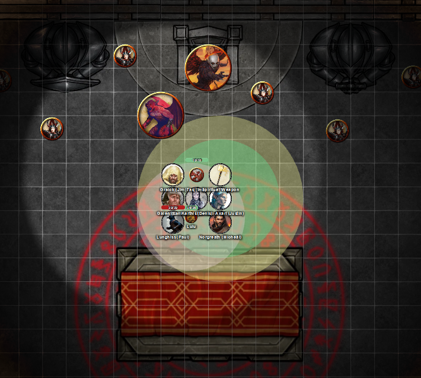
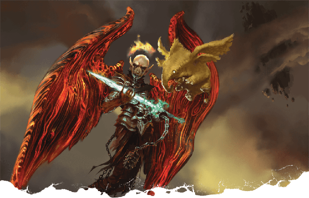
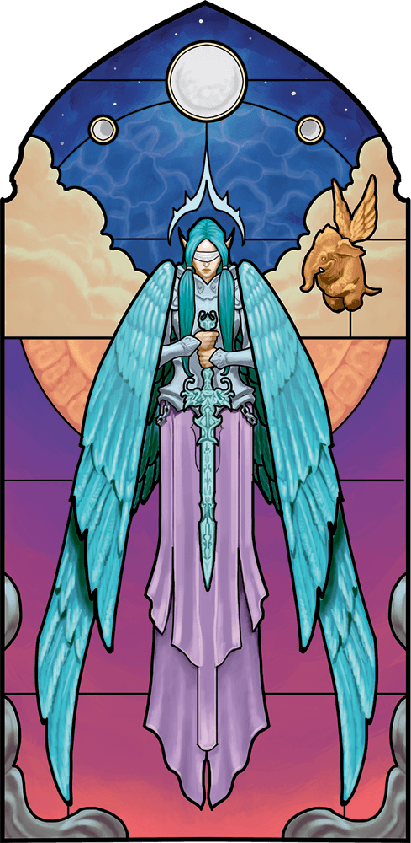
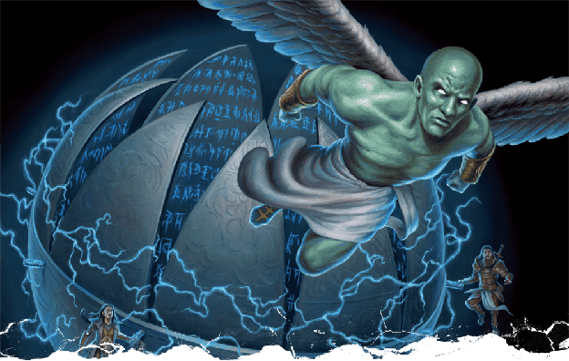

# 22 May 2025: Finale

**[Previously](2025-05-14.md):**  We are attempting to enter Zariel's flying fortress. After our battle at the Crypt of the Hellriders, we decided that our the best strategy is to use the Arches of Ulloch to teleport directly into the fortress. On our way, we found on a peak Olanthius, spiked onto a tree. Norgreath used Speak with Dead to commune with him: he gave us the advise to "Appeal to Zariel's previous nature." Galen and Barrisso blessed him, at which point Haruman appeared on his nightmare. We defeated both and continued onward, to find our way blocked by abishai flying devils allied to Tiamat.

- [ ] Enter Zariel's flying fortress and confront her.
- [ ] Go to Bel's Forge
- [ ] Investigate Mahadi's Emporium (at the Pit of Shummrath)
- [ ] Redeem Zariel's general Olanthius, and in doing so redeem the ghosts in the Crypt of the Hellriders
- [ ] Investigate Thavius Kreeg, High Overseer of Elturel
- [ ] Investigate the vampire High Rider Klav Ikaia at Shiarra's Market
- [ ] Rescue the Hellriders
- [ ] Find the other half of the Infernal contract between Thavius Kreeg and Zariel
- [ ] Free Elturel from Avernus

---

The six abishais fan out in front of us, but so far do not act aggressively. Barrisso *(Insight)* does not think they intend to immediately attack us.

In Infernal, Barrisso says:

"We mean you no harm; we simply want to continue to the Arches."

One of the abishais (a green one) approaches and raises its claw and responds in Infernal:

"And where will the Arches take you?"

"Wherever we want to go."

"My mistress has an interest in your burden."

"Who is your mistress?"

"Tiamat."

"What is your opinion of your burden?"

"It is manifested by your wings, mortal. What would you trade for it?"

"It is not to be traded."

"I must be clear: I have strict instructions not to let you pass without such a trade."

"That will not happen."

"So be it."

---

Karthis casts Haste on Barrisso.

Norgreath attacks the leading green guy with Eldritch Blast (with Agonizing Blast) three times, the first with Genie's Wrath: the first two hit for 21HP of damage. The abishais seem to be resistant to cold damage.

Taq remains invisible, and Lulu holds back in case needed to heal.

Gralok moves halfway towards the abishais, then fires his longbow. His second attack hits, doing 8HP of damage. Then he rages.

Galen casts Banishment on two abishais. Neither are banished.

The first green abishai raises its talon towards Barrisso, but nothing happens. *(Wisdom save)* He then moves towards Galen and lashes out with a fiendish claw, doing 15HP of force damage, plus a poison effect (12HP of damage).

The second green abishai casts a spell at the party: each of us hear in our minds a calming voice saying "Lay down your weapon and let's all have a relaxing time". Lunghiss succumbs, sits down on the ground and puts down his weapon. He then moves beside Galen and attacks with his claw, but misses.

The third (white) abishai flies towards Gralok and attacks three times successfully, doing 23HP of damage.

The fourth (white) abishai also flies to Gralok and attacks three times, doing 25HP of damage.

The fifth (white) abishai also flies to Gralok: one attack hits, doing 4HP of damage.

The sixth (white) abishai flies to attack Galen: all three miss.

Barrisso flies and lands beside a green abishai. As he draws the sword of Zariel, all the abishai recognise it and shake their wings. Unfortunately, all his attacks miss.

Lunghiss still remains on the ground.

---

Karthis is sure that if the green abishai that cast the spell attacks and damages Lunghiss, the spell might dissipate. Karthis moves and casts Lightning Bolt, catches three white abishais and a green one. The spell does 43HP of lightning damage to the first; 22HP to the remainder.

Norgreath attacks the leading green guy with Eldritch Blast (with Agonizing Blast) three times, the first with Genie's Wrath: the first two hit for 21HP of damage.

Gralok attacks the white abishai with his claws, killing it. He then attacks (Great Weapon Master) another abishai, doing 9HP of damage.

Galen casts Spiritual Weapon behind the abishais, and attacks the green abishai who enthralled Lunghiss, but 24HP of damage. Lunghiss then attacks him with his mace, but misses.

The first green abishai attacks Barrisso with his claws, but misses.

The second green abishai attacks Galen with his claws, but misses.

The third (white) abishai attacks Gralok, hitting once for 20HP of force damage.

The fourth (white) abishai attacks Galen, doing 24HP of damage.

The fifth (white) abishai flies away, with Gralok getting an attack of opportunity, doing 7HP of damage. He attacks Gralok, doing 35HP of damage.

Barrisso attacks a green abishai with the sword of Zariel, doing 34HP.

Lunghiss recovers due to Lulu's influence.

---

Karthis casts Lightning Bolt again in the same direction: one takes 42HP of damage and dies; the second takes 42HP but is still alive; the third takes 23HP of damage.

Norgreath attacks the leading green guy with Eldritch Blast (with Agonizing Blast) three times, the first with Genie's Wrath; with inspiration, one attack hits for 17HP of damage.

Lulu casts Heal on Gralok for 70HP of health.

Gralok attacks with his claws, killing a white abishai.

Galen casts Cure Wounds on himself, doing 28HP of healing. His Spiritual Weapon attacks, doing 22HP of force damage on a green abishai.

The first green abishai attacks Galen, but misses.

The second green abishai also attacks Galen, doing 13HP of force damage.

The third (white) abishai goes 16HP of damage to Galen.

Barrisso attacks the most bloodied green abishai; with Divine Smite, he does 68HP, killing it. His second attack misses, but his third attack hits the other green abishai, doing 40HP of damage.

Lunghiss performs a sneak attack, with Booming Blade and Savage Attacker using his Lathander's Radiant Blade, doing 45HP of damage to the abishai.

Karthis attacks Toll the Dead on the green abishai, but fails.

Norgreath attacks the remaining green guy with Eldritch Blast (with Agonizing Blast) three times, the first with Genie's Wrath; two attacks hit for 23HP of damage.

Gralok attacks with his claws, but all attacks miss.

Galen attacks with his Spiritual Weapon, doing 13HP of force damage. His follow-up attack with his mace misses.

The green abishai casts a spell: those affected are confused. He then attacks Galen with his claws, doing 11HP of force damage.

The white abishai hits with his long sword, doing 17HP of force damage. Galen is down.

Barrisso attacks the green abishai; with Divine Smite, he does 41HP, killing it. His second attack on the white abishai does 24HP of damage. His third attack does 29HP of damage. With Divine Smite, he adds 14HP of damage.

Lunghiss attacks the white abishai, finishing it off.

---

Galen casts Prayer of Healing to heal the party. We decide to go straight for the Arches, without trying to rest again, as our enemies will only regroup.

We see approaching us from the north-east, what looks like Zariel's flying fortress hurtling towards us. We think we can makes it to the Arches before it reaches us. We make it to the Arches, abandon our vehicle, and rush onwards. We pass thru the Arches, concentrating on our direction. After a period of disorientation, we arrive on the command deck of Zariel's flying fortress:

<figure markdown>
  { width="400" }
  <figcaption>Fortress Command Deck</figcaption>
</figure>

There is a huge throne, on which sits what we think is Zariel. Flanking the throne are two statues: one of Zariel herself, one of Asmodeus. The ceiling is a stained glass dome, showing demons fighting devils.

The creatures around us have already noticed us: a large number are female and armoured. Standing next to Zariel is a large pit fiend. There are also bearded devils surrounding us.

Barrisso wields the sword, and implores Zariel to thing of her better nature: that Olanthius believed in her. Lulu flies up to flank us.

Norgreath says "We have tracked across Avernus to bring justice for the people of Elturel. It is time to right the wrongs of the old."

Zariel stands at the sight of Barrisso, and rises into the air when she sees Lulu. Her face is hard to read. Her wings seems both feathery and bat-like at the same time. Her armour resembles that of a chain devil.

The devils in her entourage are watching us, but also watching how Zariel will react. The pit fiend seems suspicious. A devil calls out to Zariel: "My lady, what do you wish?"

Zariel says: "You have brought my mount back to me. You have brought my blade back to me. Why would I not just take them?"

Barrisso *(Persuasion)* tries to argue with her. We find ourselves on the Avernian field of battle. Zariel is kneeling in the dust. Lady Yael, arrayed for battle in battered, bloody, dust-covered armour kneels on the ground next her. Zariel is pushing her glowing sword into Lady Yael’s hands. [We recall this scene from before.](2025-03-05.md)

Yael says: "I refuse. Do not ask me of this."

Zariel replies, smiling sadly: "I must. I do. Look beyond this forsaken day. One last time, I need you to dream a little bigger."

Yael weeps and then, unable to speak, nods, taking Zariel’s sword.

But the moment shifts, and you see that in the moment Zariel passes over the Sword, she passes something else, too: A part of herself. A spark. A shard of her eternal, celestial soul.

"I am the memory of Zariel that was and who can be again.
I am the Sword of her will and the Blade of her soul."

Zariel continues to speak to Yael, but she turns her head and her blazing eyes bore into us: “This is the last thing I will ever ask of you.”

We find ourselves in same image as before: Asmodeus has come to Zariel and says he will end the Blood War. In the image, we find we can speak.

Barrisso wields the sword and urges her to the side of good.

"Your view has been warped by many years here. The universe is wider than this."

Lulu trumpets one final thing: she pleads, "Make a different choice".

<figure markdown>
  { width="400" }
  <figcaption>Zariel</figcaption>
</figure>

It seems as though the arguments have persuaded Zariel. Still within her vision she shakes her head at the very last minute, rejecting Asmodeus' offer, reaching forward for the sword. She takes the sword from Barrisso, both in the vision and on her command deck \- there is an explosion of divine light and Zariel’s fiery halo disappears, and feathers burst from her leathery wings. All of her diabolical features vanish as her angelic form is restored:

<figure markdown>
  { width="200" }
  <figcaption>Zariel the Angel</figcaption>
</figure>

At the sight of this blessed transformation, Lulu gasps in delight — and transforms into a celestial mammoth with golden fur, feathered wings, and gleaming tusks.

Everyone on the deck is flung back. The whole fortress lurches on its path and starts to crash downwards onto the fields of war on the Avernian plane.

Galen casts Divine Intervention in an attempt to save Zariel and the party from the collapsing structure, but there is no direct response from any divine entity.

However, Zariel manages to speak:

"I, Zariel, supplicate myself before the holy light of justice. If it should accept me, I vow to take up this blade once more in its service."

The words hang in the air for a silent moment, and Zariel glances upward in agonized uncertainty. Then she is bathed in a brilliant wash of radiant light as the glass canopy above shatters and bathes us in daylight never seen on Avernus. Lulu flies to Zariel; Zariel jumps on her back. Some jump onto Lulu's back; others enter Norgreath's magical ring.

The party who all witnessed this apotheosis are infused with a blessing of health (gaining \+2 to our constitution scores).

Zariel flies off Lulu to leave room for the rest of the party, and soars into the air. We follow.

She closes her eyes, raises her sword, and heads in the direction of Elturel. We find we can travel at the same speed. We arrive at the chained city; as we do so, the planetar emerges from the Companion.

<figure markdown>
  { width="400" }
  <figcaption>Planetar Emerging from Companion</figcaption>
</figure>

Zariel starts to break the chains with her sword. We see an army of devils trying to escape the collapsing chain. The planetar gets underneath the city and starts to raise it up into the sky. Zariel says to us: "Would you like to come with us?" We agree.

The city starts to ascend through the sulphurous red skies of Avernus, but gradually changing and warping as you move from the outer planes back towards your home, Faerûn.

Then, you see the Chionthar River shining like a golden road stretching from Elturel to Baldur’s Gate, and to the sea beyond. The scent of morning dew cuts through the odour of smoke, brimstone, and rot that clings to Elturel’s stones.

Slowly, the people of the city make their way out from their hiding places to stand in the light of the mortal world once more. All eyes focus on Zariel where she stands, sword in hand. The planetar that raised Elturel out of Avernus kneels before her. Lulu nudges Zariel, then gestures toward you with her trunk. Zariel strides toward you, bowing her head in solemn gratitude. “This dark chapter has at last come to an end, and it is a brighter end than I ever dared to hope for. Thank you. Your selflessness will live on in my memory forever.”

“And in mine\!” Lulu says, beaming.

Zariel’s tone turns more sombre as she says, “You have made an enemy of Asmodeus this day. We have that in common now. I wish you strength and good fortune — and if ever you have need of my power, hold this feather aloft and invoke my name. I shall come to your aid.” She plucks a single golden feather from her wing and hands it to Barrisso.

With her gift given, Zariel inclines her head, unfurls her wings, and soars into the sky. Lulu turns to wrap you all up in a massive hug with her trunk. When she lets you go, she smiles warmly and says, “We’ll see each other again. Someday.”

The golden mammoth then flaps her wings and soars into the sky. You watch her silhouette dwindle until it is swallowed by sunlight.

**
[The End (?)](2025-05-epilogue.md)
**
