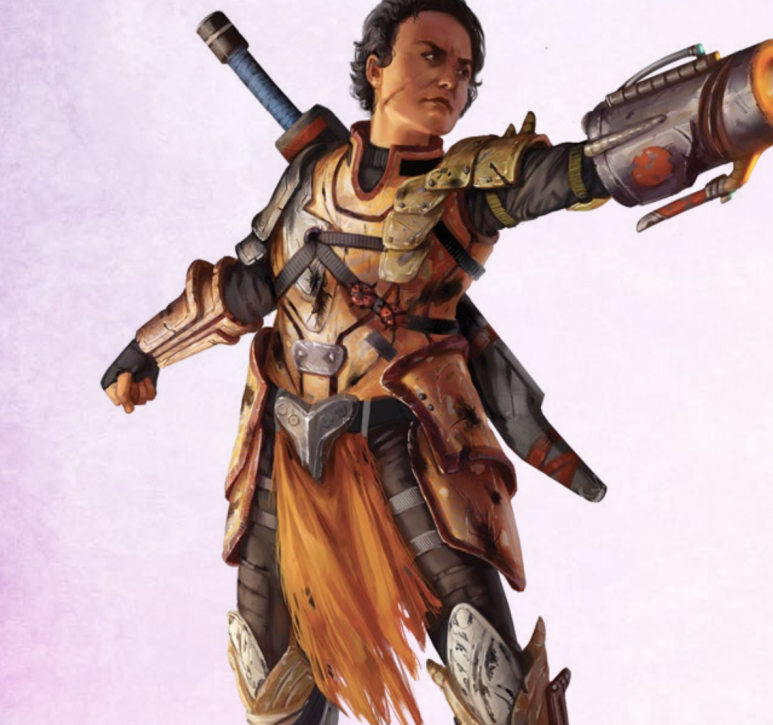
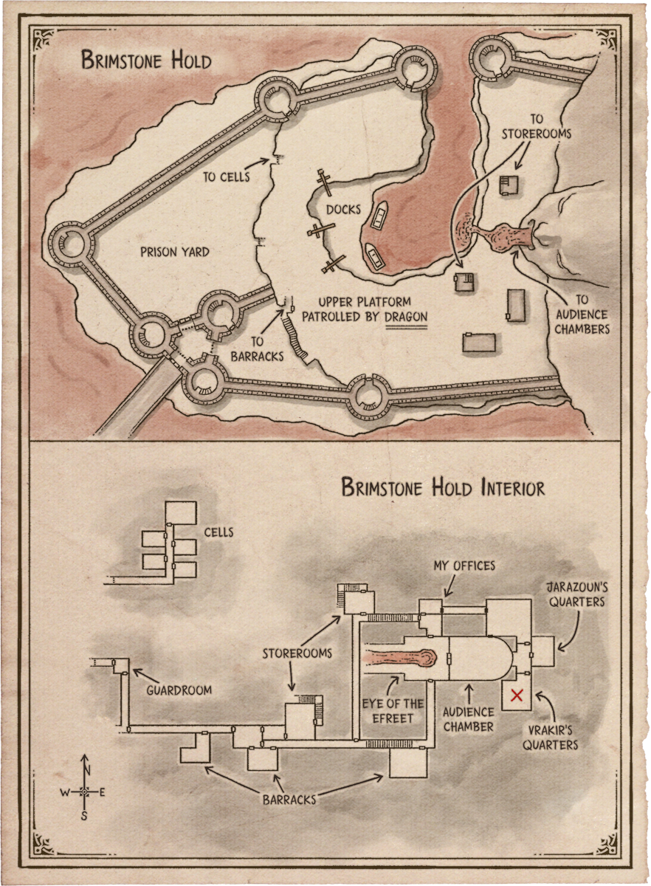
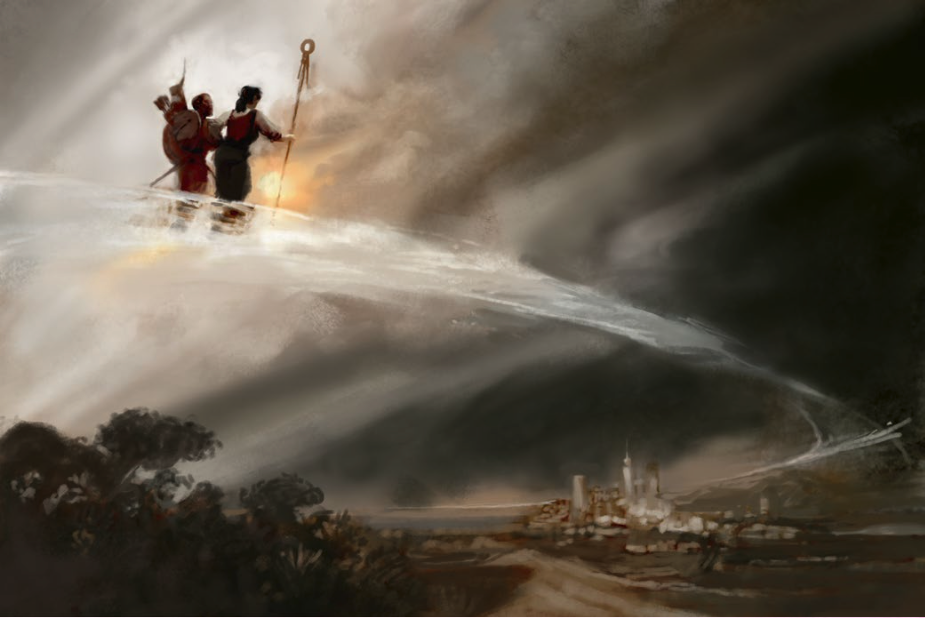

# 25 Jun 2025: A New Beginning

**[Previously](epilogue.md):** After redeeming Zariel and saving Elturel, the members of the party went their own ways and spent a year on sabbatical. However, circumstances have conspired to bring them together again...

---

Norgreath's patron has come to him and suggested a new target and new item to acquire: a book. At the same time, Galen's Book of Exalted Deeds has communicated with him that it will be moving on soon, because it needs to go somewhere in the multiverse where it can make a difference. Another message, to Barrisso in a celestial dream, perhaps from Lulu, involves a terrible force of evil he must defeat that has appeared in a place called Brimstone Hold. Gralok knows of this place due to its source of delicious cheese.

---

We gather in Elturel, the city we saved from Avernus, whose citizens are hopefully appreciative. The Grand Duke Ulder Ravengard of the Flaming First is now the elected leader of Elturel, and has been fighting the undead that plague the city - plus the Dead Three cultists who are still a menace.

The reconstituted party share their stories of what they have done the past year, and why we have come back together. A human female, with a prominent scar on her cheek and a strange metallic device attached to her left arm, approaches us, frowning, and sits down at our table without invitation.

<figure markdown>
  { width="200" }
  <figcaption>Manizer</figcaption>
</figure>

She looks at Barrisso, then turns to look at Norgreath and says:

"Why haven't you used it yet?"

"Hail we-"

"Stop that nonsense. Why haven't you used your token?"

"I didn't know I could."

"You travelled the path."

"How do I use it?"

"Like you did before."

"What do you know about it?"

"I know of the path."

"Do you serve a patron too?"

"I do, sort of."

"What sort?"

"A group who stop weapons landing in the wrong hands."

"Do they have a name?"

"You haven't heard of us."

Barrisso uses Divine Sense on her: she seems to be human and not in disguise.

Barrisso uses Insight: she seems sincere, stressed, anxious, and doesn't like meeting new people.

We offer her wine which she sips.

"How did you know about my tokens?" asks Norgreath.

"OK... I am from the group The Tyrant Tamers' Guild."

(Lunghiss remembers the name from a tome of what he thought was Faerûn ancient history: a storm giant who in a tale proclaimed himself a Tyrant Tamer as he struck down a fire giant lord and took from that lord a metal lance.)

"How are you connected?"

"I have no idea" replies the woman.

She asks Norgreath: "Do you know what your token is?"

"[Lunghiss pickpocketed it from a hag, Red Ruth](../2024/2024-10-30.md#pickpocket)."

Norgreath admits he used the token to contact his patron and meet them on another plane.

"Do you remember what happened when you found it first?"

We recall we all [felt physically drawn to the token](../2024/2024-11-06.md#drawn).

"I know understand what you are talking about. I have used the token to visit my patron and bring him artifacts from Avernus. He has actually tasked me with a new mission."

"What is it?"

"I need to know more about you before I share all your secrets."

Barrisso interrupts: "Why are you here?"

"You have a reputation."

"How do you wish to avail of it?"

Manizer (that is her name) says: "We the Tyrant Tamers have dedicated ourselves to removing evil. The first to remove is the Book of Vile Darkness."

Barrisso wonders if this was the danger in his dream. It turns out to be the book that Norgreath is seeking.

"What is the second evil?"

"You have already swung the balance in the Blood War with your deeds. There are more things that you could do if you felt you were ready. One is to prevent the Tyrant of War falling into the wrong hands. It's like the flying fortress that Zariel helmed, but worse. I need the key for this vessel."

"Where is this key?"

"On many planes. It consists of five pieces of metal."

"Which evil creature could use this vessel?"

"So, so many."

"What has my token to do with these evils?"

"You have a token that can join you the Path. Do you know what the Path is?"

"No."

"You have been able to take that path because of the Planebreaker. That is both a place and a path. It funnels thru the multiverse and in its wake, the Path remains. Those who have tokens and join the Path and follow in its wake to find places. Or, if they wish, they can go to Timeborn at the center of the Planebreaker."

"We can use the token to visit any plane along the path?"

"That would be the ideal situation."

She continues: "Visiting places you have never seen is difficult but not impossible."

Barrisso asks about the device on her arm.

"I lost my arm: this is my replacement. I can use it to fire energy bolts."

Galen asks if she would like it healed? Her metallic arm shift to look like a metallic fully-working hand. It seems she is fine with it.

Manizer suggests we can use the token to travel straight to Brimstone Hold, which is on another plane called... Oerth. There, we can find and steal the Book of Vile Darkness. She offers aid. There is a yugoloth in Brimstone Hold. His name is Nebukath, and will offer us assistance. But he has his own reasons to get the book for his master, an efreeti named Vrakir.

She also offers us a map of Brimstone Hold:

<figure markdown>
  { width="200" }
  <figcaption>Brimstone Hold Map</figcaption>
</figure>

(In Common, there is a note: "The book's location is marked with an X. Please hurry as Vrakir could move it at any time.")

---

We prepare for our journey. We first decide to meet Ravengard and asks for aid, but he rebuffs us.

We travel to Norgreath's safe place, and there concentrate using the token on our destination within Brimstone Hold. He warns us that when we arrive on the Path, not to wander off it.

After a while, a rumbling like an approaching wave occurs. This "wave" crashes over the party and washes everything away around us. We find ourselves on a ribbon-like luminous path in the sky:

<figure markdown>
  { width="300" }
  <figcaption>The Path</figcaption>
</figure>

The air we breathe is cool and pungent. The ribbon alternates between being mirror-like and transparent. An undertow draws us along the surface. We walk purposefully, aiming for a particular location. Beneath us we see different places; one looks like the planes of Avernus. We keep walking. Below us we see a large placid lake surrounded by campsites. We continue on, and take a spur and arrive on a plain where a broad bridge spans lava. Three-foot high barriers line a basalt causeway, partially plated in iron, funnelling us to a gatehouse. Two mighty towers of black stone frame a gate. This is the entrance to Brimstone Hold.

Some of the party spot creatures on the parapets. They remind us of the female winged devil creatures we saw in Zariel's throne room.

Lunghiss casts Invisibility on Barrisso. Barrisso has Norgreath's magic ring, which everyone else in the party enters. Now, Barrisso and Taq are on the bridge, invisible, with the ring.

However, the ruse doesn't work. A voice cries out "Celestial friend, what are you doing here?" It comes from the creatures on the parapet, who are [looking directly at Barrisso....](2025-07-02.md)

