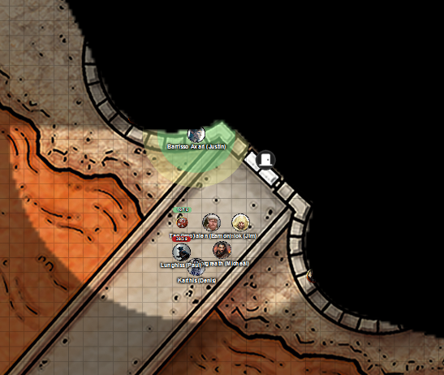
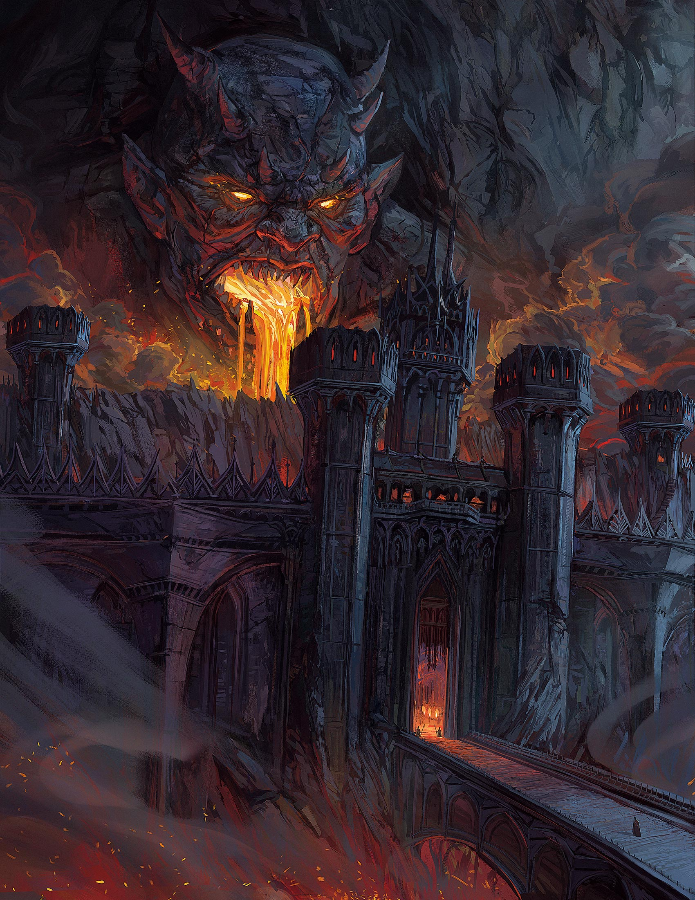
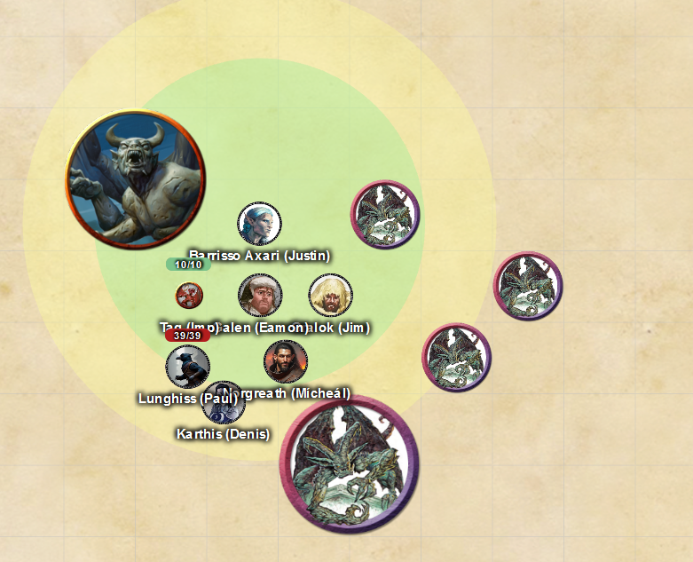

# 2 Jul 2025

**[Previously](2025-06-25.md):** The party have reunited again to acquire a tome of evil from Brimstone Hold. A human female named Manizer approaches us at an inn. She seems to have been keeping an eye on Norgreath and knows of the mysterious coin that Lunghiss pickpocketed from the hag Red Ruth, which Norgreath uses to travel to his patron along a silver path. She says she belongs to the The Tyrant Tamers' Guild. She wants us to perform two tasks: acquire the Book of Vile Darkness, and stop the vehicle the Tyrant of War falling into the wrong hands. To do the latter, we need to find the five elements of its key. There is a yugoloth in Brimstone Hold, Nebukath, who will assist us. But he has his own reasons to get the book for his master, an efreeti named Vrakir. We use the mysterious coin to travel to Brimstone Hold, on a plane called Oerth, where an invisible Barrisso is instantly spotted....

---

<figure markdown>
  { width="200" }
  <figcaption>Brimstone Hold Gate</figcaption>
</figure>

Barrisso congratulates the guards on their vigilance, and asks to be introduced to Nebukath. Barrisso attempts to use Persuasion are successful. She asks him to land on the parapet. "And bring your imp with you."

From inside the magic ring, Lunghiss cancels the Invisibility spell on Barrisso. 

"All visitors to the keep need to be verified. We had no forewarning of your approach, so stay here while I send my colleague to verify the invitation that you have."

Barrisso is aware that other inhabitants of the keep are taking note of him. Barrisso asks about Vrakir and is rebuffed.

"How did you end up with those wings and that companion?" (Referring to Taq.)

"I am an unusual individual." 

---

Barrisso looks inside the keep:

<figure markdown>
  { width="200" }
  <figcaption>Brimstone Hold View</figcaption>
</figure>

Inside the keep are three courtyards, as shown on the map:

- One is contained within the three towers at the entrance. 
- The second is a prison yard with a large number of haggard prisoners chiselling basalt blocks. Dark dwarves are watching these prisoners. 
- The third is an upper platform, where a red dragon patrols the area.

The guard's colleague returns: in response to an unseen communication, she gives a silent nod. Both in unison say "There has been no approved visit today. Would you like to make an appointment?"

"Time is of the essence. Tell Nebukath I have information to help him out."

"What do you have to offer Nebukath?"

"I cannot tell you that. Just tell him I have knowledge of a book, and say no more."

"I am instructed to tell you to leave."

"I will wait outside for his response."

"My master is not Nebukath."

Barrisso persuades the guard to communicate his message to Nebukath; she says he does not know what Barrisso is talking about. As Barrisso turns to leave, he sees a red dragon flying overhead, an awe-inspiring sight. Barrisso knows that the red dragon is observing him intently. Barrisso moves away from the hold until the dragon is no longer watching him.

---

Once a mile or two from the keep, the party emerge from the ring. 

We travel away from the keep, and see a small village with a number of residents, including humans, gnomes, and goblins. The village possesses boats with special hulls that enable them to sail on a nearby lava rivers. The village seems to trade with the wider world and send items to the keep. Maybe this is a way to infiltrate Brimstone Hold.

We decide that Lunghiss should use stealth to enter a boat at the village dock, bringing the remainder of the party in Norgreath's magic ring, and get to the docks inside Brimstone Hold undetected, where Barrisso can use Dimension Door to teleport us to the store room which he will then be able to see.

At this point, we camp in the wilderness. Four of the party sleep, the others keep watch. But during our rest, a group of five creatures - various forms of gargoyle-type stone winged creatures - come upon us, surprising us.

<figure markdown>
  { width="200" }
  <figcaption>Gargoyle Attack</figcaption>
</figure>

The first and second creatures fly towards the group.

The third creature flies, then attacks Gralok with a bite and two claws: all hit, doing 24HP of damage. Gralok wakes up.

Gralok rages into Form of the Beast and attacks, doing 15HP of damage.

The fourth, large, creature moves and does a dive attack on Karthis. Its follow-up attacks do 10HP of damage.

The fifth creature flies behind the group but doesn't attack.

Galen attacks with his marble mace at the four-armed gargoyle, doing 9HP of damage.

Barrisso attacks with his scimitars and hits.

Karthis moves and casts Lightning Bolt at a line of creatures, doing 29HP of damage to each.

---

Lunghiss performs a sneak attack, with Booming Blade and Savage Attacker using his Lathander's Radiant Blade on the large gargoyle, doing 44HP of damage, plus an extra 10HP of thunder damage if it moves.

Norgreath casts Synaptic Static at three of the gargoyles, doing 31HP of damage. They also have muddled thoughts for a minute. 

A gargoyle attacks Norgreath, doing 6HP of damage.

Another attacks Karthis, doing 4HP of damage.

Another attacks Gralok, doing 4HP of damage.

Gralok attacks with his claws, doing 35HP of damage.

A gargoyle attacks Norgreath, doing 18HP of damage.

The four-armed gargoyle attacks Barrisso, doing 16HP of damage.

Galen casts Toll the Dead, doing 17HP of damage.

Barrisso hits the large gargoyle with his scimitars, doing 51HP of damage.

Karthis moves, then casts Lightning Bolt at 5th level against four enemies, doing 37 damage, killing them all. [Only one enemy remains...](2025-07-31.md)

 

