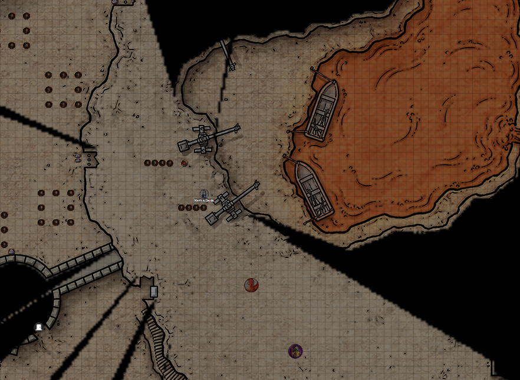
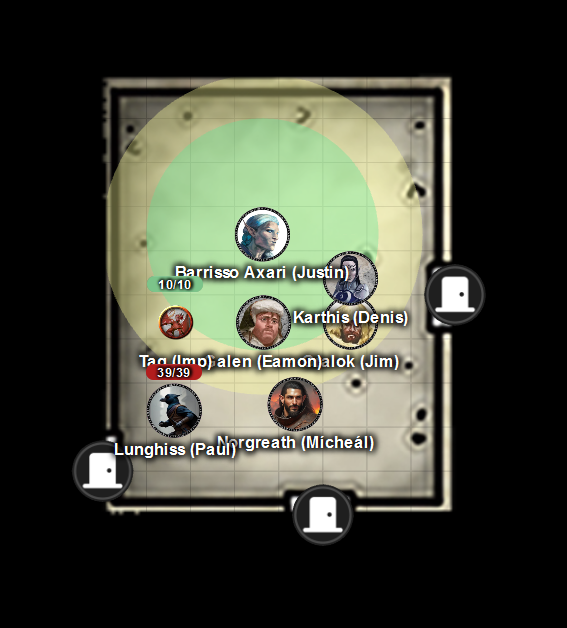
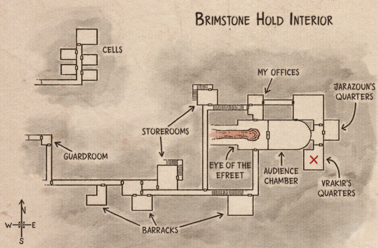

# 31 Jul 2025

**[Previously](2025-07-02.md):** The Defenders of Elturel have reunited: a human female named Manizer wants us to perform two tasks: acquire the Book of Vile Darkness, a tome of evil, from Brimstone Hold, and five elements of its key to stop the vehicle the Tyrant of War falling into the wrong hands. There is a yugoloth in Brimstone Hold, Nebukath, who will assist us. But he has his own reasons to get the book for his master, an efreeti named Vrakir. We used our mysterious coin to travel to Brimstone Hold, on a plane called Oerth. An invisible Barrisso was instantly spotted, and his attempt to meet with Nebukath was rebuffed. We travelled to a village a mile or two away, where we hoped we could hitch a ride on a lava boat and infiltrate Brimstone Hold. However, while camping nearby, we were surprised and attacked by five gargoyles. One remains...

---

Lunghiss performs a sneak attack, with Booming Blade and Savage Attacker using his Lathander's Radiant Blade on the large gargoyle, doing 38HP of damage, plus an extra 8HP of thunder damage if it moves.

Norgreath uses Eldritch Blast (with Agonizing Blast and Genie's Wrath for the first attack), doing 22HP of damage.

Gralok attacks, doing 7HP of damage.

The last, four-armed, gargoyle attacks Barrisso, doing 42HP of damage.

Galen casts Cure Wounds on him.

Barrisso attacks with his scimitar and shortsword, and with his first blow, kills him.

---

In the remains of the four-armed gargoyle, where the base of the spine was, is something that looks shiny and liquid without actually flowing. Barrisso tries to use a dagger to carve the remains away, without any success. After some work, we free it find a black gemstone. Barrisso uses Detect Magic to find that, yes it's indeed magical. Karthis casts Identify as a ritual.

It's an Ingot of the Rune. It can transfer its magic through a two-handed melee weapon to which it must be bonded. It makes it a magical +1 weapon, and also activates a property called Blazing, which means that once a day, the weapon will blaze with elemental power (in this case, cold) for 1 minute, inflicting an extra 2D6 damage per hit. Gralok applies it to his normal, non-magical, great axe.

---

We notice four people approaching us from the nearby village along a trail. Two are human, one is gnomish, while the last is a goblin. The leader is walking with a stick, his weary face smudged with volcanic ash. He reaches us and holds out his palm upwards.

"Travellers: you have done us a great service this night."

"Tell us about these creatures."

"They are the enforcers of the tyrant, sent to keep the people of Cinderfen caged in our village, forcing us into service."

"Are there more of them?"

"There may be more of the lesser creatures, but you have slain the leader. The tyrant is Vrakir, who owns Brimstone Hold. We have been captured by the forces of the tyrant, and forced to live here under these ash clouds. We are the boatman and traders with the outside world for the Hold: the only approach to the Hold are via our boats. As you may know, there are captives in the Hold itself. You could masquerade as people from Cinderfen to infiltrate the Hold."

"Within the Hold, are you free to move about?"

"We are restricted, but we can bring goods from the boats to the storage rooms above."

The four humanoids are called Kael (the male human), Griphand (the gnome), Grish (the goblin), ad  Ashtongue (the female human).

"How do we get from the docks to the storerooms?"

"That's the scary bit: the dragon is there, but you can climb the cranes via ladders."

"Who is patrolling, apart from the dragon?"

"Normally some of the salamanders. They are humanoid creatures of elemental fire. Normally there are one or two around."

We all take a long rest before our return to Brimstone Hold.

---

We leave the village, and enter Norgreath's ring, which Karthis will then wear underneath his glove. Our plan is that Karthis as a human will not be conspicuous if he travels via boat to the Hold. Karl brings Karthis to the Cinderfen docks, where goods are lined up along the quay. Kael beckons Karthis into the boat. Once the boat is fully loaded, he uses an orb on a pedestal to move it and guide it out.

The boat moves along the lava river towards the north side of Brimstone Hold and enters through a gap in the walls. Devils on the parapets watch the boat as it goes by. The boat moors at the west side of the dock inside Brimstone Hold:

<figure markdown>
  { width="400" }
  <figcaption>Brimstone Hold Dock</figcaption>
</figure>

Cranes raise pallets from the boats up to a higher level, and Karthis follows them using available ladders. Karthis helps take supplies from the pallets and carries them to the nearby storerooms. Inside the storeroom is a staircase leading downstairs. The supplies consist of food, water, timber, rope, and raw iron. As he does this, a fierce red dragon is watching everyone moving supplies.

Once safely inside a storeroom basement, the party leave Norgreath's ring.

<figure markdown>
  { width="400" }
  <figcaption>Storeroom</figcaption>
</figure>

Lunghiss checks the south door. He detects nothing past that, but he does hear creatures to our west. It sounds like two creatures performing an action that involves fire and metal - perhaps blacksmithing.

Lunghiss opens the locked south door with his Thieves Tools and opens it. A long corridor runs east to west. To the west are two doors, due west and due south. To the east, is a door north, and past that, a door south, and then finally steps leading upwards.

Lunghiss goes east, and listens at the door to the north; he hears nothing. He uses his Thieves Tools and opens it. Another corridor leads north with a door, then angles east, with steps leading up.

Lunghiss locks the south door behind us. The party head north, and Lunghiss listens at the door. He hears nothing. He unlocks the door to find a small store room, with doors north and south.

Lunghiss listens at the north door, then uses Thieves' Tools to open it. A staircase leads upwards.

We leave the room to the south, and climb the stairs to the east, 60 foot up. At the door, Lunghiss hears someone in the room beyond; at least one, but not a lot of noise. According to our map, this is Nebukath's office.

<figure markdown>
  { width="400" }
  <figcaption>Brimstone Hold Interior Map</figcaption>
</figure>

Lunghiss unlocks and opens the door, to reveal a chamber, with walls decorated with paintings of otherworldly landscape. A desk is engraved with fiendish figures. Seated at it is a slender bipedal creature wearing a red robe, sparkly ring, and a fez. He has the head and tawny head of a fox.

"Nebukath I presume?" says Barrisso.

The fox-like creature says "Yes, what of it?"

"We are here at the behest of Manizer."

Barrisso shows him our map. "Do you recognise this?"

"I do."

"We're here to help."

"I'm bound by my contract."

"We don't expect you to break that. But, maybe, bend it a little."

"That may be feasible."

"Can you assist us in reaching our destination unimpeded?"

"To the south of us, through that door, is an antechamber with a fountain of lava, three salamanders, and the Eye of the Efreet, a powerful beholder. You should avoid that chamber."

We ask him about the rooms between his office and the book we seek. A large room used by Jarazoun to entertain his guests should not be occupied. (Jarazoun is an efreeti.)

The room that connects with his quarters and the audience chamber is the vestibule. Two stone golems are in the vestibule. South of the vestibule are Vrakir's quarters. The back wall of that room has scorched marks radiating from a face holding a blood-red gem. The room holds a book but that is a trap: a mimic. The Book of Vile Darkness is actually held in a demiplane accessible from the room, opened by the blood-red gem on the wall. Two yugoloths guard the demiplane.

The golems outside will be triggered only if we try to enter Vrakir's quarters. Teleporting into that room would not trigger the golems: only opening the lock without Vrakir's key.

Galen suggests that Stone Shape would allow us to create a hole into Vrakir's quarters without opening the door. And Lunghiss suggests he could cast Major Image to make it look like [the hole doesn't exist....](2025-08-06.md)

