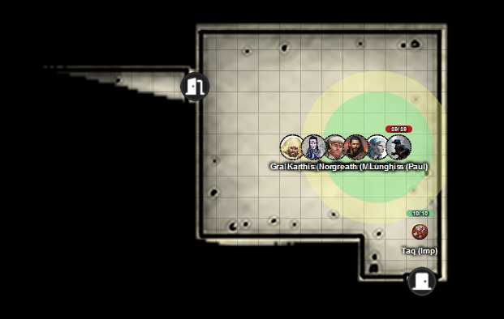
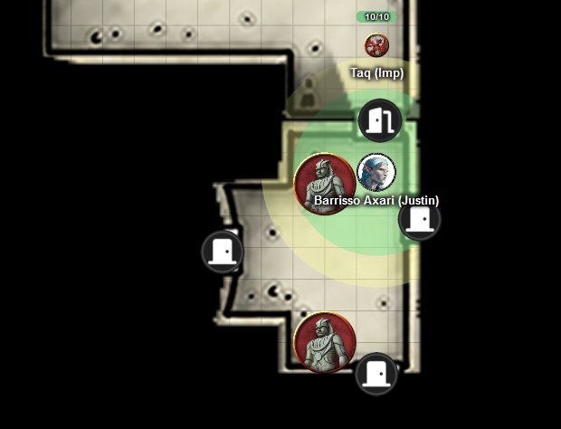
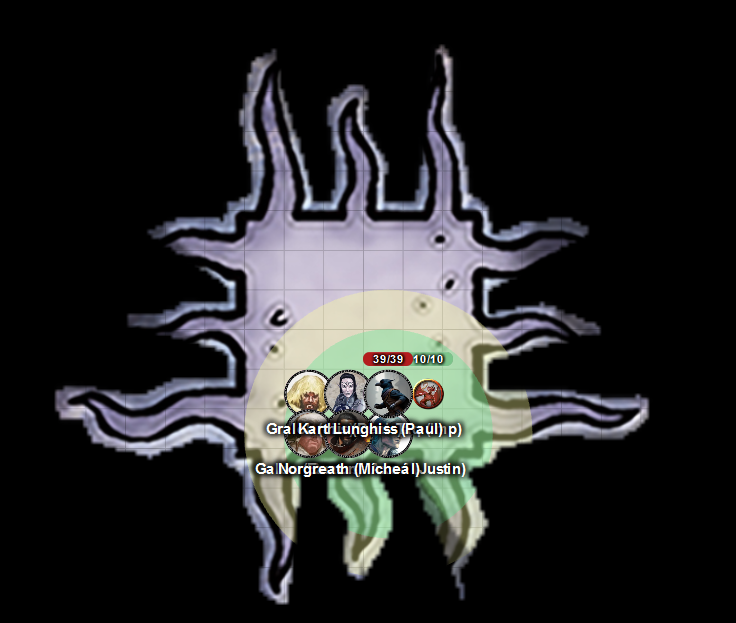
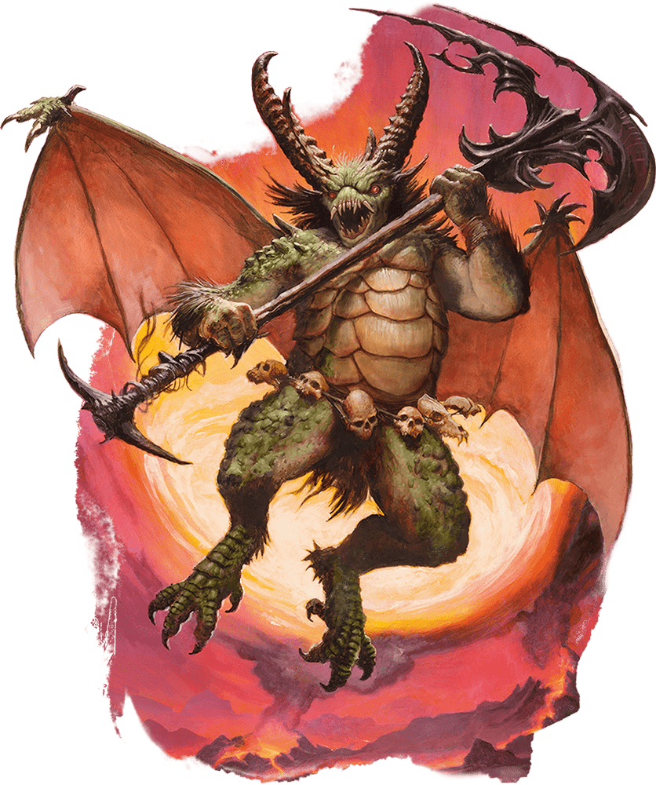
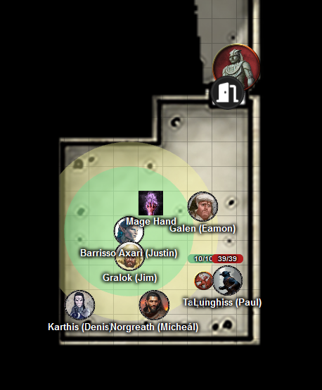

# 6 Aug 2025

**[Previously](2025-07-31.md):** We've been tasked with acquiring the Book of Vile Darkness and also five elements of a key to stop the vehicle the Tyrant of War falling into the wrong hands. We've infiltrated Brimstone Hold and talked to Nebukath, the contact who Manizer our recruiter told us about. He told us where the Book of Vile Darkness is: in a demiplane, guarded by two yugoloths, accessible through a red gem in the quarters of Vrakir, his efreeti master. Vrakir's room also holds a fake book which is actually a mimic. To enter that room, we have to access it from a vestibule guarded by two stone golems. These golems will be triggered only if we try to enter Vrakir's quarters via its door without a key: for example, teleporting into Vrakir's quarters would not trigger the golems. Galen suggests that Stone Shape would allow us to create a hole into Vrakir's quarters without opening the door. And Lunghiss adds he could cast Major Image to make it look like the hole doesn't exist....

---

We are currently in Nebukath's office, wondering if we can use Norgreath's magic coin to transport directly from the demiplane where the Book of Vile Darkness is. However *(Arcana check)* this seems not be the case.

Also, we need to get past Vrakir's efreeti deputy, Jarazoun. He may be in his room to the far east, or may not.

Nebukath's room has a bell. "This is how they alert me to their needs."

"Does that include Jarazoun?"

"Yes."

"What is the weakness of an efreeti?"

"Arrogance?"

"Do efreeti have truesight?"

"No."

"Can they shift planes at will?"

"Not at will, but then can shift plane."

We make our way into the secret passage east of Nebukath's room. Norgreath sends Taq ahead to scout.

The room to the east of the secret passage has a fountain, with a wrought brazier in the corner. No one seems to be there. We enter the room behind Taq.

<figure markdown>
  { width="400" }
  <figcaption>Brimstone Hold - Fountain Room</figcaption>
</figure>

We open the door to the south. In the vestibule room are three closed doors, and two stone golems.

<figure markdown>
  { width="400" }
  <figcaption>Brimstone Hold - Vestibule</figcaption>
</figure>

The golem is in front of the area where we wish to cast Stone Shape, but we hope we can manage.

First, Lunghiss casts Major Image to cover up the hole that Galen will make. Then, Galen casts Stone Shape. The spell works, and there is now an entrance into Vrakir's quarters.

Taq enters this palatial bedchamber: its luxury at odds with the south wall, covered in scorch-marks, with a face with a red gem embedded. On a nearby desk is a black tome, its cover emblazoned with spell iconography.

We enter the room. Fortunately, the mimic ignores us. Barrisso touches the red gem, a horrible green radiance erupts from it and surrounds Barrisso: he takes 37 points of damage. Barrisso holds onto the gem, and realises he can use the gem to open the portal to the demiplane.

An opaque green portal appears in the mouth of the grotesque face: Barrisso lets go of the gem. The party enters the portal.

<figure markdown>
  { width="400" }
  <figcaption>Brimstone Hold - Book Demiplane</figcaption>
</figure>

The room contains an open book, its pages rustling despite the lack of wind. The flagstones around it are charred and the walls of the room are veined with fissures.

Karthis casts Mage Hand to pick the book up. Suddenly, the two invisible yugoloths attack.

Gralok readies his axe. He cannot see the yugoloths, but once he senses one, he will attack.

Barrisso moves and attacks with scimitar and shortsword, doing 62HP of damage with Divine Smite.

Galen casts Bless on the whole party, then attacks where he thinks a yugoloth is, but misses.

Karthis lifts the book with his mage hand, and drops it into a bag of holding that Norgreath is holding. Karthis *(Arcana check)* and Norgreath feel a strong element of arcane power being emitted by the tome as it passed close to them. The book seems to be incredibly powerful.

Lunghiss casts Mage Hand next to where he thinks an invisible yugoloth is, in order to use his Versatile Trickster ability to give himself advantage on attacks in his next round, to cancel out disadvantage from the creature being invisible.

The yugoloth to the west now teleports besides Norgreath and appears:

<figure markdown>
  { width="200" }
  <figcaption>Yugoloth</figcaption>
</figure>

He attacks twice, doing 55HP of damage. It screams at Norgreath to say: "Drop the bag, mortal".

The second yugoloth also teleports; it can't reach Norgreath, so throws its axe, hitting Norgreath for 25HP of damage. The axe reappears in its hand, and it throws it again, but misses.

Norgreath casts Shadow of Moil.

Gralok rages, then attacks, but misses.

---

Barrisso attacks with scimitar and shortsword, doing 79 HP of damage including Divine Smite, killing the yugoloth. He moves to the second yugoloth and attacks with his shortsword, but misses.

Galen casts Heal on Norgreath, giving him 80HP of healing back.

Karthis moves past the yugoloth; fortunately, the latter's opportunity attack misses. Karthis then casts Enervation, doing 20HP of damage.

Lunghiss performs a sneak attack, with Booming Blade and Savage Attacker using his Lathander's Radiant Blade, with advantage from his Mage Hand. He does 80HP of damage, plus 22HP of thunder damage if it moves; Lunghiss then moves away with his Mobile feat.

The yugoloth attacks Norgreath, doing 31HP of damage.

Norgreath uses Eldritch Blast (with Agonizing Blast and Genie's Wrath for the first attack): three attacks, doing 35HP of damage, finishing the yugoloth off. It folds into an extra-dimensional space, and winks out of existence.

---

We return via the portal to Vrakir's chamber. Lunghiss' Major Image spell remains intact, hiding the hole we have made. However, we see the door opening, and a stone golem moves into the room:

<figure markdown>
  { width="400" }
  <figcaption>Golem Attack</figcaption>
</figure>

Galen casts Banishment on both golems: they disappear. We're not sure if they have gone to another plane. But we don't plan to hang around.

Norgreath urges the party to gather into a circle, then casts Plane Shift. We arrive back in Elturel, intact and safe. We wonder what alarms are going off back in Brimstone Hold.

We return to Norgreath's apartment, and put the word out we are trying to contact Manizer. We spend 200 gold pieces to contacts to find a scroll of Sending. Karthis inscribes it into his spell book, and spends a night relearning his spells. Karthis casts Sending to Manizer: ["Mission accomplished, book found, next steps?".](2025-08-20.md)
