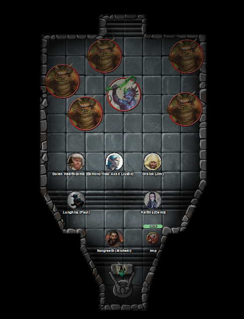
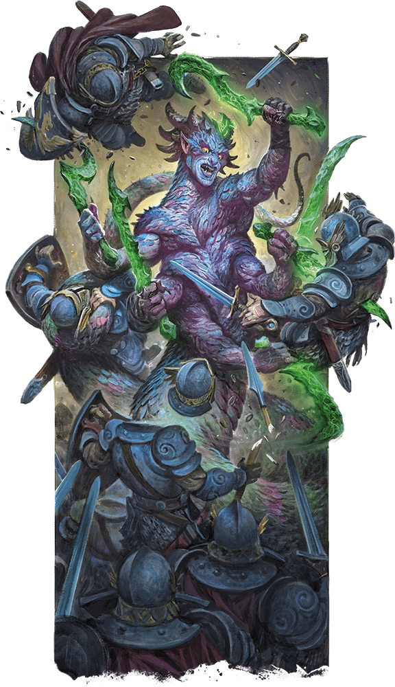
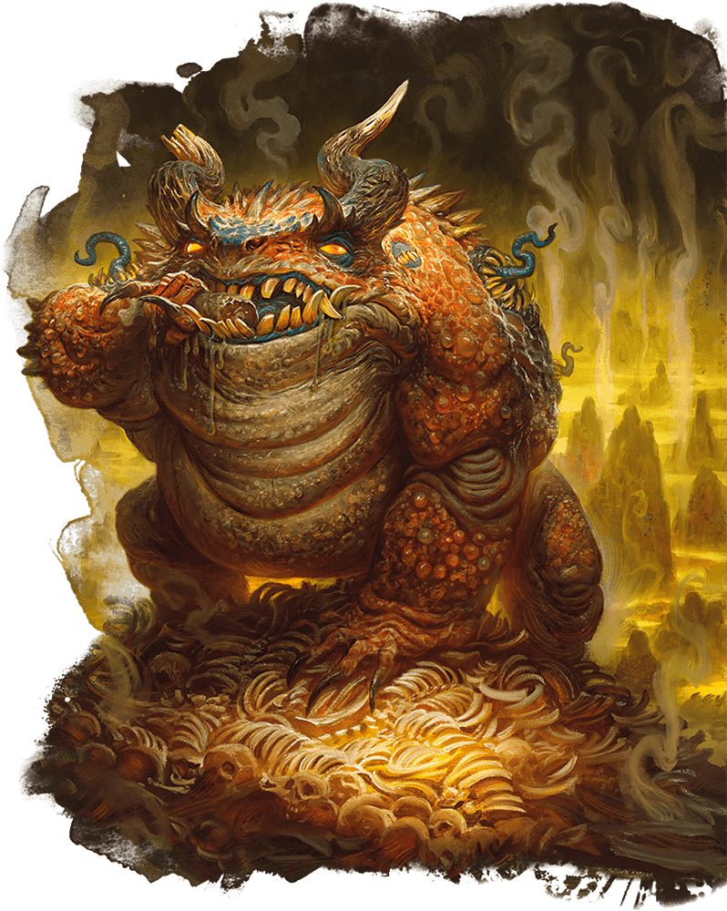

# 20 Aug 2025

**[Previously](2025-08-06.md):** We were tasked with acquiring the Book of Vile Darkness and also five elements of a key to stop the vehicle the Tyrant of War falling into the wrong hands. We successfully infiltrated Brimstone Hold and met our contact Nebukath, who gave us advice on the route ahead through the keep. We entered the secret demiplane accessible from Vrakir's quarters, found the two yugoloths there, and stole the Book of Vile Darkness. Leaving the demiplane, we found two golems had been activated. But Galen uses Banishment on them. Then, Norgreath's Plane Shift spell whisked us straight back to Elturel. There, Karthis cast Sending to ask our recruiter Manizer: "Mission accomplished, book found, next steps?"

---
 
We wait in Norgreath's apartment for an answer. While there, the bag of holding containing the Book of Vile Darkness starts to smoke. We notice the seams of the bag are stretching and blackening. We open the top of the bag using Mage Hand. 

Galen is suddenly sees a strong mental image of taking the Book of Exalted Deeds and placing it on top of the Book of Vile Darkness. He feels strongly that the artefact, his book, is suggesting this course of action. 

Three of the party use Mage Hand to open the bag and lift out the book. As we do that, black tendrils emitting from the book swoop out over our heads and swirl around. Six creatures manifest at the back of the room:

<figure markdown>
  { width="400" }
  <figcaption>Norgreath's Chambers</figcaption>
</figure>

One creature is a six-armed serpent-like creature; she is a marilith:

<figure markdown>
  { width="200" }
  <figcaption>Marilith</figcaption>
</figure>

The other five resemble massive toads; they're hezrous:

<figure markdown>
  { width="200" }
  <figcaption>Hezrou</figcaption>
</figure>

Norgreath attempts to cast Banishment on two of the creatures. However, neither are banished. 

Lunghiss casts Shadow Blade at 3rd level, then performs a sneak attack on the marilith, with Booming Blade and Savage Attacker. He does 49HP of damage, then retreats.

Barrisso attacks the same creature with his scimitar, doing 57HP of damage.

Norgreath mentally asks Taq to check the book. "It's steaming! All this smoke is coming off it! The tendrils look... enticing."

Gralok rages (Form of the Beast) and attacks the six-handed creature with his claws.

Galen takes his Book of Exalted Deeds and places it on top of the Book of Vile Darkness. The dark book seems to want to throw off his book, and he holds it firmly in place.

Karthis casts Prismatic Spray at our opponents: he blinds one, does 9HP of cold damage to the second (he's cold resistant), 17HP of lightning damage to the marilith (she's lightning-resistant).

It's now the creatures' turn to attack.

The marilith shouts in our heads: "GIVE US THE BOOK! THE BOOK IS OURS!". Then she disappears, reappears at the book, then attacks Galen six times, taking 71HP of damage.

A hezrou hops towards Barrisso and makes three rend attacks, doing 7HP of slashing damage.

A second hezrou leaps to Lunghiss and attacks. Lunghiss casts Shield. Only its third attack gets through, for 5HP of slashing damage.

The blinded hezrou walks, seemingly in a precise way, towards Barrisso, but none of its attack succeed.

The fourth hezrou jumps towards Karthis, doing 14HP of damage.

The fifth hezrou attacks Gralok, doing 7HP of damage.

---

Norgreath casts Eldritch Blast (with Agonizing Blast and Genie's Wrath for the first attack): three attacks on the marilith. 

Lunghiss performs a sneak attack with his Shadow Blade on the marilith, with Booming Blade and Savage Attacker, doing 63HP of damage, plus 15HP if they move. The marilith turns towards Lunghiss: as it does, Lunghiss sees its form crumble into demonic ichor and disappears.

Barrisso attacks the nearest hezrou, successfully hitting and using Divine Smite to add more damage.

Taq *(Wisdom save fail)* flies over to the book and attempts to push the Book of Exalted Deeds off the evil book out of Galen's grasp.

Gralok attacks the hezrou to his north with his claws, doing 16HP of slashing damage. 

Galen senses the Book of Vile Darkness pushing back against him: he *(Athletics roll)* succeeds. 

Karthis casts Enervation at a hezrou to his east, causing 23HP of damage and healing Karthis for 11HP of damage.

The hezrous now attack. The hezrou that Karthis just attacked now attacks, doing 12HP of damage to Karthis.
Karthis casts Arcane Deflection to only take 5HP of damage.

The second hezrou to his west leaps, towards Galen and attacks, doing 5HP of damage.

The third, blinded, hezrou attacks Barrisso, doing 13HP of slashing damage plus 20HP of poison damage.

The fourth and fifth hezrou next to Gralok attack him, doing 20HP of damage.

---

Norgreath casts Banishment on two of the hezrous. One is banished and blips out of existence.

Lunghiss performs a sneak attack with his Shadow Blade on a hezrou, with Booming Blade and Savage Attacker, using Mage Hand Legerdemain to give him advantage, and does 54HP of damage, plus 19HP if they move.

Barrisso attacks the blind hezrou doing 57HP of damage, then moves. Doing so prompts an attack of opportunity: 11HP of slashing damage, 17HP of poison damage.

Taq the imp is still protecting the Book of Vile Darkness. He attacks Galen, doing 6HP of damage plus 6HP of poison damage.

Gralok attacks with his claws, doing 23HP of damage.

Galen casts Compulsion on two hezrous and also Taq. When they move, they must move away. He tries to hold down his book on top of the Vile Tome of Darkness. However, the book shoves the Book of Exalted Deeds off the lectern. 

Karthis attacks the hezrou next to him using Enervation, doing 14HP of damage and gaining 7HP of health.

Now the hezrous attack. One next to Gralok attacks, doing 24HP of damage.

The next hezrou is banished. 

The third, blinded, hezrou attacks Barrisso, doing 8HP slashing + 14HP of poison damage.

The hezrou next to Norgreath attacks, but misses.

The last hezrou beside Gralok leaps, suffering an attack of opportunity, but Gralok misses. The creature attacks Galen, doing 21HP of damage, felling Galen. Its final attack hits Lunghiss, even as he casts Shield, doing 17HP of damage.

---

Norgreath flies towards the Book of Exalted Deeds and puts it on top of the Book of Vile Darkness, but suffers damage from an attack of opportunity. Norgreath also orders Taq to leave the room.

Lunghiss performs a sneak attack with his Shadow Blade on a hezrou, with Booming Blade and Savage Attacker, using Mage Hand Legerdemain to give him advantage, and does 60HP of damage, plus 9HP if they move.

Barrisso casts Misty Step to beside the same hezrou that Lunghiss just attacked, then casts Lay on Hands, giving 20HP to Galen and the rest to himself. Galen is revived, but exhausted.

Taq continues to leave the room.

Gralok attacks with his claws, doing 23HP of damage, plus another 24HP kills the blind hezrou. He gets another attack, doing 17HP of damage.

Galen casts 70HP of healing on himself.

Karthis uses Enervation, doing 21HP of damage and gaining 10HP of health

The hezrous attack. The first attacks Gralok, doing 13HP of damage.

The hezrou next to Karthis leaps and attacks Barrisso, doing 13HP of damage.

The last hezrou also attacks Barrisso, felling him. His second attack misses Lunghiss. [His third hits, doing 12HP of damage...](2025-08-27.md)
