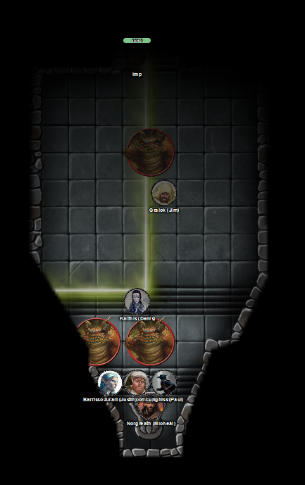
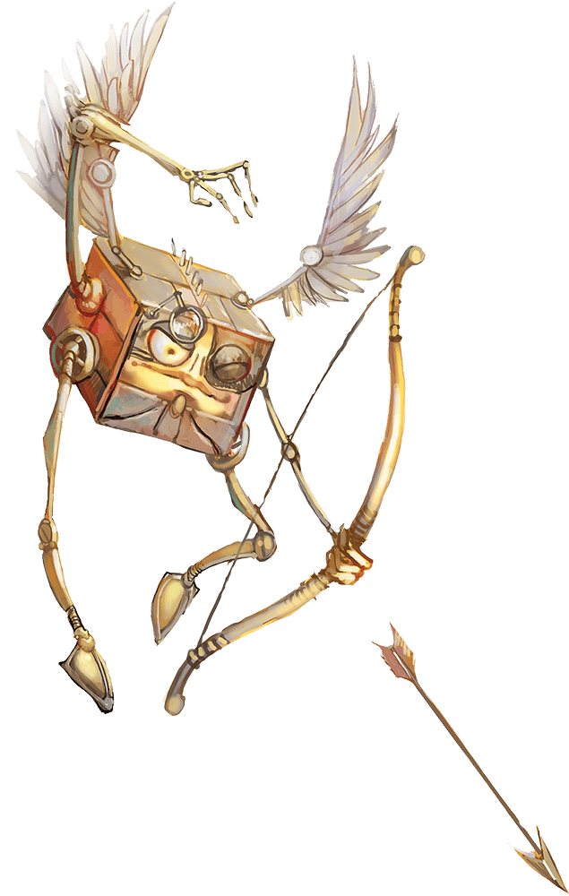
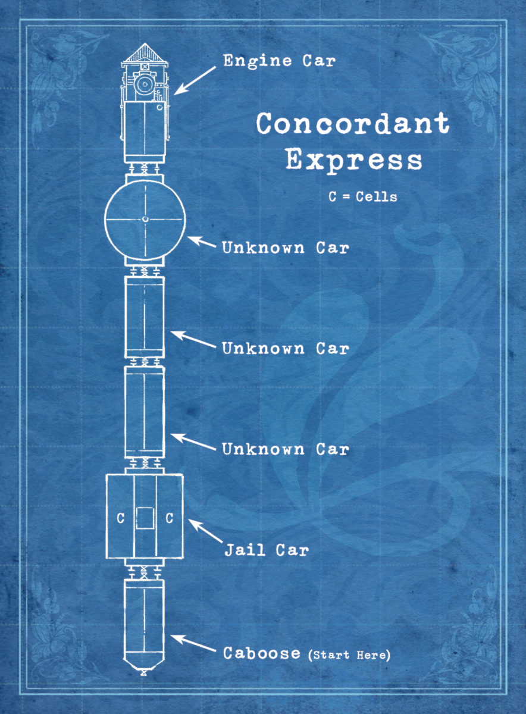
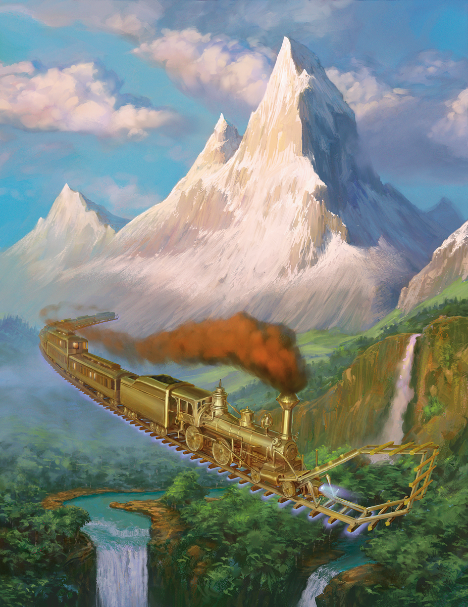

# 27 Aug 2025

**[Previously](2025-08-20.md):** We acquired the Book of Vile Darkness from Brimstone Hold, as tasked by Manizer, and sent her a message asking for further instructions. As we waited in Norgreath's apartment for an answer, the bag of holding containing the Book of Vile Darkness started to smoke. As we took the book from the bag, a marilith and five hezrous manifested in the room. In the ensuing battle, Galen held his Book of Exalted Deeds on the vile tome to hold it in place. Lunghiss felled the marilith, and Norgreath banished one hezrou. A hezrou felled Galen, but he was revived by Barrisso. However, Barrisso was downed in turn by a hezrou. With one hezrou dead and one banished, three are left... 

---

Norgreath casts Eldritch Blast (with Agonizing Blast and Genie's Wrath for the first attack) on the hezrou next to Barrisso, doing 33HP of damage.

<figure markdown>
  { width="400" }
  <figcaption>Norgreath's Chambers</figcaption>
</figure>

Lunghiss performs a sneak attack with his Shadow Blade on a hezrou, with Booming Blade and Savage Attacker, doing 57HP of damage, plus 12HP if he moves.

Barrisso makes a death save and succeeds.

Gralok attacks using his claws, doing 30HP of damage. He gets a bonus attack but misses.

Galen continues to hold down his Book of Exalted Deeds on the Book of Vile Darkness to keep it trapped. He receives a vision to take his marble mace, hit the centre of his book and smash it through the vile tome. He does so, pouring his divine energy through the mace. The whole structure of his book collapses into a point which penetrates the Book of Vile Darkness, emitting a blinding flash of radiance which does 18HP of radiant damage to anyone around, including some of the party. The hezrou next to him is killed. 

Once the flash fades, no trace of either book can be seen. Galen detects that his marble mace has improved (now +2).

Galen casts Compulsion on the two hezrous. When they move, they must move away.

Karthis casts Haste on Gralok. 

The first hezrou misses its attacks on Gralok. That hezrou is compelling to move away, so Gralok attacks, but misses.

The second hezrou attacks Galen, doing 15HP of damage. The hezrou runs away to the west, taking attacks of opportunity from Karthis and Galen. Galen does 10HP of damage, while Karthis misses.

---

Norgreath moves to Barrisso and gives him a potion of greater healing, giving him 17HP of healing and restoring him to life with exhaustion.

Lunghiss performs a sneak attack with his Shadow Blade on a hezrou, with Booming Blade and Savage Attacker, doing 54HP of damage, plus 19HP if he moves. He then disengages

Barrisso uses Lay on Hands to cure himself 65HP of health.

Taq arrives back in the room. 

Gralok runs and attacks the retreating hezrous. With his first two attacks, he kills a hezrou. He attacks the second one, doing 18HP of damage, killing the remaining hezrou.

---

Our foes are vanquished, and the Tome of Vile Darkness is destroyed. The other hezrou that was banished does not return. Galen casts Prayer of Healing, giving the party back 29HP each.

**The party goes up to level 14.**

---

Soon after, Norgreath finds a wooden scroll tube, stoppered with cork, on his doorstep. Inside is a simple scroll. It says in Common: 
???+ scroll "Mysterious Scroll"

	Find me at the Vigilant Eye 
	
	- Manizer

---

We find the inn, with a crude image of a beholder outside. The original owners were killed though the fall of Elturel, and the place rebuilt. 

The owner, a female human, greets us: "How can I help you?" She doesn't seem to recognise our fame. We ask for food and drink and look around for Manizer. When we don't see her, we ask for her by name.

"Oh yeah, the lady with the scar on her face? She arrived this morning and is in her room."

After 10 minutes she arrives downstairs, asking us if we have already ordered, and plonks herself down.

She asks about the book, and we relate our story.

"Well done."

She is not sure that the book is permanently destroyed, but potentially.

"How did you find travelling the path?"

"We used it to get there, but not to get back."

"So how do you feel about helping us out with more problems? I had already mentioned the Tyrant of War before. It's a destructive vehicle made by devils to rain down war on worlds and planes to gain an advantage in the Blood War. 

"The Tyrant of War was lost. You can find it only with its key. But this key has been scattered across the multiverse. If someone knows the location of the Tyrant without the key, maybe they can turn it to their own purpose. But its purpose will always be to aid the devils."

"The five elements of the key have begun to surface. The location of one has been talked about by a creature called **the Stranger**. He has been captured and put on an interplanar prison carriage on the **Concordant Express** to be taken for trial on Mechanus. He has been accused of many crimes. When he tried to flee with a book containing the true names of fiends, the book disappeared."

"You can help us by getting onto the Concordant Express and asking the Stranger for the location of the first element of the key."

"A friendly modron called **Glitch** used to oversee the hospitality on the Concordant Express. I can introduce you to Glitch who can get you boarding tickets. You will only have 24 hours to board the train."

Barrisso asks how do we meet him? She says she will send Glitch to us.

We finish up our meal and head back to Norgreath to arrange to depart.

---

At Norgreath's, we find the modron Glitch knocking on the door for us:

<figure markdown>
  { width="200" }
  <figcaption>Glitch</figcaption>
</figure>

He is delighted to see us, and talks about the Stranger. He shows us a map and chatters about trains, and cars:

<figure markdown>
  { width="400" }
  <figcaption>Concordant Express Map</figcaption>
</figure>

It includes an engine car at the front, powered by treasure, and a caboose at the back, where the crew's quarters are. The other cars and their configuration could change. There could be a different number of unknown carriages.

The Stranger will likely be in the jail car, which has a skylight. Modrons patrol the exterior of the train. There is a teleportation ward in place over the whole train. 

He gives us tickets for the train. These will allow us into any car not explicitly locked from the public. There could be clearly passenger cabs but also cargo cabs which are locked. There could be other cars we can pass through.

To get onto the train, Glitch will bring us to **the plane of Concordant Opposition**. There on a grassy flatland, there will be a blare of horns as the train arrives on the sky. As it draws near, we will be able to get on using our tickets at the end of the train.

"Is there a reason he'll give us the information?"

"He hasn't been reluctant to divulge that. Which is what worries Manizer."

"Why do you help Manizer and us?"

"I am no longer bound to the dictates of my superiors. I found that conflicting orders from two pentadrones gave me a different perspective on life. Now I help Manizer and her friends."

Glitch also gives us a pen and asks us to write down secrets that we find.

We ask him to lead the way. He asks about our hairy friend. Only now do we notice Gralok has been gathering cheese for the last three days.

---

Glitch asks us to stand in a circle, and reaches to his chest. It presses some buttons on its chest, and suddenly find ourselves being whisked away and landing in a new place with strange geography and new smells. We're on a grassy plain, with a colossal spire nearby, and small mountains. Glitch seems impatient, but suddenly the distant sound of a horn gets our attention. A column of smoke is on the horizon.

"Good good good! Here it comes, right on time."

We see this strange golden thing he has called a "train" flying across the sky, laying metal rails in front of it. As it draws near us, we see clockwork limbs dismantling rails behind the train so that it can lay those rails back in front of it.

<figure markdown>
  { width="400" }
  <figcaption>Concordant Express</figcaption>
</figure>

The vehicle comes to a gradual stop, with its caboose near us.

Glitch shouts: "Got your tickets? Go! [This is where I leave you."](2025-09-03.md)
