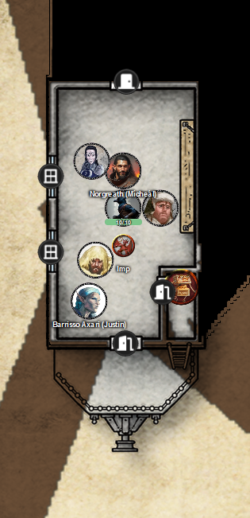
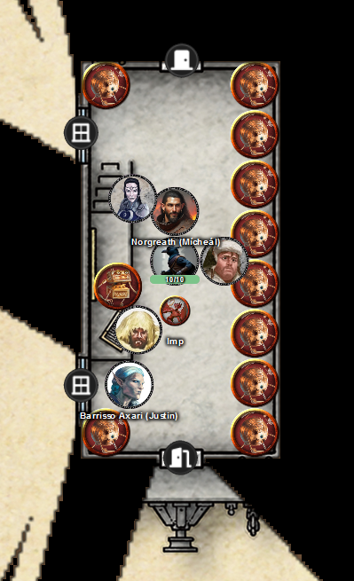
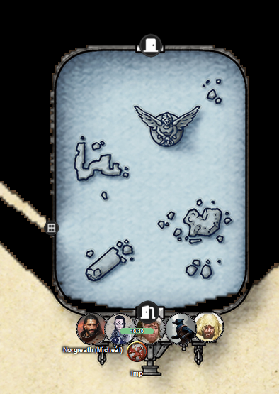
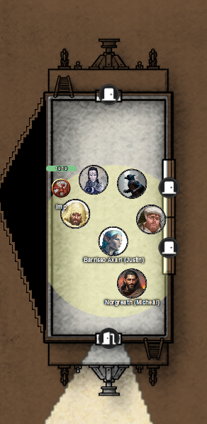
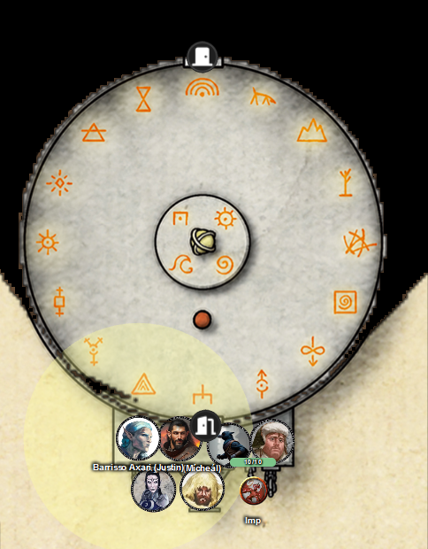
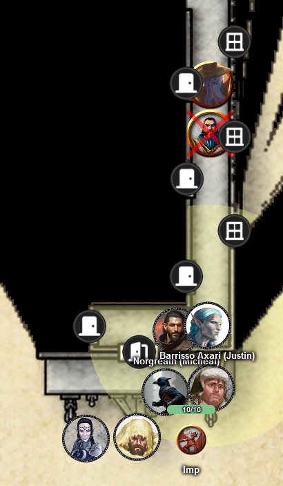

# 3 Sep 2025

**[Previously](2025-08-27.md):** We acquired the Book of Vile Darkness from Brimstone Hold, as tasked by Manizer, and sent her a message asking for further instructions. After a battle with devils who wanted to reacquire the book, we met up with Manizer in the Vigilant Eye inn. There she gave us another task: to board an interplanar prison carriage on the Concordant Express and find out from a creature there called the Stranger where the first element of the key for the Tyrant of War vehicle is. A friendly modron named Glitch brought us to the plane of Concordant Opposition, where we are about to board the vehicle...

---

A creature, a duodrone, leans out to us from a booth and says: "Can I have your tickets please?"

He counts all our tickets and says "Welcome aboard".

We all board the train:

<figure markdown>
  { width="200" }
  <figcaption>Inside the Concordant Express</figcaption>
</figure>

The whole carriage we're in shudders and we feel ourselves moving forward.

Inside the carriage is a single bench on chains, hanging on one side. A door is at the far (front) end. As we look around, we see the attendant in the booth come out and open a locker. Inside is a blue hat, a tool-belt, and grimy overalls with "9" on the back. He takes these and puts them on. Then he heads out the back door.

Before he leaves, Barrisso questions him about the roof of the train and why he is using it, any creatures that might be on the train, and so on. The creature heads out to climb on the roof.

We open the door to the rest of the train. The carriages are separated by buffers. As we access the situation, we see a shimmering in the sky and we are passing through a frigid squall of ice needles.

Lunghiss *(Arcana check)* has an idea of where the train might be: in Avernus, he studied some of the books from Mad Maggie's market plane about the layers of the Nine Hells. Cania is one of the cold hells, and that's where he thinks we are travelling through. He knows that if we are outside, we will suffer cold damage.

The duodrone who left, and four other creatures (three tridrones and a one quadron) enter the carriage and shut the doors, looking very cold.

Barrisso asks "Cold eh?"

"It is."

"How did you get caught in that?"

"We don't know which planes we will shortcut through on the way back to Mechanus."

We decide to wait out the cold storms of this plane.

---

After a while, everyone in the area gets a feeling of inner peace. All the ice seems to have disappeared. Out the window, we can see a lovely well-tended verdant landscape. A wide river flows through it, splitting into smaller rivulets, then recombining. We see buildings and great lighthouses along a coastline in the distance.

Lunghiss *(Arcana check)* believes this is Elysium. We recall this is where Uldrak the Tinker returned to.

As it seems to be safe, we take the chance to move to the next carriage of the train.

<figure markdown>
  { width="200" }
  <figcaption>Second Carriage</figcaption>
</figure>

Inside, ten spherical modrons are lined up against one wall. At the other, is a podium. On top of it is a chalkboard covered with mathematical equations. Next to the podium is a boxy-looking modron, tapping the podium with a wand to get attention.

"Well met! I am the Mad Wizard"

"When will this journey complete?"

"Calculate!" he says, tapping the podium.

The spherical modrons take placards, shuffle around,
exchange places, and eventually there are four numbers shown: 7-4-5-2.

"It is that many minutes until we arrive."

We continue to the next carriage:

<figure markdown>
  { width="200" }
  <figcaption>Third Carriage</figcaption>
</figure>

This is a strange carriage: it extends outwards more than the other carriages. We notice it is rounder, with no right angles with the walls or the roof. The carriage is completely filled with clear water to the roof. Strangely it does not rush out when we open the door: we face wall of water. The carriage resembles a large aquarium. It contains coral reefs, ruins covered in algae, and a large alabaster statue of an angel holding a decanter.

Norgreath *(Arcana check)* wonders is there a water elemental there.

Barrisso leaves the carriage and tries to flies over it to the other side. However, he feels the winds around him really strong. He stops, and returns to the door he came from.

Barrisso enters the water carriage and finds its floor is very smooth. His vision is reduced, so he cannot see the door at the other side clearly.

However, he makes it to the far side of the room and opens the door. The party makes their way through the water carriage. We find that magically we are dry when we exit the carriage.

---

In the next carriage, we find what looks like a mini war machine. Acid is dripping from a hose-like weapon on the front.

<figure markdown>
  { width="200" }
  <figcaption>Fourth Carriage</figcaption>
</figure>

We walk around the buggy and open the door to the next carriage.

The next carriage is a giant cylinder full of glowing symbols:

<figure markdown>
  { width="200" }
  <figcaption>Fifth Carriage</figcaption>
</figure>

From inside, we can see the roof of the carriage is a dome. In the middle, is a mechanical model suspended over a dais with more glowing symbols. This model looks like a large wheel with a tall spire-like appendage protruding vertically from its centre. A tiny brass ring is floating above this spire.

In the centre, the symbols are related to the elements: on the outer circles, the planes.

A short tube rises from the floor. At the top is an opening. Barrisso steps in to look down: a spectral blue image of a modron appears. It wears a pair of oversized spectacles. It adjusts it glasses and joyfully greets us.

"Welcome to the Planartarium! You can learn more about them by donating in this carriage."

It gestures towards the open tube.

We move to the next carriage:

<figure markdown>
  { width="200" }
  <figcaption>Sixth Carriage</figcaption>
</figure>

We see a little corridor with doors to the side: presumably a train carriage with compartments. There is a creature in a beige coat and hat kneeling beside a body. Three curious onlookers (one a cambion, one a drow, and a bronze dwarf with flames for hair) pokes their heads out of the compartments. There are modron butlers in each compartment.

Suddenly, the kneeling creature says "No one move a muscle: this whole car is a crime scene." The detective looks up at us. He stands up, holds his pipe with one of his face tentacles, and lights the pipe. He sends us a telepathic message: "The game is afoot. I am **Ignatius**."

Barrisso asks "What happened here?"

"I just came across this victim. I presume one of these three has killed him. Will you help me to discover the killer?"

"The creature is called Quintus. I believe he was killed getting to a privy. Quintus was an aasimar. He was killed outside the middle compartment, which he shared with Eithlin, a female drow."

"I suspect the cause of death, but want you to share your thoughts."

Norgreath *(Survival check)* deduces that the killer couldn't have come from the lowest cabin. It would have to have been the upper or middle cabin.

The top cabin is inhabited by the cambion. The middle by Ethlynn the female drow. The lower cabin is the bronze dwarf, Mildar, who shares it with Ignatius.

Galen believes the aasimar was killed by three bolts of magical force. Norgreath says they were definitely magic missiles.

Barrisso asks a modron in a compartment: "Did you see the murder?" The one he speaks to is Orb, Ignatius's modron. Quintus' modron is called Bot. Abernathy's modron is called Higglesworth. From the detective, we find out the modrons only speak Modron.

But instead of shrugging, Higglesworth points at its eye.

"Who did you see commit the murder?"

It points at its eye again.

Barrisso examines its eye. It looks like the only organic part of the modron. The eye is blue and unblemished.

The modron Higglesworth seems to confess to the murder.

The cambion steps forward: "What are you doing with my butler Higglesworth?"

Norgreath asks "Were you killed by a cambion?"

"I don't know"

"Did you see your killers?"

"No."

"Did you hear them?"

"Yeah."

"Do you have an enemy on the train?"

"Yes. Maybe even three."

"What's your favourite colour?"

"Purple?"

He expires.

---

Barrisso has a feeling that the cambion knows more than he is saying, and was bluffing when he said Higglesworth didn't do anything.

Galen casts Zone of Truth on the carriage. Only the drow resists the spell.

We ask all those who failed if they killed the Quintus the aasimar.

The mind flayer says they didn't.

Barrisso asks all the non-modrons if they killed the victim.

The bronze dwarf says some gibberish. Lunghiss casts Comprehend Languages. It turns out that the dwarf is saying "What is this person saying?"

Barrisso asks the mind flayer to ask the bronze dwarf the same question. Lunghiss confirms he says "I did not kill that aasimar."

Barrisso changes tactic and asks each person: "Who killed the aasimar Quintus?"

Barrisso casts Bane; then Galen casts a new Zone of Truth to force the drow to speak the truth.

Barrisso asks the drow again: they didn't kill Quintus, or know who killed Quintus.

We think that the cambion, Abernathy Vernus, is the killer.

Ignatius telepathically communicates "That is also my suspicion. However, I do not see how he can cast a magic missile. I would like to see the murder weapon."

Barrisso asks those in the Zone of Truth where the murder weapon is. We open a hatch in Higglesworth, and a wand tumbles out.

"Point to the person who put the wand in you."

Higglesworth struggles, then collapses onto the ground, its eye rolling up into its head.

Lunghiss knows *(Arcana check)* that modrons can have an axiomatic mind: they cannot act against their nature and instructions.

Galen casts Command on the modron, asking it to relax.

Barrisso apologises to Higglesworth, and asks him who was the last person to command him. He points at Vernus.

Ignatius says to us: "I think you have done enough, and I thank you for your help in confirming what I thought from the surface thoughts of the cambion. I will confine him until we can hand him over to the authorities. I thank you."

[We keep the wand of Magic Missile with 6 charges left.](2025-09-10.md)
