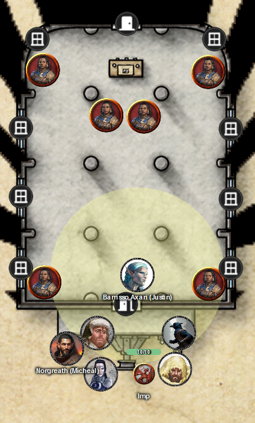
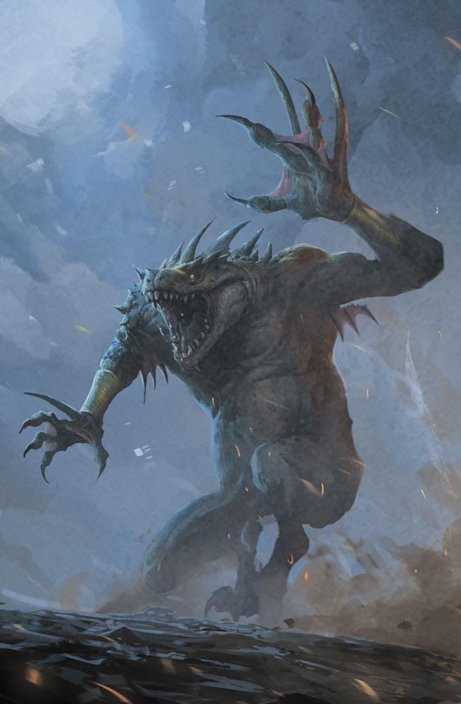

# 10 Sep 2025

**[Previously](2025-09-03.md):** We are on our next quest from Manizer: to board an interplanar prison carriage on the Concordant Express and find out from a creature there called the Stranger where the first element of the key for the Tyrant of War vehicle is. A friendly modron named Glitch brought us to the plane of Concordant Opposition, we boarded the vehicle. The train is travelling through a number of planes and we must take care as we travel from carriage to carriage. We found ourselves in one where a mind flayer named Ignatius was investigating a murder of one Quintus, an aasimar. We help Ignatius solve the murder, done by a cambion, Abernathy Vernus, with the aid of his modron butler Higglesworth. We accept the gift of the Magic Missile wand which Higglesworth had been hiding for his master.

---

We open the door to the next carriage:

<figure markdown>
  { width="200" }
  <figcaption>Seventh Carriage</figcaption>
</figure>

The carriage has an ornate chapel, with fancy pillars, rugs, and a vaulted mosaic ceiling. Two priests kneel in front of an altar, while four acolytes stand around the room.

Justin realises with Truesight they are not human, but aliens with claws.

We don't recognise either the creatures or their holy symbols.

The two kneeling creatures stand up and beckon us in. "Come in and spend some quiet time with us."

<figure markdown>
  { width="200" }
  <figcaption>Slaad</figcaption>
</figure>

Barrisso asks "Who are you?".

"I am a humble priest of Pelor. We are using this temple for the worship of Pelor. It has been used for the worship of other gods."

He asks us where we come from. He in turns comes from Flanaess.

Gralok *(Insight)* gets the impression that the creature is hiding something.

Barrisso asks him his name again.

"Are you Barrisso. Barrisso Axari? You are most welcome. Bring in your friends."

He names the whole party, which seems suspicious.

Barrisso: "We know of your subterfuge."

"We hide as you would be afraid of us, if you saw us like.... THIS!"

The creatures reveal their true forms, jump at us and attack.

---

Lunghiss believes *(Arcana)* these creatures are denizens of Limbo: slaads.

The one to the bottom-right moves to Barrisso and attacks with his claws. He does 7 HP of slashing damage and 6HP of necrotic damage, and Barrisso is also incapacitated.

The one of the left attacks Norgreath, doing 11HP slashing + 13HP necrotic damage. Norgreath is also incapacitated.

One of the priests casts a spell, Cloudkill, centred on the party.

As the Cloudkill sphere is opaque, we cannot see what the creatures beyond it are doing.

Lunghiss takes 12HP of poison damage from the Cloudkill.

Lunghiss goes over the top of the carriage, using Dash for extra distance. He makes his way across the roof, opens the door at the far side, and casts Hypnotic Pattern at the four nearest creatures. Two of them fail (the acolytes on either side) and are incapacitated. Lunghiss then climbs back up on top of the carriage.

Karthis casts Fireball at a point near the altar. Since he cannot see thru the Cloudkill, he cannot tell what exactly happens. But it breaks the concentration of the Cloudkill caster, as the spell disappears. The two creatures incapacitated are no longer under the Hypnotic Pattern spell.

Gralok uses Form of the Beast to rage, moves Norgreath out through the carriage door, then attacks the acolyte to the bottom-left.

Galen casts Banishment on the creatures. Four of the creatures are banished.

---

A creature lunges to get at Galen, but Barrisso is in his way. He attacks Barrisso. Gralok gets to attack, doing 19HP damage on him.

The other creature moves down the carriage and attacks Barrisso but misses.

Lunghiss cross the carriage to the south and attacks a creature but misses (even with Inspiration). He then moves out of the way to the other carriage.

Karthis casts Chain Lightning: one creature takes 19HP of lightning damage, the other takes the full 38HP.

Gralok attacks the creature next to him, doing 24HP of damage.

Norgreath moves into the carriage and casts Eldritch Blast (with Agonizing Blast) three times. He then uses Repelling Blast to push the creature away. The creature fortunately grabs the other carriage, and is now beside Lunghiss.

Galen casts Flame Strike on top of a creature, doing 21HP of damage.

Barrisso casts Banishment on the creature next to him, but fails.

---

A creature attacks Galen: he does 9HP of slashing plus 29HP of necrotic damage, but keeps concentration on his Banishment spell.

The other creature attacks Barrisso, damaging him and also poisoning him.

Lunghiss attacks a creature but misses.

Karthis casts Lightning Bolt at a creature, taking only 9HP of damage due his save and resistance.

Gralok attacks with his claws, doing 27HP of damage.

Norgreath moves to the carriage doorway and casts Banishment on both creatures. One is banished, the other remains.

Galen casts Sunbeam on the remaining creature, doing 10 HP of radiant damage.

Barrisso moves outside to the other carriage and attacks the creature there with his shortsword and scimitar, then pushes it off the carriage rear, plummeting into the train's undercarriage and killing it.

We gather back in the carriage and wait to see if the banished creatures return. Suddenly we hear an unnatural voice we don't recognise saying "So much for that: next time, you won't be so lucky."

Galen casts Prayer of Healing, returning 27HP of health to [everyone in the party](2025-09-17.md).

