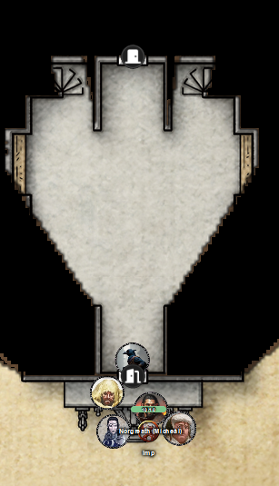
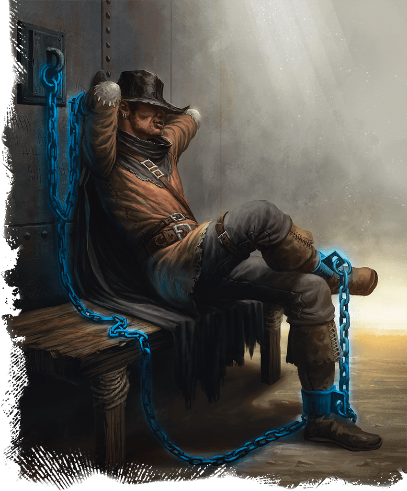

# 17 Sep 2025

**[Previously](2025-09-10.md):** We are on our next quest from Manizer: to board an interplanar prison carriage on the Concordant Express and find out from a creature there called the Stranger where the first element of the key for the Tyrant of War vehicle is. We travelled from carriage to carriage: in one, we found ourselves helping a mind flayer named Ignatius investigating a murder. In another, we encountered a group of what appeared to be holy men of Pelor, but who were actually slaads whose leader mysteriously knew the name of everyone in the party. Once they knew we could see through their disguise, they attacked. We successfully killed or banished them: after our victory, we heard an unnatural voice we don't recognise saying "So much for that: next time, you won't be so lucky."...

---

We decide to take the opportunity to have a long rest. On Karthis' watch, he suddenly sees, flying through the carriage, silent spectral forms. They resemble warriors in chainmail with long shields and spears, riding chariots being pulled by spectral horses. After a moment, they all pass through the carriage and are gone. After our rest, Karthis finds out this is the Wild Hunt.

After our long rest, Barrisso searches the room but doesn't find anything. We continue towards the next carriage.

We look in to find it is a double-height carriage, 30 feet high, encased in thick iron:

<figure markdown>
  { width="200" }
  <figcaption>Eighth Carriage</figcaption>
</figure>

The carriage has no windows, with a keyhole, very strong looking iron, door. 

Lunghiss checks the lock for traps and then tries to unlock it, but fail.

He instead uses the Pipes of Marvellous Emancipation. We hear the door unlock.

Lunghiss opens the door as slowly as possible.

Inside, there are two iron balconies protruding from the side walls. Iron stairwells connect them to the lower level. Lining the walls are doors to cells. Each has a gear-shaped keyhole. Pale light shines thru gaps around the doors, and there is radiant light shining downward from a creature on the balcony above and to the right. It is a stocky angel with blueish skin, with folded fiery wings. A radiant flanged mace is at its hip. It looks very like a planetar, except for its wings.

Gralok shouts out: "Are you a planetar?"

The creature unfurls its wings: "I am. Speak your business and speak it truthfully."

"What's up with the wings?"

"I feel comfortable with my wings."

Barrisso asks its name. 

"I am Omid. My duty is to see my charges arrive in Mechanus."

"We just want to speak to a creature called The Stranger here. We don't wish to release him, just talk to him."

"Normally, no. In this unlikely scenario, which of you would like to interview the stranger?"

Barrisso says it would be him.

"You want to interview one of the most dangerous individuals in the multiverse, to access a dangerous weapon?"

Barrisso mentions the planetar that we rescued at Elturel.

"We was captured and used to transport Elturel to Avernus."

"I did."

"We are the party that returned Elturel and rescued your friend."

The planetar seems convinced. "I will agree to your interview on several conditions. Your companions return to the next carriage. You remove all of your equipment."

The party agree and the rest of us return to the last carriage. Omid closes and relocks the door. Barrisso removes his armor and weapons. Omid approaches a particular door on the upper level. He uses his mace as a key on the door, which opens.

Inside the cell is a person on a wooden bench. They are held in place with dimensional shackles. 

<figure markdown>
  { width="200" }
  <figcaption>The Stranger</figcaption>
</figure>

The human's face seems to be blurred permanently, as if in a haze. Barrisso cannot see him even with Truesight, but feels he is looking at him.

"How are you, Stranger?"

"I am bound on a interplanar vehicle. I do not fare well."

"Do you know of the Tyrant of War?"

"Why do you ask me?"

"You have knowledge of part of a key for it.

"I thought you were going to ask me a true name? I am on this train for revealing the true names of three being."

"Do you know of the location of the first element of the key?"

"What's in it for me?"

"It might look good for you at your upcoming trial. There's no way we can release you. What do you believe? Why are you imprisoned here?"

"I dared too far."

"Against whom?"

"The agents of the Blood War. I stand with the idea that an eternal war against devils and demons might be a better thing than those creatures focusing their attentions elsewhere."

Barrisso mentions Zariel, and how we redeemed her. The Stranger doesn't really care.

We seem to be at an impasse: the only thing The Stranger wants is to escape. We cannot help him do that.

Norgreath decides to take a turn: Barrisso leaves and Norgreath tries to go to the cell. But the carriage door is locked, and the planetar doesn't answer. 

Barrisso tries to carry Lunghiss to the far end of the carriage to try and unlock the door there. As we get to the top of the carriage, four pentadrones that guard the top of the carriage move in to attack. 

Lunghiss casts Shadow Blade, then performs a sneak attack with his Shadow Blade on a pentadrone, with Booming Blade and Savage Attacker and kills it. But his weapon then disintegrates.

Norgreath casts Eldritch Blast (with Agonizing Blast and Genie's Wrath for the first attack), doing 41HP of damage: the second creature is killed. Another creature takes 7HP of damage.

Barrisso attacks with his scimitar and shortsword, killing the third creature. He moves to the fourth and last creature and attacks, finishing it off.

We continue over the roof to see one last carriage ahead of us: the engine. 

Lunghiss unlocks the door at the far end. Norgreath steps in and immediately takes his weapons and equipment off. 

Omid calls out: "What are you doing?"

"We just want a second attempt to persuade the prisoner for the benefit of all the multiverse."

"Stranger, my colleague has talked to you before. I'm fascinated by your face: is it magic obscuring your face?"

"Are you going to get me out of here?"

"I want to know more about you."

Norgreath takes out a soul coin.

"Are these familiar to you?"

"The key to getting the key is to release me."

"If I could take your shackles off, could you deal with the planetar?"

Norgreath tries to persuade the Stranger without any success.

Norgreath begins to cast Charm against the Stranger. The planetar immediately casts a holy burst, which catches Norgreath in its blast. He takes 27HP of radiant damage. Omid says "You need to stop, or I will destroy you."

Norgreath cancels his spell and says "I'm just trying to get the information that the world needs."

"How long will this compulsion work for?"

"An hour, but at my discretion."

The planetar orders Norgreath into a cell beside the Stranger's. [Norgreath complies...](2025-09-24.md)

