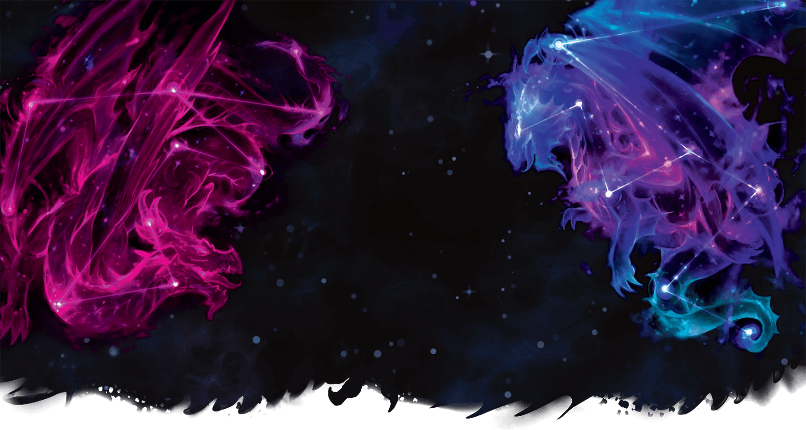

# 24 Sep 2025

**[Previously](2025-09-17.md):** We are on our next quest from Manizer: to board an interplanar prison carriage on the Concordant Express and find out from a creature there called the Stranger where the first element of the key for the Tyrant of War vehicle is. We travelled from carriage to carriage: in one, we found ourselves helping a mind flayer named Ignatius investigating a murder. In another, we encountered a group of what appeared to be holy men of Pelor, but who were actually slaads whose leader mysteriously knew the name of everyone in the party. Eventually, we find the Stranger, securely held in a carriage next to the engine, and guarded by a planetar. We have tried to convince the planetar to allow us to talk to the Stranger, but he is naturally suspicious. He allowed us in to the carriage just once to talk. But the Stranger will make no deal unless it means freeing him: something we are not willing to do, even if we could defeat the planetar. Now, after trying to cast Charm on the Stranger, the planetar has wounded Norgreath and ordered him into a cell next to the captive....

---

Once the door shuts, Taq's telepathy link with Norgreath is cut off.

The planetar opens the cell, and gives the following scroll to Norgreath:

???+ scroll "Tevaeral - The Star Forge and the Last Wyrm"

    In Tevaeral, where magic's might now fades,
    A sheltered world, through northern glades,
    A giant clan's craft, a hidden art,
    Preserves ancient power, set apart.

    A star once fell, a brief searing grace,
    Giant’s Star Forge still blazes in that cratered place.
    Where power seekers hone their crafting skills,
    Within the encircling lake they bend their wills.

    Beyond Naev Keep, where mountains loom,
    The Aetheir range, dispelling gloom,
    Westward it lies, by Zimos' flow,
    The Star Forge gleams, a cosmic glow.

    Where draconic might, now but a fading dream,
    One ancient wyrm, the last, it would seem,
    Holds secrets close, as power ebbs away,
    A link to magic, glimpsed in twilight's ray.

    From fiery fiend, the key controls,
    The Tyrant's power then unfolds.
    Bathed in cosmic forge's light,
    The key revealed, to find its might.

The planetar says that he cannot allow Norgreath to commune any more with the Stranger, but hopes this scroll will help our party on our quest.

As Norgreath leaves the cell, the planetar says "Take that with you". He points at a rod that Norgreath had not noticed. He takes it and thanks the planetar.

We decide we have done all we need on the interplanar train. We take a short rest, while Norgreath attunes to the rod he just acquired. He find it is a Rod of the Pact Keeper, +2 ("While holding this rod, you gain a +2 bonus to spell attack rolls and to the saving throw DCs of your warlock spells. In addition, you can regain 1 warlock spell slot as an action while holding the rod. You can’t use this property again until you finish a long rest.")

Norgreath casts Plane Shift to return to our origin.

Nothing happens. We decide we could wait for the next stop, wherever that is. Norgreath casts a spell of Food and Water so that the party will have sustenance for our wait.

As we are waiting, we hear a knock on the door. We open it to find it's Ethlynn Stalaczic, a drow lady. She was one of the suspects in the murder we stumbled over earlier. We offer her some food, which she takes gratefully.

After a while, she says to us: "I get the feeling you are seasoned travellers."

"We are. But there is some counteracting magic that stops us leaving here."

"Oh yes: all teleportation magic here is suppressed. You would have to leave the train and be outside its zone of influence."

"Did you come seeking us?"

"I need your assistance. You may remember that in the other carriage, Quintus the aasimar was killed. He was killed after he sold me a map, which supposedly would lead me to a Time Dragon. Would you take me there?"

She shows us the map: Norgreath and Karthis think it makes no geographic sense. Karthis and Lunghiss have never heard of a Time Dragon *(Arcana check)*. But Barrisso is sure she is sincere *(Insight check)*.

We ask her to tell her about a Time Dragon. She looks worried and concerned, as if she has picked the wrong people to tell. And also embarrassed.

"I was hoping you might be the ones who knew about them. Have you heard of The Birth of the First World?".

She takes out a book with the following image:

<figure markdown>
  { width="600" }
  <figcaption>The Two Dragons</figcaption>
</figure>

"All of the multiverse has come from the dragons. There were two dragons at the beginning who woke in the darkness and created the universe. They created other dragon-kind, then created the first world. But they did not maintain their union and the First World was sundered. Through that sundering, all other material worlds were formed. A great variety of creatures, including dragons, resulted."

"I have heard that of dragons such as gem dragons and deep dragons, and two other types."

"One is so terrible, no one would go searching for them: the void dragons."

"One is able to reunite dragon-kind: the time dragons."

"Order would return to the world. I have studied dragon-kind for 250 years, and have gathered this information from many seers across many planes."

We ask her where she is from.

"I am unusual: I was born in the centre of the multiverse. A city called Sigil."

"We have heard of a dragon, and wonder if you have come across it. A place called the Star Forge supposedly is home to an ancient wyrm. Are they familiar to you?"

"None of those seem familiar to me. Do you know the type of wyrm?"

"Only that it is associated with fire. Have you heard of the Radiant Citadel and how we might get there?"

"No."

She realises we cannot really help her, and we wish each other good luck.

---

We return to the carriage where Ignatius the mind flayer was.  We ask where Quintus the aasimar's person effects are. "On his person: I have not allowed anyone to touch them until we arrive in Mechanus."

We tell him of the story of the trade with the drow female, including a ruby. "I have the inventory of his personal effects: there is no ruby."

"I will check Vern's inventory. But I already know his motive. Our victim was not the most honest of traders. Neither was Vern. They were both trying to get one over on the other. They thought that they had a good mark in  Ethlynn."

We decide to continue through the carriages to the Planartarium. Initially, Barrisso's requests for information from the incorporeal modron are rebuffed as they reference locations within a plane. However, when the query switches to Tevaeral itself, there is a response, telling everyone about this prime material world that was somewhat off the beaten track. Realising that we could travel directly there using Norgreath's coin rather than attempting to gain more information near Elturel, we return to the temple carriage and rest until the train will arrive in Mechanus some days later.

---

We get off the Concordant Express in a weirdly ordered city and find a quiet square where Norgreath can use his coin to travel to Tevaeral. The whole party are drawn forward on a path that appears and takes us all up into the sky. The path joins a main thoroughfare heading off through the multiverse, passing strange realms below us as we proceed. Thankfully, it only takes a couple of hours of journey time before a side path appears again and draws us down into a world that looks similar to our own home plane.

Arriving on the grassland, we look around to find our way, first seeing a castle in the distance further up a valley, behind which rises a mountain range and through which flows a mighty river. Moving closer, two free standing towers are revealed, one on either side of the river valley. We approach the nearer of these, looking to gain entrance. When we pass the point where the towers aligned, we all feel as if there is a magical field of force that is trying to push us away with fear, but we all resist its effects. Once around the tower, we are able to see a door on the western side that looks back towards the larger castle further up the valley. Barrisso flies up to see if he can spot any inhabitants in the tower. He fails to do so, but when he lands [finds a trapdoor on the roof...](2025-10-02.md)
