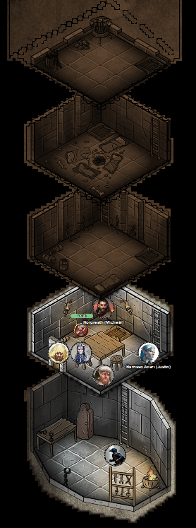
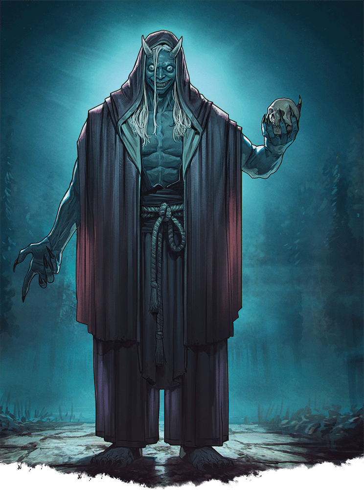

# 2 Oct 2025

**[Previously](2025-09-24.md):** We are on our next quest from Manizer: to board an interplanar prison carriage on the Concordant Express and find out from a creature there called the Stranger where the first element of the key for the Tyrant of War vehicle is. We eventually found him in a prison carriage, guarded by a planetar. We found we could not get information from the Stranger unless we agreed to free him, which we didn't want to do. But to aid us, the planetar gave us a scroll named *Tevaeral - The Star Forge and the Last Wyrm*. We presume this must contain a clue about the first element of the key.

While still on the train, Ethlynn Stalaczic, a drow lady from the city of Sigil found us. She had an interest in dragons and the so-called Birth of the First World. She asked us to bring her to somewhere called the Radiant Citadel, but we could not help. We waited until the train reached Mechanus, then used Norgreath's coin to travel to Tevaeral. It is a lush world similar to our home plane. There, we have come across two towers, and Barrisso has flown up to the top of one to discover a trapdoor...

---

The top of the tower is circled by stone parapets. Leaves are piled in the corners. Small barrels are filled with arrows, and two shortbows lean against the arrow. In an unlit brazier, there is a copper pot which is full of oil.

Opening the trapdoor on the top of the tower, Barrisso finds a ladder descending. The next level down is a sleeping chamber with a firepit. Four unfurled bedrolls lie around. The room smells of smoke and cooked meat. However, it does not seem to have been occupied recently. In the floor, another trapdoor leads downwards.

Barrisso listens at the trapdoor and hears nothing. He opens it and descends to another level. This contains neatly stacked bedrolls and bow between arrow slits facing out. One bedroll is laid out. Again, this seems to have been unused for quite a while. Another trapdoor leads down.

Barrisso listens again, and descends to what seems to be the ground floor of the tower. Two torches are burning with continual flame. A large table is in the centre of the room, surrounded by stools. There are also bedrolls, and also another trapdoor. But there is also a door, presumably leading out to the exterior. Barrisso opens this door, and lets the rest of the party in.

Lunghiss checks the trapdoor and detects nothing. He opens up to find a larger drop down to the next level. It seems to have been used as a dungeon. There is a wall rack with what appear to be torture implements, manacles, and a vaguely human-shaped cabinet against the wall.

<figure markdown>
  { width="200" }
  <figcaption>Tevaeral Tower</figcaption>
</figure>

Lunghiss checks but there seem to be no secret door. We decide we have seen everything there is to see, and leave the tower.

---

We head south-west towards a nearby keep. Norgreath *(Wisdom fail)* suddenly stops moving. His companions soon notice. It is almost like he is in thrall to a Hold spell. Lunghiss *(Perception check)* cannot detect anyone nearby. Barrisso uses Detect Magic and notices what seems to be a field of magic all around us, of the school of Abjuration. The school of magic affecting Norgreath, however, seems to be Enchantment.

Barrisso flies up to around 60 feet to see if he can see an edge to the field. He realises that the field of this abjuration spell ends at a line between the two tower we saw earlier. The party suddenly hears voices, telling us to leave. Galen uses  Dispel Magic to free Norgreath from whatever spell he was under. We decide to move on and move west.

---

Suddenly, some of the party feel a sense of fear. Both Gralok and Lunghiss are now Frightened, by something west of their position. Barrisso uses an aura of courage around the party to protect them.

---

As we continue on, a fireball explodes at Galen's feet. Fortunately the party avoid most of the damage. Barrisso flies up to see if he can see an end to the magical field we are in. 100 feet in the air, the field dissipates. He flies towards to the keep to see if the field ends in that direction. The field seems to surround the keep in all directions, but if we reach it from the air, we have less of the field to travel through.

The party climb into Norgreath's ring. Barrisso and Taq then fly towards the keep above its dangerous magical defensive field.

We see creatures in defensive guard posts: most are humanoid with bluish skin. The one that catches our eye is the biggest: an adult copper-coloured dragon. We skirt north to avoid it, but it lifts into the air. The clouds in the sky start to darken, the air turns colder, and a wind rises. Barrisso increases his flying speed to draw the dragon away from Taq and the party in the ring he holds. While he draws the dragon away, Taq lands on the ground and the party leave the ring.

To the south and east of us, we see blue-skinned humans, along with a number of fey, a lion with feathery wings, and other assorted creatures. As Karthis looks at them, he thinks that the blue-skinned humans are normal humans. He notices there are no dwarves, elves, or halflings. Gralok notices they look defensively dug in, as if expecting something coming from the east. He also notices that the humans are not well armed or armoured: they don't seem to be the military type. Galen notices the dragon is independent with no rider.

Barrisso shouts in Common at the dragon: "Can we parley?"

The dragon replies, in a voice that sounds like ten thousand mouths overlapping: "Your kind has not been here for millennia. How are you here?"

"Let us stop and converse."

"Your kind has hunted and killed my mind for millennia! Drop your weapon."

The dragon breathes to push Barrisso towards the ground and force him to land, but fails.

"All I wish to do is get to the Star Forge. Can we parley?"

The dragon beats its wings.

"How can I trust you?"

"You can't be all I wish to do is talk. Do we have an agreement?"

"I will land if you do."

It lands on its hind legs, still obviously on edge. Barrisso *(Insight)* senses it is frightened of Barrisso. Some of the blue-skinned humans we saw earlier seem to start drifting over to us.

Suddenly a strange creature appears, moving more quickly than its legs would seem to be able to carry it, and stops beside the dragon. Eight feet tall, it has two white horns and madly staring eyes.

<figure markdown>
  { width="200" }
  <figcaption>Creature</figcaption>
</figure>

"What manner of creature are you?" asks the dragon of Barrisso.

"I am by nature Elvish, but I have been blessed."

"By whom?"

"Zariel, an Angel in Mount Celestia. That is another plane. Like I, who am from another world."

"How did you come here?"

"Magic."

"You can come to my world...."

"Yes, from other worlds."

"Have you seen creatures like me there?"

"Yes. In our tongue, you are a dragon."

"Why did you come here?"

"I seek the Star Forge in this vicinity, to prevent a great evil from happening. I would like your permission to get there."

The dragon looks confused. It looks at its companion.

"You are not hunting us?"

"No we are not interested in that. We are just here to get to the Star Forge."

"You mention the Star Forge. The giants have gone from there. What power do you think is there?"

"We need an element of a key. If we don't, the multiverse may be destroyed. I would like your aid in that?"

We see more of the dragon's allies arriving.

"I will consider your request."

The dragon agrees to keep a distance from our party, and vice versa. Barrisso asks him to [take time to consider our request....](2025-10-08.md)
