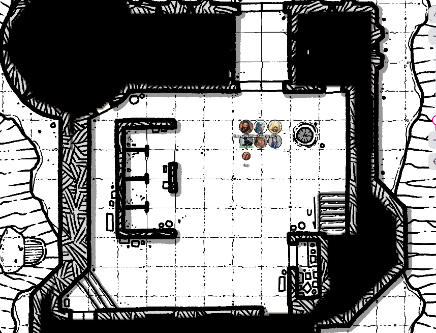
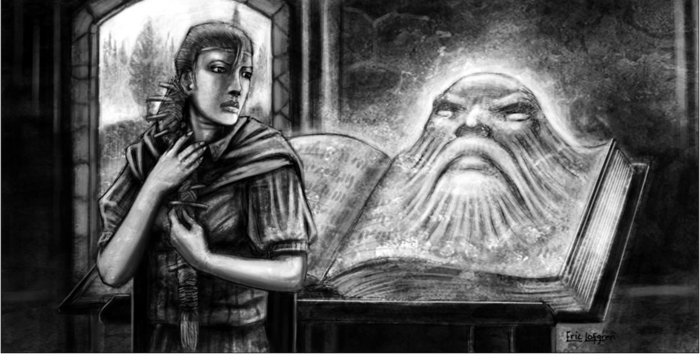

# 8 Oct 2025

**[Previously](2025-10-02.md):** We are on our next quest from Manizer: we boarded an interplanar train and acquired a scroll called *Tevaeral - The Star Forge and the Last Wyrm*, which indicated our next destination, and possibly where the first element of the key for the Tyrant of War vehicle is. We used Norgreath's coin to travel to Tevaeral. There, we first reconnaissanced a tower, then headed to a nearby keep. On the way, we met various magical wards trying to block our path, and offensive spells to dissuade us. We eventually engaged with an adult copper-coloured dragon, which was initially frightened of us as, in its words, "our kind" hunt it. We told it we just want to find the Star Forge, and it is considering our request....

---

The blue-skinned beings part to admit a five-foot-tall bluish-white woman with dark blue hair in a single braid, woven with wooden dowels. She holds a quarterstaff and around her belt, she has five wands. She has a conference with the dragon, then nods to the dragon. She then strides across the open space between the parties to us.

"My companions tell me that you are looking for the Star Forge?"

Norgreath says yes, we seek it, and we might have common cause.

"Aren't you a spellcaster?"

"I certainly am."

"And that one there", pointing at Karthis.

"Yes."

"And... you are both somewhat of the old kin?"

"We come from a different plane, via magic."

"There are still old kin where you come from?"

"But these two... why is their skin not blue?" pointing are Gralok and Galen.

"In our world, most are light skin."

She still looks a little perplexed. She points at Lunghiss.

"You have bird people?"

"A fascinating people, very good at unlocking doors and discovered traps."

"So, you who can do magic, can you cast the Ninth Circle?"

"If you mean ninth level spells, we're getting there but not there yet."

Her shoulders sag.

"But the book, the book...."

"You have come to the valley for the Star Forge, and not sanctuary?"

"No. But we are interested to hear what you have escaped here from?"

"What do you know of the Unity?"

"Nothing, I'm afraid.

"Come. Let us break bread together."

She turns to her gathered friends. "I have invited them for parlay."

She leads us towards the keep. Near it, a circular tent has been set up, with a campfire nearby. She leads us inside. The dragon and the strange creature stay outside. Inside, they make tea and give us some fruit, while we sit ourselves down on benches.

"You have come to us in our hour of need. We are the last on our world who have any arcane power. This is our stand."

"Who is attacking you?"

"All the people of the world. This belief is spreading across the world. People should rely on themselves rather than gods or magics. They claim that magic is a crutch and not a tool. They hated magic users, but more recently the elders of the Unity began encouraging leader to outlaw magic. They started to enforce anti-magic laws, and that led to pogroms. As the number of magic users dwindles, so magic dwindles."

"Can I do a small spell to see if our magic here works as normal? A small illusion?"

"Go ahead."

Norgreath casts the image of a small dragon. It works perfectly and as expected. The blue-skinned people don't seem to be awestruck by the display.

The woman says: "Yes, our magics can equal that. But I fear that I am the strongest caster and my capabilities are not close to what I could do."

Karthis asks: "What spell would you like to be able to cast?"

Lunghiss notices she seems to be taken aback at this question.

"You have encountered our defensive field in this valley. It's our last defence and we have no way to replenish it. We were hoping you were able to help us make those defences permanent. I fear you are not able to cast the spells required to do that."

She opens her backpack: inside is a big spell book. She takes it out and says: "This is my repository of knowledge. After I am gone, two circles of magic will be lost, because only I can cast up to the fifth circle."

Karthis asks "Can you cast everything in your book?"

"Yes. However, the book cannot grant me anything beyond my capability."

Norgreath: "Is there a particular spell in the ninth level that you need?"

"Yes, there is, but I do not know."

We ask how many people are here.

"We have about 250 spellcasters, and maybe another 100 people, and some magical creatures of our world: a dragon, a nymph, a doppelganger, and the oni you met earlier."

"If we could transport you to a different plane, does that sound like a plan?"

She seems hesitant. "I must consult the book." The dragon leans in and says "Yes, you should."

---

We accompany Maon (her name) to the keep to consult her book.

<figure markdown>
  { width="300" }
  <figcaption>Tevaeral Keep</figcaption>
</figure>

In the keep, we meet four sprites fluttering around. To our right is a library. On the side of a shelf lies what looks like an open spell book. The book seems to be manifesting a face:

<figure markdown>
  { width="300" }
  <figcaption>Tevaeral Spell book</figcaption>
</figure>

Karthis asks can he borrow the book. Maon looks aghast: "You cannot. We would be lost without it. It has given us the guidance to help us defend ourselves."

"Could I copy spells from it?"

"What do you mean?"

"I would like to copy, without damaging, some spells from it. I might help you further your goals as well as ours."

Maon asks the book, reverently, "Great Book. Some strangers from another world tell us that they can use magic beyond our own. They are offering us the opportunity to go with them to another plane, where we would not be persecuted. What do you think?"

The book says: "Have them approach."

Norgreath and Karthis step forward. The face looks at them and says: "Your kind has not been seen here in many years. Elves used to rule this land, but they fought with the dragons many terrible wars. And although they wiped out most of them, they found their own power diminished as a result, and they left the world. Is this what you propose for my people?"

"If the alternative is to suffer attack from the Unity, then maybe a fresh start is the best option. We only offer this as a possibility."

The book addresses Maon and says: "Have everyone else leave." She looks shocked and says: "You have heard the book: please leave us." [The rest obey the orders...](2025-10-16.md)

