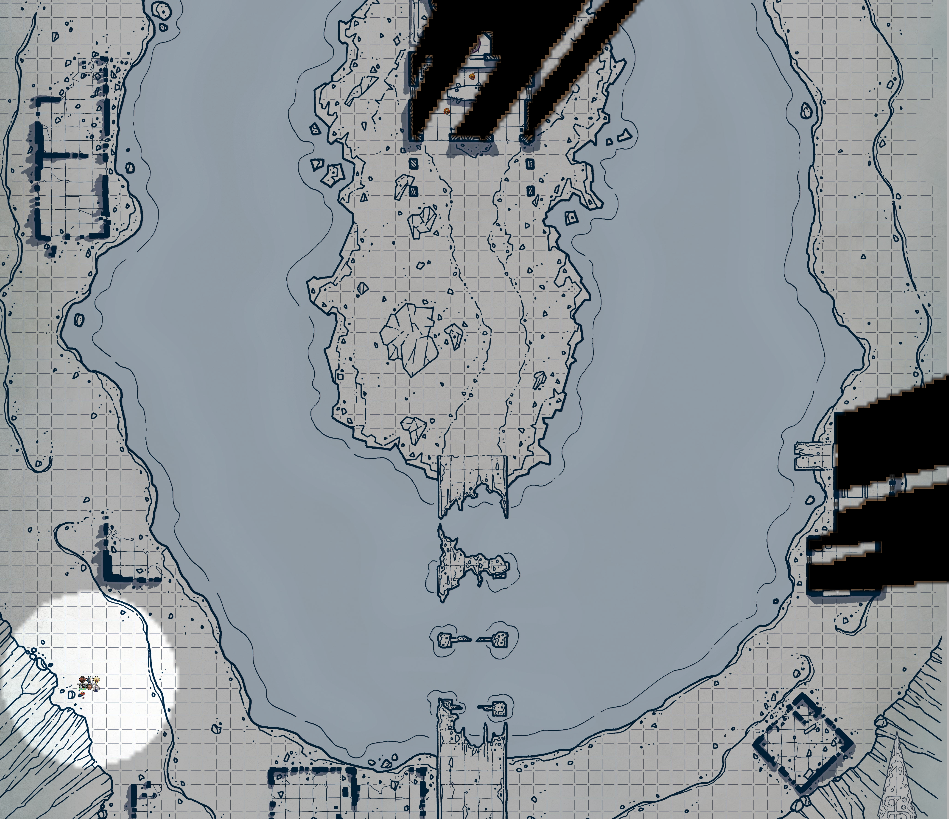

# 16 Oct 2025

**[Previously](2025-10-08.md):** On our mission to find the first element of the key for the Tyrant of War vehicle, we travelled to the plane of Tevaeral to look for the Star Forge. We have encountered a place where magic has been made illegal, and magic users have banded together in a valley behind what are their last magical defences. We parlayed with one of their leaders, Maon, and suggested to her that we could help transport them to another, safer, plane. Maon asked to come while she consults her book: this is to be taken literally, as the book has a face and can talk. It has asked everyone apart from Maon and our party to leave the room....

---

The book is a huge heavy leather-bound volume, with vellum pages. On it, Karthis recognises fascinating magical scripts. But its big face is in the way. It asks us further about our plan to rescue his people.

"It is not the Unity that I fear: it is the Doombringers. They were a sect of the Unity that became dragonslayers. They travelled all across our world, slaying dragons. Until they persuades an arch-mage to create the Dragon Doom. This greenish-black gemstone was given to the Doombringers. Using this, they can permanently banish dragons. As they used it, magic began to fail. I believe that Real, who stands guard with the mages outside, is the last dragon left. With him gone, magic too will have left this plane."

"Where is this Dragon Doom gem?"

"With the Doombringers. I don't believe they realise that Real is the last dragon."

"Do they have a base or headman?"

"Base? Not that I know. The current leader is a man called Tycho. He is never in one place for too long: he travels Tevaeral hunting magic-users, specifically dragons. At some point, he will find us here. His motivation is that every being should rely on themselves rather than external forces."

Barrisso asks about the Star Forge?

"But my people are doomed. Why are you asking me about irrelevancies?"

Barrisso explains why we are here, to prevent access to the Tyrant of War vehicle. He says he can help the Book's people, but we need to find the Star Forge first.

"It is located further up the valley. In the elder days, the giants built a forge that took power from a fallen star. It has been millennia since the giants. They fought with the dragons, and they were almost all destroyed. The Formorians have kept the Star Forge somewhat active. But as the magic of the world fails, it too fails."

We talk about the Dragon Doom. If it is destroyed, the dragons banished by it can return. So if it is destroyed, perhaps the plane does not need to be evacuated."

We decide we need to talk to Real the dragon again. As we leave the chamber, the Book calls to us:

"You should know that I do have some things that you could bring with you that no longer work here. Should you succeed in saving Maon and her friends, then I will gift them to you."

---

Outside are a group of blue-skinned people, who were earlier asked to leave. They look at Maon and our party for reassurance. Maon says we wish to speak to Real.

At that point, we notice a golden-coloured humanoid. He steps forward and says "I am Real."

Barrisso says "I thought as much. I'm going to show you this verse." He shows him the scroll we acquired on the interplanar train.

Real reads it and asks us: "Where did you get this from?"

"From a planetar on a magical train."

He reads it again. "I'm not ancient."

"Could there be another 'ancient wyrm' on this plane?"

"What do you know about my father?"

"Nothing much expect that he was banished by the Dragon Doom."

It turns out that Real knows nothing about this information that the Book has imparted to us. Suddenly, he turns back into a dragon. "STOP. TELL ME NOW."

"Let us speak in private."

He asks for privacy from the beings around, and they all withdrawn.

Barrisso tells him all about the Doombringers and the Dragon Doom which the Book told us of. That they are a secret group dedicated to wiping out dragons.

He asks "How do I destroy the Dragon Doom?"

"It may be safer is we try rather than you. If it banishes you, it's curtains for this world."

We ask about the Star Forge: as he is not ancient, he does not think he is the dragon mentioned in the scroll.

We get the direction to the Star Forge, and we head there.

---

We arrive at the Star Forge, which is located in the middle of a tarn - a small mountain lake:

<figure markdown>
  { width="300" }
  <figcaption>Star Forge Tarn</figcaption>
</figure>

A glow emanates from a building on the island. There are a number of other buildings around, ruined, made from iron and stone. A remnant of an iron bridge leads to the island.

As we walk to the bridge, we do not see any movements. Barrisso flies across and, using ropes, we manage to cross the remnants of its piers.

As we approach the building in the middle of the island, we see some creatures hidden among its walls. Taq scouts ahead: In the middle of the building is what seems to be a giant anvil, surrounded by eight creatures that reminds me of beings we saw on the train: dwarves with flaming hair. There is also a furnace, burning brightly. In an alcove, he thinks he sees a huge creature that is a Fomorian, which is guiding the dwarves.

Gralok moves forward and hides behind a rock.

Barrisso delays his action.

Karthis casts Haste on Barrisso, then moves.

Barrisso flies towards the building, keeping out of sight.

Norgreath casts Shadow of Moil.

Lunghiss casts Magic Weapon on his shortbow, then advances forward.

The creatures inside the building do not seem to have been alerted to our presence.

---

Galen does a double move ahead.

Gralok moves ahead to join Barrisso.

Barrisso delays his action.

Karthis casts Ice Storm at 7th level into the building. He does 39HP of damage, and four enemies fall.

Norgreath moves.

Lunghiss fires his shortbow but misses.

The flame-haired dwarves are panicked by the attack. They run towards the southern entrances of the building. As they do so, their entire bodies exude a flaming aura. One casts Wall of Fire and blocks off the right-hand entrance.

Gralok rages and then attacks multiple opponents, causing them to attack each other.

The Fomorian moves from his alcove into the main part of the building. He raises his weapon in the air and points it towards Gralok. A strange flash of red light hits Gralok, and he takes 11HP of necrotic damage.

Barrisso attacks the Fomorian with scimitar and shortsword, doing 68HP with Divine Smite.

Karthis casts Ice Storm at 5th level at the opponents in the left-hand doorway, doing a max of 33HP of ice and bludgeoning damage, killing them all.

Norgreath flies into the air to target the opponent above the Wall of Fire. His Eldritch Blast (with Agonizing Blast) and Genie's Wrath, doing 28HP of damage. The opponent is still standing.

Lunghiss moves and casts Mage Hand.

The flame-hair dwarf casts Flame Strike at Barrisso. Barrisso takes 11HP of damage.

Galen moves then casts Spiritual Weapon at 2nd level, but his attack misses. He then attacks with a Sunbeam, doing 34HP of radiant damage.

Gralok runs towards the Fomorian and attacks with his glaive, doing 4HP of damage.

Suddenly, [we hear some great doors being opened...](2025-10-29.md)
