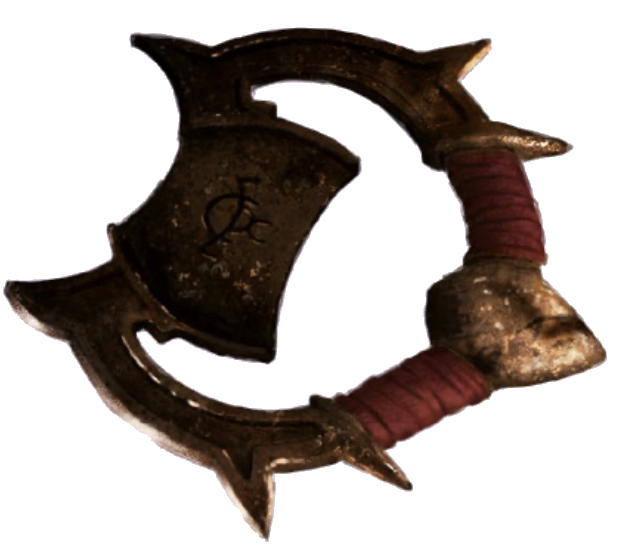

# 29 Oct 2025

**[Previously](2025-10-16.md):** On our mission to find the first element of the key for the Tyrant of War vehicle, we travelled to the plane of Tevaeral to look for the Star Forge. We have encountered a place where magic has been made illegal, and magic users have banded together in a valley behind what are their last magical defences to stop. The group is opposed by the Doombringers, a sect that once served the Unity but became dragon-slayers, using a powerful artifact called the Dragon Doom to banish dragons permanently. Our party learned that Real, the last dragon, may hold the key to stopping the Doombringers. The party headed to the Star Forge, an ancient anvil-like structure powered by a fallen star, which is guarded by dangerous creatures, including flame-haired dwarves and a Fomorian. During a tense battle, we suddenly hear the sound of large doors opening....

---

Through the door comes a giant bronze dragon - it's Real. He does not seem happy. He lands on the ground, giant wings stirring up a storm of dust, and his voice booms out: "STOP! YOU CANNOT DESTROY THESE CREATURES." We think he's referring to our opponents. The Fomorian, who had been raising his hands offensively, pauses, and instead casts Healing Word on one of his allies. It opens its cyclopean eye towards us and seems to cast a spell at some of the party, but it doesn't work.

Barrisso attacks the Fomorian with scimitar and short sword, damaging it severely. This prompts Real to pounce on Barrisso, doing 25HP of damage. He shouts deafeningly at Barrisso, "STOP".

Karthis holds his action, as does Norgreath and Lunghiss.

An azer opponent casts Cure Wounds on himself.

Galen moves beside Lunghiss.

Gralok holds his action.

Real booms: "SUCH A TRAVESTY. SUCH A WASTE. YOU KNOW WE DON'T HAVE MAGIC LEFT IN THIS WORLD. WHY ARE YOU TRYING TO DESTROY IT."

Barrisso: "What do you mean?"

"You have killed seven of the fire dwarves. How many do you think are left in the world?"

"They attacked us."

"Liar!"

"So what do you suggest we do?"

"Put down your weapons"

We refuse, but agree to step back from the Fomorians. They are obviously on edge, but not attacked.

Real tells us to leave this place. "You have lied to me. Why can I trust you now?"

Barrisso offers to bring back to life some of the dead by casting Revivify. Our party can restore five of the seven. Tomorrow we could then restore the remaining two. We tell Real of this. Real goes to an azer, who is cradling the dead body of their companion, and talks quietly with them.

They ask us to show us this magic. We ask which ones we should start with. They lay five of their companions out on the anvil.

Barrisso takes out our diamond, which strikes awe into the Fomorians. We need to split it to casts multiple spells. Gralok uses his Raggadragga's Maul to shatter it into eight pieces. Barrisso uses Revivify while Galen uses Raise the Dead and Norgreath casts Revivify using his limited wish. In all, we restore five opponents back to life.

The remaining two dead are placed on the altar, and candles are lit around them, while their companions stand watch.

We ask Real to talk. We apologise for assuming the region was full of evil creatures. We reiterate we need their help on our quest, which is to preserve the whole universe. Real says he cannot trust us.

That's fine, Barrisso says, but the world is still going to end, whether Real trusts us or not.

We explain again about the key that we need, and the importance of finding it. Barrisso successfully persuades Real and the Fomorian shaman of our mission. They ask what we need. We explain the key is somehow associated with the Star Forge.

Barrisso casts Detect Magic, in an attempt to discover where the key might. Many objects and entities around emit magic, it seems, including the Star Forge and from Real. He detects transmutation magic coming from a brazier. He sees there are runes etched on its irons, flaring with magical light.

Karthis detects among the glowing runes one which he does not think is actually a rune.

<figure markdown>
  { width="300" }
  <figcaption>Brazier Rune</figcaption>
</figure>

He presses it - and suffers 13HP of fire damage. It's actually really hot. But it did move slightly.

He presses it again, using his dagger. He realises he can prise it off and does so. It lands on the ground. Once it cools we pick it up.

Barrisso can still detect magic from it. He notices it is made from metal and a strange red leathery fabric, and it emits conjuration magic.

Barrisso feels a stream of bizarre feelings and emotions wash over him. He is left with three strong recollections:

- "Tyrant of War": The name of a green object floating in a skyscape
- "Tyrant key": The name of an an unbroken key-like object. A moment later, he sees fiery fissures crack this key and its components are flung across the multiverse. One fragment matches the rune he holds.
- Four planar locations:
    - The Citadel of the Fate Eater
    - The Infinite Labyrinth
    - Ramiah the Star Blade
    - Timeborne

Barrisso explains his vision to everyone. No one has heard of the places that he envisioned. We now pledge to help Real and his people in their mission. We resurrect the remaining two dead of our opponents, and restore the rest all back to full health.

---
<a name="dragondoompromise">
We talk to to Real about how to help him and his people. He says they do not want to simply leave the plane. It is better if we can help them destroy the artifact called the Dragon Doom. If we destroy it, the banished dragons may come back (but we are not certain of that). We decide to consult with Maon and her magical book to see if we can gain more information about the artifact.</a>

We go to see Maon and explain what information we need. She liaises with a mage, who leaves and returns, bringing us an object wrapped in velvet cloth. He puts it on a table in front of us, and ceremoniously unwrap it. Inside is a six-inch diameter glass sphere.

"I am Orin Farsight, and I have been able to use this crystal ball to scry upon people and places."

"Do you know anybody of the Doombringers?"

"We do: it is rumoured to be lead by Tycho, who we can scry upon."

In the meantime, Barrisso could cast Commune to ask his deity questions whose answers may help. We have a number of ways we can narrow down [the location of the Dragon Doom....](2025-11-05.md)
