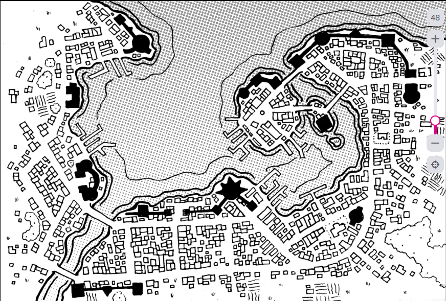
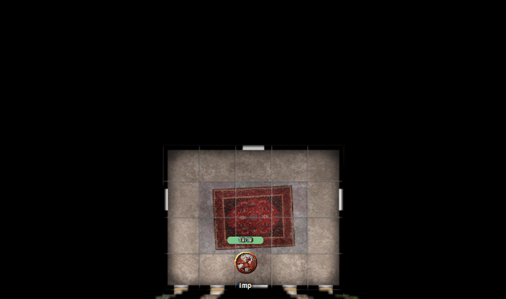
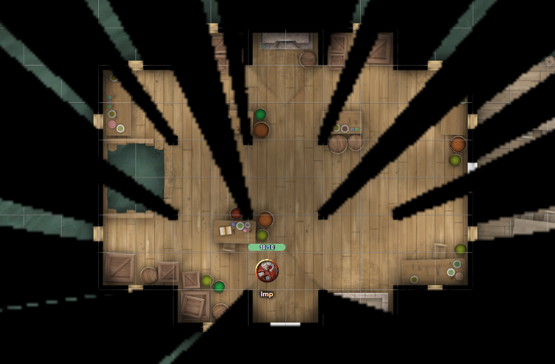
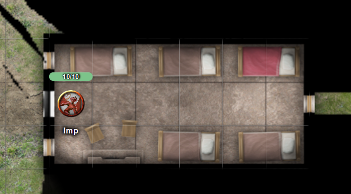

# 5 Nov 2025

**[Previously](2025-10-29.md):** On our mission to find the first element of the key for the Tyrant of War vehicle, we travelled to the plane of Tevaeral in search of the Star Forge. There, we engaged in battle with flame-haired dwarves and Fomorians before being interrupted by Real, a massive bronze dragon. He demanded that we cease fighting the Fomorians and Azer, condemning the senseless destruction in a magic-depleted world. Though he accused us of deceit, Real allowed us to prove our good faith by reviving the slain Azer. Using Revivify, Raise Dead, and Limited Wish, we restored five fallen foes, later reviving the rest. Seeking redemption, we apologised and reaffirmed our mission: to save the universe by locating a key linked to the Star Forge. Through magical investigation, we uncovered a conjured rune tied to visions of the Tyrant of War and four mysterious planar locations — the Citadel of the Fate Eater, the Infinite Labyrinth, Ramiah the Star Blade, and Timeborne. Real reiterated that his people did not wish to leave this plane, preferring instead to see the destruction of the Dragon Doom. We later consulted with Maon and a seer named Orin Farsight, who revealed that the leader of the Doombringers is a man named Tycho — someone we may be able to scry upon to discover his location.

---

The city of Cardaeram where Tycho can be found is on the coast, and is the local capital. While we intend to do there, Maon and Orin point out that as we are not blue-skinned humans, we will stand out a mile.

Maon mentions there is a guild-house in the city, but does not know its current status. The building straddled both the land and the sea. However, she thinks it is likely to be empty.

Our plan is to travel to the city via boat inside Norgreath's magic ring, which Taq will carry. He will be accompanied by Galen disguised as a local blue-skinned human using a Hat of Disguise.

We set our on the river journey: at 100 miles, it takes several days travel. Once the party feel the situation is becoming unsafe, we enter Norgreath's ring. Once we get close enough to the city (about a day's travel), the crew pull over to shore and disembark. "We will camp out here for a couple of days. If you don't come back by then, we'll return back upriver." They point out the small wood where they will rest.

Galen continues on his way until he reaches a hamlet, where he enquires with a woman about getting transport in a new boat to the city. "For the right price, someone will take you" is the response. The woman requests 10GP: Galen offers 5GP, but is refused - it will take her 3 days in total to do the return journey. Galen counts out a 5GP deposit into her palm, and her eyes go wide at what she has given her. They are not gold pieces from this plane. "I have never seen these before", she says. She bites one to test it, and she seems satisfied that they are indeed gold. "Your money is good enough for me", she says, dropping them into her pouch and beckoning Galen onboard her boat.

They set off down river, and she drops us at a wharf in Cardaeram:

<figure markdown>
  { width="300" }
  <figcaption>Cardaeram</figcaption>
</figure>

Galen wanders the city, eventually finding what looks like an abandoned temple.
The building's windows are missing glasses, but it is still firmly closed up. It has a fallen wall around it; gravestones lies around at angles.

Galen continues on his way to what we think is the guild-house that Maon mentioned. It has a wooden platform that extends out into the sea, where a wooden building sits on stilts. Its solid doors look well-maintained, but no one seems to be inside. Galen checks out the surrounding buildings: there are warehouses, but they don't connect to any docks. Galen calls Taq to investigate the guild-house to make sure it is empty before we use it as our headquarters.

Taq enters the building:

<figure markdown>
  { width="300" }
  <figcaption>Guild-House</figcaption>
</figure>

Taq slides under the right-hand door and continues along the corridor east.

Checking the first door, he finds himself in a dining room, with a large dining table and chairs. On the table are dusty plates and cups, as if for a hurried exit.

The second door is to a library, with empty bookshelves, a table, and knocked-over chairs. Some scraps of paper lie on the floor. Taq leaves and enters the next door.

This looks like a bedroom, with a small bed, a desk, and a chair.

He checks the final door on the south of the corridor. It's another bedroom, with two beds.

At the end of the corridor is a storage room. Along the corridor, he finds two more bedrooms. He returns to the main hall and heads west into a north-south corridor. He checks the door to the west to find a kitchen. A flimsy door leads to a pantry.

Taq has now explored the whole building and returns to Galen to tell him about it. Taq enters the building with the ring, and we all disembark. Lunghiss opens the front door to allow Galen inside.

Taq makes his way over the boardwalk across the water into the wooden building linked to the guild-house:

<figure markdown>
  { width="300" }
  <figcaption>Guild-House Wooden Building</figcaption>
</figure>

Taq checks out the room. A hole in the floor at the west side leads straight into the water. The building is more decrepit than the stone building. Out to the east is a verandah. To the south is a stone sink. To the north are empty crates. Taq leaves and heads back to the stone building. He then checks out a bunkhouse to the south-east.

<figure markdown>
  { width="300" }
  <figcaption>Bunkhouse</figcaption>
</figure>

Lunghiss casts Disguise Self and then Invisibility on himself in order to be safe while he reconnoitres the city. He decides to head to what seems to be the more secure place on the map: a building on an island with two bridges.

He walks up a busy main north-south street, with food vendors and inns on each side. Lunghiss tries to dodge everyone. He sees another abandoned temple on the right. As he continues north, the street becomes quieter. He notices that his way is blocked by a barrier on the bridge to the island. He continues around to another bridge; he passes a series of military buildings linked by a wall and then across the bridge, which arches 30 feet above sea level.

The large island he arrives on is where the fancy villas of the richer classes can be found. This area has noticeably more city watchmen and military. In the middle of the island is a statue of a human crushing a shield under their foot.

Lunghiss approaches the other bridge to the smaller island: he finds another guard post and a barrier blocking the bridge. He decides to return to the safehouse, and tells everyone what he has seen.

We decide to send Taq over as well to have a look. The fort on the island is four storeys tall, with sloping walls down to the sea on three sides. Its upper storeys have balconies and windows, but the lower floors just expose arrow slits. The roof is flat, with a huge trebuchet sitting on it and a wooden trapdoor.

Taq flies through one of the arrow slits. Inside he find chambers with maps showing the surrounding buildings and even miniature vessels to use in wargaming. Taq leaves and re-enters at a lower level. He find this mainly has meeting rooms and what looks like a council chamber that would seat twelve people. On the wall is a nautical chart showing the depth of the harbour in multiple places.

In some of the smaller chambers, Taq encounters blue-skinned uniformed figures wearing medals and insignia of rank.

Taq continues downwards to the next level: he find chambers with armor and arms displayed on rack, and also training rooms where people are currently sparring.

The next level down is a mess level, with large trellis tables and bench ready for meals.
One more floor down are rooms for storage, a cold pantry for meat, but other chambers that are closed and locked. The first one he enters is a wine cellar. The next along is a document store, filled with scroll tubes and leather ledgers.

Taq continues down to what seems to be the lowest level, underground. [Here Taq hears cries of what seem to be prisoners in dungeons....](2025-11-12.md)
