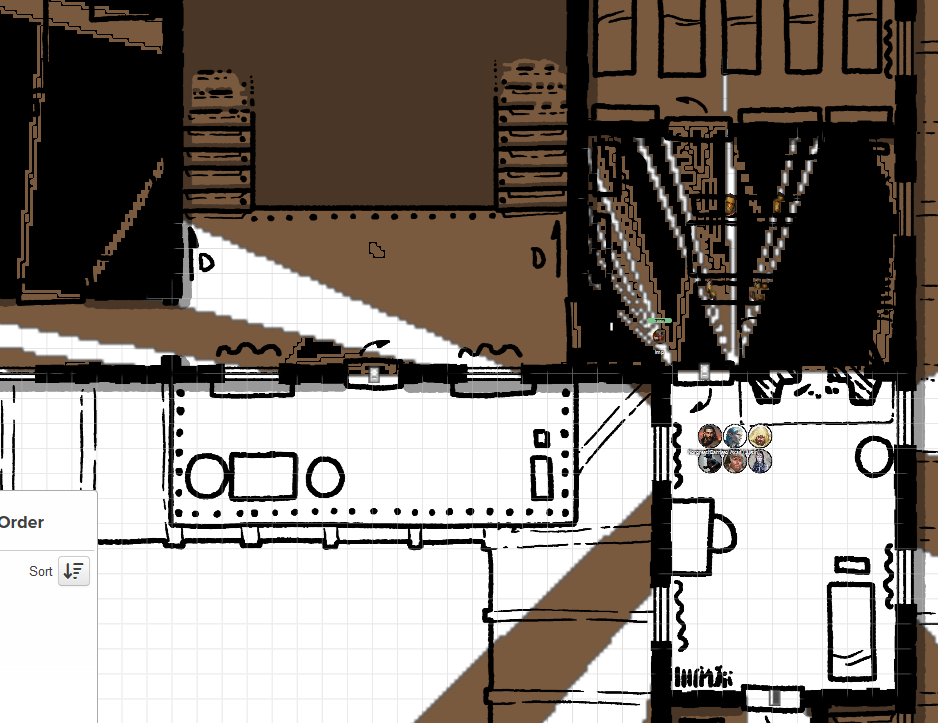

# 12 Nov 2025

**[Previously](2025-11-05.md):** The party are seeking the first element of the key for the Tyrant of War vehicle on the plane of Tevaeral. The group travels by river toward the coastal city of Cardaeram, where they plan to find Tycho, the leader of the Doombringers. Since we are not blue-skinned like the locals, Galen has used a Hat of Disguise on himself while the rest hide inside Norgreath’s magic ring. After a long journey, Galen left the crew who brought us near the city and hired a local boatwoman to take him the rest of the way to the city. In Cardaeram, he explored and found an abandoned guild-house by the sea, which Taq scouted and confirmed to be empty. The group moved in to use it as a base. Lunghiss, casting Disguise Self and Invisibility to stay hidden, explored the city and discovered a guarded island with rich villas and soldiers at whose centre is a fortress: possibly Tycho's base. Once Lunghiss returned to the party, Taq investigated the fortress there, finding military officers, maps, weapons, and dungeons holding prisoners deep below.

---

Taq returns to our base, the guild-house. Our plan: Galen will wear the Hat of Disguise, and travel to within 1,000 feet of the fortress to cast Locate Object. Lunghiss will cast Invisibility on himself and Barrisso, who will escort Galen in case of trouble. 

Galen walks to the larger of the islands, west of the targeted fortress. He walks to a point where he can cast the spell that targets the large island, small island, and a star-shaped fortress on the mainland. Both Barrisso and Lunghiss are invisible escorting him. 

Galen casts Locate Object, seeking the Dragon Doom. The location appears to him: it's not in the fortress on the small island, but in a building on the large island, above our heads. 

Barrisso, who is currently invisible and can fly, soars into the air and checks the building. It resembles a 2-storey manor house with a verandah on the street on the NE side. Barrisso tries to look in all the windows. He finds most have curtains drawn - even during the day. Barrisso sees some well-armoured figures in the building.

--

The entire party returns to the building in Norgreath's ring. Lunghiss opens the main door, then checks the next one: he hears multiple people behind it - 8 armed soldiers, it seems.

<figure markdown>
  { width="300" }
  <figcaption>Manor House</figcaption>
</figure>

To our west is a window which leads us to the balcony, which would bypass the soldiers. But we step into the room with them. They jump to their feet and shout at the non-blue-skinned beings. 	

Barrisso tries to intimidate them, and they cower backwards.

"WHERE IS TYCHO?"

"He's over on the other side, in his council."

"Go to your dormitory, and lock the door."

They enter the dormitory with their sleeping colleagues. Lunghiss casts Major Image on the doorway: they will perceive the doorway to be on fire. 

We travel west to two staircases leading up. We continue pass those and Lunghiss listens at a door. Hearing nothing, we enter into a well-appointed bedroom. 

We continue onwards and open the next door. There is someone in this small room, in plate armour wielding a greatsword. Barrisso intimidates them but they start shouting "INTRUDERS! INTRUDERS!". 

Barrisso attacks with his scimitar and shortsword, doing 26 HP.

Lunghiss casts Shadow Blade and attacks with Booming Blade, Savage Attacker, and Sneak Attack, doing 43HP, plus 5 of thunder damage if they move.

Norgreath moves in and casts Eldritch Blast with Agonizing Blast, doing 43HP of damage.

Karthis casts Haste on Gralok.

Galen attacks with his mace, doing 19HP.

Gralok attacks with his claws, finishing him, then readies himself at the door for more enemies.

A woman in armour arrives at the door to investigate what is going on.

Barrisso attacks her but misses.

Lunghiss attacks with Booming Blade, Savage Attacker, and Sneak Attack, doing 42HP, plus 10 of thunder damage if they move.

Karthis hears a male voice says "Defensive position beta!".

Norgreath casts Eldritch Blast with Agonizing Blast, doing 30HP points of damage.

Karthis stays in cover, watching the door at the end of the corridor, and casts Crown of Stars, doing 16HP of damage.

Gralok attack with his claws, doing 25HP of damage.

The female warrior attacks Barrisso with her greatsword, but misses. Gralok uses his reaction to attack but misses. The warrior attacks Gralok, but misses.

---

Barrisso attacks with scimitar and shortsword, doing 46HP of damage, finishing her off.

We hear the stomping of feet up the stairs. A lot of feet.

Lunghiss moves out of the room and readies an attack.

Norgreath holds his action to attack the first enemy he sees.

Karthis casts Fireball down the corridor at the approaching troops, doing a max of 48HP of fire damage.

Karthis uses his Crown of Stars to make a ranged attack on the nearest enemy, doing 28HP of damage, killing him.

Gralok attacks with his handaxe.

Galen casts Spirit Guardians.

---

Lunghiss attacks, doing 20HP of damage, killing the enemy.

Barrisso, at the other end of corridor to the west, can hear a conversation happening between two people. He hears the word "time".

Norgreath casts Synaptic Static, doing 37HP of psychic damage: he kills 10 of the party, leaving only three alive.

Karthis casts Magic Missile at the remaining opponents, wiping them out.

Gralok runs to the door to the west: it's locked, so Gralok attacks the ground in front of the door with his maul, crushing the ground and smashing the bottom of the door. Two men behind the door fall back, and [we see a third behind them.....](2025-11-26.md)

