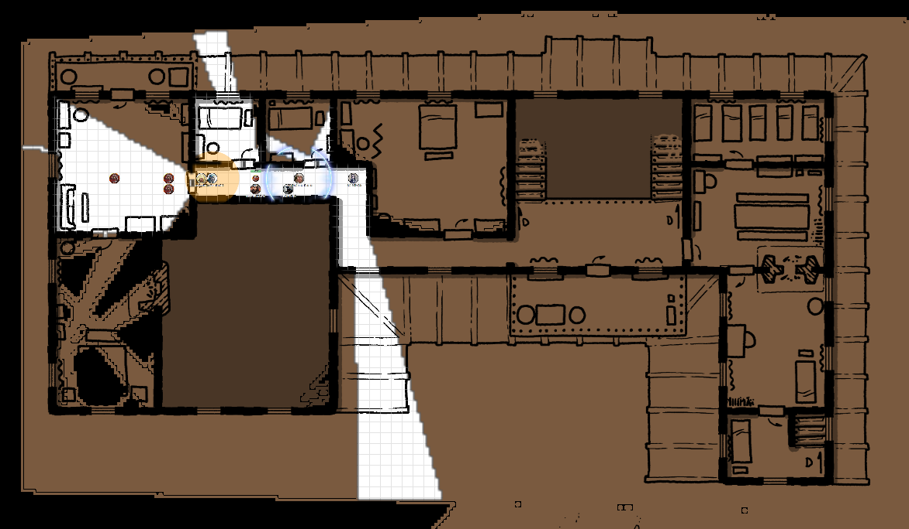

# 26 Nov 2025

**[Previously](2025-11-12.md):** The party has traced the first element of the Tyrant of War’s key to the island of Cardaeram. Using disguises and invisibility to blend among the blue-skinned locals, we established an abandoned seaside guild-house as our base. Galen’s Locate Object spell revealed that the relic lies not within the fortified small-island citadel, but inside a manor on the larger island. After confirming armed occupants within, the group infiltrated the manor, confronting soldiers and cutting a path through its defenders. Initial intimidation scattered one squad, but deeper inside we engaged heavily armed guards. A rapid series of coordinated attacks - shadow blades, eldritch blasts, fireballs, and melee assaults - felled multiple foes as reinforcements poured in. We finished off the responding troops, Gralok shattered a barricaded doorway with his maul, and now we stand poised before three remaining figures deeper within the manor.

---

<figure markdown>
  { width="300" }
  <figcaption>Cardaeram Manor House</figcaption>
</figure>

Three Champion fighters inside the room turn to face us.

Galen casts Sacred Flame at one, doing 13HP of damage.

The enemy at the back unpacks his bow, and fires an arrow at Gralok, lightly wounding him (3HP), then withdraws to a defensive position behind a table.

A female opponent closer to us fires her shortbow at Galen, wounding him (11HP). She also withdraws towards a faraway door.

Taq guards our rear.

The enemy nearest the door moves towards us and fires his bow at Barrisso, but misses. He also retreats towards his compatriots.

Barrisso enters the room and, flying in front of them, displaying his wings, tries to intimidate them: "BY THE POWER OF THE GODS, SURRENDER."

The three opponents look up at him and call out "TYCHO! WE HAVE A FLYING ANGEL IN HERE! TIME TO HELP US!" They don't seem to be intimidated.

Lunghiss casts Mind Sliver on one of the enemy, but can sense it has no effect. They seem to have an anti-magic effect, perhaps from Tycho. He uses Dash to move back out of range of their arrows.

The door to the south of the enemies opens. Out comes a 7-feet-tall blue-skinned humanoid, with a greatsword, bow, and plate mail. On a chain on its breastplate is a circular greenish-black stone.

It approaches Barrisso. Barrisso in turn falls to the ground. The creature attacks him with, grievously wounding him (38HP). 

"BE BANISHED FROM THIS PLACE! YOUR KIND HAVE NO PLACE HERE ANYMORE!" he cries.

Another creature appears at the open door and looses a series of crossbow bolts at Barrisso: they do they poison damage as well. A flurry of bolts take Barrisso down.

Norgreath moves towards the end of the corridor and casts Eldritch Blast with Agonizing Blast at Tycho. The attack flies into the room: then stops a good 15 feet before him. Norgreath movies into the room to target the assassin, but as he steps through the door, a hidden enemy uses his prepared action to jump forward and attack with his shortsword. He strikes but misses. Norgreath notices that his blade is coated with poison. Norgreath retreats into the corridor.

Karthis moves and casts Fireball towards a location he can damage Norgreath's attacker. However, we see him leap and contort himself (like a rogue) and he lands on his feet completely unharmed.

Gralok, in Form of the Beast, attacks with his claws, doing 14HP of damage.

Galen casts Power Word Fortify on Gralok and Norgreath, giving them 60 temporary hit points each.

It's now our opponents' turn. One moves towards us and looses an arrow at Galen, wounding him (16HP). His Spirit Guardians dissipate. 

A second enemy joins his companion and fires at Gralok with his shortbow, wounding him (17HP).

The Tycho shouts out "Torvan: attack the guy beside our assassin!". Torvan gets a second attack but misses.

The assassin, Evano, in front of Gralok attacks, doing 27HP of damage. He then retreats.

The last armoured opponent moves up and targets Gralok, but misses.

Barrisso makes a successful death save.

Tycho fires his shortbow at Gralok, slightly wounding him (7HP).

Lunghiss casts Shadow Blade and moves to attack. But as he does, his blade dissipates.

Tycho moves in and swings his greatsword at Gralok, doing 20HP slashing damage.

The enemy assassin fires crossbow bolts at Gralok, physically injuring him and poisoning him. 

Norgreath feels terrible, and notices he can no longer talk to Taq in his head, and his Shadow of Moil has disappeared.

Norgreath casts Thunder Step and lands beside Barrisso, outside of Tycho's zone of anti-magic.

Karthis casts a mote down the corridor at Tycho, but it disappears. He casts Toll the Dead on the assassin. 

Gralok uses his axe on Tycho, doing 21HP of damage.

Galen casts Healing on Barrisso, giving him 70HP of healing. Barrisso decides the best course of action is to play dead for now.

Tycho calls to Isolde his companion: "Shoot that teleporting creature!". 

Isolde turns and fires her bow at Norgreath, wounding him (23HP).

Torvan also aims at Norgreath, doing 48HP of damage.

Isolde notices that Barrisso is no longer dying, but targets Norgreath, wounding him.

Isolde calls to Evano: "Take out the flying creature! He is not dying anymore!". Evano darts forward to attack Barrisso, taking him down to 39HP.

Another enemy fires an arrow at Gralok, doing 17HP to Gralok.

Barrisso stands up and moves beside the assassin, and attacks Tycho with his weapons, wounding him.

Tycho calls to Evano, "Strike him down!". He does so, wounding Barrisso.

Lunghiss moves and does a sneak attack with his silvered rapier, doing 37HP of damage, and then disengages and moves.

Tycho attacks Gralok, wounding him.

The crossbow assassin attacks Gralok, doing 28HP of damage.

Norgreath casts Eldritch Blast with Agonizing Blast at an enemy he thinks is outside Tycho's anti-magic zone, wounding him.

Gralok attacks Tycho with his greataxe, doing a huge amount of damage. But Tycho does not look bloodied.

Tycho calls to an ally, who fires his light crossbow at Gralok, felling Gralok. 

Galen casts Flame Strike at an enemy he hopes is outside Tycho's protective aura, doing some damage.

Torvan moves and attacks Barrisso, felling him.

Isolde moves beyond Gralok and fires her shortbow, doing 15HP of damage.

Ivano stays where he is.

The enemy who has been flame-striked moves besides Tycho, and [fires his shortbow at Karthis, doing 27HP of damage....](2025-12-04.md)
