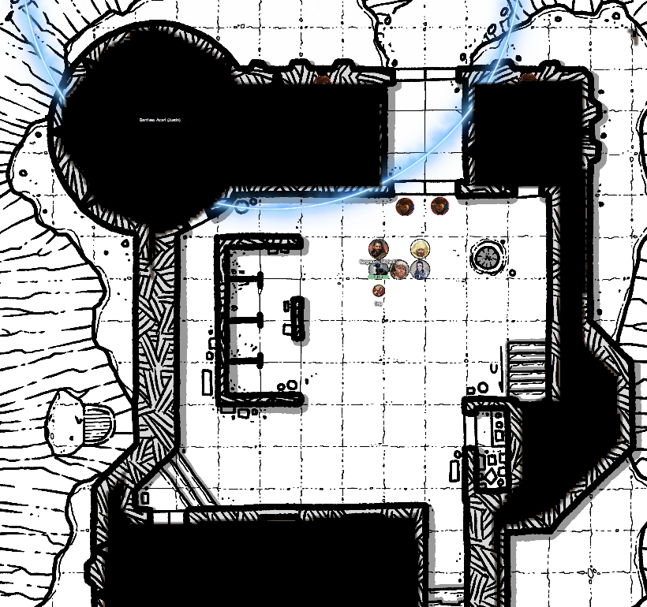

# 21 Jan 2026

**[Previously](../2025/2025-12-18.md):** After a disastrous attempt to attack Tycho in his fort on Cardaeram, the party retrieved the heads of Barrisso and Gralok and resurrected them. Our magic user helper, Crom Picket, has given us food, drink, and equipment, and we have planned a second attack on Tycho. However, Tycho and his followers have already set off towards the valley which is the last redoubt of the magic users. Taq alerted us to a guard assault on our hideout, and we escaped. After some rest, we eventually made our way to the valley. We land at the keep and distribute poisons given to us by Crom among our party and the archers there, advising the magic users that Tycho and his followers will have immunity to magic if close to him. 

---

The party are prepared and ready on the battlements of the keep:

<figure markdown>
  { width="200" }
  <figcaption>Valley Keep</figcaption>
</figure>

Each of us have six poisoned arrows: three with wyvern poison, three with serpent venom.  

The enemy phalanx approaches the keep from the south-west, with Tycho at its centre, shielding everyone from magical attacks. They have their shields held over their heads as they round the keep, coming towards its north gate. They seem to be carrying a battering ram. 

As they reach the gate, we point out to the archers that Tycho, in the middle of the group, is the main target. They loose off six attacks. The second attack is a critical. Cora Bentbow, the second attacker, gets one hit. The third attacker misses. Tycho takes 40HP of damage.

Karthis casts a spell at the anti-magic amulet, Dragon Doom, which Tycho wears around his neck. The spell is Dispel Magic. However, nothing happens.

Two of our allies on the lower level of the keep fire their bows thru slits at the enemy. But they are unskilled archers and both miss.

Lunghiss does a sneak attack from hiding with his shortbow, doing 44HP of damage (as Tycho saves against the wyvern poison).

Norgreath uses a Limited Wish to cast Call Lightning at 6th level, doing 40HP (20HP to those who save, including Tycho) to the group of opponents.

Gralok fires his longbow but misses; with inspiration, he hits, doing 20HP of damage to Tycho. 

Tycho and his party move towards the gate and bash it with their battering ram. Taq sends a message to Norgreath "They may get through that door soon! *(in the next round or after)*".

Tycho encourages his party to do an extra attack with the battering ram - this second attack is successful, and they might only need one more attack to break their way into the keep. The whole party also changes position in synchronisation.

Barrisso flies up and fires his longbow at Tycho: the two attacks hit, doing 48HP of damage. He then returns to the battlements.

Galen casts Bless on the three archers, then fires his crossbow at Tycho, but misses.

---

Our archers, now blessed, fire at Tycho. Two attacks hit, doing 56HP of damage.

Karthis casts Haste on Jim. 

Lunghiss fires his shortbow: with sneak attack damage, he does 45HP of damage, killing Tycho.

Norgreath calls down more lightning, doing 18HP of damage to those affected.

Gralok fires his longbow and hits, doing 57HP of damage.

Barrisso fires his longbow against the enemy assassin, doing 33HP of damage. 

Galen casts Flame Strike into the middle of the enemy position. However, it stops above the enemy. Tycho's Dragon Doom is still active.

The enemy use their battering ram to finishing breaking down the gate. We can see they are carrying the corpse of Tycho with them, so can still be inside the anti-magic zone of his amulet.

Our archers on the battlements cannot fire as they have no targets.

Karthis continues concentrating on his Haste spell.

Our allies on the ground attack the enemy coming in. Meanwhile, others pour boiling oil down onto them. 

Lunghiss dashes down to the murder hole and throws a flask of Alchemist's Fire down to the oil-soaked attackers. It ignites the pool of oil they are standing in and burns intensely. 

Norgreath flies down to the courtyard and puts some spikes in front of the doors into the courtyard, to barricade our opponents into the murder hole area.

Gralok readies an attack.

Barrisso flies and fire his longbow at the enemy thief (the enemy assassin has died in the fire). [His bowstring snaps!](2026-01-28.md)
