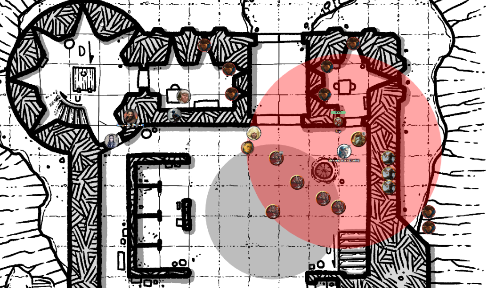

# 4 Feb 2026

**[Previously](2026-01-28.md):** The party returned to the valley, where the hunted magic users are making their last stand, to aid them in the assault against them by Tycho and his army. We have killed Tycho, but his army his comrades are still availing of the anti-magic protection of his amulet. A ferocious battle ensued, with the army breaking their way through the front gate and the inner gate into the keep's courtyard. One of Tycho's champions the poured a strange liquid into his mouth, which revived Tycho as a revenant. Some of his own side have fled at the sight of this evil magic. Tycho's champions hammered Barrisso with multiple attacks, downing him. Galen casts Banishment and made Tycho disappear. After that, his allies concentrated to Karthis, felling him as well. Fortunately he makes a critical death save and is alive (with 1HP).

---

<figure markdown>
  { width="400" }
  <figcaption>Valley Battle</figcaption>
</figure>

Lunghiss does a bow sneak attack (using a poisoned serpent venom arrow) on the champion with Tycho's Dragon Doom amulet at his feet (inside the anti-magic zone in grey above). With inspiration, his hit does 33HP, killing him.

Norgreath holds his action: to attack the weakest champion with Eldritch Blast.

Gralok attacks the opponent beside him with his claws, killing him. As he moves to attack the next opponent, he moves into the Dragon Doom's anti-magic zone. The opponents left are the four champions (and Tycho, is he returns from his banishment).

Taq snatches the Dragon Doom and carries it away into a nearby stable to hide.

Norgreath casts his Eldritch Blast (with Agonizing Blast), with the first with Genie's Wrath (Cold damage) against Torven. The 30HP of damage kills him.

Barrisso makes a successful death save.

Galen casts Mass Healing Word, giving everyone 14HP of healing back.

Barrisso, who is back to life, plays dead, with one level of exhaustion.

Galen then casts Toll the Dead on Isolde: she takes 24HP of damage.

Now our archers attack. Unfortunately only one of them make a successful hit.

It's now Tycho's remaining champions' turn to retaliate.

The first champion runs into cover behind the stable, where he think he cannot be hit by arrows.

The second does the same.

Isolde, too, follows.

---

Karthis is casting Fireball only once Taq has moved and removed the anti-magic zone from around the champions.

Lunghiss jumps from the parapets onto the stable (Acrobatics), does a bow sneak attack (with poison) and does 37 damage to Isolde.

Norgreath casts Synaptic Static only once Taq has moved.

Gralok moves towards the champions but stays out of the range of Karthis' Fireball. He throws a javelin and hits, doing 8HP of damage.

Taq flies to the west over the keep's parapet. The champions are no longer in the anti-magic zone of the Dragon Doom amulet.

Karthis's Fireball hits them, doing 30HP of fire damage. Isolde dies, while the other two survive but take the full force of the blast. Karthis uses Power Surge to add another 7HP of damage to one champion. 

Norgreath's Synaptic Static envelopes the champions, doing 28HP of psychic damage and affecting their ability to attack and to save.

Barrisso heals himself and moves up onto the battlements.

Galen is still concentrating on the banishment of Tycho. He casts Cure Wounds on Karthis, doing 15HP of healing.

Our archers cannot see the champions, who are out of sight behind the stables. They move around the battlements and attack. One does 5HP of damage, the second does 15HP of damage, the last kills one champion and wounds another.

The remaining champion has lost all his allies and the protection of the Dragon Doom. He runs towards the gateway. Some of our allies try to hit him: one hits, doing 17HP of damage.

---

Karthis moves and casts Fireball at him; the champion saves, so it only does 14HP of damage.

From atop the stables, Lunghiss fires an arrow into the champion's retreating back: his sneak attack (35HP) finishes the champion off.

Norgreath casts Speak with Dead on his corpse. 

"What potion did you use to revive your master, Tycho?"

Using great persuasion, Norgreath gets him to answer: "The potion that he told us to give him."

"Do you know what it did?"

"No, not in detail."

"But you did know to give it outside the magic zone?"

"Yes."

"What was your master's greatest weakness?"

"Pride."

"Do you believe in an afterlife?"

"I hope so."

"Rest in peace."

---

Barrisso casts Magic Circle at the spot where we expect Tycho, the now revenant, will return.

Lunghiss casts Mage Hand.

The archers are ordered to hold.

Tycho returns from his banishment.

Karthis casts Fire Bolt: with inspiration, he does 20HP of damage.

Lunghiss distracts Tycho with his mage hand (Versatile Trickster) and gives himself advantage. He then does a sneak attack with Lathander's Radiant Blade, using Booming Blade and Savage Attacker. He does 35HP of damage - plus 13HP thunder damage if he subsequently moves. 

Norgreath calls: "What sort of creature are you?". There's no answer. Lunghiss *(Insight)* cannot determine if he still retains intelligence.

Norgreath casts his Eldritch Blast (with Agonizing Blast), with the first with Genie's Wrath (Cold damage), doing 36HP of damage.

Tycho glares at Norgreath in a vengeful way. *(Norgreath does a Wisdom save from whatever would have happened.)*

Gralok attacks with his claws, doing three hits. Tycho falls - this time, hopefully for good.

Barrisso attacks the body with his shortsword. With Divine Smite, he does 30HP of radiant damage.

We wait for Tycho to make a move. But it does not move or regenerate, and simply turns to ash.

---

We search the bodies and find 197GP, 5 gemstones (each worth 50GP), several backpacks with normal equipments, two scroll tubes: one held by Torven, one by Isolde. The first scroll talks about what we think are various kingdoms in this world, and where the Unity has forces, outlining a strategy of who from the Unity would rule each kingdom. The second scroll is a diary, with Tycho telling Isolde: *"The book told Daeral of the Heaun the method of crafting the Dragon Doom"*. This seems to refer to the sentient book [we met earlier](../2025/2025-10-08.md).

Securing the broken gate of the keep as best we can, we take a long rest at this point.

**The party goes up to level 15.**

---

We arrange a meeting with Maon (the leader of the spellcaster, and who seems to own the sentient book) and Real (the last dragon), both of whom we first met [when we arrived here in Tevaeral](../2025/2025-10-02.md). Maon takes the sentient book and puts it in its usual stand. We leave and go outside with them.

Barrisso says: "We have recovered the Dragon Doom and dealt with Tycho. However, you need to see this information we obtained from one of his champions." We show them the scroll that details Tycho's plan and the book's duplicity.

After reading a few moments, Maon stops and turns her head to Barrisso. "What?"

"This is a surprise, is it not?"

"It is."

"What does the book gain from this?"

"I... I really don't know."

"Is there only one book it could be referring to?"

"I only know of this one. The trust that we have placed in it - is it all misplaced?"

She tells us that Daeral of the Heaun is a figure from ancient history. The Heaun were a tribe of magic-users that lived far to the east, across the sea. Daeral was a great mage of their tribe. Maon remembers that Daeral fought a dragon in the past. 

We ask Real his opinion. "I want to unmake the Dragon Doom."

Perhaps the book helped create the Dragon Doom to defeat the dragons but that led to unintended consequences. [We need to talk to the book...](2026-02-11.md)

