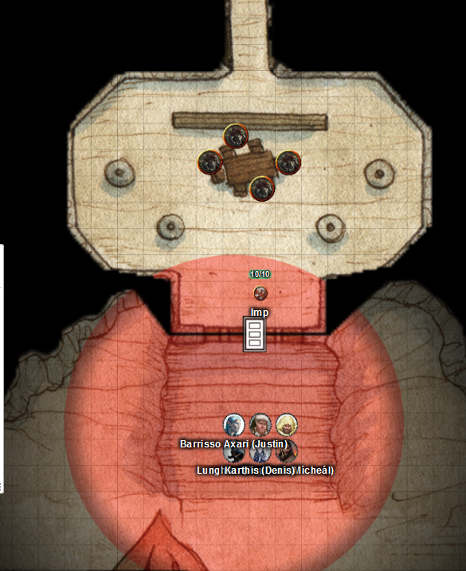
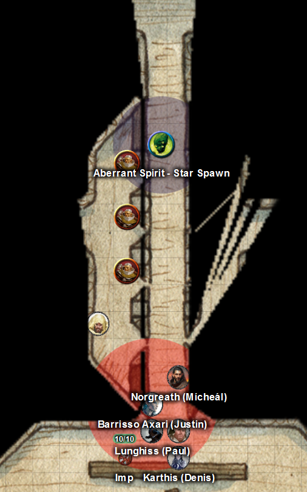

# 18 Feb 2026

**[Previously](2026-02-11.md):** The party repelled Tycho's on the keep of the hunted magic users. But in doing so, found a diary, with Tycho telling Isolde: *"The book told Daeral of the Heaun the method of crafting the Dragon Doom"* We confronted the sentient book which Maon, head of the magic users consults. He told us that the Dragon Doom is a shard of something called the petrified Heart of the Giant. The petrified corpse of the giant, named Xeluan, is in a cavern in the hills near the keep, frozen in his final act of saving the world from an immense eruption. Maon was upset to learn that Daeral of the Heaun, who wrote the credo of the Unity, is in any way linked to the book or this artifact. Before we set out for the hills, the magic users gave us gifts of equipment and magic books, from which Karthis learns some new spells. We then travelled back to the city to retrieve Gralok and Barrisso's weapons and equipment. Girded once more, we get ready to set out to the hills and ask Maon to accompany us....

---

Maon replies "No - I have to stay here with my people. But I will send Oswin here, a mage, to help you."

Oswin says "We will head now to the crater from where we can access to the cavern."

---

We climb from the valley of the keep, following the river. The ground rises towards the crater, which we have visited before. Half a day's walk takes us to the crater, where we can see the Star Forge on an island in the middle of its lake.

Oswin takes us eastwards around the rim of the crater. Around the rim is a stony path, descending in a zig-zag manner to the saddle between the crater and the next peak.

We continue on to the saddle - beyond there is what looks like an unguarded natural entrance into a cavern in the mountain. Inside is what looks like a hand-fashioned tunnel of limestone descending into the mountain, covered in fungal growth. We enter.

The tunnel we are in is obviously artificial and of an even width and height all the way.

We ask Oswin, "Does this lead to Xeluan?"

"It does."

We start noticing there are non-magical lit torches in brackets on the walls every 15 feet.

"Oswin, who is here?"

"The miners."

After 200 feet from the exterior, we see steps leading up to a pair of massive black iron doors, solidly closed. Each door has half a face embossed on it. The face reminds us of the one on the sentient book, but isn't the same *(Perception)*. The face seems to show deep pain.

"What is this door all about, Oswin?"

"It is rumoured to show the face of Xeluan."

"What is beyond these doors?"

"Xeluan's form remains inside. I will leave you here as I believe beyond these doors are dangerous bandits and ne'er-do-wells who seek to profit from the form of Xeluan. Goodbye."

---

Lunghiss checks the doors carefully. He can see that the doors are barred from behind. Norgreath sends Taq through to check the bars. The bars seem to be heavy enough to take two humans on either side to lift. There are torches, and tables and chairs in front of a vertical slab of granite. The slab displays carvings. In front of it are four men-at-arms sitting at a table, chatting nonchalantly.

<figure markdown>
  { width="400" }
  <figcaption>Cavern Doors</figcaption>
</figure>

Taq moves past the table and continues on down the corridor behind. He sees more guards on the left-hand side.

We decide to enter the area in Norgreath's ring while he sets up a distraction.

Norgreath orders Taq to stay under the door to use his sight, while he casts Summon Aberration. He brings a Star Spawn into being right on the table where the men-at-arms are sitting. Its Whispering Aura does 8HP of psychic damage to each of them.

The Star Spawn then performs a Psychic Slam on one, doing 16HP of psychic damage. His second such attack misses.

Gralok holds his action until we leave Norgreath's ring.

The four panicked men-at-arms inside attempt to attack the aberration, but only one lands a blow.

Lunghiss holds his action to perform a sneak attack.

Karthis holds his action to cast Fire Bolt.

Galen hold his action casts Toll the Dead.

Barrisso casts Dimension Door, bringing Gralok with him into the chamber. They then attempt to lift one of the two bars blocking the door. They succeed.

---

Norgreath keeps concentrating on his spell, and sends his Star Spawn over to help Barrisso and Gralok unbar the door. The Star Spawn does more damage to the surrounding foes.

The Star Spawn and Gralok lift the remaining bar from the door and the rest of the party can enter and attack.

Two of the enemies attack Gralok, damaging him. The other two chase after the Star Spawn and attack it, but miss. Gralok gets a chance to attack a passing enemy, doing 13HP of damage.

Taq opens the unbarred doors.

Lunghiss does a sneak attack with his Lathander's Radiant Blade, using Booming Blade and Savage Attacker, on the enemy beside Gralok, killing him instantly.

Karthis steps inside and casts Fire Bolt, doing 16HP of an enemy. He uses Power Surge on him to finish him off.

Norgreath casts Eldritch Blast with Agonizing Blast and Genie's Wrath three times, doing 29HP of damage.

Galen casts Toll the Dead on the enemy just injured, doing 31HP of necrotic damage: he's dead too. One enemy remains.

Barrisso attacks with scimitar; using Divine Smite he does 35HP of damage, killing the final man-at-arms in the chamber.

---

We search the bodies and take whatever coins we find.

Norgreath sends the Star Spawn north along a corridor to where Taq saw other militia earlier. The militia are in cover behind arrow slits. Two of them fire crossbow bolts at the aberration, slightly wounding it.

The Star Spawn's Whispering Aura does 12HP of psychic damage to the surrounding attackers.

The Star Spawn then attacks with a Psychic Slam, doing 13HP of psychic damage. It then moves further down the corridor.

Gralok attacks the wall around the arrow slits with Raggadragga's Maul, opening a fissure through it. Gralok then moves in and attacks an enemy, killing him instantly.

<figure markdown>
  { width="400" }
  <figcaption>Cavern Arrow Slits</figcaption>
</figure>

Norgreath casts Eldritch Blast with Agonizing Blast and Genie's Wrath, doing 19HP of damage, killing another opponent. His next attack does 11HP of damage to another.

Lunghiss moves and attack the enemy beside the Star Spawn: his sneak attack kills him.

Karthis casts (with inspiration), a Fire Bolt, doing 32HP of fire damage, killing the last opponent.

---

In this area where the crossbowmen were hiding, we find a secret door to the west. Lunghiss checks the door for traps. We open it to find a small room with four dilapidated altars. The two to the north seem to be associated with tools or crafting. One to the south is a skeleton in finery, while the other is a large disk. They look like they have not been cleaned or used in a long time.

Norgreath sends Taq down to the corridor. At the end if a large room filled with bedrolls. Four of them are occupied by sleeping inhabitants.

Beyond them is a corridor leading west to east, with five doors off it to the south.

Lunghiss moves into the room and dispatches the inhabitants, quite ruthlessly.

Back in the corridor we check the door to the south. There is a shaft behind it, seemingly just for ventilation. The door cannot be picked, so Gralok attacks it with his Raggadragga's Maul breaks the grate in front of it. Inside a 20-feet-wide vertical shaft of limestone leads upwards, with no visible handholds or ladder.

Taq soars up the shaft to find a natural cave, which leads to open air. To get to the natural cave from outside would require some serious rock-climbing skills.

We return to the corridor with five doors. Each is locked. Lunghiss unlocks them one by one, west to east.

Each room has walls lined with timber, containing a cot, an old lamp hanging from the ceiling, [and is unoccupied...](2026-02-18.md)
