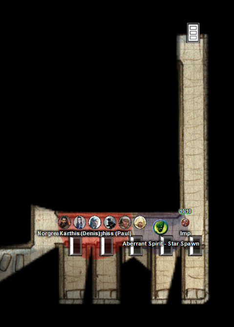
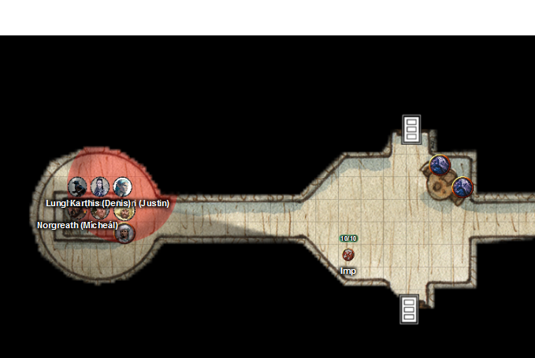
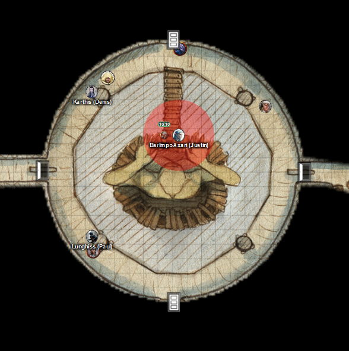

# 25 Feb 2026

**[Previously](2026-02-18.md):** Maon's sentient book told us that the Dragon Doom is a shard of the petrified Heart of the Giant, Xeluan, whose corpse is located in a cavern in the hills near the keep. We set out to the hills with Oswin, a mage, accompanying us. Near the crater that holds the Star Forge, we entered a crafted tunnel that ends in massive black iron doors. We entered through the doors using Norgreath's ring and attacked men-at-arms that are guarding the entrance. We explored the cave system further, defeating some bowmen who have set themselves up behind arrow slits looking out onto a corridor, and also killing what perhaps are just poor miners. We are currently checking what seem to be a series of monastic cells...

---
 
<figure markdown>
  { width="400" }
  <figcaption>Cavern Cells</figcaption>
</figure>

We move northwards and see another corridor, also running east-west, with cells similar to the ones we just saw. The party hears noise coming from the chamber in the middle of the corridors we just traversed: conversation and laughter. 

Lunghiss checks the cells and finds they all have someone inside, sleeping. Lunghiss unlocks one of the doors. There's a guy in bed asleep; the room contains an oil lamp, and his weapons stacked against the walls. Barrisso tried to stealthily pick up the weapons, but he trips up and drops them noisily. 

Lunghiss moves in and casts Hypnotic Pattern. Our woken sleeping beauty is now incapacitated. 
Galen asks the charmed guy for the key to his cell, but he looks suspiciously at him. "We've been told to look after our keys."

Galen takes the guy's belongings and brings them out to the corridor.

Karthis casts Fire Bolt at him. He's now singed, damaged, and entirely conscious.

Gralok tries to attack him. But walking into Lunghiss' Hypnotic Pattern field, he accidentally dazes and confuses himself.

---

Lunghiss casts Mage Hand, which he uses to give himself advantage on a sneak attack. He pulls his attack to make it non-lethal. The guy he previously charmed is now out cold.

Barrisso gets the cell key from the guy's unconscious body. We leave the room and unlock the door.

Norgreath and Karthis both wait.

Gralok listens at the next door, but does not hear anything.

Lunghiss does not hear any sleeping sounds from the next room. Instead, he hears what sounds like someone trying to hold their breath. He alerts the rest of the party.

Galen holds his action.

Barrisso moves to the second cell door and listens. He doesn't hear anything.

Norgreath keeps watch on the corridors.

Karthis holds an action to casts Fire Bolt.

Gralok waits beside the door where Lunghiss heard someone breathing.

---

Lunghiss unlocks the door.

Galen casts Sacred Flame at the now-armoured guy inside the cell, doing 14HP of radiant damage.

Barrisso moves on to another door and listens. He hears someone sleeping heavily.

Norgreath moves to the open door and casts Eldritch Blast with Agonizing Blast and Genie's Wrath twice, killing him.

----

Lunghiss unlocks another door to find someone asleep.

Galen moves into the room and attacks with his marble mace, doing 3HP of damage.

The guy attacks Galen, injuring him.

Karthis attacks with a Fire Bolt, damaging him but not killing him.

---

Lunghiss opens another door to find someone else fast asleep.

Karthis targets the sleeping guy with Fire Bolt. It does 25HP of damage and wakes him up.

Gralok swings his great-axe and he kills him.

There are two other rooms. Gralok waits outside one of them.

Lunghiss opens the remaining door. A sleeping man lies there in a cot.

Galen takes his weapons.

Karthis casts Fire Bolt at him, doing 15HP of damage.

Gralok finishes him off with two axe strikes.

There’s one man alive but unconscious. We leave the other armour and weapons, and lock the door.

We open the door to the large room between the corridors. Inside it resembles a bar. At one table, four ruffians in leather armour are playing cards.

In the south of the room, there’s a bar, and two more heavily armoured men are eating and talking with the barman.

Lunghiss gets a sneak attack on one of the two heavily armoured men to the south. He does 47HP of damage with additional Booming Blade damage if the target moves. He then retreats.

Norgreath’s summoned aberration moves to encircle the ruffians in its area of effect in the next turn. It does a Psychic Slam on one, hitting twice, for 18HP of damage.

Barrisso enters the room and and targets the same armoured man with scimitar attacks, killing him.

Galen casts Sunbeam on all the remaining targets (and the aberrant spirit). He kills the aberrant spirit outright, and injures the three ruffians at the table. One armoured guy and the barman also both take damage but are still alive. Everyone who is damaged is also blinded.

Karthis casts Poison Spray at the armoured guy at the bar, doing 14HP of damage.

A ruffian at the table spins around and attacks Galen, but misses.

Gralok moves to the far wall and attacks the ruffian who just attacked Galen. His second attack succeeds and kills him. That gives Gralok an extra attack, and he kills one of the ruffians at the table.

Norgreath enters, and kills the armoured guy and one of the remaining ruffians.

At this point in the chaos, the barman understandably surrenders.

The final ruffian is targeted by Lunghiss. He is blinded so doesn't see the attack coming, and drops dead.

---

Barrisso asks the barman, whose name is Brego: "So my good man, I have a few questions for you."

"You don't look like you're from around here?"

Barrisso unfurls his wings. "Really? Anyway, I have a few questions for you. How many men-at-arms are here?"

"About... twenty?"

"Is any of the Unity here?"

"No!"

"And where is Xeluan?"

"In the big central chamber?"

"How do we get there."

"You can use a gantry to get to either the upper or lower part."

"How many men-at-arms are in that chamber?"

"Normally it's only the workers."

"Are they slaves?"

"They are indentured slaves for Aminta. She is up in the council chamber with her lieutenants and the elf mage, who comes from across the sea."

"Would you like to join us as our guest?"

"I would!"

Lunghiss picks the lock on the other chamber and we head westwards inside. We find ourselves in a big room with weapon racks and a stone staircase leading upwards. There is also a door leading north.

"What is to the north?"

He seems to be scared, but tells Barrisso's that is the quarters of Edino, the elven mage.

Lunghiss checks the door for traps. There seems to be nothing that would damage us. However, there is a magical effect - perhaps one that would alert the mage? Barrisso detects the magic used is from the school of adjuration.

Norgreath casts Ghostly Gaze on the door. On the other side, there is a hulking figure which he thinks is a golem. The room contains two bookshelves, a bed, a table, and a desk. There seems to be no other person in the room. We decide to avoid the room until we meet the mage himself. He proceed upwards.

---

We arrive in a circular room with very old murals, depicting a giant, presumably Xeluan, at various stages of its life. A corridor leads east to a large room.

We ask Brego where the corridor goes.

"The door to the far east leads to the giant of the chamber. The council chamber is to the north of that."

Taq enters the next room: it displays murals showing people showing gratitude to the giant. At a table in the north-east corner are seated two identical blue-skinned women, wearing studded leather armour, playing cards. So far they have not seen us.

<figure markdown>
  { width="400" }
  <figcaption>Cavern Circular Room</figcaption>
</figure>

Barrisso enters the room and nonchalantly asks to see the mage. Brego is cowering in fear. The two women stand up and reach for their weapons. "You shouldn't be here...."

"Our business is with the mage. Stand aside and let us through."

"Well, if you must. The mage has his study through the door to the south."

"Or maybe in the council chamber?"

"Maybe."

Karthis checks the chamber where the giant is.

One of the women asks Barrisso, "Why do you want to go there?".

We ignore her and walk around the circumference of the chamber.

<figure markdown>
  { width="400" }
  <figcaption>Giant Chamber</figcaption>
</figure>

The chamber is an arched vault which contains the body of a giant. About 30 feet tall, its arms are bracing the ceiling of the vault. A hole in its chest shows an ebony heart with veins of gold. Scaffolding around the statue enables one to access it. Far below are miners using pickaxes to cut away the base of the statue, while others are gathering chunks of material into crates. There are no workers on our level: only down below.

At our level, the heart is accessible. Barrisso attempts to remove the Dragon Doom from its breastplate and put it back into the heart cavity. One of the ladies opens a door to the north - it looks like the council chamber - and runs inside, calling out two names: "Edino! Aminta!".

Lunghiss casts Invisibility and moves towards the council chamber.

Gralok also moves to the council chamber. He notices that another woman in the chamber looks like the "twins" we saw earlier. He closes the door to the chamber.

Karthis casts Haste on Gralok.

Barrisso removes the shard from the breastplate. 

Galen moves up to the council chamber door. 

Taq grabs the now non-magical breastplate and flies over to the southern wall.

---

Lunghiss holds an action to attack anything that comes through the door from the council chamber.

Opponents behind the council door attempt to force it open. Gralok pushes to keep it closed.

Barrisso pushes the shard from the breastplate into the heart of the giant and lets go. The shard is repelled back out, as if the heart is rejecting the shard. He tries again, holding the shard in.

Galen casts Stone Shape to hold the door to the council chamber shut. 

We hear a voice from the chamber: "You have held this door but we have many ways to get to you. Flee now or face your fate."

Norgreath uses a piton on the door to the west to hold it closed.

---

Lunghiss again holds an action to attack anyone coming from the chamber.

Those inside the chamber try again to shove the door open. They manage to crack the stone shape which Galen had cast.

Barrisso tries to hold the shard in the heart. He *(Arcana check)* thinks that a mystical force that shattered the heart in the first place. Applying such a force again would heal it, but he does not know what that might be...

