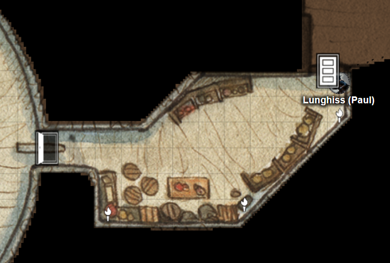
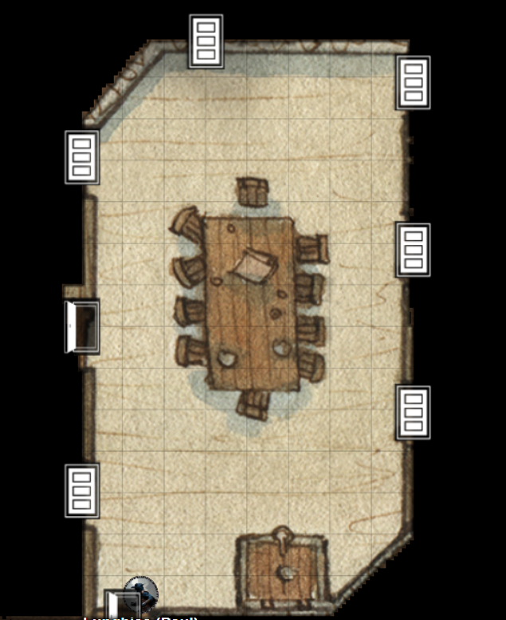
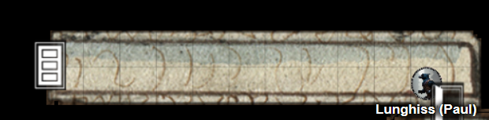
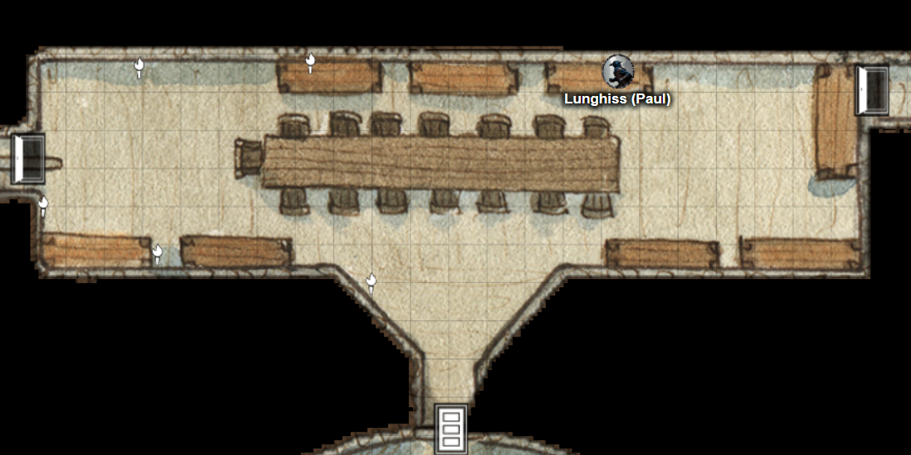
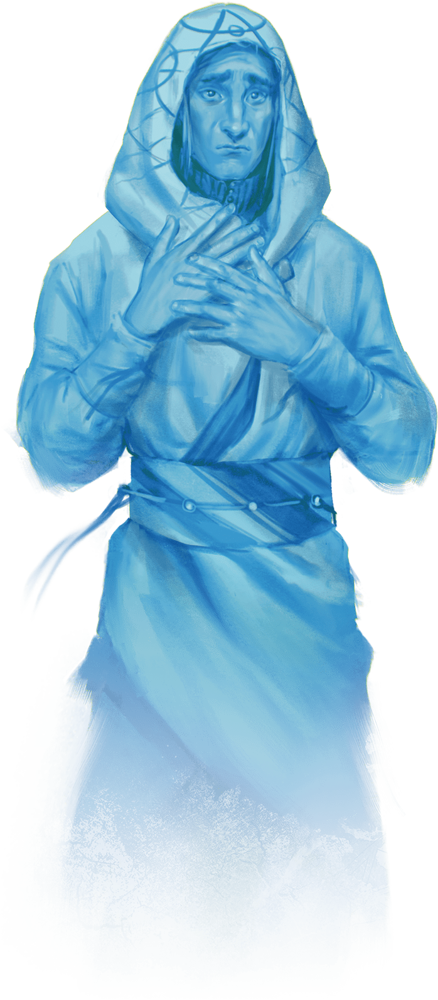

# 4 Mar 2026

**[Previously](2026-02-25.md):** Maon's sentient book told us that the Dragon Doom is a shard of the petrified Heart of the Giant, Xeluan, whose corpse is located in a cavern in the hills We found the cavern and engaged in battle with its residents - both miners, and men-at-arms guarding them.

---

Norgreath spikes the door to our south to hold it fast in case anyone tries to attack us from that direction.

Lunghiss holds his action to attack anyone coming out of the council chamber.

The second casting of Stone Shape by Galen is keeping the council chamber door firmly shut, so Gralok goes to the door to the east. It opens into a room with various boxes containing provisions such as cheeses and cured meats.

<figure markdown>
  { width="400" }
  <figcaption>Provisions Room</figcaption>
</figure>

He grabs some cheese and bread and returns to the main chamber.

Karthis holds his action.

Barrisso tells us the Dragon Doom shard is being rejected by the heart of the giant. He  thinks that a mystical force that shattered the heart in the first place. Applying such a force again would heal it, but he does not know what that might be.

Barrisso enters the provisions room and listens at the wooden door to its north. He notices a breeze circulating in the room. He tries to find its source with no luck. He opens the door to the north.

He finds himself in a torchlit chamber, hung with tapestries. As well as the doors Barrisso entered through, the room has three doors on either side, evenly spaced. A trapdoor with iron hinges and a pull ring is set into the floor.

<figure markdown>
  { width="400" }
  <figcaption>Trapdoor Room</figcaption>
</figure>

The tapestries depict three scenes:

1. An image of a giant  that looks injured being tended to by four figures: a warrior, a sage, a scout, a priest. Lines of lights emit from the giant’s chest.
2. An image of mountains collapsing. The four figures are ushering people into a chamber for safety. The giant has hands pressed against the ceiling of the chamber, holding its weight while the four heroes weave magic.
3. An obsidian heart in the chest of the giant glowing like a sun, with the four heroes placing their hands upon it.

We ask Brego the barman in. We ask him about the tapestries and the stories they seem to depict.

"The four people were the giant's followers."

"What spells were they casting?"

"Some kind of magic. We don’t talk about magic."

"How did they fortify him so he could support the weight of the collapsing mountain?"

"They cast Flesh to Stone."

Suddenly, Lunghiss says, "What's that over there?", pointing at the north wall. He has noticed a secret door.

We open it to find ourselves in a dusty corridor running east to west, that has not seen much recent passage.

<figure markdown>
  { width="400" }
  <figcaption>Dusty Corridor</figcaption>
</figure>

In the corridor are five murals:

1. The four heroes we saw in the tapestries are shown. Except, this time there is a ghostly visage over their faces. While in the tapestries, they looked stoic, in these murals they look smiling, scared, concerned (the priest), and a wild manic grin (the sage) respectively. Carved above the sage is an upside-down Jester image.
2.	This mural is similar to the tapestry showing the heart. However, a spectral image shows a fist striking the heart of the giant, leaving a crack of black smoke. Carved above that is the image of a rogue image (not upside down).
3.	This mural shows the four companions weaving their magic. However, this time a spectral tar-like substance leaks from their eyes. Each emanation looks like a tear that resembles Euryale (see image).
4.	This mural shows a dark hole in the giant’s chest, in which there is the image of a void (see image).
5.	The last panel shows the four companions with ghostly visages, pointing to bronze signet rings on their hands; each has the image of a world. Behind their hands is the face of a sage glowing with soft light (see image).

At the far west end of the corridor is another door. We open it to find ourselves in a narrow room we recognise as the council chamber:

<figure markdown>
  { width="400" }
  <figcaption>Council Chamber</figcaption>
</figure>

The long room contains a long table with an ornate throne-like chair at one end and smaller chairs along both sides. It holds pewter jugs of water. Around the room are bookshelves displaying crumbling books and scrolls. Such items would normally last a long time. We check the books and scroll for anything of value but they all crumble to dust as soon as they are handled.

The door to the west is open. We guess from the dusty state of the corridor we just came through that the members of the council did not know about it.

Barrisso casts Detect Magic, but it reveals nothing.

We go west.

The corridor leads west, then turns south. We see someone. Its one of the "twin" ladies we saw earlier playing cards. She is a blue skinned human in her late 30s, with long dark hair streaked with grey. She is wearing light armour and is armed with a rapier.

She asks, "Where did you come from?"

Barrisso: "The council chamber."

"You can’t go any further".

Norgreath thinks she is actually one of the two women we originally saw playing cards.

Taq is meanwhile keeping an eye on the chamber.

Barrisso: "Why are there so many women who look you?"

"We’re triplets from the village."

She warns us not to come down the corridor. But we walk past her to a locked door to the south.

She tells us that Aminta is her leader, head of the guard. She is the sister of Taveo, who is mayor of the nearby village. The woman speaking tells us she doesn’t like Aminta' elf mage companion.

"He seems to be trying to take all the dying magic from the shards..."

"Like this one?" says Barrisso, showing her the Dragon Doom shard.

She recoils from it.

She tells us that the elven mage uses slaves to gather the shards, then uses the resulting shards to trap souls.

We ask her to go ahead of us to the door to the south.

Lunghiss checks the door and opens it.

It opens into a neat bedroom. We assume it is Aminta's. To the east is a wooden table with utensils. Against the wall is a fully stocked wine rack, Gralok, a wine connoisseur of the streets, thinks two of the bottles are high quality. We search the room and, under the bed, find a small coffer with six zircons worth 50gp each inside.

We open the door to the south, and find ourselves back in the hallway that leads into the main circular chamber. We continue south, and Lunghiss opens the door to find ourselves surprised by six people: Aminta, two men-at-arms, plus another three women look identical to Aminta (with that woman behind us, that makes a total of five "Amintas".

Lunghiss receives a surprise attack and is wounded for 7HP.

The "Aminta" that we had been conversing with earlier attacks Gralok, doing 18 HP of damage.

Barrisso scimitars the woman that attacked Gralok, and wounds her.

Gralok rages and uses Call the Hunt. He gets 15HP temporarily, while Lunghiss, Norgreath, and Barrisso get an extra 1d6 damage on their attacks. Gralok then uses reckless attacks on her: his 27HP of damage kills her. As he kills her, the corpse changes to a doppelganger. This explains the mystery of the multiple "Amintas", but presumably one is the real one.

Gralok throws a hand axe at a man-at-arms, doing 27HP of damage.

Norgreath casts his Eldritch Blast (with Agonizing Blast), with the first with Genie's Wrath (Cold damage) against the man-at-arms: he does 21HP of damage and also pushes the target backwards.

One of the Amintas fires a light crossbow at Norgreath, doing 29 HP of piercing/sneak attack damage, plus 7HP of poison damage.

Brego runs away terrified back to the room above.

Karthis casts Fireball: one man-at-arms is killed outright, while the rest take damage. Karthis adds Power Surge to the other man-at-arms' damage, doing 7HP extra.

Galen casts Holy Aura on the party.

Lunghiss kills the second man-at-arms. As he attacks, his Invisibility wears off and he pops back into view. After the attack, he retreats.

An Aminta runs at Norgreath and attacks but misses and is blinded due to Galen's Holy Aura.

The second Aminta attacks Barrisso. She misses but does not go blind.

The third one attacks Karthis. She hits and damages him but is then blinded. Karthis uses Arcane Deflection to protect himself, and injures the three attackers.

Barrisso uses True Sight to see that the woman at the back is not a doppelganger but is presumably the real Aminta. He attacks the nearest doppelganger, doing 13HP of damage, killing her. With his offhand, he attacks another blinded doppelganger, doing 12HP of damage.

Gralok attacks the same target as Barrisso: his 33HP of damage kills her. He does another strikes and kills the final doppelganger. He then attacks the real Aminta, doing 19HP of damage.

Norgreath casts his Eldritch Blast (with Agonizing Blast), with the first with Genie's Wrath (Cold damage), doing 55HP of damage. Aminta is still alive but badly wounded.

She reaches to her belt pouch and holds up a key.

"It’s all yours. You’ve won."

She drops all her weapons.

Barrisso: "We have some questions. You are the runner of the shard business?"

"I’ve sold hundreds."

He shows her the Dragon Doom shard.

"I known what that is. The Unity are not happy with you."

"What is the story displayed in those tapestries?"

"I don’t know. Until recently, a magical ward protected these caverns. My pet elven mage managed to get us in."

"The doppelgangers?"

"I needed some distractions. What can I say? Many strange creatures had been congregating here. I paid them well to imitate me."

"Tell us about the mage."

"He’s an elf.

"What spells can he cast?"

"He is the most powerful Spellcaster that I have met.
He can cast bolts of fires, snuff out candles. His main thing is being able to stay invisible, fire storms and cones of cold. He can jump far, he can even fly?"

"What is that key you are offering us?"

"Symbolic to this room."

"And so where is your mage?"

"Probably hugging his golem in fear."

Barrisso tells her: "You can leave, but we will not be so lenient if you oppose us again."

---

We search the room we are in. There are four wooden chests. None are locked. They are filled with gold, 10K in total.

We go back downstairs, back to the mage’s room. From a previous visit, we know there is a golem in there,

Lunghiss casts Invisibility on himself. He then checks the door for traps and, from a distance, opens it with his mage hand.

Barrisso casts Aura of Purity.

From outside the room, Karthis casts Lightning Bolt at the golem, doing 49HP of damage.

Barrisso moves into the room. His True Sight means that he can see through the mage’s Invisibility: he’s hiding in the corner of the room behind a bed.

Barrisso attacks the golem with his scimitar, doing 60HP of damage .His non-magical offhand weapon bounces off the golem, but he uses Divine Smite to add 23HP of damage. The clay golem crashes to the floor.

The mage Edino had looked like he was about to attack. When the golem falls, he looks horrified.

Barrisso says loudly: "I can see you. I just killed your golem in one go. Surrender."

"Ok!" shouts the mage. He cancels his Invisibility.

The rest of the party enter the room.

Barrisso: "Why do you put souls in the shards?"

"They hold people’s essence, I can make use of that."

"Where do you get the souls?"

"From the crypt here. One shard containing a soul is there on the table, three more are in the drawers."

"How can we return the shards tom the statue?", asks Barrisso.

"I’ve never done that, but I have an idea. If you take a shard and it contains a soul, then once you connect it to the statue, the soul is released. The companions were haunting this place. I captured then as I wanted to stop them from annoying us, as didn’t want us to sell the shards."

Barrisso opens the box on the mage's desk, and finds a deck of cards inside. He chooses one marked Elemental, and finds he is now immune to fire for a week.

---

We take the box with us, along with the shards. We place the shards one at a time into the status. The statue seems to absorb each shard, turning each into dust. Motes of light are emitted by each shard, which rise and and are absorbed into the giant.

We ask the mage, "Where are the ghosts?

"Behind the southern door."

We open it to see a large burial chamber. In the dim light, we see stone caskets draped in cobwebs. We hear a weak voice say, "Hush. Come no closer or you’ll wake the angry spirits." A humanoid ghost materialises in front of us:

<figure markdown>
  { width="200" }
  <figcaption>Rilago</figcaption>
</figure>

“My name is Rilago. It was my foolishness that broke the giant's heart."

"We have the shard, the Dragon Doom."

"Oh, this is great news!"

"Can you help us replace it in the heart of the giant?"

You may not like it. We can only mend his heart by allowing someone of the companion's bloodline to do the deed. My signet ring struck his chest and broke the shard. It fell into my own heart and killed me. If I possess one of you I can mend it. Once I pass into the next room they will be returned."

Barrisso allows the ghost of Rilago to possess him. He places the shard in the hole of the giant's chest, and it binds there. Rilago’s form briefly materialise and he is absorbed into the statue. The statue is now impervious to any mining, and the Dragon Doom is no more.

Barrisso flies down to the miners and orders them to leave the caverns, [never to return.](2026-03-11.md)

