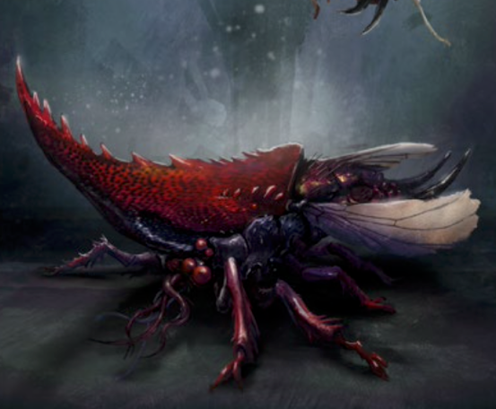
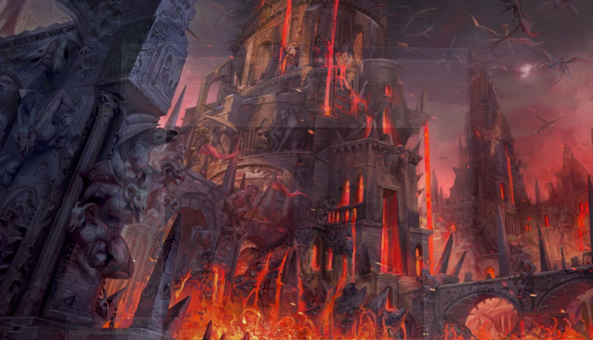
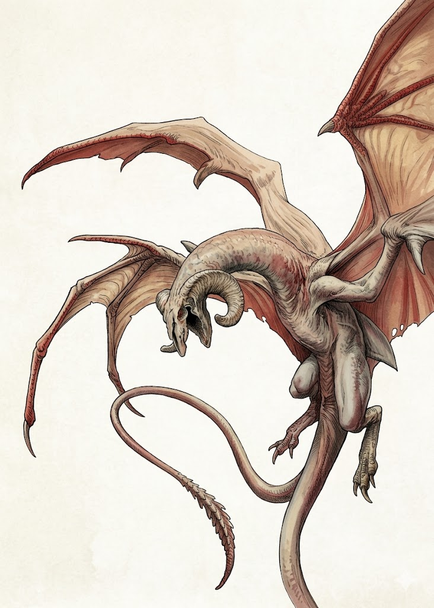
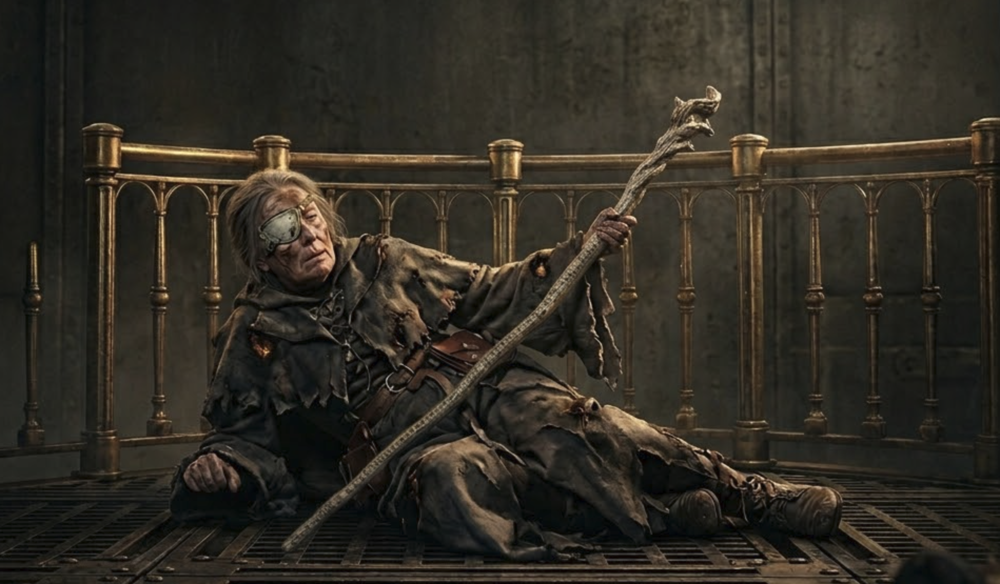

# 18 Mar 2026

**[Previously](2026-03-11.md):** On the plane of Tevaeral, we found the corpse of Xeluan the giant and merged the Dragon Doom with his body, thus allowing the banished dragons to return to the plane, [as we had promised to Real](../2025/2025-10-29.md#dragondoompromise). Galen used Divine Intervention with his deity to restore the dragons, include Real's father, Subonix. Norgreath then cast Plane Shift, to return to the party to the Material Plane.

---

From Tevaeral, we arrive back on our original plane, the Material Plane, in the city of Elturel. We recall our overall quest: [we had been asked by Manizer of the Tyrant Tamers to retrieve the first element of the key for the Tyrant of War vehicle](../2025/2025-06-25.md).

We take time to divvy up the magical items we obtained on Tevaeral. Lunghiss is delighted to get a Cloak of the Bat - and can finally fly! Gralok takes the Ring of the Ram. Galen takes the Necklace of Prayer Beads. Norgreath takes the Figurine of Wondrous Power - Silver Raven. Lunghiss takes the Bag of Beans and Norgreath takes the Wand of Sweet Dreams.

Back in our lodgings, sitting on the table is a slim volume we have not seen before. The cover says: *War Diary*. Karthis picks it up and scans through it. It is a slim volume with notes penned by someone called Clotild Kell, apparently a collector specializing in artifacts of fiendish manufacture.

Clotild describes his discovery of the third key segment, and his quest to find the fourth in a "dimension of sad, demented little constructs" that ended in failure. Clotild next found a group called the Tyrant Tamers who were very helpful in providing details about what he should do next. (We recall that Manizer is from the Tyrant Tamers Guide.) The last entry indicates that Clotild took their advice and went seeking the first piece of the key in something called "the Planes of Mirror and Shadow".

Tucked into the front cover is a note: "A little reading for you - Manizer". It seems the book is a gift from our mysterious employer.

We think that owning an element of the key enables us to find other elements of the key.

[From the time that Barrisso held the first element of the key](../2025/2025-10-29.md#fourplanes), he recalls four planes that we might visit in search of elements of the key:

- The Citadel of the Fate Eater
- The Infinite Labyrinth
- Ramiah the Star Blade
- Timeborne

Barrisso searches out a sage to ask about the various planes we have heard of. Apparently, on the plane where the Citadel resides, there is a demon queen called Tereculon the Fate Eater. She can eat prophecies, curses, and dooms affecting individuals. Her fortress, the Citadel of the Fate Eater, is on the outer planes on a deep layer of the Abyss.

Norgreath uses his path token to transport us to the plane on which the Citadel resides. Norgreath feels a faint tug from the token, urging him forward. A gossamer pathway rises in front of us, wide enough to bear all of us. A moment later, we are on the path above a hazy landscape. The air is cool and there is a smell as if after a lightning storm.

Eventually, we encounter some travellers on the path. These travellers are appear like flattened red boulders. They appear sentient, but yet, boulders. We continue on. But these creatures don't want to be ignored. As they approach, they unfold into strange cockroach-like creatures.

<figure markdown>
  { width="400" }
  <figcaption>Mite</figcaption>
</figure>

Lunghiss does a sneak attack on one, with Lathander's Radiant Blade, using Booming Blade and Savage Attacker, and kills it, then retreats.

On another, Norgreath casts Eldritch Blast (with Agonizing Blast), the first with Genie's Wrath (Cold), doing 39HP of damage.

Gralok attacks the same creature with his Blazing Cold Greataxe, doing 12HP of damage. He then casts Call the Hunt to give others in the party more damage.

The three remaining creatures swarm towards Gralok. When they attack, they simultaneously bite and claw. Gralok takes a total of 8HP of damage but is grappled and restrained.

Karthis casts Fire Bolt at the damaged creature, killing it.

Barrisso casts Sacred Flame at a remaining creature, taking 15HP of radiant damage.

Galen attacks with his mace, while also casting Bless on Gralok and Lunghiss.

Lunghiss attacks the uninjured creature and gets a crit. It explodes in a shower of ichor.

Norgreath finishes the remaining one off.

---

We continue along the shiny path and eventually see what seems to be an exit from it. We continue down it and it deposits us at a strange location. In front of us is a massive fortress. Its iron gates lie fallen and bent. Now off the path, we feel blistering heat from a moat of lava around the fortress. The building is covered with carvings of daemonic forms. We assume this is the Citadel of the Fate Eater.

<figure markdown>
  { width="400" }
  <figcaption>Citadel of the Fate Eater</figcaption>
</figure>

Overhead, we see winged daemons wheeling thru the ash-smothered sky:

<figure markdown>
  { width="200" }
  <figcaption>Winged Daemons</figcaption>
</figure>

As we approach the entrance, two of the flying daemons land beside us and say in Common:

"Why have you come here?"

Norgreath: "We are travellers from another plane."

"Who are you?"

"We are heroes from the Prime Material plane."

"Have you not heard of the Defender of Elturel?"

"We have not."

"We seek advice from learned beings native to this plane."

"We are such. What do you want?"

Barrisso says: "We wish to meet the Fate Eater."

"Hmm." (*Persuasion check*) "The mistress might well be interested in the likes of you!"

"It sounds like we have come to the right place. A pleasure to make your acquaintance."

We proceed into the citadel, across the bridge, and we find sets of curving stairs that ascend and descend into many different routes. Cracked and broken statuary lies amid heat mummified corpses of various demonic beings. Bowls are positioned to catch streams of lava, trickling from above through cracks and fissures. Some molten rock has escaped and meanders across the floor.

Barrisso, holding the key, realises we should go down. We follow that stairway. This path leads us towards a set of chambers where we see a room with etched and relief-carved with demonic iconography. There’s rubble and remains of furniture. We follow as we’re led by the key element.

A second chamber, similar to the first opens up, also rubble strewn. We see, hiding in a corner, next to an outcropping of stone, a battered and burnt female in wizard's robes, tightly clutching a staff, with a leather eyepatch. She is breathing raggedly, and when she hears us, she lifts her head and gazes at us with her one good eye.

<figure markdown>
  { width="400" }
  <figcaption>Ixona of the White Eye</figcaption>
</figure>

Galen casts Greater Restoration on her. She uses her staff to rise to her feet and nod her head in thanks to Galen.

"Thank you! Who are you, that has come to this accursed place and yet gives me boons?"

"We are looking for an item that may cause great damage across the multiverse."

"I am Ixona. In some lands, people call me Ixona of the White Eye."

She flips up her eyepatch to reveal a smooth milky glass orb.

"I too am on a quest. The demon queen here has the object that I need to continue. But conquering this place has proved impossible."

"Have you heard of Clotild Kell?"

She thinks. "No, I have not."

"Have you heard of the Tyrant Tamers?"

"Who... are these Tyrant Tamers?"

"They are an organisation, that's all we know."

"But you have heard of tyrants?"

"The Tyrant of War."

"Is that the nature of your quest? Are you looking for a segment of the key?"

"I am."

"Why do you want it?"

"Well, I suggest we work together to gather it."

"What is your purpose with it?"

"Vengeance."

"Against whom?"

Her lips thin and she shakes her head slowly.

"The tyrant..." she says, shaking her head.

"You wish to destroy the Tyrant of War?"

She nods, vigorously.

"Where are you from?

"Both a long way and a long time ago. It has taken me half a lifetime to have reached here."

"We both have the same aim, to subdue or destroy the tyrant."

"I think we can work together."

Barrisso (*Insight check*) thinks she hates the tyrant, but is not sure she has told us everything yet.

He shows us the element of the key he holds - she reaches out involuntarily and he moves the key out of reach. He explains we can use it to find the next element, and tells her she can accompany us if she wishes.

---

We open the door to the south and continue. This chamber is covered in cylindrical holes, possibly used for scrolls. Most appear to be empty. In the centre is a partially broken statue of a daemon with two sets of wings, resembling those we saw flying in the air outside.

Barrisso casts Detect Magic on the cylindrical holes. There is only one that radiates magic, and the only one with a scroll in it. He hands it to Karthis, but he does not recognise the language. Galen does.

The scroll has a warning in Abyssal:

???+ scroll "Abyssal Scroll"

    Read on to gain the sovereign ability to reshape the multiverse for a moment. Should you do so, you are fated to die in the following manner.

As soon as Galen finishes reading it, the scroll crumbles into dust, and he feels a strange magical potential transferred into his soul.

Galen feels he can make a perfect attack at the right time. But he needs to choose how he will die if her performs that action. He wonders if he can choose old age...

We continue through a door to the east. A corridor leads north and south, so we continue south. We continue east to another north-south corridor. [We enter a room to the east...](2026-03-25.md)

