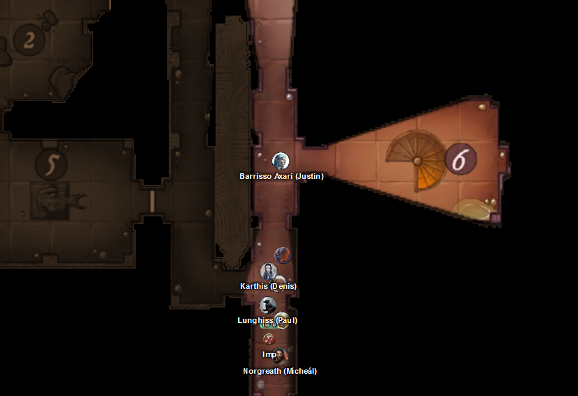
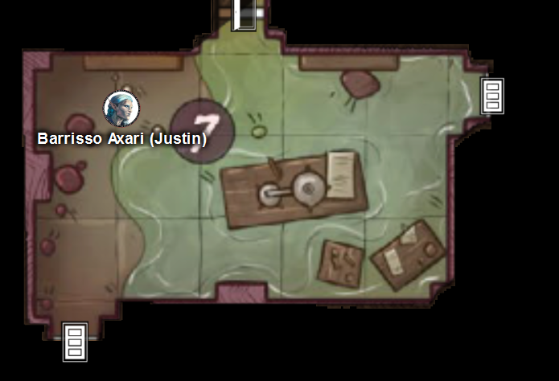
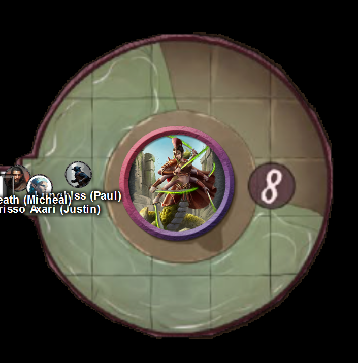
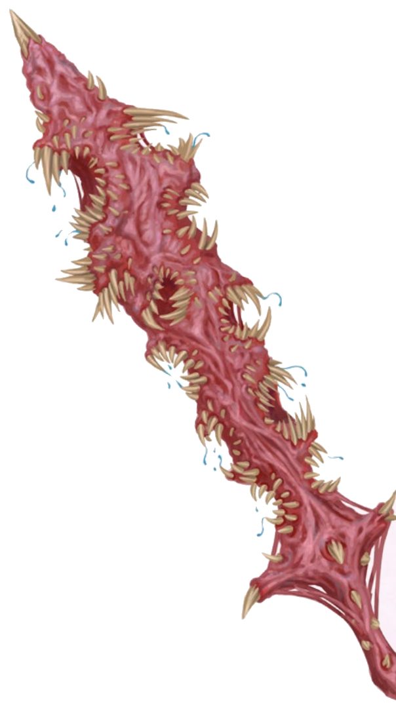
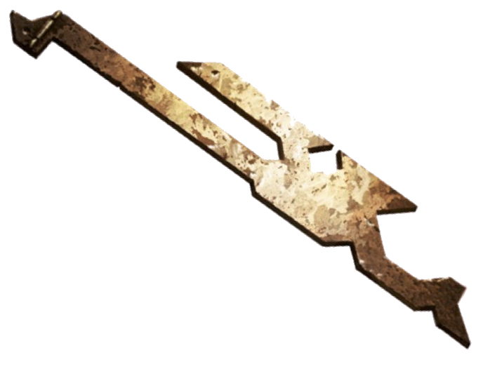

# 25 Mar 2026

**[Previously](2026-03-18.md):** We returned to Elturel on the Material Plane with the [first element of the key for the Tyrant of War vehicle, as requested by Manizer of the Tyrant Tamers ](../2025/2025-06-25.md). Manizer has left us a slim volume called *War Diary*, a clue to the next fragment. In it, a Clotild Kell, a collector specializing in artifacts of fiendish manufacture, describes his discovery of the third key segment, and his quest to find the fourth in a *"dimension of sad, demented little constructs"* that ended in failure. We travelled using Norgreath's token to the plane where the The Citadel of the Fate Eater is located: this is [one of the planes about which Barrisso received a vision](../2025/2025-10-29.md#fourplanes). We entered the fortress and met a Ixona of the White Eye, who told us she is also looking for a fragment of the key. We moved on, and found a mysterious scroll, which Galen read. It said: *"Read on to gain the sovereign ability to reshape the multiverse for a moment. Should you do so, you are fated to die in the following manner."* He sensed that in the future he could make a perfect attack, but would die in the attempt....

---

In the room to the east is a marble spiral staircase descending down:

<figure markdown>
  { width="400" }
  <figcaption>Fortress - Spiral Staircase</figcaption>
</figure>

A red glow emanates from downstairs.

The room also contains a door to the south.

There's also a greenish glowing liquid at the south door. Barrisso thinks it's of no danger. He listens at the door, and hears nothing. He does hear the sound of a viscous liquid flowing from the level below the spiral staircase. Barrisso opens the south door.

Everything in this room seems to be covered in the same green liquid. There's broken glass from vials and glasses on the floor. The room resembles a wizard's laboratory. A four-foot diameter crystal cylinder is in the middle of the room: this also contains the same fainting glowing green liquid. Lunghiss *(Arcana check)* thinks the liquid has some alchemical properties, but does not think it's dangerous to walk in.

Barrisso flies into the room, avoiding the liquid.

<figure markdown>
  { width="400" }
  <figcaption>Fortress - Green Liquid Room</figcaption>
</figure>

The rest of the party join him. As Galen passes the spiral staircase, he notices there is a different symbol inscribed on each step. The top few are a stylised skull, flame, throne, comet, moon, and sun.

Those in the party who can fly (such as Barrisso, Norgreath, and Lunghiss with his newly acquired Cloak of the Bat), fly into the room to the east. The others stay where they are.

Gralok decides to empty the room of liquid by using his Raggadragga's Maul. He makes his way down the staircase. When he gets halfway down, he sees some movement but is not sure what it is. As soon as he stops, he sees what appears like a card with a gem on it momentarily. 25 pieces of jewellery appear out of nowhere and drop at his feet. Gralok frantically gathers up the twelve that he can reach. He notices that the symbol on this step is a gem.

Gralok hits with his Raggadragga's Maul, but fails.

Meanwhile, the fliers in the party enter a circular chamber room with candles surrounding its perimeter:

<figure markdown>
  { width="400" }
  <figcaption>Fortress - Sarcophagus Room</figcaption>
</figure>

The floor has pools of the green liquid. A figure is entwined around an upright sarcophagus, seemingly in grief. Barrisso recognises it as a marilith daemon, but twice the size of normal. Norgreath uses Ghostly Gaze to look inside the sarcophagus. Within it, he sees a dead double-winged daemon, like those we have seen flying outside. On the outside of the sarcophagus, he can see a name etched in Abyssal. Lunghiss copies the text using his calligrapher's tools and Expert Duplication, and brings it back to Galen to translate. Galen recognises it. It's simply a name: Idlewyld. We have no idea what this could refer to. Barrisso thinks this is location is where one of the elements of the key is.

Meanwhile, Gralok uses his maul again to drain the liquid and succeeds. He hews a channel which allows the green liquid to drain from this level.

We try and parlay with the marilith. Gralok opens the conversation in Common, and the marilith responds with telepathy which all of us can hear: a horrible feeling writhing in our brains.

"Leave me alone."

"We do not mean to intrude upon your grief. We wish to learn of the noble creature who you mourn."

We suddenly find ourselves overwhelmed with a series of thoughts and images. This creature, Tereculon, considers herself the Fate Eater. In the chamber next door, we see her at work, crafting, building, creating. In one of her six hands, she holds a weapon of such horror that we recoil, as it's crafted from demon flesh: the literal mouths of daemons, which will bite anyone attacked:

<figure markdown>
  { width="200" }
  <figcaption>Daemon Flesh Sword</figcaption>
</figure>

We see her use the blade on her own flesh, and using that flesh in the laboratory to craft the double-winged daemons we have seen. She has created a particular daemon who was different: straight of limb, and keen-minded. All of this creatures have the ability that Galen has: the ability to use a perfect attack, but then they die. We get images of hoards of them being created, and help their queen, Tereculon, to seize territory. But in doing so, they die quickly. This Idlewyld creature is patient and thoughtful and waits for the right time, serving at her side. Until one day, an attempt is made to overthrow her. A trusted vizier tries to assassinate her. Only then, does Idlewyld use his perfect attack to save her - and dies in the process.

"We apologise for intruding on your grief. We seek an artefact here."

She seems to unfold from the sarcophagus and looks at us. She seems a bit bedraggled and weak from crying.

"We seek a segment of a terror weapon called the Tyrant's Key - do you know of such a device?"

She looks at us all, her gaze lingering on Ixona. She reaches to a belt pouch and shows us a metal device.

"I think this is what you seek."

<figure markdown>
  { width="200" }
  <figcaption>Key Element</figcaption>
</figure>

She says: "Is this all that you wanted from me?"
Barrisso: “Unless you can help us with some further aid, this is all we require”
She responds: "Leave me"
Barrisso “Condolences”

As we leave, the door behind us shuts. We head south.

Norgreath flies down the spiral stairwell and tries to collect the missing jewellery. There are 13 remaining pieces.
Norgreath touches the step by mistake, after trying to pick up a piece.
Picks up pieces on this step – 6 of 13, so 7 are left.
The star symbol displayed, and he increases his CHA by 2 permanently.
Taq noticed that step symbols reshuffled when first touched.

Karthis tries to fly down to collect some of the remaining jewellery. He inadvertently touches a step as he picks up a piece. Thirty feet away on the level above him, a high elf wearing chainmail with a longsword and shield appears. Suddenly, Karthis seems to have a personal connection with them. He knows they will serve him loyally from now on.

Lunghiss uses Mage Hand to gather the rest of the jewellery.

---

We return to the room with the crystal cylinder, then go south.

In the southern room, we find dust and debris and, in the middle of the room, a stone chest. Barrisso casts Detect Magic: he thinks there is something magical inside. Lunghiss checks for traps: he *(Arcana check)* believes there is a price to pay, a trade off, that we cannot get around if this chest is opened. Norgreath uses Ghostly Gaze to see inside the chest. He believes that inside there are two rings, five gems, and a short sword.

Barrisso opens the chest. Instantly, some kind of giant lava creature appears.

Karthis casts Death God’s Touch against it, doing 48HP damage. Now invisible, he retreats.

Gralok attacks it, injuring him, and then uses his Call the Hunt ability.

Lunghiss casts Shadow Blade and then sneak attacks, using Booming Blade and Savage Attacker, doing 57HP of damage, plus 12HP thunder damage if	d they move.

Barrisso starts his turn inside the creature's fiery aura, but fortunately is immune to fire. He attacks with his scimitar, doing minor damage.

Norgreath casts Eldritch Blast with Agonizing Blast and Genie's Wrath (Cold).

Galen casts Sunbeam, doing 17HP of damage.

The crater between the creature shoulders erupts in a plume of fire, rock, and toxic smoke. Those who fail a save take 44HP of damaged, and are poisoned.

Ixona casts Cone of Cold at the lava creature, [doing 31HP of damage...](2026-04-01.md)

