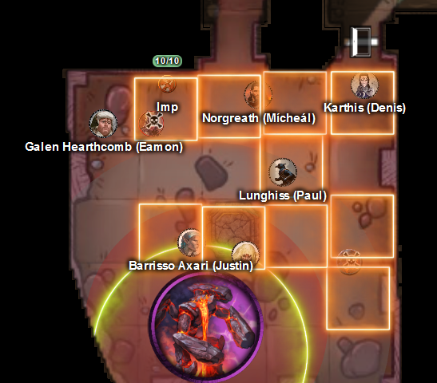

# 1 April 2026

**[Previously](2026-03-25.md):** We followed a clue left by Manizer of the Tyrant Tamers and travelled, using Norgreath's token, to the plane of The Citadel of the Fate Eater. There we hoped to find another fragment of the Tyrant of War key. In the citadel, we allied with Ixona of the White Eye, who is also searching for the fragment. We searched the citadel and found a sarcophagus around which is entwined a grieving marilith. Her name is Tereculon, and she is the eponymous Fate Eater. She is grieving for their a winged daemon named Idlewyld, one of many she crafted from her own flesh (using a sword fashioned from demon flesh). Idlewyld saved her when was attacked by her own vizier, using a "perfect attack" like that which has been bestowed on Galen via a scroll found in the fortress. We asked her about the element of the key to be found in the room (Barrisso sensed this was the location of a key element) and she simply handed it over. We then left the room and in another, found a chest which Ghostly Gaze showed to contain treasure. But when we opened it, a giant lava creature attacked...

---

Karthis casts Cloudkill at the monster, doing 15HP of cold damage. However, Gralok and Barrisso are caught in its sphere and take half damage.

Gralok takes more damage as he is still in the effect area of the Cloudkill. Even more angry than usual, he attacks the lava monster with his Blazing Cold Greataxe, but misses with his first attack. His second hits, doing 18HP of damage.

Lunghiss shoots his shortbow at the creature, but misses.

Barrisso attacks with his scimitar but misses.

Norgreath casts Eldritch Blast with Agonizing Blast and Genie's Wrath (Cold), damaging it.

Galen uses Channel Divinity: Order's Demand on the creature and succeeds. The creature is now charmed and will not attack until damaged - which will happen with the Cloud Kill spell.

The creature then attacks - sheets of roaring flame appear across an area of the floor (Fire Storm) for a maximum of 42HP of damage. Both Ixona and Karthis's magically-conjured retainer are killed.

<figure markdown>
  { width="400" }
  <figcaption>Lava Monster - Fire Storm</figcaption>
</figure>

Karthis casts Ray of Frost, doing 24HP of cold damage, and kills the creature.

---

Barrisso casts Revivify to restore Ixona back to life. He casts it again to revive Karthis' magical retainer, Lathandrial Silverwind.

Ixona looks battered and bruised, and slowly rises, dusting herself down.

Lathandrial Silverwind, revived, backs away from us. "What sort of creatures are you, here in this horrible place? Send me home!"

It turns out that this magical retainer will only aid Karthis until death, his own death.

Barrisso: "Where is home for you?"

"I am from the world of Oerth."

(We have been to Oerth [before](../2025/25-Jun-2025.md).)

"We will send you home, in the course of time."

Galen casts Prayer of Healing, and everyone gets back 46 HP.

We open the chest and find 5 gems, 2 non-magical gold rings, and a short sword, which Barrisso takes.

We all take a short rest. In the meantime, Barrisso discovers that his new sword is a Fool's Shortsword.

Holding the element of the key that we retrieved, Barrisso receives a vision of the Tyrant of War key - an intact key-like object shattering, each segment being flung across the planes. One segment looks like the one he is holding. He sees three other names: The Infinite Labyrinth, Ramiah the Star Blade, and the Timeborne.

We decide to return Lathandrial Silverwind back to Oerth, and then continue to The Infinite Labyrinth. We ask him where on Oerth do you want to go.

"Furyondy."

Norgreath uses his coin and meditates, asking for a path to that location. We walk along the silver path produced for an hour, until his coin leads us towards a side path. We descend into a town which looks familiar except that lots of flags and banners are being flown from its towers. We land on a grassy sward outside the town, named Libernen, where Lathandrial asks in amazement: "How did we get here?"

"Oh, just magic."

We ask him for details of an inn to stay at, and have a long rest there.

---

Once we are awake and geared up, Norgreath uses his coin to again travel the planes, this time to somewhere we know as The Infinite Labyrinth. As before, we follow the silvery path that is produced. This journey is longer than the one to Oerth. We cross an area that seems like a great cavern but with no sky above us, pockmarked with bioluminescent fungi the size of cities. We leave this cavern and arrive in a place where there are mountains rising around us, even though we are in the clouds. We continue on into another cavern, this one in a hollow between densely-woven white tendrils writhing on either side. We still continue one until the coin tugs us towards a side path.

We descend into a crumbling city of buckled streets and broken towers. We arrive in a plaza with a polished mausoleum in its middle. Inside, torches light the way downwards into a cavity under the city. The key fragment tugs us downwards. Karthis spends some time studying the area, in case we need to teleport back here. We then head down.

We find ourselves in a catacomb, with burning torches lighting the way. Narrow corridors lead off into the darkness. A clearing in the middle holds a heavy plinth, atop which is a massive metal urn. A rough lean-to tent with random equipment is against the western wall of the chamber.

The key element does not lead us to the urn.

Both Lunghiss and Barrisso search the room. We look closely at the urn and see that it is made of an unusual metal and sealed shut. Norgreath uses Ghostly Gaze to look inside. He sees fragments of bone and perhaps what is ash inside. The fragments seem to belong to a being twice human-size.

As we decide which way to go, a human woman appears from one of the corridors. She looks fifty years old and wears clothing that seems to have been patched carefully many times. She wields a staff and has a medallion around her neck, with the symbol of a four-leaved green plant. She raises her staff in greeting.

"Ah! Visitors! I haven't seen visitors in a while! You are very welcome here!".

"Thank you for your welcome - I am Barrisso, what is your name?"

"I am Misara."

"Are you the keeper of the labyrinth?"

"I am one of the twelve apostles of Kaos."

"Who is he?"

"You have come to his tomb. Some say that is his urn. I am not so sure."

She tells us how the labyrinth we are in is growing over time. Her apostles are trying to answer questions about it, while also mapping the labyrinth.

"Who or what was Kaos?"

"A hard answer to give. Will you take tea with me?"

"We'd be delighted."

She takes us to the lean-to area, which seems to be her quarters. As she does so, she takes some papers she was carrying and puts them into a leather folder, and puts away more of her items.

She then uses a brazier to make us a beverage. We use bedrolls lying around to seat ourselves comfortably.

As we do so, we notice Ixona is looking around nervously, as if expecting to be ambushed. Barrisso uses Divine Sense to locate any nearby evil - none seems to exist. Misara continues with the ritual of making what seems to be a pepperminty tea, and hands us beakers of it.

We ask her about the labyrinth and about Kaos.

"This land that we call Scryon was ruled from this city Navatar. The god emperor Kaos ruled from here. Each year, he would make a divine decree, using magic to improve the conditions for his followers . But something went wrong with his 99th decree. He meant to widen the streets and increase the height of our buildings, to accommodate the burgeoning population. But something went wrong dramatically. Eight out of ten fell dead, including Kaos himself. His surviving followers interred him here. The catacomb containing his remains continues to grow larger as the rest of the world shrinks. We have discovered in our mappings that miles beyond this hall lie other halls with rooms of a different character. Some places that none of us realised could be there have turned out to be banquet halls, galleries of art, strange rooms, stairs, pools, aquariums! We try to map what is happening in the hope we can figure out how to return Kaos to us."

"Let us tell you why we are here."

"Not to map the catacombs?"

"Not necessarily. We seek an object similar to this" - he shows her the fragment. "Have you come across this?"

"I thought you were going to mention the puzzle box!"

"What's that?"

"I have discovered hints of a way to bring back my lord Kaos. Before the disaster, he owned something called the Puzzle Box. It was lost when the world cracked. But I have visions it lies within this labyrinth. I believe it would resurrect our lord."

We wonder if the box will contain the fragment we are looking for. We agree we will help her find the box.

"Where are the other disciples?"

"I have not heard from some of them in years. I hope for the best."

Those who have the tea feel refreshed, without a formal in-game effect. Ixona is still on edge, though she enjoyed the tea.

We ask her what her concern is. She finds this place is unnatural, and that the sky was not like it should have been. She is worried we’ll be lost in the maze. We reassure her that we have a way to get a safe exit, if needed.

We plan to explore the maze with one key segment in Barrisso’s hand, following its lead. Initial segments are narrow tunnels tiled with stone. There are regular alcoves with urns and the like.

The first thing we encounter on the way is a slightly larger room which contains what looks like a wheeled market stall, but splintered and wrecked as if dropped from a height. It's similar to one what we might see in the market square in Baldur’s Gate. In the market stall, Gralok notices pipeweed and other rare tobacco which he rescues. He thinks what he’s recovered may be worth 138gp, but it’s really for personal use.

The next area we come to has a set of confusing corridors which are frustrating to navigate. Just as we are about to give up, we find a dead end full of cages with dead animals. Except for one, which holds an emaciated sabretooth tiger. Norgreath uses Create Food and Water to obtain sustenance for the tiger. Galen casts Cure Wounds on the creature. We decide to leave it safely in the cage.

We find our way out of this maze of corridors and into an area of corridors made entirely of metal. The doors along the corridor are also metal, with blinking lights. Nothing looks normal or natural to us. We reach a glass window which opens into an empty void, [with flickering strands running through it...](2026-04-08.md)

