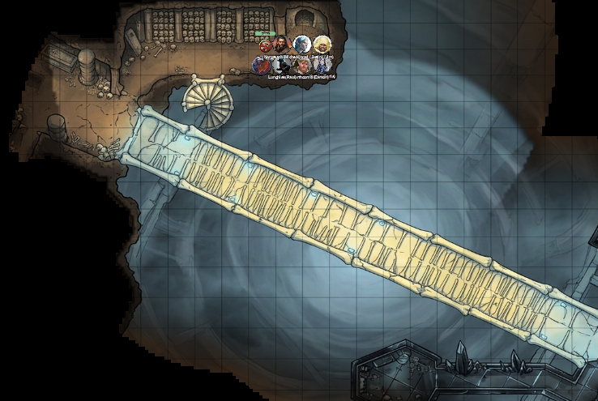
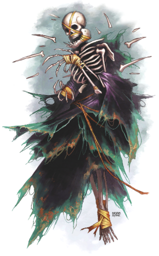

# 8 April 2026

**[Previously](2026-04-01.md):** We travelled to the plane of The Citadel of the Fate Eater and found another fragment of the Tyrant of War key. From there, that fragment led us to a strange plane containing a place known as the The Infinite Labyrinth.
Inside, we conversed with Misara, who said she is one of the twelve apostles of Kaos, whose tomb she tends. Over tea, she explained that the labyrinth was once a city called Navatar in the land of Scryon. Each year he used a magical decree to improve the condition of his followers. But something went wrong with the 99th, killing eight of ten, including him. Now the catacomb containing his tomb expands magically while the rest of the city shrinks. Misara is trying to map this labyrinth in order to find something called the Puzzle Box which she believes can restore Kaos. We left her and continued onwards, eventually reaching a glass window which opens into a mysterious empty void...

---

As we arrive, we all experience a weird tug towards the glass. Lunghiss experiences 14HP of necrotic damage. Lunghiss *(Arcana check)* wonders what we are experiencing, but realises it is beyond knowledge of those from our plane of existence. We hurry away from the window and arrive south into an area with an ossuary and a bridge that incredibly looks like fused bones. It leads across to an area seemingly made from metal. The bridge is over a deep column that penetrates through multiple levels of the labyrinth through which we could descend. However, the key segment pulls us across the bridge. Another area is off to the west, through an entrance with two pillars.

<figure markdown>
  { width="400" }
  <figcaption>Bone Bridge</figcaption>
</figure>

Lunghiss searches the ossuary - and suddenly, six floating skeletal creatures, wrapped in ragged cloaks, appear in the area:

<figure markdown>
  { width="200" }
  <figcaption>Boneshard Wraith</figcaption>
</figure>

Each has a constant swirl of fragments of bone and grit around them, that obscures them from our view.

Karthis casts Fireball at them, doing a max of 32HP of damage.

Gralok throws a handaxe at one twice: both miss.

Barrisso advances and attacks with his Fool's Shortsword, adding Divine Smite, doing 29HP damage. His second attack misses, but his offhand attack connects, with Divine Smite again, doing 25HP damage.

Lunghiss moves and attacks the same target as Barrisso, but misses.

Galen uses his holy symbol on two of the skeletal creatures: both are turned, but do not die instantly.

One creature floats up towards Galen and attacks with a spectral claw, doing 20HP of slashing damage.

Another fires a cyclone of boneshards at Gralok, inflicting 18HP of slashing/necrotic damage.

Another fires a cyclone of boneshards at Lunghiss, who takes 20HP of slashing/necrotic damage.

Barrisso is attacked by another wraith's spectral claws, taking 38HP of slashing damage.

Norgreath attacks, casting Eldritch Blast with Agonizing Blast and Genie's Wrath (Cold), doing 35HP of damage.

---

Karthis casts Haste on Gralok.

Gralok attacks with his greataxe, doing 18HP of damage.

Barrisso casts Channel Divinity: Vow of Enmity and attacks with his Fool's Shortsword: with Divine Smite, he does 28HP. His second attack does 40HP.

Lunghiss casts Shadow Blade, then attacks the same creature, doing 60HP of damage, plus 13HP thunder damage if they move. But Lunghiss feels the target is resistant to both psychic and thunder damage.

Galen moves but takes an attack of opportunity from a wraith, taking 20HP of slashing damage. But he manages to turn the wraiths again. The rest of the wraiths who can flee, do. Three are trapped at the end of the room. Barrisso gets an attack of opportunity on one, doing 34HP of damage, killing it.

Norgreath holds his fire, as there are no targets.

---

Karthis casts Fire Bolt at one of the turned wraiths, doing 23HP of fire damage. He takes damage, but looks as if he has resistance.

Ixona is confused and does nothing.

Gralok attacks the same target as Karthis with his greataxe, doing 36HP of damage.

Barrisso attacks, with Divine Smite, doing 30HP of damage. His second attack does 43HP of damage, killing it.

Lunghiss casts Mage Hand to use as a distraction, then attacks the same target as Barrisso, doing 48HP of damage, then retreats.

Galen casts Sacred Flame.

A wraith attacks Gralok, inflicting 12HP of slashing damage.

Norgreath casts Eldritch Blast with Agonizing Blast and Genie's Wrath (Cold); his first attack kills a wraith. His further attacks inflict 25HP of damage.

---

Karthis casts Ray of Frost but misses.

Gralok attacks with his Blazing Cold Greataxe, doing 7HP of damage.

Barrisso attacks, doing 47HP of damage, killing it. Two turned wraiths remain.

Lunghiss makes a critical attack, doing 97HP of damage on a turned wraith (plus 10HP thunder damage if it moves), then retreats.

Galen casts Sacred Flame on the same target, but it takes no damage.

That wraith casts a cyclone at Galen, inflicting 23HP of damage.

Norgreath casts Eldritch Blast with Agonizing Blast and Genie's Wrath (Cold): his first two attacks kill it. His third attack does 15HP of damage to the remaining wraith, who is now no longer turned.

---

Karthis moves and casts Ray of Frost, doing 11HP of cold damage. He uses a Power Surge to inflict another 7HP of damage.

Gralok uses a dash move and attacks, but misses.

Barrisso attacks, but misses.

Lunghiss attacks, doing 41HP of damage, then moves back.

Galen casts Sacred Flame, doing 11HP of damage.

The wraith attacks Barrisso, doing 34HP of damage.

Norgreath casts Eldritch Blast with Agonizing Blast and Genie's Wrath (Cold) three times, doing 32HP of damage.

---

Karthis casts Ray of Frost again, doing 7HP of damage.

Gralok attacks with his Blazing Cold Greataxe, doing 25HP of damage. The final wraith is dead.

---

Barrisso casts Detect Magic to see if we can find any items, which surely a ghostly ossuary has. One area lights up. In a north-west alcove, in a broken sarcophagus, there is scroll tube. Karthis detects *(Arcana check)* that it is a scroll of Bind to Dimension.

Galen casts Prayer of Healing, returning 31HP of health to the party.

We return to the bone bridge. Detect Magic reveals several schools of magic. As Norgreath crosses the bridge, a figure embedded in the bridge reaches out to grab him, but misses. As he continues, another such creature attacks but again misses.

Karthis casts Fire Bolt at one but misses.

Galen casts Sacred Flame at one of the embedded figures, dealing 14HP of damage.

Barrisso is buffeted by extreme winds over the bridge, but successfully holds his place. He lands in the middle of the bridge, and one of the embedded figures attacks him, doing 8HP of slashing damage but does not petrify him. Barrisso counterattacks, doing 20HP of damage. The creature disappears back into the bone bridge. He attacks the other embedded figure, doing 16HP of damage.

Lunghiss fires his shortbow at the same figure - it also retreats back into the bridge.

Karthis casts Fire Bolt at a third figure - it too disappears into the structure.

Norgreath continues along the bridge. Another figure pops up. Norgreath casts Eldritch Blast with Agonizing Blast and Genie's Wrath (Cold) at it. This figure too is reabsorbed into the bridge.

Gralok moves along the bridge to alongside Norgreath.

Ixona warily enters the bridge, gripping her staff tightly.

Galen walks along the bridge carefully.

Barrisso advances as well.

Another petrified creature pops up and attacks. Barrisso inflicts 25HP of damage on it. It falls back into the bone surface. As soon as it does that, dimensions shift, and now the bridge is vertical to Barrisso, as if gravity has shifted and the metallic side of the bridge is down. He attaches a rope to the bridge, enabling others to climb "down" it safely.

Lunghiss flies using his Cloak of the Bat, landing just behind Barrisso.

Karthis joins the group halfway along the bridge, as does Norgreath.

Norgreath moves ahead and another figure attacks from the bridge. Norgreath casts Eldritch Blast with Agonizing Blast and Genie's Wrath (Cold), vanquishing it.

Gralok keeps moving across the bridge. When the gravity shifts, he holds on to the rope that Barrisso installed, as if the bridge is a ladder.

Ixona follows Gralok.

Galen follows but loses his footing and is attacked by one of the strange bridge creatures. However, it misses. Galen continues to slide down and the creature gets a second attack, doing 8HP of slashing damage.

Barrisso attacks, successfully killing another creature.

Lunghiss flies across the bridge, successfully avoiding an attack, and lands on the other side of the bridge.

Karthis attacks it with a Fire Bolt, killing it.

We are now all on the other side of the bridge, back on what seems to be "normal" gravity. The key element is tugging us towards a large green crystal. One the other side of it is a door. None of us have seen anything similar to the crystal or the metal [that this area is made from.](2026-04-29.md)
