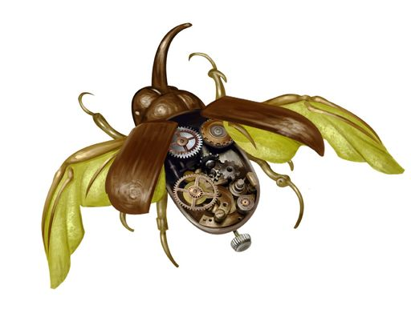

# 29 April 2026

**[Previously](2026-04-08.md):** The latest fragment of the Tyrant of War key has led us to a place known as the The Infinite Labyrinth.
It was once a city called Navatar in the land of Scryon, once ruled by Kaos, but now contains a labyrinth around his tomb which expands magically while the rest of the city shrinks. Misara (one of the twelve apostles of Kaos) is trying to map this labyrinth in order to find something called the Puzzle Box which she believes can restore Kaos. We continued deeper into the labyrinth and fought boneshard wraiths after Lunghiss disturbed their resting place, then crossed a bridge of bone, until we found a large green crystal towards which the key element is pulling us.

---

It seems that the key element is not pulling us towards the crystal, but to the closed door on the other side. We enter a hallway of a black mirror-like substance. But the reflections we see are not exactly of us, but resembling us with unsettling changes.

<figure markdown>
  { width="400" }
  <figcaption>Black Mirror Hallway</figcaption>
</figure>

Barrisso (*Perception check*) notices a faint murmuring sound, growing in volume. As we move along the hallway, the sound grows louder into what sounds like thousands of voice screaming unintelligibly. Some in the party suffer (*Intelligence check*) suffer 9HP of psychic damage and a level of exhaustion.

At the eastern end of the corridor are two doors to the north and south. We open the door to the north.

As we look into the chamber behind it, we see various mechanical items: gears, a massive telescope. We hear a terrible scratching noise from what looks to us an ambulatory metal golem. As soon as we look in, the golem notices us and moves towards us.

<figure markdown>
  { width="300" }
  <figcaption>Clockwork Abomination</figcaption>
</figure>

Gralok rages and attacks the mechanical beast with his Blazing Cold Greataxe, doing 28HP of damage.

The clockwork beast makes a bite and slam attack against Gralok, doing 6HP of bludgeoning damage.

Karthis casts Ray of Frost, but misses.

Lunghiss does a Booming Blade sneak attack with Savage Attacker using Lathander's Radiant Blade, doing 51Hp of damage, plus 8 thunder damage. The mechanic entity falls, and the sound of the thunder damage echoes around the room.

---

We examine this room more carefully:

<figure markdown>
  { width="400" }
  <figcaption>Telescope Room</figcaption>
</figure>

Looking through the eyepiece of the telescope, Barrisso sees a space he does not understand: something completely beyond his ken. In fact, he receives psychic damage doing so.

Lunghiss looks around a corridor to the north-east and sees a door at its end. He returns to the nearest door and opens it.

To the south-east, we see a passageway containing workbenches. There are also alcoves on either side containing workshops and materials. At the junction is a model of what seems to be a star system. Lunghiss looks for blueprints, but cannot find any.

We continue to the south-east. At the next junction, we see passages north-east and south-west. To the north-east, we hear the sound of a loud clanking machine. To the south is what looks like a workshop, with a corridor leading south-east to a dead end. Barrisso continues along that corridor and finds a concealed door. He opens it.

He opens it to find a room full of mechanical insects:

<figure markdown>
  { width="200" }
  <figcaption>Clockwork Beetle</figcaption>
</figure>

They attack Barrisso, but miss.

Barrisso closes the door, but seven insects manage to get into the corridor alongside him. He uses Misty Step to escape the swarm and then flies towards the rest of the party and warns them about the insects that are coming.

Norgreath casts Armor of Agathys.

Gralok holds his action to attack the first enemy he sees.

Karthis casts Haste on Gralok.

Lunghiss holds an action to attack with his Lathander's blade.

Galen holds an action to casts Spirit Guardians.
