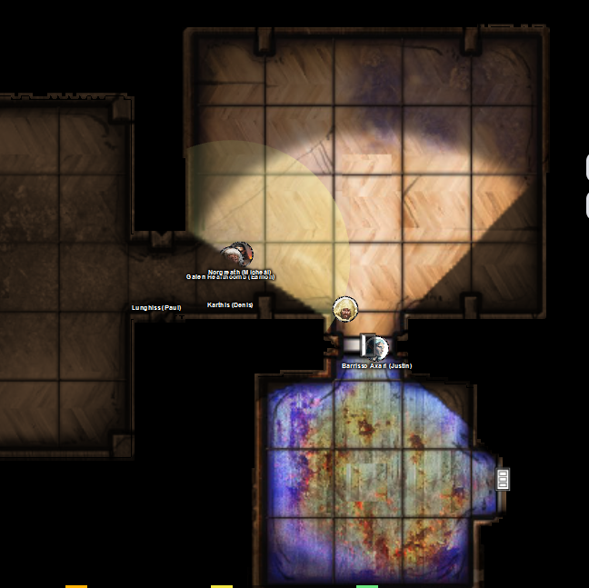
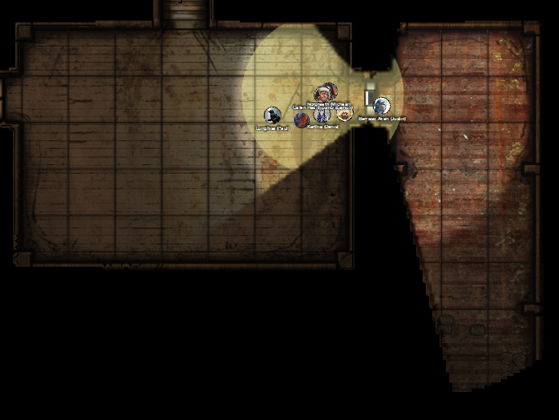

# 6 May 2026

**[Previously](2026-04-29.md):** The latest fragment of the Tyrant of War key has led us to a place known as the The Infinite Labyrinth. It was once a city called Navatar in the land of Scryon, once ruled by Kaos, but now contains a labyrinth around his tomb which expands magically while the rest of the city shrinks. In this labyrinth, we fought boneshard wraiths, then a clockwork abomination. We found a room containing a telescope that appears to let one see into another plane that our minds cannot comprehend. Continuing onward, we vanquished a room of clockwork beetles, and then mechanical ballistae. After that we found ourselves in a vast chamber, where we had to carefully make our way across a series of giant horizontal metal cogs to reach a glowing orb on the other side to which we were drawn by our key element. On reaching the orb, we were teleported to another location: an an obsidian bridge crossing a bottomless void. There, we are now fighting something resembling a great flying lizard made of shadow...

---

Karthis casts Last Rays of the Dying Sun at the creature, doing 35HP of damage.

The creature in revenge casts Mind Spike on Karthis, doing 12HP of psychic damage.

Lunghiss fires his shortbow (with disadvantage) but misses.

Galen casts Cure Wounds on himself.

Norgreath casts Eldritch Blast with Agonizing Blast and Genie's Wrath, damaging the creature.

The creature surrounds itself with a black mist, invisible even from Truesight.

Barrisso casts Hunter's Mark on the creature, then flies towards it. He attacks with with his Fool's Shortsword and scimitar, doing 20HP of damage.

Gralok throws his handaxe at the creature, doing 7HP of damage.

Ixona casts Fire Bolt but misses.

The creature makes four claw attacks on Barrisso: all hit, doing 32HP of psychic/necrotic damage.

---

Karthis casts Last Rays of the Dying Sun again, doing 42HP of damage.

The creature, again in revenge, casts Mind Spike on Karthis, doing 16HP of psychic damage.

Lunghiss moves to stand beside Barrisso - since with Blindsense he can hear the creature, he sneak attacks it with Lathander's Radiant Blade. He does 41 HP of damage, plus 9HP of thunder damage if they move.

Galen casts Holy Aura.

Norgreath casts Eldritch Blast with Agonizing Blast and Genie's Wrath, doing 29HP of damage.

Barrisso's follow-up attack kills it: it falls apart into black inky tendrils which are absorbed by the darkness.

---

At the end of the walkway, we see an area of brightness and light. We head towards it.

<figure markdown>
  { width="400" }
  <figcaption>Bright Bridge</figcaption>
</figure>

We found ourselves on a bridge of bright crystal-like prisms which ends in a archway. Barrisso thinks this is a planar gateway: on the other side are wooden floors and a seemingly comfortable domain.

Galen casts Temple of the Gods as a refuge, to blend in with the local landscape. We pass enough time safely in the temple to perform a long rest. Galen inside performs a Prayer of Healing, giving everyone 31HP of health.

---

We leave the temple and proceed through the archway. As we step through, we all sense something *(Wisdom save)* but get through safely. We find ourselves in a weird but familiar place. It feels like we are in a tavern. We can see coats, hats, scarves, and other garments hanging from pegs that covers the walls of this chamber. Strangely, we see similar garments piled on the floor, with narrow paths between those piles.

In the next room, mugs and glasses cover the tables, and many others are broken on the floor. The air is filled with the smell of stale beer.

Barrisso performs Detect Magic, but does not detect magical emanations.

We move into the second room, where there is a door to the south. As we approach it, we see coming from under it an oozing creature. Two other similar creatures appear from under the tables.

Lunghiss casts Mage Hand, then sneak attacks one of the monstrous ochre jellies using his Lathander's Radiant Blade. He does 48 HP of damage, plus 10HP of thunder damage if they move. He then retreats.

Ixona casts Fire Bolt, doing 25HP of damage.

Barrisso attacks an undamaged jelly with his Fool's Shortsword. doing 7HP of damage.

Karthis casts Fire Bolt, doing 20HP of fire damage.

Norgreath casts Eldritch Blast with Agonizing Blast and Genie's Wrath, killing a jelly. He then damages another.

Galen casts Sacred Flame at the damaged jelly, doing 11HP of damage.

Gralok attacks with his Blazing Cold Greataxe. His (slashing) attack splits the jelly in two without doing damage. There are now three jellies again. He switches to his Raggadragga's Maul, and does 8HP of bludgeoning damage.

A jelly attacks Gralok with its pseudopods, doing 27HP of damage. The second jelly damages Barrisso. The final one does 14HP of damage to Norgreath.

---

Lunghiss attacks the southernmost jelly (the one that divided), killing it. He then retreats.

Ixona casts Fire Bolt at the other half of that jelly, killing it.

Barrisso attacks the remaining jelly, damaging it.

Karthis does 9HP of damage to it using a Fire Bolt.

Norgreath casts Eldritch Blast with Agonizing Blast and Genie's Wrath: his 52HP of damage damage the jelly.

Galen casts Sacred Flame, finishing it off.

---

We continue through the door to the south.

Inside the room are carcasses hanging off hooks from the ceiling: porcine, bovine, and some unfamiliar to us. We assume it is a cold room used to store meat:

<figure markdown>
  { width="400" }
  <figcaption>Carcasses Room</figcaption>
</figure>

We see a door leading east from this room and cross to it. Despite the intense cold, we make across it safely but we are all streaked with lard. We enter the next room.

Hanging from racks in this room are all manner of metallic pots and pans. Open cupboards display trays and crockery. Wooden and metal utensils cover the floor. Firepits are set into the walls. On the southernmost wall are hanging cleavers and knives. A staircase on the northside of the room lead upwards, and a door leads east.

We cross to the eastern door. In the chamber beyond, we see stacked wine barrels and ale casks, blocking our view of the rest of the room. We hear a deep rumbling, like a snoring, inside the room:

<figure markdown>
  { width="400" }
  <figcaption>Kitchen and Cask Room</figcaption>
</figure>

Lunghiss stealthily moves ahead to check out the situation. Curled on top of broken barrels and casks is a full size black dragon, fifty feet long. This room seems to be a dead end. Lunghiss casts Invisibility on himself.

He checks the rooms (*Perception check*): acid drips from the beast's jaws and burns the barrel fragments below it. Lunghiss can see beyond against the back wall are two five feet wide chests. Both are stuffed with coins and other riches, so much so that the lids are jammed open. Lunghiss returns to the party and [tells them what he has seen...](2026-05-13.md)
