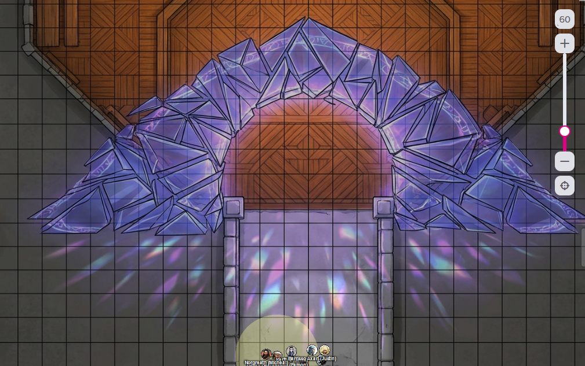

# 6 May 2026

**[Previously](2026-04-29.md):** The latest fragment of the Tyrant of War key has led us to a place known as the The Infinite Labyrinth. It was once a city called Navatar in the land of Scryon, once ruled by Kaos, but now contains a labyrinth around his tomb which expands magically while the rest of the city shrinks. In this labyrinth, we fought boneshard wraiths, then a clockwork abomination. We found a room containing a telescope that appears to let one see into another plane that our minds cannot comprehend. Continuing onward, we vanquished a room of clockwork beetles, and then mechanical ballistae. After that we found ourselves in a vast chamber, where we had to carefully make our way across a series of giant horizontal metal cogs to reach a glowing orb on the other side to which we were drawn by our key element. On reaching the orb, we were teleported to another location: an an obsidian bridge crossing a bottomless void. There, we are now fighting something resembling a great flying lizard made of shadow...

---

Karthis casts Last Rays of the Dying Sun at the creature, doing 35HP of damage.

The creature in revenge casts Mind Spike on Karthis, doing 12HP of psychic damage.

Lunghiss fires his shortbow (with disadvantage) but misses.

Galen casts Cure Wounds on himself.

Norgreath casts Eldritch Blast with Agonizing Blast and Genie's Wrath, damaging the creature.

The creature surrounds itself with a black mist, invisible even from Truesight.

Barrisso casts Hunter's Mark on the creature, then flies towards it. He attacks with with his Fool's Shortsword and scimitar, doing 20HP of damage.

Gralok throws his handaxe at the creature, doing 7HP of damage.

Ixona casts Fire Bolt but misses.

The creature makes four claw attacks on Barrisso: all hit, doing 32HP of psychic/necrotic damage.

---

Karthis casts Last Rays of the Dying Sun again, doing 42HP of damage.

The creature, again in revenge, casts Mind Spike on Karthis, doing 16HP of psychic damage.

Lunghiss moves to stand beside Barrisso - since with Blindsense he can hear the creature, he sneak attacks it with Lathander's Radiant Blade. He does 41 HP of damage, plus 9HP of thunder damage if they move.

Galen casts Holy Aura.

Norgreath casts Eldritch Blast with Agonizing Blast and Genie's Wrath, doing 29HP of damage.

Barrisso's follow-up attack kills it: it falls apart into black inky tendrils which are absorbed by the darkness.

---

At the end of the walkway, we see an area of brightness and light. We head towards it.

<figure markdown>
  { width="400" }
  <figcaption>Bright Bridge</figcaption>
</figure>

We found ourselves on a bridge of bright crystal-like prisms which ends in a archway. Barrisso thinks this is a planar gateway: on the other side are wooden floors and a seemingly comfortable domain.
