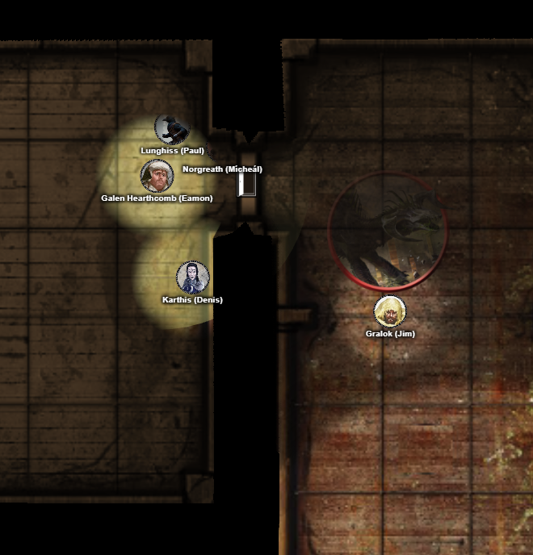
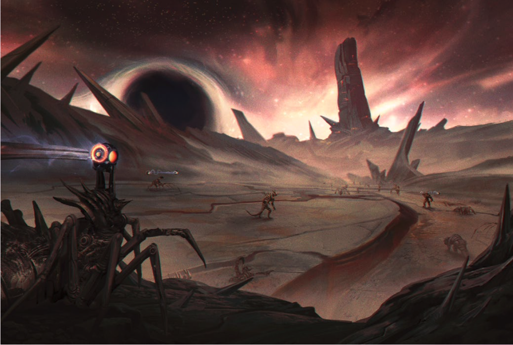

# 14 May 2026

**[Previously](2026-05-06.md):** The latest fragment of the Tyrant of War key has led us to a place known as the The Infinite Labyrinth. It was once a city called Navatar in the land of Scryon, once ruled by Kaos, but now contains a labyrinth around his tomb which expands magically while the rest of the city shrinks. Here, we fought boneshard wraiths, a clockwork abomination, clockwork beetles, and mechanical ballistae. We were teleported to an obsidian bridge crossing a bottomless void, where we defeated a great flying lizard made of shadow. Through a portal, we found ourselves in what felt like the comforting confines of a tavern, where we fought some monstrous ochre jellies, explored rooms and have now found a full-size black dragon guarding treasure...

---

We gather together and discuss what to do with the dragon. Norgreath attempts to cast Banishment on it. However, the spell fails and instead the creature starts to rouse itself from its slumber.

Barrisso flies at top speed towards it, and uses Channel Divinity: Vow of Enmity on it. He also attacks it, doing 32HP damage. Using Luck, he succeeds in hitting the dragon again, doing 29HP of damage.

The dragon leaps towards the middle of the room and performs a Rend attack on Barrisso, doing 21HP of damage. The party are nauseated by the acidic smell of the dragon.

Ixona is stunned: "What the hell is that?"

Karthis casts Haste on Gralok.

Gralok rages and uses his Call the Hunt ability. He runs towards the dragon and swings his Blazing Cold Greataxe at it, doing 16HP of damage.

The dragon summons a cloud of insects at Gralok, taking 22HP of poison damage.

Norgreath casts Eldritch Blast with Agonizing Blast and Genie's Wrath, doing 24HP of damage. His follow-up attacks do another 11HP of damage.

Lunghiss (using Inspiration) performs a sneak attack with Lathander's Radiant Blade (using Savage Attacker), doing 40HP of damage (plus 9HP if it moves).

The dragon does indeed move towards the bulk of the party, attacking Gralok, doing 14HP of damage.

<figure markdown>
  { width="400" }
  <figcaption>Black Dragon Battle</figcaption>
</figure>

Galen casts Sacred Flame at it, but it missed.

The dragon screams at us in a guttural voice, flecks of spits flying from its fangs. "WHO DARES TO DISTURB THE REST OF VORASHAN!?"

The dragon makes a acid breath attack on the party: Galen takes 54HP damage, Norgreath takes 27HP. Lunghiss does a backflip, giving the dragon the finger.

---

Barrisso flies back to the dragon and attacks, doing 25HP of damage. With his second attack, he does 33HP. When the second attack connects, there is a gout of acid blood from the wound. Both Barrisso and Gralok are caught in this spray, and both take 10HP of damage.

But - the dragon is dead!

---

We explore the chests that the dragon had been resting near. We find:

- Three gold tankards, worth 50HP each
- 3,573 gold pieces
- 10,429 silver pieces
- 20,000+ copper pieces
- ...and another key segment
- A magical cloak

Karthis casts Identify, and discovers that the fine cloak of black material with silvery threads is a Cloak of Arachnida, enabling the wearer to spider-climb and cast Web.

Galen casts Prayer of Healing, giving everyone 42HP of healing back.

Norgreath casts Demiplane to find a place to store the carcass of the black dragon, plus the treasure we found. (Since the entrance to the demiplane is too small, we unfortunately have to cut up the body.)

Before we travel onward to the next destination where we expect to find a key fragment, we decide to take a long rest. Barrisso uses True Sight and Lunghiss checks the room: there seem to be no other secret entrances. We spike the door and take our rest.

---

After we awaken, Norgreath uses his coin so we can travel to the next location where we hope to find a segment of the key for the Tyrant of War vehicle: one of the last two phrases we have is "Ramiah the Star Blade". Norgreath concentrates, and a misty path appears in front of us, leading up and out of the chamber. We follow this silvery trail and are transported. As we leave, we realise we didn't help Misara with her task...

We find ourselves floating over a strange landscapes: buildings below us are actually themselves floating in the sky, held up by what look like balloons. As we travel on, we see a greasy river, fouled with corpses and bones, winding through a grey dismal landscape. We continue on. Out of this area of permanent shadow, we find ourselves in a dazzling area of great cliffs of translucent layers, soaring infinitely high above us.

Finally, we see a side path to which Norgreath's token pulls him. We arrive in an area of hard metallic surfaces, broken up by canyon-sized fissures. At our back is a pile of house-sized metallic blocks fused together to form a tower. The sky is filled with stars and nebulae of every colour - except for a blotch on the horizon. Nearby, we see a dozen entities made of mismatched segments of crudely forged metal. Half of the group carry metal poles with loops at one end. An ectoplasmic film stretches across the loops.

When we appear, some of these beings freeze in place, as if startled. Other seem to whisper to each other.

<figure markdown>
  { width="400" }
  <figcaption>Plane of Ramiah</figcaption>
</figure>
