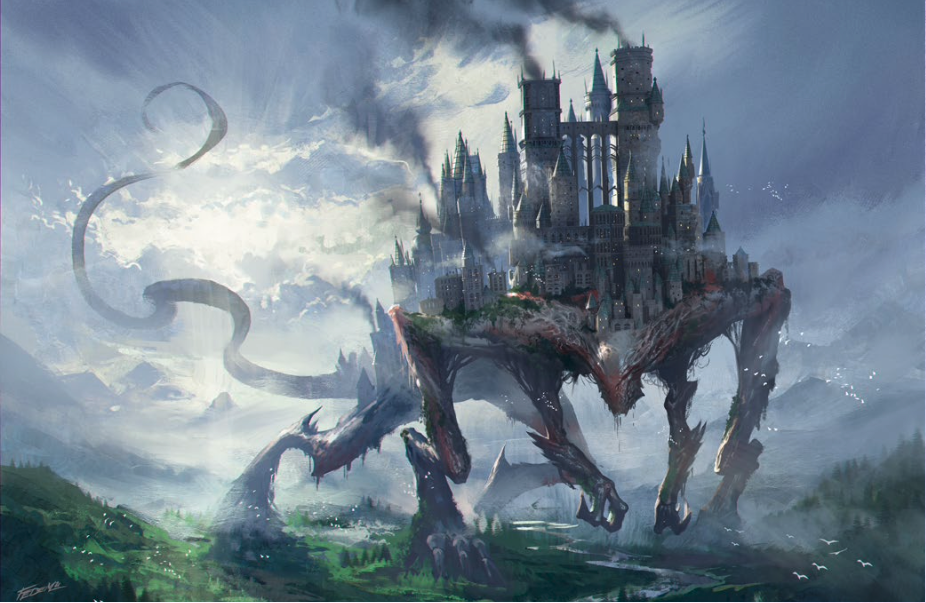
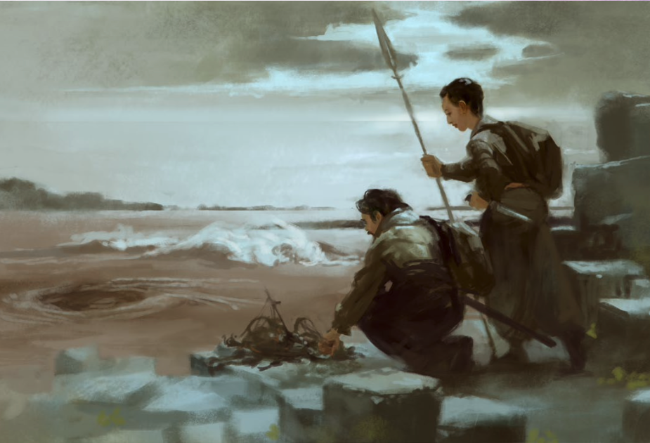
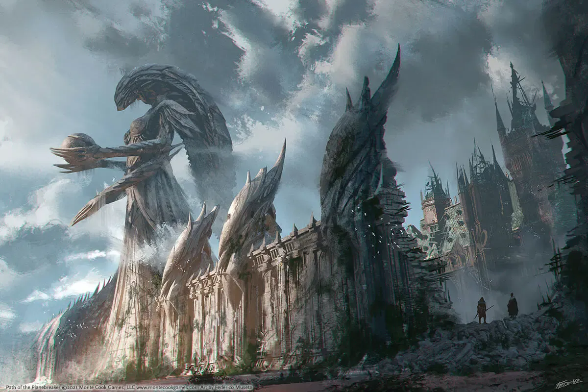
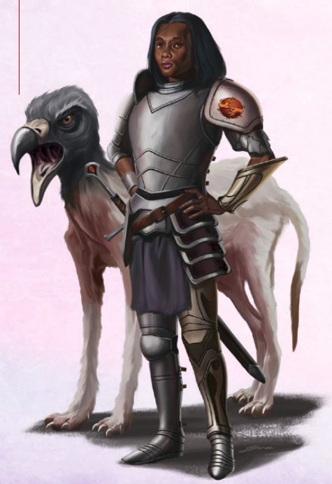

# 27 May 2026

**[Previously](2026-05-20.md):** We travelled to a place called Ramiah the Star Blade, where we made an agreement with someone called The Sovereign to rid him of another being known as the Empty Prince in exchange for information. We parlayed with the Empty Prince and ended up in battle, defeating him and his clockwork minions. We returned to the Sovereign, who offered us a fragment of the Tyrant of War key, as agreed. He told us he was the very first embodied created by Shaziad, and that we had earned the right to an abode in his reality should we  wish it. We used Norgreath's Plane Shift to return to Elturel, plus the party went up a level.

---

After levelling up, the characters discuss their options. The key segments are building up. But we have one remaining, Tyneborn, who we know little about it. We consider Galen casting Legend Lore to learn more, but he needs to purchase some material components: incense (that is consumed) and four ivory strips (that we retain). He asks for information about the place, Tyneborn. He learns that:

- Tyneborn is a small city built on the Plane Breaker that is home to extra-planar refugees and travellers.
- In the city, strange and exotic coins can be found (or purchased) that give the bearers access to the whole of the multiverse – noting that we may already have one of these.
- Whilst it doesn't have a ruler, there is a creature called The Mantis, that values peace and continuity.
- The Library of Worlds is the central archive of visits that the Plane Breaker has passed through.

Justin was trying to sort out armour, and we were experimenting with how to harvest the scales of the dragon we had in cold storage (Dimension Door). But we found ourselves challenged and we did not harvest the scales.

Karthis conducts some arcane research in Elturel (that is, getting more spells in his spell book). He looks to transcribe, from the arcanaloth spellbook: Sending (3rd) Arcane Eye (4th) and Confusion (4th).

Norgreath gets out his coin, the path token, and we prepare to travel. He holds it in his two hands and concentrates on Tyneborn. His Arcana check is low, so he uses inspiration to roll a 19. The first thing we see from the path is strange: a mountainous landscape with a city, that appears to be moving! The city seems to be on the back of a creature.

<figure markdown>
  
  <figcaption>Creature Bearing a City</figcaption>
</figure>

We move onwards, and see an area with a lot of dust and haze, not much solid to see. But around us and beneath us we see images of humanoid forms. It's almost like they're trying to communicate with us. We continue onwards again.

The next transition is a more structured environment, where the path goes through what appears to be a giant rib cage. There are arches made of what seem to be bones of long dead creatures. We see giant ram's head-like skulls that seem to have had six eyes. There are other skeletal forms on view. All the ground beneath us seems to be covered in bones. But again we pass on through.

Next, Norgreath feels like a sub path could be coming up, but there isn't a sub path. And it's almost as if we are being propelled along the path faster and faster. What we're passing is becoming a blur. Then we are flung into a planar space, and we land in water (or some red tinged liquid). The wave tossed sea seems to stretch in all directions, though there are causeways and a city to one side. We plunge beneath the surface, and we're surrounded by bubbles. We all make an Athletics check.

We all succeed except for Ixona, Norgreath reaches out to help her steady her. We realise the liquid is more buoyant than water. So we feel light. Ixona then saves again, and succeeds. So we're all together in this strange place. We see big waves travelling slowly, and we can see through the troughs a low line of place stone just below the surface, less than half a mile away. Barrisso wonders whether flying would be easier. He tries to rise out of the liquid. It's easy to unfurl his wings and he can fly. From that vantage point, he can see that the line of stone is one of the causeways we saw initially, but there are several others, only a few feet higher than the water. The pattern causes the waves to break. These are massive, very long, but worn down, as if battered by waves for an age. The pattern is kind of radial. We see they seem to radiate out from the skyline of a city. There are also some connectors between the radial causeways, like a spider's web, but not as regular. The city itself seems to have irregular towers and a big wall. We head towards the nearest causeway, guided by Barrisso.

As we look up, we see a world suspended above us looking down. It gives us some feelings of vertigo. This reminds us of Sigil itself where you look from the ring into the centre. The landscape is metallic with fortresses, seems like a martial world.

We clamber up on the causeway when we reach it. It's easy enough to do so. The liquid drains off us quickly, so we no longer feel wet within a minute or two. We proceed towards the central city. We see in the distance, on another causeway, some figures – like fisherfolk sifting the waters for objects.

<figure markdown>
  
  <figcaption>Fisherfolk</figcaption>
</figure>

We see a formation similar to the Giant's Causeway, cubic rather than hexagonal, that we need to navigate around. We also realise the stone is different from what we know.  We continue towards the city. Barrisso sees a drifting patch of rotating liquid, spinning like a half hearted whirlpool. In it some flotsam has gathered. We proceed, and eventually we come to the 50' high city walls, with a very tall statue looming above – humanoid with four arms.

<figure markdown>
  
  <figcaption>City Walls</figcaption>
</figure>

There's a large cavity breaching the wall. Through that we see a city of mismatched buildings. It's as if many different people from different dimensions built their own buildings here. Many are hung with lamps that seem to be of recent manufacture. We do see some figures traversing the city, but fewer than the size and number of the buildings would suggest.

We proceed in through the gap in the wall, where our segments suggest we should go. We cross the rubble, that seems ancient, into the city itself. We're directed down one of the many streets, by the segments we have. We follow the lead. This layout reminds us the Infinite Labyrinth, where different areas had very different styles.

We are approached by one person, who steps out from buildings to the South of us, and says: "Are you newly arrived in Tyneborn?".

<figure markdown>
  
  <figcaption>Interpreter</figcaption>
</figure>

Barrisso: "Who is asking?"

"I mean you no harm, I'm from the interpreters guild. Our mission is to welcome travellers into the city and ensure there are no misunderstandings. That can lead to conflict, and The Mantis doesn't want conflict".

Barrisso replies "Yes, we're newly arrived.". She enquires about our purpose, Barrisso is evasive. Then she's joined by a strange creature who seems to know her.

We ask about what tenants or rules we must follow.

"You must have been on the path when you arrived?"

"Yes."

"And this is you first time here?"

"Yes."

"All travellers who arrive are washed into the Sea of Uncertainty. Should you visit again, you'll land in 'the landing': that is a more pleasant arrival. You may have heard we do have a distinct ruler. However, the Mantis does provide guidance and provides order. If you wish, you can claim one of the buildings, and take it as your home or residence. There are many buildings, and not all are populated. Most have been swept up in the passage of the Plane Breaker as it moves through the multiverse. Have you encountered the Plane Breaker? Do you know what I'm talking about?"

"No."

"You are on the Plane Breaker now. This oversized comet, heavenly body, careers through the multiverse, breaking through the normal laws and constraints and barriers into various planes of existence."

Barrisso asks: "Where is the Mantis?"

"She keeps to herself in 'the enclave'."

She points. It's not in the same direction as we're being pulled.

"How does the Mantis keep order?"

"Mainly through the bounty system. She has several bounties that are standard. If you are clearing up waste and detritus to a length of 300' in a street, you will be granted a piece of soul silver. If you run in 5 path tokens you will be granted the same. If you bring the heads of anyone caught stealing from the library or the Sisterhood of Sages, you will be granted the same."

"Additionally there are unique bounties posted in response to specific threats. They're posted on her domain, publicly accessible. But they are time-limited. If you take one and do not fulfil a bounty, you become the next bounty."

Barrisso "Why is it called the Sea of Uncertainty?"

She replies, "We've never managed to understand the limits of the sea, it seems to vary depending on where you are."

Barrisso says "Thank you."

"If you wish to find me again, you'll find me here", she says, indicating the Interpreters' Guild building. "We have this symbol on our shoulders." (a symbol of two hands).

Before getting to the geographic centre of the circle, our keys pull us down a side street, a similar size to the existing street. This leads towards a substantial building. As well as the mix of buildings there are some empty spaces. As we travel away from the wall breach, there are more gaps in the buildings. The building we're heading to is a red brick structure over a wide area with clay tiles. It's five stories high, with a tall central tower with a dome. There are two iron sculptures of stylized humanoids reading from massive tomes. We realize this is the Library of Worlds.

We proceed through the main entrance. We see loads of shelves with books. Haphazardly filled with books, and tomes and scrolls and other ways of writing (beads on strings etc.). There are a few people inside. There are stairways at the far end leading up, and doors closing off other chambers on this level.  We see a human looking woman who has long white hair but does not look frail. She's carting a wheelbarrow with dozens of books. She looks up and calls out.

"Sorry, who are you?" she asks.

Barrisso: "We're travellers."

She wheels to block our progress further into the library.

"If you want to use the library, you need the permission of the lead archivist. That's me."

Barrisso: "Can we have permission to use the library?"

"I need to know why."

"We're searching for the location of the segment of a key, and we believe we can find out in this library."

"This key, what is it for?"

"To save the multiverse"

"Not another one…"

"What will the key help you find, or unlock?"

Barrisso: "Our aim is to gather all the pieces to prevent its use by the Tyrant. He will destroy the multiverse if he gets the key."

"Is he known as the Tyrant of War?"

Barrisso: "Yes"

"Indeed, you are not the first to come here to request information about the Tyrant of War."

"Who precedes us?"

"An elf named Krieger, who has been researching the topic for years. He has a reading room in the sub-basement."

"Can we meet him?"

Barrisso uses Persuasion, aided by Norgreath, and she is convinced.

She leads us to him, an oaken iron-bound door with a semi-circular handle.

Norgreath opens the door.

It opens into a wide chamber. It looks lived in for years, Half the space contains stacks of books, dangerously perched. We catch sight of a cowled figure lying partially reclined in a divan, flicking through some pages of a big tome, with gloved hands.

"Hail Krieger, well met, I am Norgreath and these are my colleagues. We have a common interest in the Tyrant of War", Norgreath says in Elvish.

He replies "It's been years: why have you taken so long?"

Barrisso "What do you mean?"

"My knowledge of your coming was foretold. I am a particular asset to the golden skulls. You've heard of them?"

"No."

"Well, they're pirates led by my sister Zaretta."

"You seek a segment? I have no need for that, I've been researching the pattern of the appearing of the Tyrant of War."

He rants on a bit about how clever he is figuring out the pattern, and how his sister will meet up with the Tyrant of War.

"My sister and I agree I'm the best placed to block your pathetic attempts to gather the keys. Who was it who sent you, was it Manizer. I have the knowledge of the pattern of the appearance of the Tyrant, and I have the final segment of the key."

Lunghiss piles in to attack, Barrisso can see through the illusion, he is really 5' to the left. Lunghiss misses. Barrisso points to where he is. Karthis casts haste on Gralok. Barrisso shows where he is, Gralok rages and moves in, with "call the hunt" (4 people get a d6 – Norgreath, Barrisso, Galen and Lunghiss). His first attack misses. His second hits, he adds infectious fury, 9+22 damage. His third attack hits, again with infectious fury that he saves.

Barrisso attacks, but he can see where he is. His first hit is 27 piercing and radiant damage (looks like he has some resistance to radiant).  His second is  31 piercing and radiant damage. Offhand attack misses. Call of the Hunt gives an extra 6 damage in the first attack.

Galen casts Holy Aura.

The enemy teleports to behind Norgreath and deals a critical doing 67HP of damage. Norgreath saves against poison and is resistant, so only takes +5 damage from the blade. The next attack misses.

Norgreath casts Armour of Agathys on himself, gaining temp HP and creating an automatic reaction attack if he is hit again in melee.

Lunghiss casts Blur on himself.

Karthis does a Last Rays of the Dying Sun, dealing fire and cold damage.

Gralok weighs in with multiple attacks.

Galen heals Norgreath 70 HP.

The enemy pulls out a scroll. He casts Synaptic Static – the area includes everyone. It requires an INT save of 20. Succeed is 10 damage, Fail is 20 plus befuddled thoughts. Only Gralok fails, despite using inspiration to re-roll.
