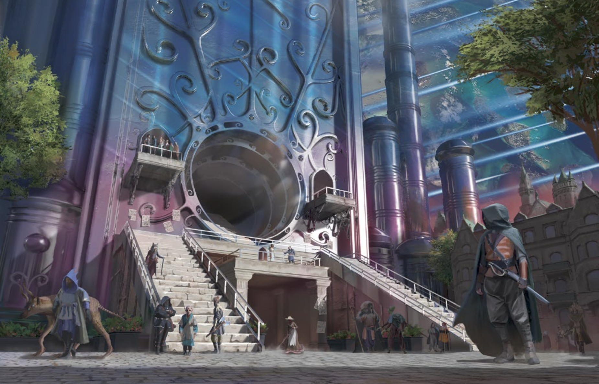
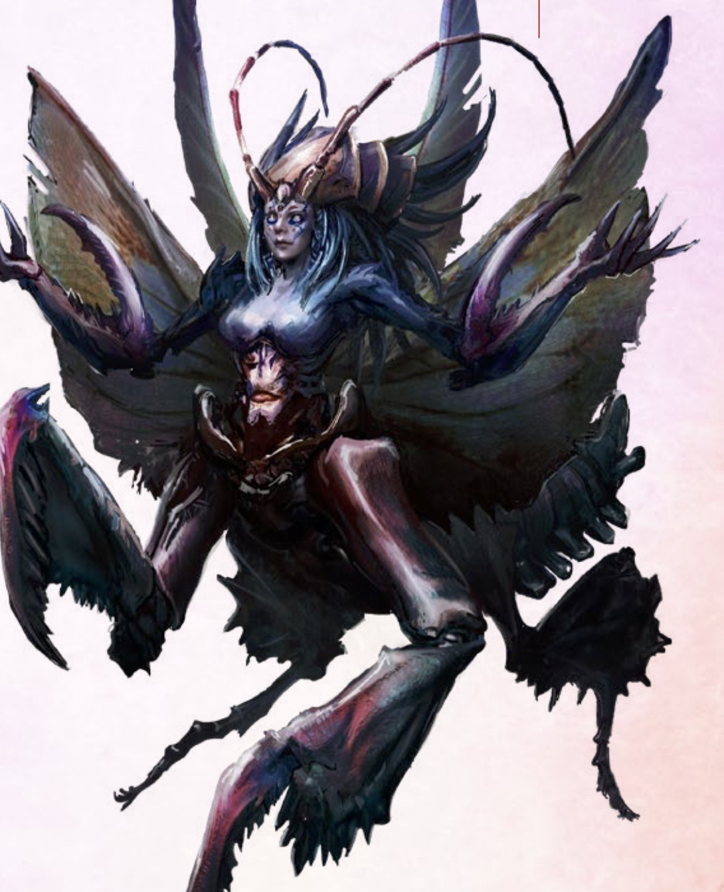
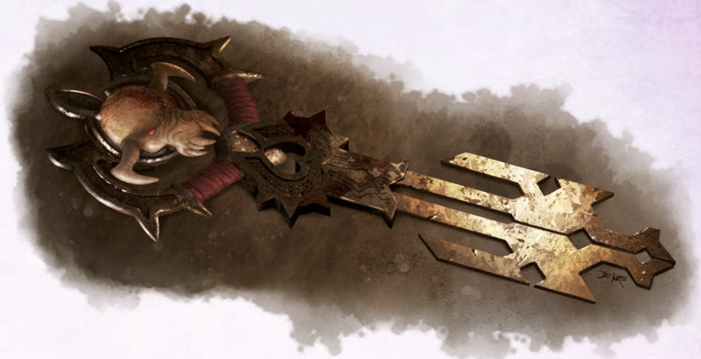
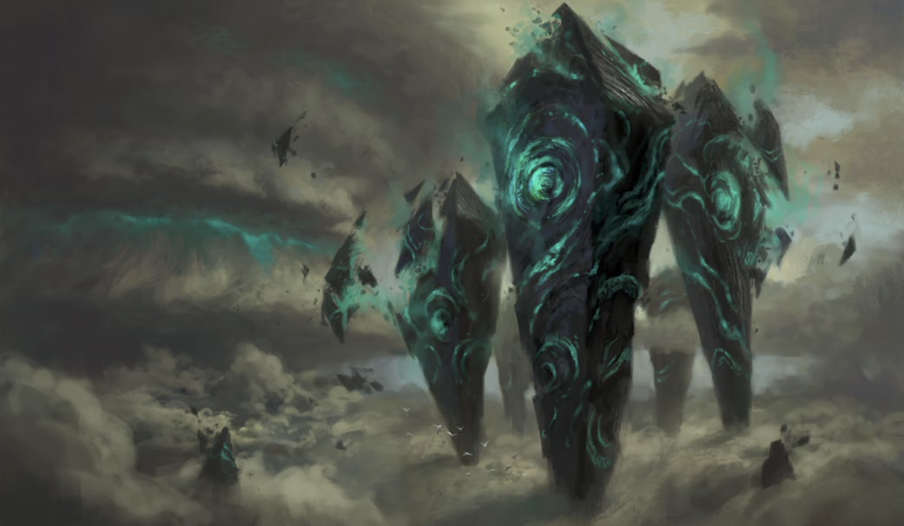

# 10 June 2026

**[Previously](2026-05-27.md):** We reached the end of the path of the Planebreaker, landing in the Sea of Uncertainty on our way to the city of Timeborne as we pursued the last piece of the Tyrant’s Key. Making our way through the city, we found that a scholar called Kreeger had been studying the appearances of the Tyrant across the multiverse. His genius had apparently led him to deciphering a means of finding the devil-craft without the need for the key at all! But he lies in wait in the Library of Worlds, knowing that we would be drawn to his location as he himself holds the final key segment. He remains confident that this was the correct decision, while the Golden Skulls, led by his sister, Captain Zareta, have the chance to seize the weapon that is the Tyrant for their own purposes. Will we prove him wrong?

---

Norgreath hopes Taq can tell him where Kreeger is, but unfortunately the imp cannot see invisible beings.

Norgreath casts Shadow of Moil to defend himself.

Ixona flips up her eyepatch, removes a sphere from her eye socket, and launches it in the air. "You will not stop me taking my vengeance!".

The orb flies through the air in a circular path, but does not seem to have any other effect, yet.

Lunghiss using Blindsense senses Kreeger, wields his Bloodfuelled Sword and does massive damage on him, at the expense of his own blood. The 107HP of damage skewers him.

---

Kreeger's belongings include a magical longsword and a set of scrolls on his belt. On the desk he was working is a smouldering pile of papers. We can only make out some geometric symbols, and what seems like a map. Lunghiss uses Expert Duplication to make a copy of whatever is left on the papers.

Ixona gathers back her orbiting orb and puts it back under her eyepatch.

Lunghiss takes the fifth and final segment of the key for the Tyrant of War.

Norgreath uses a ritual to determine that the magical longsword is +3 magical longsword known as Scather. It has a garnet as a gem and is a Sword of Answering. It will only function with people of the alignment Lawful Evil.

We decide to return to Manizer in Elturel with the key elements and ask her about our next steps.

Norgreath casts Plane Shift. A voice comes through the door: "Is everything OK in there?"

"Yep."

"Did you get what you needed?"

"Yep."

"Because I have someone here for you. One of the interpreters, Darli Kos."

We meet and she tells us: "You have been greatly honoured. I have been asked to bring you to the court of the Mantis. You should come now. If you decide not to come, there might be a bounty put on us."

Darli leads us through the city, which we note is composed of multiple types of building as if from different worlds. Plenty seem unoccupied.

We reach the Enclave where the Mantis is:

<figure markdown>
  
  <figcaption>Enclave</figcaption>
</figure>

The facade of the building is covered with paper: requests pinned to it from petitioners.

She takes us through the central passage of the building, which occasionally bends and rises until after 500 feet it opens into a wider space with a brazier. On the opposite side of the entrance is a dais bearing a many-limbed creature resembling a 15-foot-tall human combined with a preying mantis.

<figure markdown>
  
  <figcaption>The Mantis</figcaption>
</figure>

On her left is a 10-foot-tall horned demonic creature with two pairs of arms. On her right is a humanoid with feathery wings and silvery skin: a deva.

The glabrezu and the deva speak in turn.

"We hear you are seeking a craft out of great power."

"When you are finished with it, preserve the Tyrant, do not destroy."

"A cross-planar cataclysm will one day claim the Cosmos: hide it until then."

"Bring us a key segment in case the need to find the craft arise."

Barrisso says: "We have it on good authority that the Tyrant is a tool of ultimate destruction. We were to find the key segments so no one could ever use it. Yet you tell is the future of the multiverse depends on it. We are stuck in the middle. Perhaps you are the evil?"

The glabrezu says: "You have been misinformed if you think the Tyrant of War can destroy everything."

The deva: "But it is key to the survival of the multiverse."

"You are wise for your kind and we think you will make the right decision. But we cannot force you into any course of action."

Barrisso: "What is this cataclysm you mention?"

"We have learned many things and cannot speak of them in detail."

The deva: "Lest we cause the cataclysm to be certain."

"Have you heard of Manizer, and what are her motives?"

"The Tyrant Tamers have laudable motives", says the deva. "The Tyrant of War is a devil-forged craft of great destruction, meant to swing the tide of the Blood War. But if it can be made to be lost, that is its best fate."

"You wish to have a single element?"

"With one, the others can be found, with effort."

"What if they are destroyed?"

"The craft is diminished."

"We need to consult with some others first and learn more about both the machine and the Tyrant Tamers."

"You can return after your work is done."

Gralok asks "So what's our reward?"

We are each given a little pouch. In each is something that resembles coinage. We realise that Ixona is not here as part of the invitation.  Karthis looks inside his and see a hint of silver, but glowing. They remind him of the path token that Norgreath has.

"What is this?" asks Barrisso.

"Pieces of soul silver. They are a manifestation of the lifeforce of the Mantis. You can trade them. Each is worth 100GP. But that's not usually what they are used for. You can infuse their essence to heal yourself. If they are collected into a chest, you can use them to ask for a special blessing from the Mantis."

We meet with Ixona and ask why she wants the Tyrant of War.

"I am seeking the Tyrant of War to destroy the Baron who killed my family."

"We are returning to Elturel to ask the Tyrant Tamers for this objectives. You are welcome to join us."

"Gladly."

---

Norgreath casts Plane Shift and we teleport back to Elturel. Karthis casts Sending to send a message to Manizer: "We have the key, meet us in our quarters."

Karthis examines the scrolls we got from Kreeger and finds they include the following spells:

- Illusory Dragon
- Feeblemind
- Blade of Disaster
- Time Stop

We have some downtime. Lunghiss decides to investigate poisons with a view to making them. He finds the formula for Essence of Ether, Pale Tincture (Ingested), and Torpor (Ingested). Next time he hopes to gather some ingredients.

---

We finally meet Manizer and inform her of our success. Barrisso asks her, "Have you ever heard of the Mantis?"

"Yes."

"What's your take on her?"

"Overall, one of the more positive things in the multiverse."

"We spoke with her and she requested that we ensure the Tyrant of War is kept intact and available rather than destroyed."

"Available? Well, there was a bard in my youth who had a great song that included the lyrics 'Set the controls for the heart of the sun'. That is what we should do with the Tyrant of War."

Barrisso tells us about the cataclysm which the Mantis warned us about, and how the Tyrant of War could be used.

"That's the stupidest thing I've ever heard."

"Also if we destroy it, we could tilt the balance of the Blood War."

"Can you tell us more about the Tyrant Tamers: how many of there are you, how did you come to hold your opinions, and so on?"

"The Tyrant of War was forged by a Duke of Hell and can slip between the planes, raining down cataclysmic attacks. It appears in random locations across the multiverse, unless it is used in anger and controlled. I was concerned when I heard the Golden Skulls, pirates, were seeking it."

Barrisso says, "We encountered Kreeger, the brother of the pirate queen. He seems to have figured out how to locate the Tyrant of War without the key. But he is no longer of this world. We do know though that they were both seeking the Tyrant of War before we turned up."

"Do you agree with the Mantis would not keep the Tyrant of War unless there was a grave need?"

"Maybe."

We produce the five segments of the key.

"Oh. You haven't assembled it yet?"

"Deliberately so."

Barrisso puts the key together:

<figure markdown>
  
  <figcaption>Tyrant Key</figcaption>
</figure>

He senses that the key is pulling us towards where we assume the Tyrant of War is. A portal appears near us, revealing a strange, huge object consisting of five floating metallic monoliths in a cloudscape.

<figure markdown>
  
  <figcaption>Floating Object</figcaption>
</figure>

The portal view moves towards what seems to be an entry door on one of the monoliths.

We pass through the portal and our orientation shifts: we are on a ledge protruding from the side of a monolith in front of the door. We can see there is a dead and burned humanoid corpse in the floor near the gate. A closer look reveals that this corpse is partly subsumed into the flooring.

Norgreath casts Speak with Dead on the body, but his spell fails.

Barrisso, floating above the platform, attempts to open the door. He sees green flame falling intermittently in front of the door but he avoids it. He opens the door.

Beyond is a huge expanse covered in stone embedded with Infernal script. The chamber is lit from above with great chandeliers of green flame. The space feels like a deserted warehouse. There are a few clusters of crates around. We get a glimpse of other people, and then hear screaming: "GIVE US BACK OUR FACES!".

We all have an uneasy feeling that this is a return to the type of atmosphere of dread that we associate with Avernus. This is a place deeply connected with evil.

Entering the chamber, we see six or seven humanoids, either lying down scraping at their faces, or walking and bumping into things. We can see they actually have their faces, intact. They look like they might be pirates...
