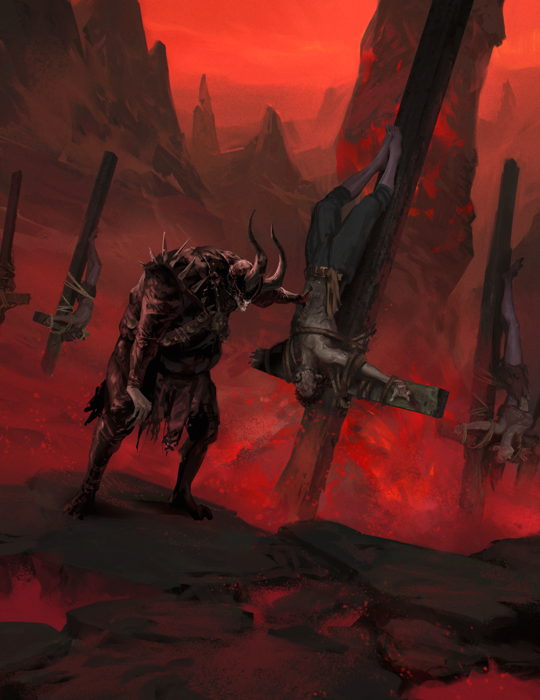
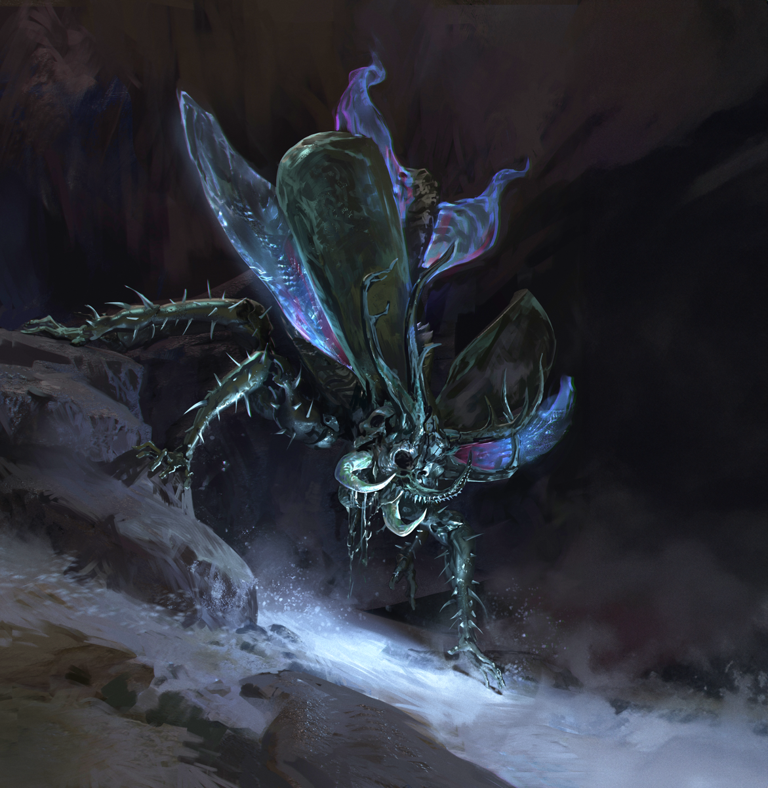

# 17 June 2026

**[Previously](2026-06-10.md):** In the city of Timeborne, we found a scholar called Kreeger. He had the final element of the key for the Tyrant of War, but had also discovered the pattern of appearances of the vehicle without the need of its key. He was working with a pirate band, the Golden Skulls, who are led by his sister, Captain Zareta; she intends to locate and commandeer the craft. The party attacked him and, despite his invisibility, Lunghiss felled him using his Bloodfuelled Sword and some of his essence. We took the fifth and final element of the key and decided to return to Manizer in Elturel. Before we could depart, we were summoned by the translator Darli Kos to meet with the Mantis. She asks us to consider her request: while she respects Manizer and the Tyrant Tamers, do not destroy the Tyrant of War, as one day it will be needed to stop a cross-planar cataclysm that will one day claim the Cosmos. When we return to Elturel, we told Manizer of this request. She initially told us it was the stupidest thing she had ever heard, but grudgingly agreed that the Mantis would not make such a request unless there was truly a grave need. We merged the key elements together to form the Key. This created a portal, leading us to what seems to be another plane, with five enormous metallic monoliths floating in a cloudscape. Inside we have found humanoids, possibly pirates, in some form of hallucination, screaming that they have lost their faces...

---

Karthis is overwhelmed by a vision of Gralok turning into a horned devil. He is surprised but not afraid due to Barrisso's Aura of Courage. He thinks this may be an illusion, so grasps at where Gralok's new horns are. His hand passes through where the horn would be.
As he does this, he sees devilish appendages rise form the floor, grab the humanoids we had seen shouting earlier, pull them into the floor, and themselves emerge into the chamber. They are two classes of devils, of a like we have never seen. Four of the devils look like a humanoid skeleton with two giant horns upright from their skull from their eye sockets:

<figure markdown>
  
  <figcaption>Horned Devil</figcaption>
</figure>

The other two creatures look like horrible insects:

<figure markdown>
  
  <figcaption>Insect Devil</figcaption>
</figure>

Karthis casts Cloudkill on five of the enemy.

Just before Lunghiss moves, he experiences an Aura of Torment and loses 26HP points. He attacks one of the horned devils, doing 44HP of damage (and 10HP extra if they move), and then disengages.

Galen then suffers from an Aura of Torment and loses 20HP of damage. In response, Galen casts Sunbeam at two of our opponents. One is blinded and suffers full damage, while the other only takes half damage.

Gralok takes 20HP of damage from an Aura of Torment. Now angry, he rages and uses Call of the Hunt. He attacks with his greataxe, doing 13HP of damage.

Norgreath takes 11HP of damage from an Aura of Torment. He takes to the air and flies far from the group of enemies. As he takes to the air, one creature hits him for 21HP of damage. Norgreath lands and casts Synaptic Static at five of the enemy.

[]

Barrisso hits a creature using Divine Smite, doing 100HP of damage.

One devil flies out of the Cloud Kill and hovers in the air. A second flies, lands beside Barrisso and attacks him. Fortunately he suffers 22HP of damage.

The devil beside Gralok attacks him, Karthis, Lunghiss, and Norgreath with a Scourge of Steel.

Another devil attacks Galen but misses. The final devil moves to Galen and also attacks, doing 17HP of damage.

---

Karthis suffers 24HP from an Aura of Torment. He then moves his Cloud Kill away and casts Chain Lightning at the opponent beside Barrisso, hitting three more targets for 43HP of damage. One dies, one takes full damage, the other two take half damage.

Lunghiss takes 19HP damage from two Aura of Torment. He casts Shadow Blade and attacks the weakened devil beside Gralok, doing 61HP of damage (plus 15HP if they move). The foe is badly injured but not dead.

Galen casts Sunbeam at the two devils beside and another further away, all in a line, doing 22HP of damage. Two suffer full damage and are blinded.

Gralok activates his greataxe to be blazingly cold, then attacks the creature beside. It dies. He runs at another devil nearby and takes a follow-up attack, wounding it.

Norgreath casts Eldritch Blast with Agonizing Blast and Genie's Wrath at an enemy next to Galen, doing 34HP of damage.

Ixona moves her eye towards the creature beside Gralok, inflicting Sphere of Annihilation on it, but it saves.

Barrisso attacks the same devil, doing 79HP of damage: it dies. Three devils remain. Barrisso then moves towards the creatures next to Galen.

One of the blinded devils flies around, confused. Another attacks Galen, doing 56HP of damage. The final devil, who is blinded, performs a Storm of Steel that catches both Barrisso and Galen. Barrisso takes 31HP of damage, while Galen takes 15HP and is now very weak.

Karthis casts Chain Lightning at all three devils: all take 13HP of damage each.

Lunghiss performs a Dash to reach the non-blinded devil attacking Galen, and does 64HP of damage.

The two devils' Aura of Torment down Galen.

Gralok attacks the non-blinded devil, doing 7HP and using Infectious Fury. The creature attacks his ally, doing 9HP of damage. Gralok's follow-up attack does 13HP of damage.

Norgreath casts Heal on Galen, restoring him to his feet but with Exhaustion.

Ixona moves her magic eye towards the devil.

Barrisso suffers 23HP of damage from the devils' Aura of Torment. He attacks a devil, doing 16HP of damage, killing him. He attacks the devil beside it, doing 31HP of damage with Divine Smite. He then casts Misty Step to move 30 feet away.

The devil furthest away from us can see again. He flies towards Barrisso and wounds him with his claws and proboscis. Barrisso is near death.

The other devil attacks Gralok, doing 12HP of damage.

---

Karthis casts Chain Lightning, doing 23HP of lightning damage to both of the devils.

Lunghiss performs a Dash and attacks the creature beside Barrisso - but even with Inspiration, he misses, and has to retreat.

Galen uses Power Word: Fortify to gives Barrisso temporary hit points. He also uses Voice Of Authority so Barrisso can use his reaction to attack the devil beside him. He does 36HP of damage, killing him.

Then Galen hits the creature beside him with his +2 Marble Mace, using the anti-devil power of the weapon. He takes 19HP of damage, killing him. The Marble Mace glows in his hand, and is now +3.
