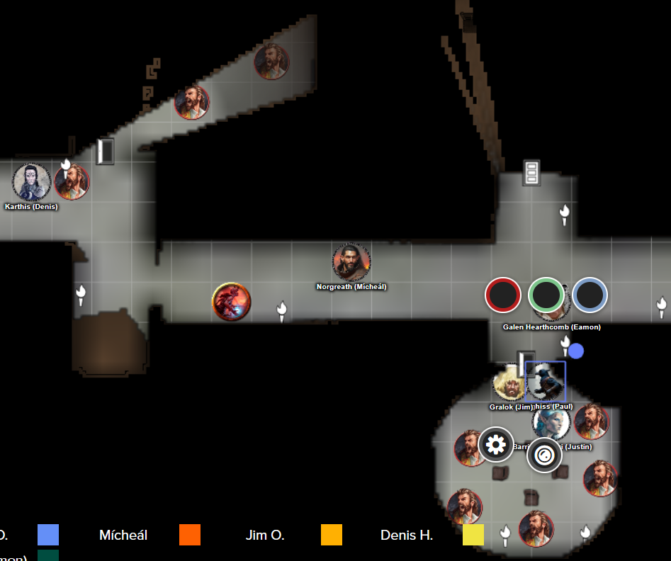

# 24 June 2026

**[Previously](2026-06-17.md):** We have found all five elements of the key for the Tyrant of War. When we merged them, we created a portal that has led us to five gargantuan monoliths floating in a cloudscape. This is the Tyrant of War. Inside one of the monoliths, we found humanoids, possibly pirates, undergoing some form of hallucination, screaming that they had lost their faces. A similar hallucination caused Karthis to see Gralok as a horned devil, but he realised he was just under a spell or effect of some type. Suddenly, organic appendages pulled the humans we had seen into the floor, and six devils of a type we had never before seen attacked us. We fought and defeated them, and have now retreated back outside the monolith to recuperate.

---

During our rest inside a Tiny Hut cast by Karthis, in the first 10 minutes, Lunghiss falls unconscious and starts screaming. He wakes up but cannot remember what he was upset about. However, he has gained two levels of exhaustion.

Ten minutes later, a devilish limb materialises from the floor of our Tiny Hut and throws a ball of green fire at Karthis, who suffers 10HP of damage. It seems that our retreat is not very safe, since Tiny Hut only protects us from above and the sides, but not below.

Karthis takes down his Tiny Hut. Galen casts Greater Restoration on Lunghiss: he now has only one level of exhaustion.

We re-enter the Tyrant of War and try the door to the north-east. Lunghiss checks it *(Perception)* and does not hear anything. He opens the door to find a door running east-west, with twelve doors north and south.

There is a human cry from the far east of the corridor. He (a pirate?) calls out: "Intruders! Beware!".

Galen moves and casts Sacred Flame, inflicting 17HP of flame damage.

He cries "Shit!" and ducks out of sight.

Gralok casts Call the Hunt, then runs up the corridor. As he nears a corner of a corridor running north-south, the guy who had retreated out of sight attacks him with a dagger, doing 2HP of damage. Another human is also in the corridor to the south.

Karthis moves down the corridor and casts Haste on Barrisso.

Norgreath also moves down the corridor.

Lunghiss moves using a Dash movement and does a sneak attack with Lathander's Radiant Blade, killing the guy who had retreated.
Barrisso flies to the second guy and attacks with his Fool's Shortsword and scimitar, doing 43HP of damage: he dies. In a corridor to the east, there are two more humans.

Ixona moves down the corridor.

---

Galen does a double move towards the north-south corridor. He uses his Necklace of Prayer Beads to cast Greater Restoration on Lunghiss: he now has no levels of exhaustion.

One of the two pirates calls out "Retreat!".

Gralok moves down the other east-west corridor. As he gets to the junction with another north-south corridor, he see a band of pirates in a room to the south, who are in a circle of chairs pointed to the ceiling. In the ceiling is a veil of green light through which Gralok can see outside. In the back of each chair is a mini model of one of the monoliths that comprise the Tyrant of War. This seems to be some kind of control room for the vehicle.

Karthis does a double move.

Norgreath moves as far as he can go, and almost reaches the north-south corridor which Gralok is in.

Lunghiss does a sneak attack with his Lathander's Radiant Blade and Booming Blade, doing 56HP of damage: he dies. Six pirates remain in the room.

Barrisso attacks another guy in the room, doing 41HP of damage: he dies. He attacks a nearby pirate, wounding him.

Ixona moves toward where the action is.

Galen does a double move.

A door opens near Karthis and a pirate attacks him for 4HP of piercing damage.

<figure markdown>
  
  <figcaption>Pirate Attack</figcaption>
</figure>

Another pirate attacks Barrisso, wounding him, while two more wound Gralok. Yet another pirate attacks Gralok and does 3HP of damage.

A pirate attacks Barrisso, doing 4HP of damage.

One near Karthis moves toward him. Another moves toward Ixona. Yet another moves and attacks Karthis, doing 6HP of damage.

Yet another pirate double moves, while one more throws a dagger and misses Norgreath.

The last pirate throws a dagger at Ixona and hits, doing 5HP of piercing damage.

Gralok attacks with his Blazing Cold Greataxe, +2, killing the target outright. He attacks another pirate, doing 17HP of slashing damage. A follow-up attack misses.

Karthis casts Fireball at the group of pirates to his south-east. Five are dextrous (and save). Ixona also saves and only takes 15HP of fire damage. Karthis uses Power Surge to add extra damage to the target who took full damage: he dies.

Norgreath casts Eldritch Blast (with Agonizing Blast) and Genie's Wrath on a nearby target, killing him. A second attack on a pirate wounds him. His third attack kills a pirate.

Lunghiss does a dash movement back to Karthis, who is surrounded by foes. Lunghiss does a sneak attack with his Lathander's Radiant Blade and Booming Blade, killing one.

Barrisso attacks but misses twice. His offhand also misses.

Ixona rushes forward to the control room and calls out "Yes! This is where we can make it work!". She moves to the door to the north and shouts "Ahh! The way is blocked!".

Galen enters the control room and attacks with his Marble Mace, casting Branding Smite, killing one.

Karthis is attacked for 9HP of damage.

Suddenly we hear the voice of a woman. "That's enough. Leave my boys alone. You know you can kill them. If you do not leave, I will unleash all hellfire beams of this vehicle on your beloved city of Elturel."

A pirate attacks Barrisso, doing 5HP of damage. A second does 11HP to Barrisso. Another attacks Karthis, doing 9HP of damage. Another pirate attacks Lunghiss, doing 13HP of damage.

Gralok attacks with his Blazing Cold Greataxe, +2, obliterating an opponent. He attacks a second pirate, doing 23HP of damage.

Karthis casts Fire Bolt at a pirate to his south, doing 15HP of fire damage. He uses a Power Surge to add 8HP - he dies.

Norgreath casts Eldritch Blast (with Agonizing Blast) and Genie's Wrath, doing 19HP of damage to an enemy: he dies. He does a follow-up attack on another, killing him as well.
Lunghiss moves to the door to the north of the control  room and checks it: there are no traps.

Barrisso kills the last pirate, then moves down the east-west corridor to the door at the end.

---
