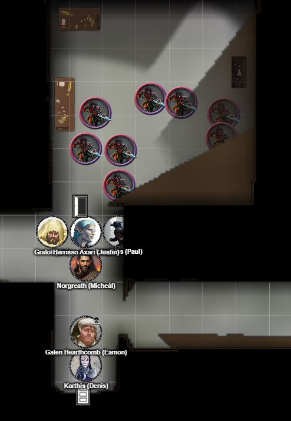

# 1 July 2026

**[Previously](2026-06-24.md):** We have found all five elements of the key for the Tyrant of War. When we merged them, we created a portal that let us travel to the Tyrant of War. Inside, we fought a band of strange devils, and afterward tried to rest on a ledge outside in a Tiny Hut cast by Karthis. Unfortunately, we were attacked from below, and had to retreat back into the Tyrant of War. There we were attacked by pirates, who we repelled. We eventually made our way to the control room of the Tyrant, where we defeated Captain Zareta, leader of the pirates. Before dying, Zareta had pressed some levers that made the craft lurch, but the remaining pirates could not tell us what she actually did. We restrained them and Barrisso led them to what seemed like a laboratory. Just as he entered the room, nine devils materialised, and he quickly shut the door on them, with the now-dying pirates trapped with them...

---

Lunghiss holds an action to attack anyone coming through the door.

Barrisso opens the door, revealing nine devils:

<figure markdown>
  
  <figcaption>Tyrant Devil Attack</figcaption>
</figure>

He attacks the nearest devil with his Fool's Shortsword, doing 12HP of damage plus an extra 11HP with Divine Smite. His second attack does 11HP, plus 12HP with Divine Smite. His third attack does 7HP, plus another 8HP with Divine Smite. Finally, his offhand attack with his +1 scimitar does 14HP of damage.

Norgreath casts Eldritch Blast(with Agonizing Blast) and Genie's Wrath, killing the same devil. The devil disappears into the floor. Norgreath continues his attacks on the devil behind him, doing another 29HP of damage.

Gralok attacks: his first misses, his second swipe does 8HP of damage. He moves back, taking an attack of opportunity and 11HP of damage.

The devils now attack. One who can reach Barrisso attacks with beard and glaive, doing 7HP damage.

A second devil attacks Gralok similarly, doing 9HP of damage. The remaining devils cannot reach the party.

Karthis casts Chromatic Orb, choosing acid, at a devil, doing 45HP of acid damage, killing him.

Galen casts Cure Wounds on Karthis, doing 20HP of healing.

---

Lunghiss nips inside and performs a sneak attack using Lathander's Radiant Blade, Savage Attacker and Booming Blade, doing 44HP of damage, then moves back outside the room.

Barrisso attacks the same devil, doing 39HP of damage, finishing him off. He, too, gets absorbed into the floor of the craft.

Norgreath casts Synaptic Static into the middle of our opponents, doing 22HP of psychic damage to each (if they do not make an Intelligence save).

Gralok moves into the room and attacks a devil with his greataxe, doing 9HP of damage.

The devils now regroup and attack us, but are weakened due to Norgreath's Synaptic Static. Three devils at the front attack. One almost hits Lunghiss, but he casts Shield in reaction to defend himself.

Karthis casts Chromatic Orb again, doing 17HP of acid damage.

Galen casts Cure Wounds on Lunghiss, giving him 16HP of healing.

Lunghiss performs a sneak attack using Lathander's Radiant Blade, Savage Attacker and Booming Blade, doing 44HP of damage, then moves back outside the room. He takes an attack of opportunity from a glaive, which does 7HP of damage.

Barrisso attacks with his Fool's Shortsword three times, doing 34HP of damage. His follow-up offhand does 15HP of damage (with Call the Hunt).

Norgreath casts Eldritch Blast(with Agonizing Blast) and Genie's Wrath at the devil straight ahead of him, doing 46HP of damage.

Gralok attacks the devil on the left of the door, who collapses. He continues his attacks, and fells a second devil. 

Three devils remain. One hits Gralok for   