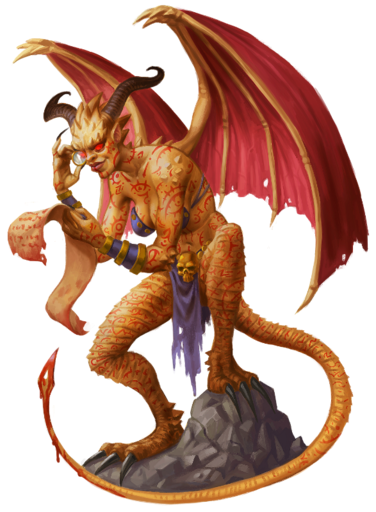
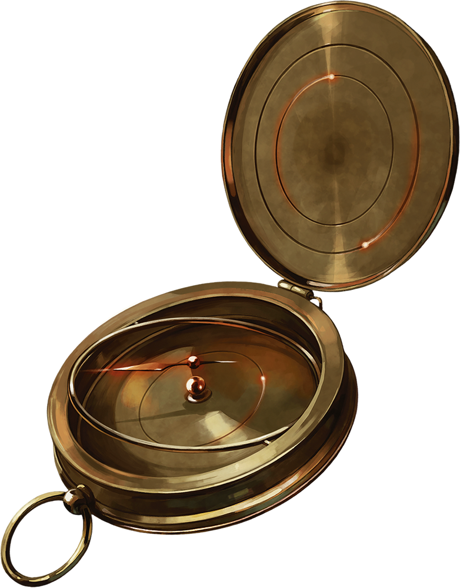
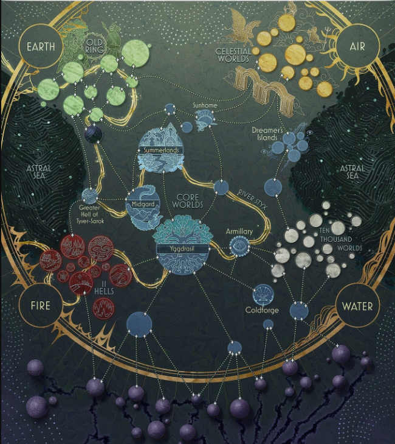

# 1 July 2026

**[Previously](2026-06-24.md):** We have found all five elements of the key for the Tyrant of War. When we merged them, we created a portal that let us travel to the Tyrant of War. Inside, we fought a band of strange devils, and afterward tried to rest on a ledge outside in a Tiny Hut cast by Karthis. Unfortunately, we were attacked from below, and had to retreat back into the Tyrant of War. There we were attacked by pirates, who we repelled. We eventually made our way to the control room of the Tyrant, where we defeated Captain Zareta, leader of the pirates. Before dying, Zareta had pressed some levers that made the craft lurch, but the remaining pirates could not tell us what she actually did. We restrained them and Barrisso led them to what seemed like a laboratory. Just as he entered the room, nine devils materialised, and he quickly shut the door on them, with the now-dying pirates trapped with them...

---

Lunghiss holds an action to attack anyone coming through the door.

Barrisso opens the door, revealing nine devils:

<figure markdown>
  
  <figcaption>Tyrant Devil Attack</figcaption>
</figure>

He attacks the nearest devil with his Fool's Shortsword, doing 12HP of damage plus an extra 11HP with Divine Smite. His second attack does 11HP, plus 12HP with Divine Smite. His third attack does 7HP, plus another 8HP with Divine Smite. Finally, his offhand attack with his +1 scimitar does 14HP of damage.

Norgreath casts Eldritch Blast(with Agonizing Blast) and Genie's Wrath, killing the same devil. The devil disappears into the floor. Norgreath continues his attacks on the devil behind him, doing another 29HP of damage.

Gralok attacks: his first misses, his second swipe does 8HP of damage. He moves back, taking an attack of opportunity and 11HP of damage.

The devils now attack. One who can reach Barrisso attacks with beard and glaive, doing 7HP damage.

A second devil attacks Gralok similarly, doing 9HP of damage. The remaining devils cannot reach the party.

Karthis casts Chromatic Orb, choosing acid, at a devil, doing 45HP of acid damage, killing him.

Galen casts Cure Wounds on Karthis, doing 20HP of healing.

---

Lunghiss nips inside and performs a sneak attack using Lathander's Radiant Blade, Savage Attacker and Booming Blade, doing 44HP of damage, then moves back outside the room.

Barrisso attacks the same devil, doing 39HP of damage, finishing him off. He, too, gets absorbed into the floor of the craft.

Norgreath casts Synaptic Static into the middle of our opponents, doing 22HP of psychic damage to each (if they do not make an Intelligence save).

Gralok moves into the room and attacks a devil with his greataxe, doing 9HP of damage.

The devils now regroup and attack us, but are weakened due to Norgreath's Synaptic Static. Three devils at the front attack. One almost hits Lunghiss, but he casts Shield in reaction to defend himself.

Karthis casts Chromatic Orb again, doing 17HP of acid damage.

Galen casts Cure Wounds on Lunghiss, giving him 16HP of healing.

Lunghiss performs a sneak attack using Lathander's Radiant Blade, Savage Attacker and Booming Blade, doing 44HP of damage, then moves back outside the room. He takes an attack of opportunity from a glaive, which does 7HP of damage.

Barrisso attacks with his Fool's Shortsword three times, doing 34HP of damage. His follow-up offhand does 15HP of damage (with Call the Hunt).

Norgreath casts Eldritch Blast(with Agonizing Blast) and Genie's Wrath at the devil straight ahead of him, doing 46HP of damage.

Gralok attacks the devil on the left of the door, who collapses. He continues his attacks, and fells a second devil.

Three devils remain. One hits Gralok. Another hits Barrisso for 22HP of damage.

Karthis casts Chromatic Orb again, doing 55HP of acid damage to a devil.

Lunghiss attacks a devil, doing 41HP of damage: he dies. Lunghiss then moves back.

Barrisso attacks with his Fool's Shortsword: the first target dies. The second targets takes 41HP of damage.

The last standing devil calls out: "Scribe! It is time!".

Norgreath finishes it off. But another devil emerges from the floor, whose tail appears to be dripping with a red liquid:

<figure markdown>
  
  <figcaption>Devil</figcaption>
</figure>

She holds a scroll which she stares at, and her body is covered with writing. Norgreath attempts to read it. It appears to be in an unintelligible script.
Lunghiss moves in and attacks her, doing 50HP of damage, then retreats.

Barrisso also attacks her, doing 43HP of damage. With that blow, he strikes her down and she fades into the floor like the other devils.

Norgreath moves into the control room and ask Ixona what she is doing.

She blinks her good eye and looks at Norgreath, distractedly.

"I'm, eh, I'm OK. How... how are things with the devils?"

"Did you know about them?"

"I did."

"They're dead now. Did you know about one called the Scribe?"

"No."

Norgreath notices that Ixona is fiddling with the controls of the craft, bt that something seems to be wrong.

"I need to sort something out.", Ixona says, leaving the room.

Norgreath inspects the controls. There are a set of levers on the chair, but nothing seems to be amiss. He checks the other chair in the control room. Norgreath searches Zareta's body. She's wearing light leather armour, and has various ordinary weapons such as knives and bows. She has a backpack with a leather book containing records of a type. In the cover of the book is a bloodstained, half-burnt, piece of parchment written in Infernal between Zareta and a devilish person, promising a tithe of souls from her use of the Tyrant of War in exchange for safe passage of the ship through the lower plains. Also in the backpack is a metal device that seems to be a magical compass:

<figure markdown>
  
  <figcaption>Compass</figcaption>
</figure>

At the back of the book is another piece of parchment, displaying what appears to be a cosmology of known Hells:

<figure markdown>
  
  <figcaption>Cosmology</figcaption>
</figure>

As Barrisso moves to where Ixona is, he spots Ixona moving to a door to the far-east. In the chamber beyond is an huge iron frame containing a fiery sphere. The frame has two levers attached to it. There are three bodies in the room, who look like they were part of Zareta's band. They seem to have died of self-inflicted wounds.

One of the levers is bent, as if bashed by a hammer. Ixona is trying to bend it back.

"What is the significance of this lever?"

"Without it, we cannot jump.", says Ixona.

She says the other lever is a defensive measure, triggering what she calls a "hell wave".

Barrisso asks Ixona: "You have a mission of vengeance. What can we do with the Tyrant of War afterwards?"

"Afterwards, you can do what you like with it."

"Perhaps we could get a planetar to destroy it?"

"Maybe. I will help you in any way I can."

"What is your target?"

"I want to bring this craft back to my home plane to use its power against a tyrant there, a Baron, who purely thru his noble birth amassed a warband that killed hundreds of people, including my family".

Lunghiss moves into the chamber but takes attacks from appendages from the floor, taking 26HP of damage.

Barrisso asks Ixona: "I'm a Paladin, and my oath is one of vengeance. However, is this vehicle the right choice, given the destruction is will produce?"

He notices the stare in her eye that she is getting frustrated with anyone limiting what she is trying to do.

"She wasn't precise with us!"

"It was him and just him."

"It was all of them! They were all following orders."

"How can you be sure you are not killing innocents?"

"There are no innocents."

"I am righting the scales of justices! Once we arrive, we will unleash the force of this craft on his forces."

Both Barrisso and Lunghiss feel that while they support her vengeance against the man who murdered her family, they will not let her kill innocents, and they tell her such.

Ixona seems to be losing hope and getting desperate.

"How-how - but...but he must die!"

"This is an evil weapon. It has destroyed whole worlds. It cannot be allowed to exist and to be used in the name of justice."

We feel that Ixona comes back from her crisis. She seems more measured and controlled.

"But this craft won't move anywhere unless we repair it. You cannot bring it anywhere to destroy it."

"Fair enough - we can destroy it, then help you kill the monster who killed your family. Are you agreeable with that?"

"Yes."

"In that case, we will destroy this craft and deal with the warlord. Do you agree to that?"

"I do."

We fix the lever that allows the Tyrant of War to jump to another location.

"Now we need to navigate from the Navigation Chamber of this craft", Ixona says. We go west to that chamber. It holds a wide cauldron-like object. A fog fills the bowl's interior. The bowl is a navigation tool: we can manipulate the fog to form an image of where we want to travel to.
