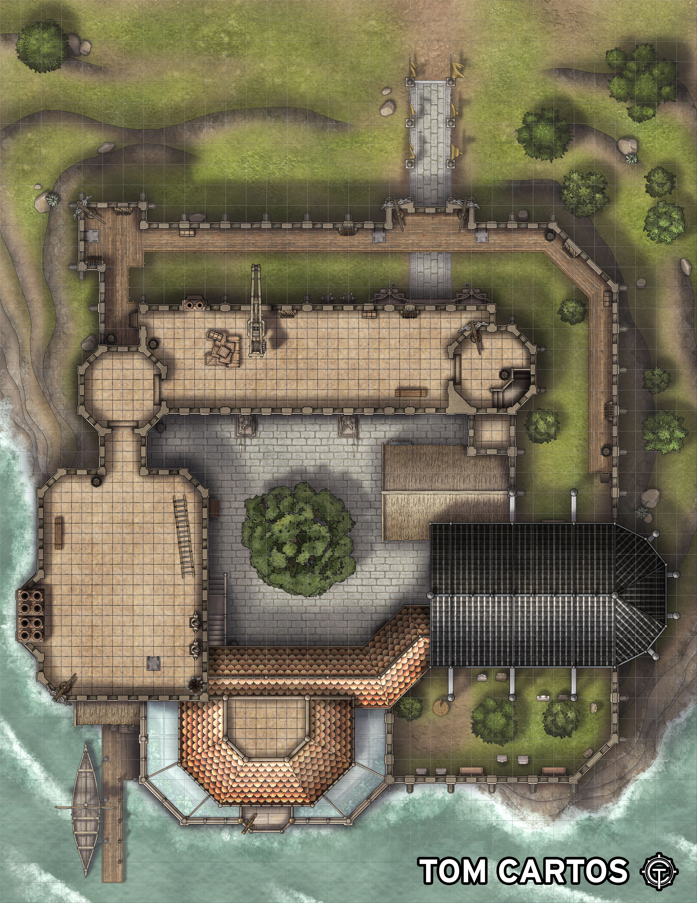
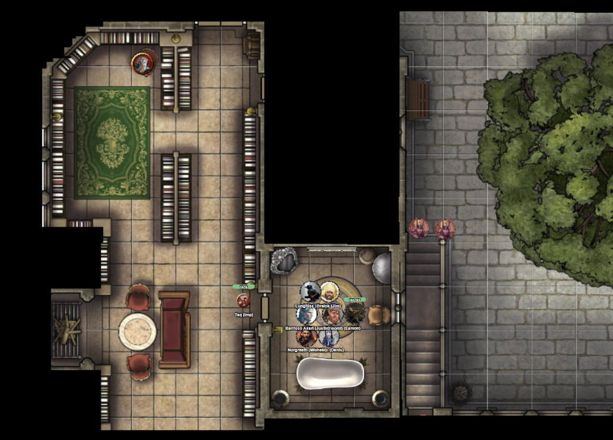
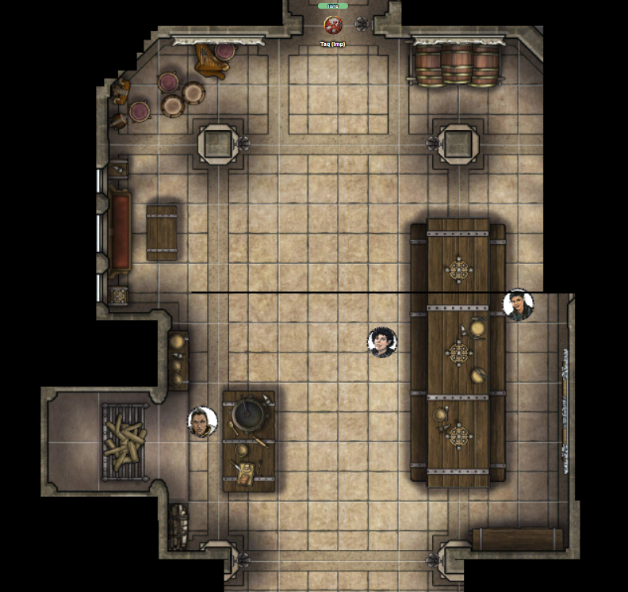

# 16 July 2026

**[Previously](2026-07-01.md):** We managed to commandeer the Tyrant of War and convinced our new companion Ixona not to use it on innocents in order to kill Baron Thutin, who murdered her family back on her world of K'thar. To destroy the vehicle, we decided to bring it the Positive Energy Plane - a continuous explosion of energy not meant for mortals. When we arrived, some in the party were blinded even inside the vehicle. But we managed to join hands so that Norgreath could planeshift us back to Elturel. There, the blinded members of the party are cured. We hoped that the energy of the Positive Energy Plane destroyed the craft. However, the Tyrant of War's key still activates a portal, suggesting the vehicle is still extant. We decided that it is probably out of reach of evil there and need to focus on aiding Ixona...

---

We research the location where we will be travelling to, including Castle Rend, where Baron Thutin resides. The Baron wields no magic, but his minions do. He has seven knight guardians, each with a separate title and ability: The Knight of Mercy, the Searing Knight, and so on. The one Ixona hates the most is the Star Knight. The Star Knight has a mystical connection to the Far Realm. She thinks in total he has 150 followers.

He prepare to travel using Norgreath's coin. He feels a faint tug from the token, and we step onto the silvery path that appears before us. We end up in the air about Elturel, but the landscape changes as we keep walking. We see an endless sea extending in all directions, interspersed with cloud-like objects. We continue onward. We see a grassy steppe beneath us with what look like leonine centaurs: human heads, but lion-like bodies. On we go, to see a swamp-like region with submerged trees among which bat-like creatures fly and roost, and trails of giant submerged beings in the water.

We feel a tug which leads us downward to low hills, which look to us relatively normal. We arrive at what appears to be night in woodlands at the base of the hills. We seem to have arrived at Ixona's world of K'thar.

"How far as we from the Baron's castle?"

"I think we are on the edge of the Razor Peaks. This north of the Duchy of Urasta and the Barony of Bedegar."

"How far do we need to travel?"

"Perhaps 100 miles."

"Is there a safe house you know of within give miles of the castle?"

"There are some villagers there, but I do not know how safe we will be there."

We discuss how we can travel swiftly and stealthily to our target."

"My dad was a weaver and he used to gather plants for his weaving. He did that in a forested area, not far from Castle Rend. I can scry that area and Karthis can teleport to that target."

Norgreath casts Heroes' Feast to give the party a boon.

Ixona then scries and uses Major Image to show Karthis the target.

Karthis casts Teleportation and we arrived at the forested area envisaged by Ixona. In the near-distance, we can see the Baron's castle.

We decide to send Norgreath's now resurrected familiar, Taq, to investigate the castle, carrying the rest of the party in Norgreath's magical ring.

We arrive at the castle, getting an aerial view of it:

<figure markdown>
  
  <figcaption>Castle Rend</figcaption>
</figure>

Taq can see various defenders including magic users on the battlements.

Norgreath orders Taq to find an entrance into the keep, then find a quiet room where we can decamp.

He manages to find a water closet with a bath within the keep. From this room, we can see out into a courtyard.

Taq leaves to reconnoitre via the door. He finds himself in a library where an older man sits in a chair.

<figure markdown>
  
  <figcaption>Castle Rend Keep</figcaption>
</figure>

Someone else, a non-human creature, is to the south, playing a harpsichord. We ask Ixona who that might be, but she does not think any of the knights are, shall we say, bardic.

Norgreath casts Major Image to show the rest of the party what he can see via Taq's eyes. Ixona does not recognise the people in the library.

Norgreath orders Taq to look for exits further into the castle. There are double doors to the north and double doors south-east.

Taq leaves through the north doors to find himself in a octagonal staircase leading down. He descends to the bottom of the staircase to see two armoured guards, with a passage to the south and doors to the east.

Taq continues south into what seems like a large refectory.

<figure markdown>
  
  <figcaption>Castle Rend Refectory</figcaption>
</figure>

There is one large table, with two people serving: a halfling and half-elf. On the west side of the room is a cook.

Taq crosses the room to its south side: to his east are double doors, to his south are single doors, and to the east are stairs going down.

He crosses back to the north of the refectory, then continues east along a long corridor with various men-at-arms milling about. Windows open onto a central area.

Taq continues east to find a staircase going up, massive double doors going north, and a flagstoned passage to the south. The double doors seem to be the entrance to the keep.
