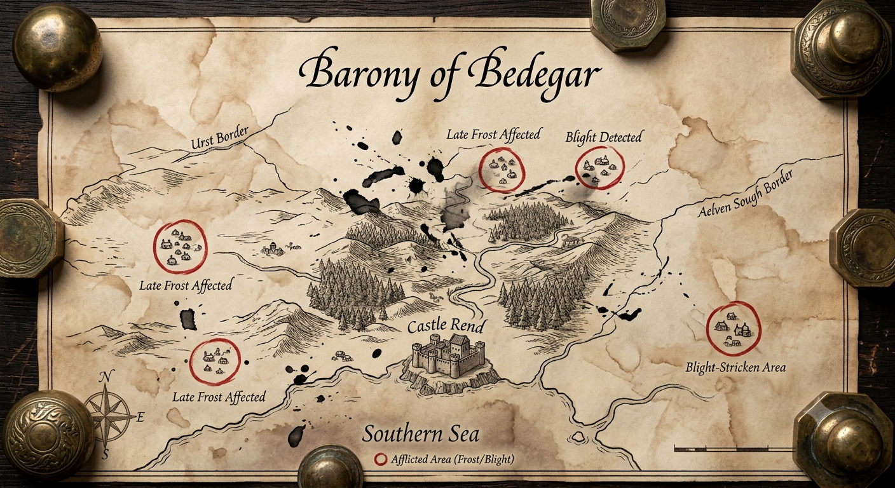
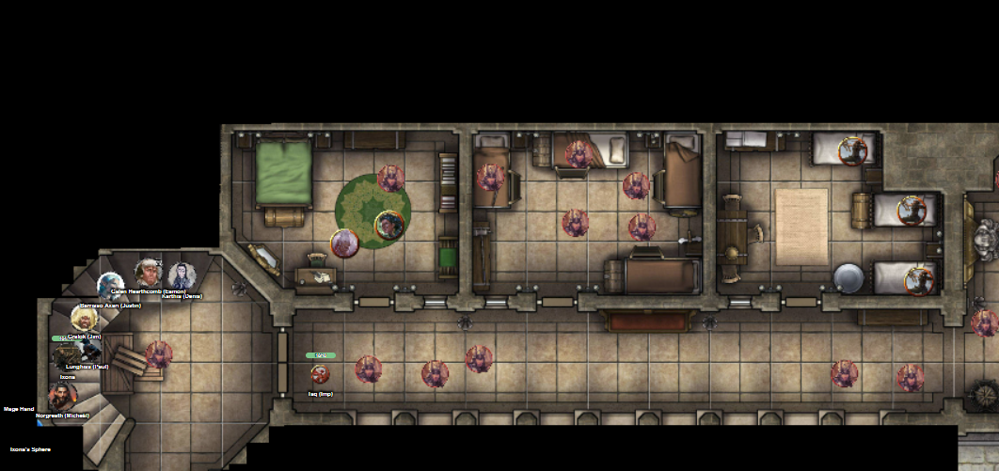
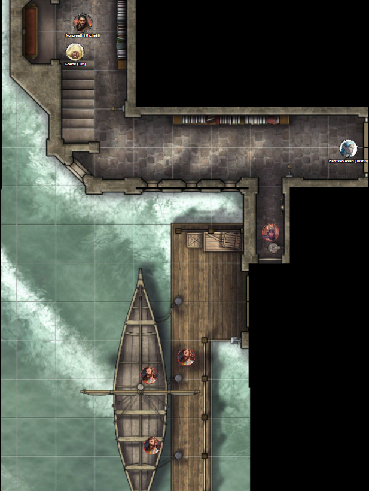
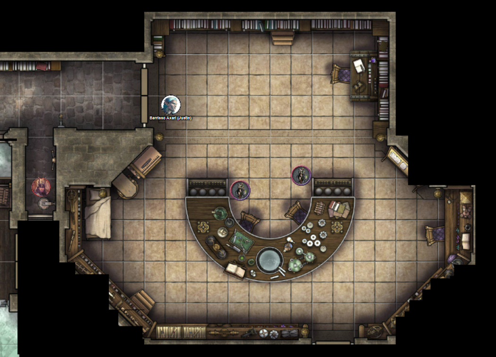

# 30 July 2026

**[Previously](2026-07-22.md):** We managed to commandeer the Tyrant of War and convinced Ixona not to use it on innocents in order to kill Baron Thutin, who murdered her family back on her world of K'thar. We left the Tyrant of War in the Positive Energy Plane, and teleported to the baron's heavily-defended castle. There, Taq mapped out the castle, including the War Room, where he found the Knight of Stars: one of the baron's guardians and the one that Ixona hates the most. Thinking her scream of revenge might have alerted enemies around us, the party left its hiding place in the castle and moved through it, dispatching defenders including Sir Connadus, whose head exploded from a Psychic Scream by Karthis. The Star Knight was killed but then arose as a dark spectral form, which was finally put to rest by Gralok with his axe. At this point, the Baron must have realised his cause was lost, and it seems he has teleported to safety along with his archmage.

---

Karthis casts Locate Creature to see if he can locate the baron, but he does not sense him in any direction. Ixona is distraught he seems to have escaped. In the meantime, we search the castle for anything powerful or valuable. On the table in the War Room is a map of the Barony of Bedegar:

<figure markdown>
  
  <figcaption>Barony of Bedegar Map</figcaption>
</figure>

Near the map are a bunch of scrolls. They seem to be about calculating grain reserves, shipment plans to hamlets, itemised list from the castle's granaries. "Waive storage for Miller Oaks - he took in three burnt-out families last month". Next to this are architectural blueprints on thick vellum detailing structural repairs to a key bridge over the river, and an ancient aqueduct. Beside this is a ledger showing wages to stonemasons, carpenters, and labourers. There is also a smaller version of the map showing troop movements. There are also a stack of petitions showing the baronial seal, transferring lands to displaced families. Finally, we see unsigned edicts from the baron about abolishing tariffs. A scrawled note says "Loss of tax revenue will affect the castle but prevent panic."

It's not obvious where the Baron may have fled. We ask Ixona for advice. Most of the Baron's knights had their own keeps in various places in the barony. It is about four days ride from our location to the northern board. Ixona warns us off travelling to the land of the elves.

We ask about the two villages on the map which are not afflicted by frost or blight. Ixona does not think there are any keeps in those locations. We ask her to mark on the map where she remembers keeps of the knights are.

Suddenly, someone enters the war room. "Do you realise the whole keep is in a panic?"

"And?"

"Please don't kill me. I am Father Bellerone, a cleric. Is there anything I do to dissuade you from killing the rest of the people in this keep?"

"We are looking for the Baron."

"It seems he has beat a hasty retreat with his archmage."

"Valthor?"

"And also tell us of the Baron."

"The Baron was tutored by Valthor for the last 10 years. When he was first being tutored, he was not the Baron - he was just a minor noble in a small hamlet on the borderlands. I don't like Valthor."

"Is Valthor a bad influence on him?"

"Whether it was Valthor, or the seven knights that Valthor brought to the kingdom from somewhere unknown."

"Which God do you worship?"

"From your speech and your friend's garb" - nodding to Galen - "I suspect you will have not have heard of My Lord."

"Do the people of the land favour the knights or Valthor?"

"Some of the knights have not been to the people. The Star Knight was one of the worst."

Father Bellerone nods to Ixona. "I see you don't remember me."

Ixona blinks and looks at him. "Kyother?"

He nods.

She suddenly realises she knows this man.

"I have been in this castle for the last 20 years. I served as an acolyte to the previous priest, who died when the Baron took over the castle."

We offer to make some amends by reviving some of those we have killed in the keep. Norgreath casts Raise Dead on the sage he killed in the library, who had been simply reading a book about crop husbandry and who he feels bad about.

Karthis asks are there any magical tomes in the keep, but there seem to be none.

We notice Father Bellerone wears a holy symbol on his chest, which seems to resemble a hearth.

Barrisso asks the cleric: "Ixona's family was killed when the baron took over this castle?"

"Many who resisted his rule were dealt with merciless. Most of the common soldiers however are loyal to the baron."

"What is at the lower level of the keep?"

"There are dungeons, but I do not know of the crimes of those there. There are also master of natures, who have laboratories down there. They are antithetical to my faith."

We decide to make our way to the dungeons.

We're confronted by a mass of guards. One runs away, screaming "Argh, it's them."

<figure markdown>
  
  <figcaption>Castle Rend Basement</figcaption>
</figure>

Ixona casts Finger of Death at a knight in the mass. She seems determined to seek justice. Perhaps a bit too determined.

Lunghiss moves down the stairs.

Gralok moves into the room to the south towards the dungeons.

Galen casts Entangle then moves, in the hope that anyone coming through the doors to the east of the stairwell will be grappled.

Karthis moves down into the stairwell.

Taq is able to fly above the entanglement cast by Galen.

Lunghiss moves south into the kitchen.

Gralok shouts at the kitchen staff: "We've just killed the Baron! We could kill you! Get out of our way!" This is not an unreasonable strategy.

They cheer, the fact we have not actually killed the Baron notwithstanding.

Barrisso continues south and down. He moves down a corridor with a guard at the end, with another corridor leading south. Barrisso flies towards the guard: "If you want to live, drop your weapons."

He drops his weapon.

Galen moves into the kitchen, as does Karthis.

Taq moves south as well, to beside his master Norgreath.

Lunghiss moves across the kitchen to the staircase to the south-east.

Gralok shouts out "Power to the people!" and moves to the same staircase and down.

Some of the party are now on a lower dock level, where a ship is berthed:

<figure markdown>
  
  <figcaption>Castle Rend Dock</figcaption>
</figure>

Barrisso enters a room similar to the library above. There are bookshelves on most of the walls. A bureau has multiple drawers, with writing material. There is a large semi-circular workbench with a steaming cauldron in the centre. Around it are alembics and strange vessels brewing. Plants, scrolls, and books litter the surface. Two humanoid creatures (blight druids) stand near the workbench. They wear skull-like helmets with cut-off antlers.

<figure markdown>
  
  <figcaption>Castle Rend Workbench Room</figcaption>
</figure>

Barrisso attempts to intimidate them: "Down on the ground!".

They do not fall to the ground. But they do back up and ask "Who are you?".

"I am your angel of death. On the ground, now!".

On the floor above, Karthis moves towards the stairs.

The two humanoids in the room with Barrisso perform a ranged spell attack. One hits, for 7HP of cold damage.

Lunghiss moves down the stairs to the dock level then continues towards Barrisso. Gralok follows him.

Norgreath joins Lunghiss.

Barrisso flies towards one of his attackers (female) and attacks, doing (with Divine Smite) 113HP of damage - she dies. With her falling, Barrisso shouts to the other "Do you want to die too?"

Galen and Karthis both move to the bottom of the stairs.

The other humanoid screams "Begone!" and launches a Blight Wave at Barrisso. Fortunately he is immune to both necrotic and poison damage. The humanoid scrambles around the desk and hides, presumably in despair.

Lunghiss moves into the room and fires his shortbow at her, doing 11HP of damage.

Gralok attacks her with his Blazing Cold Greataxe, doing 20HP of damage.

Norgreath casts Eldritch Blast with Agonizing Blast and Genie's Wrath, doing 44HP of damage.

Barrisso flies and attacks her: his first blow kills her.

--

We check the room. The books are mainly related to herbalism and ambulatory plants. There are nine unknown potions which we take, along with a bunch of non-magical scrolls. Barrisso casts Detect Magic but there is nothing else on the bodies of notice.

Lunghiss identifies four doses of raw material that he could use to create poisons.

To the south, Barrisso opens a door. A guard see him, takes fright, and [runs away...](2026-08-05.md)
