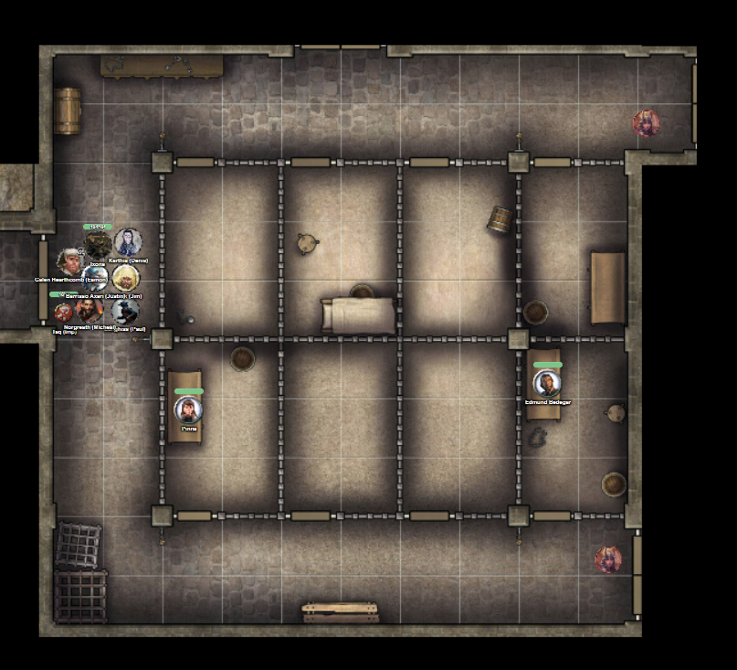
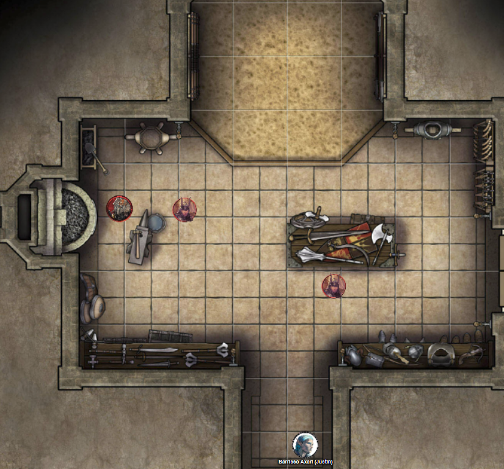
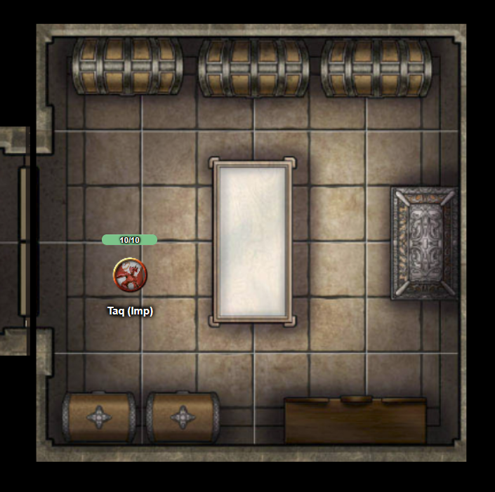

# 5 Aug 2026

**[Previously](2026-07-30.md):** We managed to commandeer the Tyrant of War and convinced Ixona not to use it on innocents in order to kill Baron Thutin, who murdered her family back on her world of K'thar. We left the Tyrant of War in the Positive Energy Plane, and teleported to the baron's heavily-defended castle where we battled him and his allies. Realising his cause was lost, the Baron teleported to safety along with his archmage. We rifled through his papers, but didn't find any definite clues. Suddenly, a cleric named Father Bellerone arrived and told us some backstory about the Baron. He claimed that the archmage, named Valthor, brought the seven knights to the kingdom and were perhaps a bad influence on the baron. Ixona recognised the cleric as a novice who was previously called Kyother. He told us that many of the common soldiers are loyal to the baron. We made our way down in the lower levels of the castle, where we might find both prisoners and also the laboratories of blight druids loyal to the baron. There we killed the druids and looted their room.

---

We interrogate a guard.

"I am guarding this area." He seems to be guarding doors both to the north and to the east.

"Are you going to stop us?"

"Who are you?"

"We're cleaning up these rooms and that one is next."

Norgreath intimidates him and he backs away.

We open the doors to find ourselves in the castle dungeon:

<figure markdown>
  
  <figcaption>Castle Rend Dungeon</figcaption>
</figure>

Norgreath casts Eldritch Blast with Agonizing Blast and Genie's Wrath at a guard: he dies.

Barrisso flies towards and intimidates the other guard. Having seen what happened his colleague, he drops him weapon. Barrisso orders him into a nearby cell.

Karthis talks to a female prisoner (who named Pinna) and asks why she is locked up.

"They burned my herbalist shop to the ground. I was just trying to keep the villagers healthy."

We talk to another prisoner (named Edmund Bedegar).

"They keep me here so I cannot resume my true position - Baron of this castle."

Ixona comes over and looks. "This is the son of the old baron."

"Is he of good standing with the people?"

"I haven't been here in years. He was due to inherit the barony."

"Was his father in good standing?"

"Certainly. Much more than his replacement."

We decide to let Edmund out.

We warn the herbalist woman not to wander around as the castle is still dangerous.

Edmund is nervous but reaches down to the take the blade of the fallen guard.

We tell him how we fought and killed some of the knights, but that the baron and his archmage teleported away.

"Do you know where they might have gone?"

"I can only guess to one of the knights' strongholds."

"That is there our mission will take us, to deal with the usurper."

We ask if he has any forces loyal to him.

"None of my loyal vassals have been free to help me these two years."

"Would it be possible to muster them?"

"Now the usurper has been roistered, hopefully my allies will return."

We continue to check the castle. We exit the dungeon and turn north into the pantry. This is a small room with a dumb-waiter to bring items to the floor above. Gralok samples some of the cheese.

We move back to the dungeon and open a door to its north. Beyond looks what could be an armoury, containing a dwarven blacksmith and two guards.

<figure markdown>
  
  <figcaption>Castle Rend Armoury</figcaption>
</figure>

Karthis casts Fire Bolt at the guard to his right, doing 27HP of damage.

Lunghiss moves and downs that guard with his Lathander's Radiant Blade.

Gralok moves into the armoury and throws two javelins at the other guard, doing 32HP of damage.

Galen casts Sacred Flame at the guard, who dies.

Norgreath intimidates the dwarf, ordering him to drop the hammer he holds.

He looks at Norgreath, the two fallen guards, Lunghiss and his bloodied blade, Karthis and the sparks of fire on his fingertips... and he laughs a deep throaty laugh. "Have you come to overthrow the usurper? FINALLY. I can stop making weapons for these arseholes."

"Yes, we are trying to restore the old baron to his rightful place."

We ask Edmund to vouch for the dwarf.

"I'm sure he is loyal - he taught me how to fight."

We ask about the sandpit in the room - it seems to be some kind of training pit.

--

We continue to check the castle. Taq flies east through a passageway into a treasury:

<figure markdown>
  
  <figcaption>Castle Rend Treasury</figcaption>
</figure>

Edmund says he would rather us not check this, so we leave. We head back towards the blight druids' laboratory, then to the dock we saw earlier. When we arrive, the ship we saw earlier is no longer there.

We check out the castle crypt, which has various shrines and symbols. We ask Edmund about the hearth symbol we have seen often.

"It is the symbol of Kayliss the Hearth-keeper. There is also the symbol of the Grave Mother - a willow draped over a tomb. All the Vigilant Shield: a stone keep wall with an eye in it."

--

We go back up to the castle kitchen via a spiral staircase to the ground floor of the castle. We know from Taq's early scouting that there are many guards here: perhaps 30 in all.

<figure markdown>
  
  <figcaption>Castle Rend Ground Floor</figcaption>
</figure>
