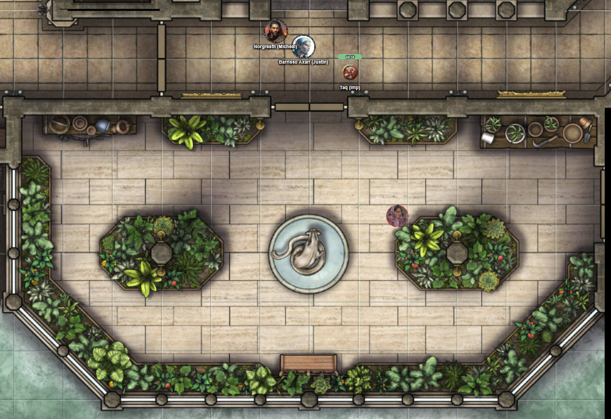
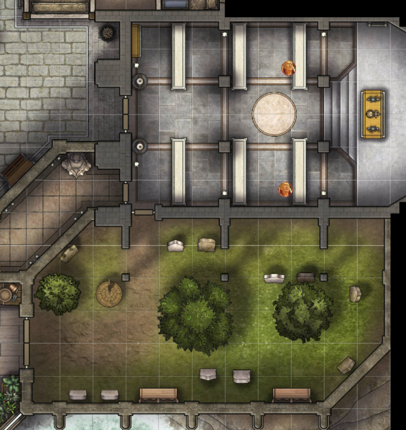

# 5 Aug 2026

**[Previously](2026-07-30.md):** We managed to commandeer the Tyrant of War and convinced Ixona not to use it on innocents in order to kill Baron Thutin, who murdered her family back on her world of K'thar. We left the Tyrant of War in the Positive Energy Plane, and teleported to the baron's heavily-defended castle where we battled him and his allies. Realising his cause was lost, the Baron teleported to safety along with his archmage. We rifled through his papers, but didn't find any definite clues. Suddenly, a cleric named Father Bellerone arrived and told us some backstory about the Baron. He claimed that the archmage, named Valthor, brought the seven knights to the kingdom and were perhaps a bad influence on the baron. Ixona recognised the cleric as a novice who was previously called Kyother. He told us that many of the common soldiers are loyal to the baron. We made our way down in the lower levels of the castle, where we might find both prisoners and also the laboratories of blight druids loyal to the baron. There we killed the druids and looted their room.

---

We interrogate a guard.

"I am guarding this area." He seems to be guarding doors both to the north and to the east.

"Are you going to stop us?"

"Who are you?"

"We're cleaning up these rooms and that one is next."

Norgreath intimidates him and he backs away.

We open the doors to find ourselves in the castle dungeon:

<figure markdown>
  
  <figcaption>Castle Rend Dungeon</figcaption>
</figure>

Norgreath casts Eldritch Blast with Agonizing Blast and Genie's Wrath at a guard: he dies.

Barrisso flies towards and intimidates the other guard. Having seen what happened his colleague, he drops him weapon. Barrisso orders him into a nearby cell.

Karthis talks to a female prisoner (who named Pinna) and asks why she is locked up.

"They burned my herbalist shop to the ground. I was just trying to keep the villagers healthy."

We talk to another prisoner (named Edmund Bedegar).

"They keep me here so I cannot resume my true position - Baron of this castle."

Ixona comes over and looks. "This is the son of the old baron."

"Is he of good standing with the people?"

"I haven't been here in years. He was due to inherit the barony."

"Was his father in good standing?"

"Certainly. Much more than his replacement."

We decide to let Edmund out.

We warn the herbalist woman not to wander around as the castle is still dangerous.

Edmund is nervous but reaches down to the take the blade of the fallen guard.

We tell him how we fought and killed some of the knights, but that the baron and his archmage teleported away.

"Do you know where they might have gone?"

"I can only guess to one of the knights' strongholds."

"That is there our mission will take us, to deal with the usurper."

We ask if he has any forces loyal to him.

"None of my loyal vassals have been free to help me these two years."

"Would it be possible to muster them?"

"Now the usurper has been roistered, hopefully my allies will return."

We continue to check the castle. We exit the dungeon and turn north into the pantry. This is a small room with a dumb-waiter to bring items to the floor above. Gralok samples some of the cheese.

We move back to the dungeon and open a door to its north. Beyond looks what could be an armoury, containing a dwarven blacksmith and two guards.

<figure markdown>
  
  <figcaption>Castle Rend Armoury</figcaption>
</figure>

Karthis casts Fire Bolt at the guard to his right, doing 27HP of damage.

Lunghiss moves and downs that guard with his Lathander's Radiant Blade.

Gralok moves into the armoury and throws two javelins at the other guard, doing 32HP of damage.

Galen casts Sacred Flame at the guard, who dies.

Norgreath intimidates the dwarf, ordering him to drop the hammer he holds.

He looks at Norgreath, the two fallen guards, Lunghiss and his bloodied blade, Karthis and the sparks of fire on his fingertips... and he laughs a deep throaty laugh. "Have you come to overthrow the usurper? FINALLY. I can stop making weapons for these arseholes."

"Yes, we are trying to restore the old baron to his rightful place."

We ask Edmund to vouch for the dwarf.

"I'm sure he is loyal - he taught me how to fight."

We ask about the sandpit in the room - it seems to be some kind of training pit.

--

We continue to check the castle. Taq flies east through a passageway into a treasury:

<figure markdown>
  
  <figcaption>Castle Rend Treasury</figcaption>
</figure>

Edmund says he would rather us not check this, so we leave. We head back towards the blight druids' laboratory, then to the dock we saw earlier. When we arrive, the ship we saw earlier is no longer there.

We check out the castle crypt, which has various shrines and symbols. We ask Edmund about the hearth symbol we have seen often.

"It is the symbol of Kayliss the Hearth-keeper. There is also the symbol of the Grave Mother - a willow draped over a tomb. All the Vigilant Shield: a stone keep wall with an eye in it."

--

We go back up to the castle kitchen via a spiral staircase to the ground floor of the castle. We know from Taq's early scouting that there were many guards here: perhaps 30 in all.

<figure markdown>
  
  <figcaption>Castle Rend Ground Floor</figcaption>
</figure>

We plan how to make the guards surrender without having to kill them. We send Taq out to check. In the initial courtyard in front of the main gate, there are now only four guards. Taq then checks the three small rooms to the north off the cloister. There are still three archers in the archer barracks, while only one guard in the guard barracks. The third room is empty.

Norgreath intimidates the four guards in front of the main gate.

"Lay down your weapons and we will spare your lives."

See him and his impish familiar, they drop their weapons.

"Don't take our souls!"

Norgreath binds their arms and puts their weapons in a pile.

Barrisso goes to the main courtyard and levitates in front of the four guards there.

"I am the Soul of Vengeance! Lay down your arms or suffer my wrath."

They look scared and also drop their weapons. Barrisso orders them to the tree in the middle of the courtyard, and binds them there.

Lunghiss moves towards the room where the archers are.

Gralok comes and asks for more cheese loudly.

Galen moves into the main courtyard.

We move the eight restrained guards into the dungeon below and ask them where their colleagues have disappeared to. They seem to have fled.

Norgreath enters the room with the archers and intimidates them. They do join their comrades in the dungeon, as does eventually the guard in the room next door.

Barrisso checks the stables on the east side of the main courtyard. It's empty, and looks like people readied the horses and left in great haste.

Barrisso then flies to the cloister that bounds the main courtyard to its south, and demands the surrender of the two guards and one archer there. They give up immediately and also join the others in the dungeon.

Barrisso moves south through the cloister into a lush greenhouse containing a fountain:

<figure markdown>
  
  <figcaption>Castle Rend Greenhouse</figcaption>
</figure>

Elstar, the elderly gardener here, takes the hand of Edmund and says "It it so good to see you."

"Find a quiet place: it is not quite safe yet."

"I should be quite safe here."

Through doors to the east, we find a private garden-cum-graveyard. Through a door north, we enter the castle chapel. There are only two unarmed acolytes here.

<figure markdown>
  
  <figcaption>Castle Rend Chapel and Graveyard</figcaption>
</figure>

--

We return upstairs with Edmund and formally hand over the castle to him. Father Bellerone is there. When we check the outer keep, we realise that is where most of the castle guards have retreated to. Barrisso flies to the south-east, and orders a group of seven guards there to surrender.

"Who are you?"

"The Soul of Vengeance, and Favoured of Heaven!"

"Where is the baron?"

"The younger baron is now restored. You have the opportunity to leave this castle if you submit."

They don't drop their weapons, and some of the guards take their crossbows and ready them.

"OK, we're leaving then."

"The gate is that way."

The guards move north towards the outer gate of the keep.

Karthis darts out through the inner gates and casts Fireball at the group of 16.

Lunghiss holds an action to attack anyone who comes through the inner gates.

Gralok moves out into space outside the inner keep and rages, choosing Form of the Beast.

Galen casts Spirit Guardians.

Taq flies over to the outer keep to see if anyone else is coming.

Ixona remains with the baron.

Norgreath casts Summon Aberration - a beholderkin.

Barrisso now tries to intimidate them again. "NOW will you put down your weapons?"

They don't put down their weapons.

Karthis casts Fireball again, and the guards all die.

Lunghiss moves outside the inner keep and holds an action to attack if someone attacks him.

An enemy wizard casts a Sculpted Explosion of thunder centred on Galen, taking in Karthis, Lunghiss, and Gralok. Karthis, Gralok and Galen take 21HP of thunder damage.

Lunghiss attacks the nearest guard, doing 48HP of damage (plus 12HP thunder damage if they move), then retreats back into the keep.

Gralok moves to the same guard.

Karthis takes an Arcane Burst attack, which does 12HP psychic damage.

Galen and his Spirit Guardians move beside Gralok. He casts Toll the Dead at the guard attacked by Lunghiss, and kills him.

An enemy wizard casts Ice Storm at Karthis, Gralok and Galen. Gralok takes 16HP of damage, while Galen takes 10HP.

A guard runs at Galen and takes 8HP damage from his Spirit Guardians. Meanwhile, other guards move towards the party. Galen and Karthis are hit by a flurry of heavy crossbow bolts.

Norgreath's beholderkin casts Eye Ray at the guard beside Gralok, doing 9HP of damage.

Longbowmen attack Galen and Karthis, wounding them badly...
