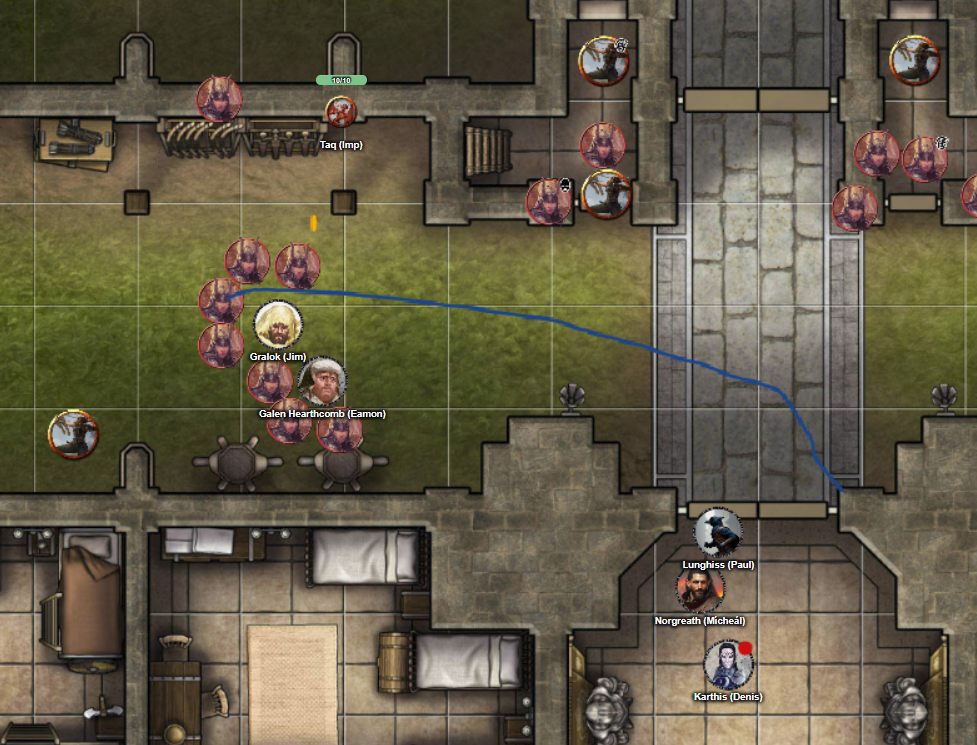

# 19 Aug 2026

**[Previously](2026-08-12.md):** We commandeered the Tyrant of War and convinced Ixona not to use it on innocents in order to kill Baron Thutin, who had murdered her family. We travelled to her world K'thar, cleared the baron's inner keep of his allies, and freed Edmund, the son of the previous baron. When we reached the outer keep, we found that was where most of the usurper's forces had gathered. Barrisso persuaded some to leave the castle, but once Karthis attacked them with fireballs, the rest of the baron's forces retaliated. A mass battle ensued with multiple foes, including mages of various types. Karthis was felled by an Arcane Burst from a mage on the gate tower, while Barrisso is also down after a barrage of blows.

---

Norgreath casts Wind Wall to create a defence that protects us from the enemy archers on the outer wall of the keep:

<figure markdown>
  
  <figcaption>Wind Wall</figcaption>
</figure>

The wind wall kills one of the enemy. He also closes one of the great doors of the keep to offer us some cover.
An enemy archer fires their longbow, but the arrow bounces harmlessly from our wind wall.

A second archer fires, but is also neutralised.

A third archer realises that firing arrows is futile, so he moves position.

A fourth fires at Gralok, doing 7HP of damage.

A fourth shoots at Galen, doing 16HP of damage.

A sixth takes a shot at Gralok, but misses.

A seventh moves along the wall.

The archer on the ground shoots at Galen, doing 12HP of damage.

Karthis performs a death save and succeeds. He is now stabilised.

Barrisso performs a death save and succeeds.

Lunghiss casts Shadow Blade, then moves outside the keep gate and sneak attacks a man-at-arms beside Galen. He kills them, then moves back into the keep.

Gralok runs towards the keep doors, triggering three attacks of opportunity, which do 25HP of damage.

Galen also runs to the keep doors. Fortunately none of the attacks of opportunity do any damage.

An evoker wizard casts a sculpted explosion towards the keep doors. Galen is felled, Gralok is down to 1HP, and Karthis' condition is now destabilised.

Taq keeps watch of our enemies' movements.

Norgreath maintains concentration on his Wind Wall.

Lunghiss takes a blow from a man-at-arms in the doorway, but casts Shield to deflect it.

---

Norgreath casts Eldritch Blast to push the men-at-arms in the doorway away from it. His first blast does 22HP of damage and pushes the enemy back 10 feet. He casts the same at a second man-at-arms, who is hurtled back into the wind wall, and takes 7HP more. He casts a third blast sending him again into the wind wall.

Enemy archers start making their way along or down from the outer wall towards us.

Karthis makes a successful death save.

Lunghiss closes the open door. But he cannot bar the door at the same time.

Gralok bars the door, then braces it.

Galen fails a death save.

Taq moves to the gate of the outer keep.

Enemy men-at-arms swarm towards the keep's doors.

---

Norgreath gives a healing potion from Gralok to Galen, giving him 6HP. However, Galen still has a level of exhaustion.

Karthis rolls a successful death save.

Barrisso also rolls a successful death save and is successful.

Taq communicates that an enemy mage is coordinating the retreat of the enemy archers and men-at-arms from the outer keep.

Lunghiss gives Karthis one of Gralok's health potions and restores 4HP.

Galen casts Cure Wounds on Gralok, giving him 21HP.

Taq moves to Barrisso to help him.

Enemy men-at-arms continue to retreat out the main gate.

Norgreath uses his Rod of the Pact Keeper to regain a spell slot.

Karthis uses a Potion of Greater Healing to heal himself for 18HP.

Taq sees to the far west a woman on a mighty warhorse, who dashes quickly to the main gate and out of the castle.

Galen starts a ritual of Prayer of Healing.

Taq reaches Barrisso and administers a Potion of Healing to him.

Norgreath goes back to Ixona and Edmund and tells them what happened. He advises they need to secure the keep.

"But we don't have any men-at-arms", complains Edmund.

We discuss using the contents of the treasury - if any left - to hire mercenaries.

Barrisso comes back to the keep and uses Lay on Hands to restore 75HP to himself.

Galen's Prayer of Healing gives everyone 18HP back. A second prayer gives us 28HP hack. The party then takes a short rest.

---

Afterward, we form a council with the baron, Ixona, the dwarven blacksmith, and Father Bellerone.

"Do you know where the usurper's forces could be?"

"There are militia at various places in the kingdom, but this force was by far the biggest. It looks like a third of their forces have been destroyed and the rest have been routed. Perhaps we can send scouts to see the force remains coherent or has scattered. In theory, they could bring a total of 200 men-at-arms."

"We fear the magicians."

"I fear the knights the most.", says Edmund.

We think five of the seven knights are still alive.

"How far away is the nearest militia group?"

"Maybe half a day's ride?"

We seem to have at least a day before the enemy returns. We decide to take a long rest.

---

While we slept, some of the people from the castle went to local places to recruit, and now the keep has a small militia to guard it. They don't seem to be as high quality as the forces that we faced, but for now they will suffice.

Elenar (the sage we brought back to lift) has been researching in the library, and suspects the old baron was taken by the archmage to the Court of the Lunar Knight and gives us directions.

"The Lunar Knight has strange, fey powers. The Court fades in and out of existence. Sometimes it's there, and sometimes it isn't. The knights have talked about the Heralds of the Comet."

Lunghiss has heard of this group *(Arcana check)*. A weird cult that believes that the Multiverse is a flawed creation, and looks forward to the end of all planes of existence. After the Multiverse's destruction, only a formless void will remain.

We ask the baron if the enemy forces will return. He hopes that the people will rally to his cause.

Pinna, the female prisoner we freed, invites us to the castle refectory where a small feast awaits us. Meanwhile, some of the men-at-arms have been searching the rooms of the knights who stayed here, and show to us a bag, soaked in blood, containing three obsidian shards covered in runes. In one of the chambers where a knight stayed, there are three blue crystal tablets with unrecognisable writing. In another room, they found dark purple bones of a strange creature. The ends of the bones are glowing blue with a strange power.

Lunghiss uses Comprehend Languages to read the blue crystal tablets. There is a word that he cannot translate. However, the general meaning is that they are calling to some entities that are "from beyond" or "from the Void". The Void seems to correspond to the purple area of our cosmology map. Karthis thinks that our concept of the Far Realm that corresponds to this Void: an eerie place where the normal laws of the universe do not work.

---

Meanwhile, Taq has been following the retreating forces. They have split up, and two mages are not longer together. Some are continuing north-west, while some head north or west. We think they are heading to garrisons we saw on a map in order to recuperate.

We ask the baron for any aid in his stores that may help us. He gives us a Potion of Healing (Greater) each. He also has a skull.

"This skull, or mimir, has been used over generations to guide us. If you throw it in the air and ask it questions, it can help answer them. Sometimes it is not very helpful.

Lunghiss uses Comprehend Languages to read the runes on the obsidian shards: the language they are in is familiar. He is pretty sure that the bag that holds the runes is made from human skin. He takes the runes from the bag. Lunghiss is now obsessed with these shards and will not relinquish them. He takes them out and looks at them, caresses them, and cradles them.

Meanwhile, Norgreath looks at the bones. Barrisso throws the mimir up into the air and asks about the shards...
