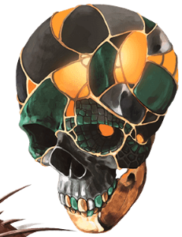
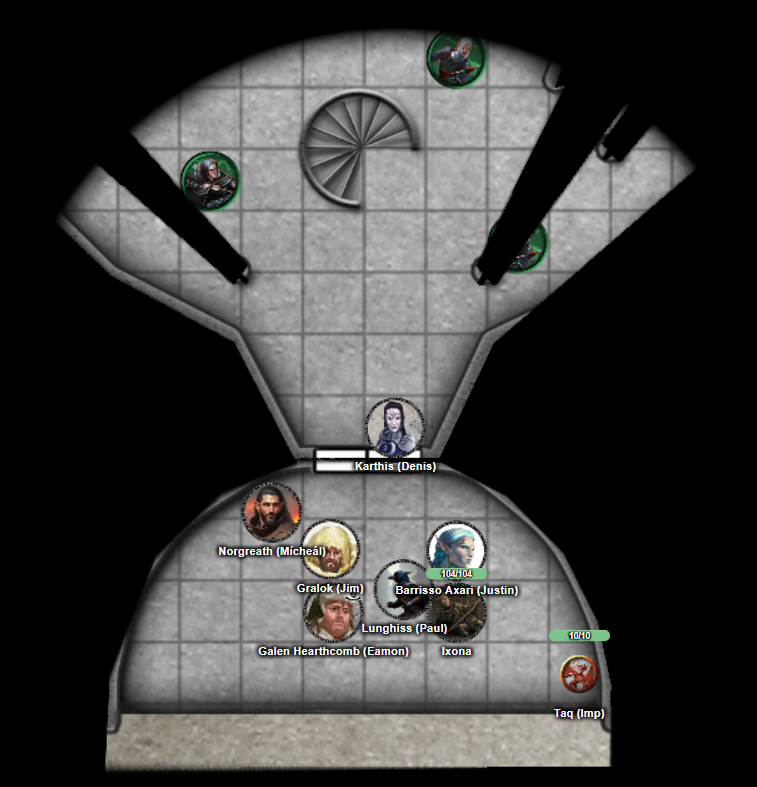
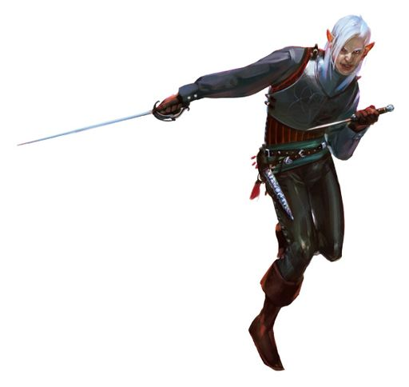
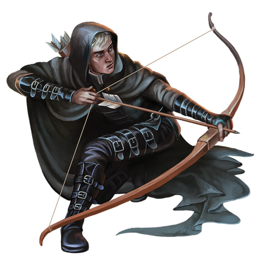
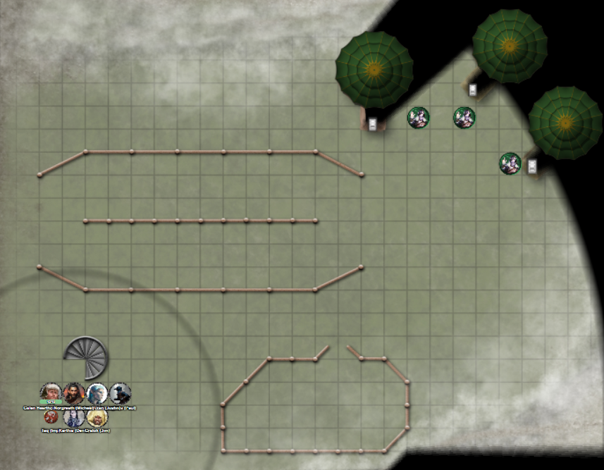

# 26 Aug 2026

**[Previously](2026-08-19.md):** We commandeered the Tyrant of War and convinced Ixona not to use it on innocents in order to kill Baron Thutin, who had murdered her family. We travelled to her world K'thar, cleared the baron's inner keep of his allies, and freed Edmund, the son of the previous baron. We found most of his force's in the outer keep, and a huge battle ensued during which Karthis and Barrisso were felled. We used a Wind Wall to shield our retreat back to the inner keep, while an enemy mage organised the retreat of their force. We held a council with the baron, Ixona, the dwarven blacksmith, and Father Bellerone, while Taq scouted the retreating enemy. In the chambers of the knights, strange objects are found, including three obsidian shards covered in runes. To aid us, the baron gave us a mimir that has been in his family for generations, and we are about to use it to ask about the shards...

---

Barrisso throws the mimir into the air, and asks about the obsidian shards.

<figure markdown>
  
  <figcaption>Mimir</figcaption>
</figure>

The mimir hovers, orients itself, and moves its lower jaw up and down. Finally, its eye sockets glow. It turns to the obsidian shards and observes them carefully. It turns to us and speaks in Common.

"These shards are midnight stones. They are all different. They have different capabilities. Two of them have a permanent effect. One has a daily ability."

"Can you explain in detail the effects of all three?"

"The first shard, with a daily ability, can send a ray of energy doing force damage within 120 feet. They may be able to dodge the effect.

"The second shard needs to be absorbed into someone's body. They will gain resistance to slashing damage." Barrisso takes this.

"The third shard also needs to be absorbed. This will improve their wisdom." Norgreath takes this.

As they put the stones on their exposed skin, the runes on the shards glow a sickly purple as they sink into their flesh until they are no longer visible.

We ask the mimir for more information about the entity that could be summoned by the tablets.

"They are tools of Void cultists to bring things into this realm."

We ask about the dark purple bones.

"These are bones of a creature beyond this realm, from the Void."

Lunghiss investigates, and there are some things in the chamber we are in giving us hints. A symbol appears on several of the artifacts: a horizontal Y with bisecting lines. These symbols are on a chest and on books in the room.

Barrisso checks the books. One is called "The Whispers from the Stars' Gulf", written by a Valen of the Obsidian Spire. It is a worrying treatise charting constellations which have vanished over centuries. The author thinks these are being consumed from the Void."

We ask the mimir about the summoning rituals or the Obsidian Spire. He does not know much about either.

We ask about the place where the baron and the archmage have fled to: The Court of the Lunar Knight, where resides The Knight of the Twilight Sky, also called Lady Morgant. We decide to go there. First we assist in the burial of the dead. Karthis searches the bodies of the three enemy spell casters. One has a magical wand, Wand of the War Mage +1.

---

We set off for the Court of the Lunar Knight. The first day of travel is uneventful. We pass a number of hamlets and villages, who seem to be suspicious of us travellers. Galen casts Temple of the Gods as a refuge for the night. We rest for the night.

---

We wake up the next day, refreshed, and continue on our journey. We find ourselves near the entrance to an ivory tower with silvery metal doors forming a half-circle. When we step outside the half-circle, we cannot see the rest of the tower. It does not seem to be on the same plane of existence. This seems to be the Court of the Lunar Knight.

Karthis opens the door. Everyone has to make a Wisdom saving throw. Gralok fails and is cursed with the Curse of the Crescent Moon. Barrisso casts Remove Curse on Gralok.

Inside the doors, there is a strange luminous glow that rises and fades.

<figure markdown>
  
  <figcaption>The Court of the Lunar Knight</figcaption>
</figure>

Around the room are six slender pillars of white stone supporting the ceiling. A spiral staircase of mother of pearl ascends to the next levels. There seem to be three elvish-looking defenders moving towards us:

<figure markdown>
  
  <figcaption>Elvish Defender</figcaption>
</figure>

<figure markdown>
  
  <figcaption>Elvish Defender</figcaption>
</figure>

Karthis casts Fireball at them. It seems they manage to evade most of the damage.

Gralok rages, and then uses Call the Hunt. He then attacks with his Blazing Cold Greataxe, doing 9HP of slashing damage.

Norgreath moves and attacks one of the bowmen with Eldritch Blast with Agonizing Blast and Genie's Wrath, doing 56HP of damage. He then flies up to the ceiling.

Taq goes invisible and heads for the staircase to scout if anyone is coming down.

Lunghiss is attacked by a bowman. Lunghiss takes 30HP of damage plus 11HP of poison damage.

Ixona casts Aganazzar's Scorcher at a defender.

Galen moves and casts Toll the Dead at the bowman, doing 29HP of damage.

The next defender attacks Gralok with his rapier, doing 17HP of damage.

The next defender attacks the hovering Norgreath with his rapier and dagger, doing 16HP of damage.

Lunghiss casts Shadow Blade, then sneak attacks one of the defenders using Booming Blade, doing 54HP of damage. He then moves back out.

Barrisso casts Aura of Purity on the party so we are resistant to our attackers' poison. He then attacks with his scimitar and uses Divine Smite, doing 20HP of damage.

---

Karthis moves and attacks an archer with Poison Spray, but he takes no damage.

Gralok attacks a defender with his greataxe, doing 26HP of damage.

Norgreath attacks the defender beside him with Eldritch Blast with Agonizing Blast and Genie's Wrath, doing damage. But he also pushes him away, triggering Lunghiss' Booming Blade damage and killing him. Norgreath attacks the archer next to Gralok with his final attack, doing 11HP of damage, killing him.

Taq continues to the next floor to reconnoitre.

Ixona casts Fire Bolt at a defender.

Galen casts Toll the Dead on the remaining defender, doing 34HP of necrotic damage.

The enemy attacks with his rapier and dagger. Lunghiss retaliates and his 70HP of damage wipes him out.

---

We climb the stairs to the next floor. We see a grassy lawn illuminating by the moon. Three green pavilions stand to one end of the field, and the edge of the field is rimmed by fog. The field contains a jousting area, and a corral holds several creatures: three look like warhorses, but there is also a warg, a hippogriff, and a nightmare. Three knights near the tents have notnoticed us yet.

<figure markdown>
  
  <figcaption>The Court of the Lunar Knight Field</figcaption>
</figure>

Barrisso uses True Seeing. Everything seems to appear as it should.

We move closer to the pavilions, and the three people there spot us and beckon us over.

"Barrisso is my name."

They introduce themselves, and ask would we joust with them?

"I would not be a fair opponent. Would you consider a non-lethal bout instead?"

"How are we to show you the stairway if you don't have a joust? We must have a joust."

"So be it", says Barrisso.

The three knights take the warhorses. Barrisso decides to mount the warg. Galen takes the nightmare, while Gralok chooses the hippogriff. All three are provided with blunted lances.

Barrisso lines up against the first knight and they charge. He knocks his opponent prone on his mount, and wins 3 points.

Galen and his opponent face off. His opponent knocks Galen prone on the nightmare, but he does not fall off. His enemy wins 1 point.

The third knight and Gralok gallop towards each other. Gralok knocks his enemy prone. He wins 1 point.

The riders get ready for the second round. Barrisso and his adversary joust again, and Barrisso wins, dismounting his rider. He now has 6 points, and has won the contest.

The knights are good to their word and show us that the third pavilion has an entrance to the next level of the court. "Beware the statues in the garden", we are warned. "Those of strong minds can change the moon", says another knight. The last knight says "Don't drink from the new moon fountain."

We climb the stairway to the next level...
