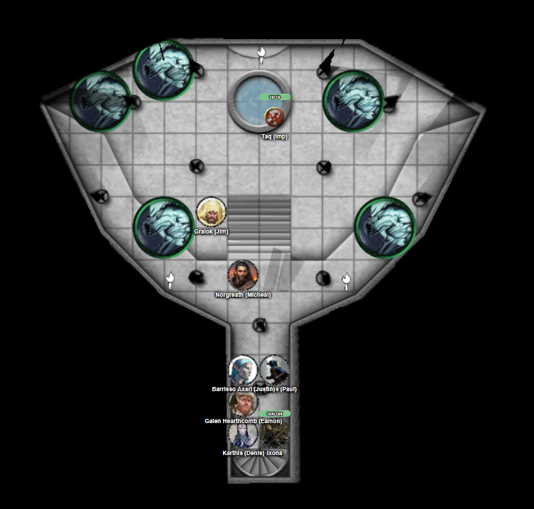
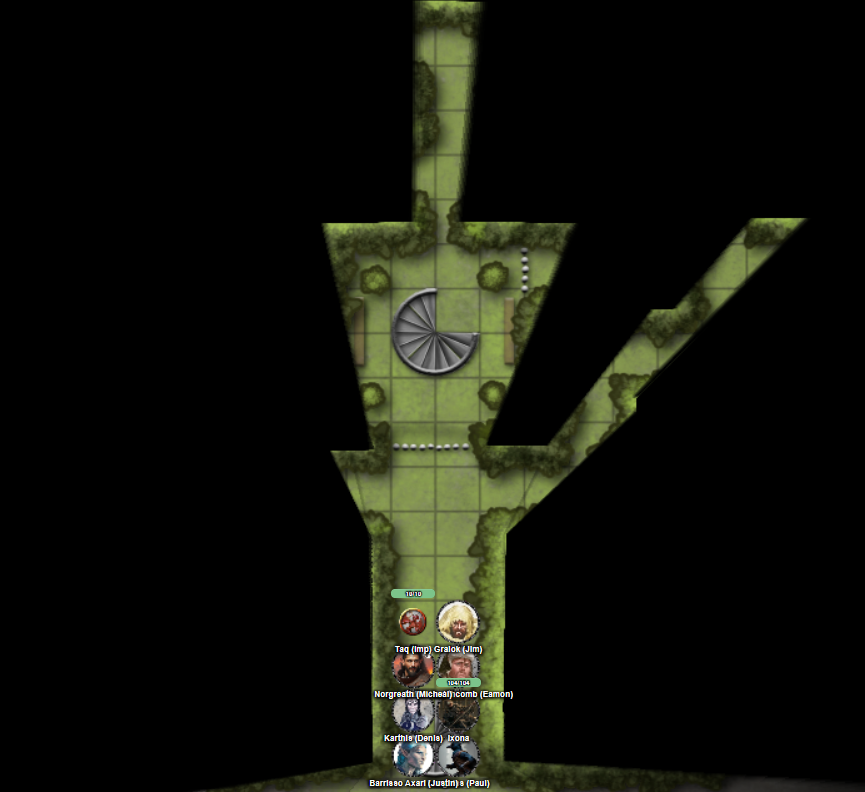

# 2 Sep 2026

**[Previously](2026-08-26.md):** We have cleared Baron Thutin's castle of his forces, and rescued Edmund, the son of the rightful baron. However, Thutin himself has escaped. We held a council with Edmund, Ixona, the dwarven blacksmith, and Father Bellerone, while Taq scouted the retreating enemy. To aid us, the baron gave us a mimir that has been in his family for generations. The mimir identified some enemy artifacts we found, such as midnight stones and bones of creatures from the Void. We headed to The Court of the Lunar Knight, where we believe Thutin has fled. On the ground floor of this ivory tower, we first battled with some elvish-looking defenders. On the second floor, we found a grassy field with pavilions, and three knights who offer to joust volunteers from our party. Barrisso, Galen and Gralok accept their challenge, and Barrisso wins the contest on points. The knights guide us to the next floor, warning "Don't drink from the new moon fountain"...

---

We arrive into a short pillared hallway. A wide balcony overlooks a temple-like building. Stairs lead down to a white marble floor with a pool set into it. A disc is mounted on the wall behind it.

As soon as they hear us coming, some bat-like transparent creatures turn to look at us:

<figure markdown>
  
  <figcaption>Bat-like Creatures</figcaption>
</figure>

Gralok rages and runs towards them. His first attack misses, but his second attack does 12HP of damage plus 12HP of psychic damage via Infectious Fury.

Norgreath casts Eldritch Blast with Agonizing Blast and Genie's Wrath at the same target, doing 21HP damage. He casts three more attacks, doing 67HP in total.

<figure markdown>
  
  <figcaption>Court of the Lunar Knight - Third Floor</figcaption>
</figure>

Karthis casts Haste on Gralok.

One of the bat-like creatures hurls moonlight at Norgreath, doing 11HP of cold damage but also blinding him.

Another attacks Gralok with a claw, doing 5HP of slashing damage.

A third creature turns invisible.

The next enemy hurls moonlight at Norgreath, hitting for 6HP of cold damage.

The final creature flies over to Norgreath and attacks with his fangs and claws, but misses.

Lunghiss casts Shadow Blade at 2nd level and attacks, doing 71HP of damage. As his shadow blade pierces the creature, he senses the creature is resistant to a lot of damage.

Ixona casts Fire Bolt at one of the creatures, doing 20HP of fire damage.

Barrisso moves in and attacks with his Fool's Shortsword; his damage causes it to howl, which reminds him of the howl of a wolf to the moon. Barrisso attacks again with his shortsword and scimitar, killing it. Barrisso jumps down to the main floor.

Galen casts Sacred Flame, doing 16HP of fire damage.

---

Gralok attacks the creature north of him, doing 15HP of damage.

Norgreath uses Taq's eyes to guide his attacks. He attacks the creature beside Gralok at disadvantage, doing 63HP of damage, killing it.

Karthis casts Chain Lightning at one of the creatures. Two more missiles shoot out at the other visible creature, doing a max of 34HP of damage.

One of the creatures steps into a moonbeam and teleports directly to Karthis. He hurls moonlight at him, doing 42HP of damage and blinding him.

The invisible enemy hurls moonlight at Barrisso, doing 40HP of damage (but not inflicting blindness on him).

The third bat-like thing hurls moonlight at Galen, doing 20HP of cold damage but again not blinding him.

Lunghiss attacks the creature that teleported doing 37HP of damage (plus 16HP of thunder damage if it moves).

Ixona casts Shocking Grasp on the same target, killing him.

Barrisso attacks the invisible creature beside him, using Divine Smite to add more damage. That kills him. Barrisso moves to the last creature and attacks with shortsword and scimitar.

Galen casts Sacred Flame, doing 23HP of fire damage.

---

Gralok slams his Blazing Cold Greataxe into the same target, killing him.

---

Galen spends ten minutes casting Prayer of Healing on the party, giving everyone 23HP of healing back.

Meanwhile, the waxing crescent on the wall expands to become a half moon, then gibbous moon, then a full moon, then back again.

We ascend the stairs to the fourth floor. We are on grass again, surrounded by thick hedges. A gibbous moon hangs above. There are another set of stairs, but blocked off by a gate. We appear to be in some kind of maze.

<figure markdown>
  
  <figcaption>Court of the Lunar Knight - Fourth Floor</figcaption>
</figure>

Barrisso tries to fly up for a view. As soon as he tries, he is teleported back to the stairway. We forward, then turn right. We continue to follow the maze, looking for anything of significance. We find ourselves at a dead end with an oblong reflecting pool. There is also a bush bearing plump round berries. Barrisso plucks a berry and throws it into the pool. Nothing seems to happen. He tries to detect magic and senses magic from everywhere, including the berries and pool.

He tries one of the berries. It is incredibly tart. But otherwise, no effect.

We continue through the maze. We find two rows of fruit trees, laden with plums, pears, and apples. Barrisso picks an apple. It seems to be just a nice apple.

Gralok tastes a pear. It's very nice.

Norgreath samples a plum. Again, very tasty.

We continue on to find a corridor of eight statues. They look like pairs of fey creatures facing each other. Each have arms raised with batons held aloft like an honour guard.

We move away into a clearing with several small bushes and a small hillock topped with a tree. There is a small well under the tree. Barrisso notices a sign on the side of the well in a script he cannot read, but which Karthis understands as Sylvan. It says "WISHING WELL".

Barrisso throws a gold coin into the well.
